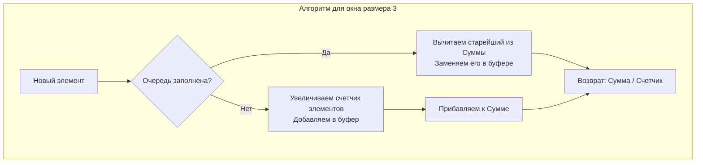

## Потоковая обработка данных и агрегация

До этого момента мы работали с задачами, где все данные (массивы, строки) были известны нам заранее. Но в реальном бэкенде — при сборе метрик (Prometheus), обработке котировок с биржи или анализе логов — данные поступают непрерывным потоком (Data Stream). Мы не можем сохранить весь поток в оперативную память (привет, OOM), но мы должны вычислять аналитику "на лету".

Задача **Moving Average from Data Stream** (LeetCode 346) — это базовый пример построения агрегирующего окна над бесконечным потоком. 

**Суть задачи:** Дана система, в которую по одному поступают числа. Нужно реализовать структуру, которая получает новое число и моментально возвращает среднее арифметическое (Average) последних `k` добавленных чисел.

---

## Архитектура решения: O(1) Time и Кольцевой буфер

Наивный подход Джуниора: сложить все поступающие числа в слайс, а при запросе среднего значения брать срез последних `k` элементов и в цикле считать их сумму.
Проблема: Вычисление суммы в цикле на каждый входящий элемент дает сложность $O(K)$. Если окно содержит 100 000 элементов, сервер "ляжет" под нагрузкой от пустой работы.

**Подход Senior-инженера:** Мы должны возвращать ответ за $O(1)$. Для этого мы будем поддерживать **бегущую сумму (Running Sum)**.
Математика проста: 
`Новая_Сумма = Старая_Сумма - Самый_Старый_Элемент + Новый_Элемент`.

Чтобы знать, какой элемент является "самым старым", нам нужна структура FIFO — Очередь. 
А чтобы не аллоцировать память на каждый "Push/Pop", мы применим **Кольцевой буфер (Ring Buffer)** фиксированного размера, который мы обсуждали в [[1. Теория. Очередь]].



---

## Идиоматичный Go-код: Трюк с одним указателем

В классическом кольцевом буфере используются два указателя: `head` (для чтения) и `tail` (для записи). Но поскольку в этой задаче окно фиксированного размера и мы вытесняем старые элементы только тогда, когда окно заполняется, мы можем **объединить их в один указатель**.

Инсайт: Место, куда мы должны записать новый элемент (хвост), всегда совпадает с местом, где лежит самый старый элемент (голова), который пора вытеснить!

```go
package main

// MovingAverage вычисляет скользящее среднее потока.
type MovingAverage struct {
	window []int // Кольцевой буфер
	size   int   // Максимальный размер окна
	sum    int   // Текущая бегущая сумма
	ptr    int   // Единый указатель (индекс) для вытеснения и записи
	count  int   // Реальное количество элементов (пока не заполнили окно)
}

// Constructor инициализирует структуру.
func Constructor(size int) MovingAverage {
	return MovingAverage{
		window: make([]int, size), // Выделяем память один раз!
		size:   size,
	}
}

// Next обрабатывает новое число из потока и возвращает среднее.
func (m *MovingAverage) Next(val int) float64 {
	// Если окно уже заполнено, вычитаем вытесняемый (самый старый) элемент из суммы.
	// Самый старый элемент лежит прямо по нашему указателю ptr.
	if m.count == m.size {
		m.sum -= m.window[m.ptr]
	} else {
		// Окно еще набирается
		m.count++
	}

	// Записываем новое значение поверх старого и добавляем к сумме
	m.window[m.ptr] = val
	m.sum += val

	// Сдвигаем указатель по кругу с помощью остатка от деления
	m.ptr = (m.ptr + 1) % m.size

	// Возвращаем среднее, конвертируя в float64 только на этапе деления
	return float64(m.sum) / float64(m.count)
}
```

---

## Взгляд под капот: Mechanical Sympathy

Данный код — это эталон эффективности для CPU:
1. **Zero Allocations (Обещание GC):** Память `make([]int, size)` выделяется ровно один раз при вызове `Constructor`. Метод `Next` работает в бесконечном цикле, **вообще не запрашивая память у кучи**. GC (Garbage Collector) не будет тратить процессорное время на очистку устаревших узлов (как это было бы с `list.List`).
2. **Амортизация математики:** Мы заменили цикл из $K$ сложений на ровно 2 операции: одно вычитание и одно сложение. Сложность упала с $O(K)$ до строгого $O(1)$.
3. **Локальность данных (Data Locality):** Все $K$ элементов окна лежат в непрерывном массиве. Массив помещается в кэш-линию процессора (L1/L2 Cache), что делает операцию чтения вытесняемого элемента `m.window[m.ptr]` практически бесплатной по тактам CPU.

> [!warning] Ловушка / Gotcha: Целочисленное переполнение
> В реальных системах (например, в высокочастотном трейдинге или мониторинге) сумма `sum` может легко выйти за пределы типа `int` (в Go на 64-битных системах это `int64`, что очень много, но не бесконечно, а на 32-битных — всего около 2 миллиардов).
> Если поток генерирует миллионы больших чисел, `sum` может переполниться (Integer Overflow).
> **Решение для Production:** В таких случаях `sum` нужно сразу хранить как `float64` или использовать алгоритмы бегущего среднего (Welford's Online Algorithm), которые вычисляют среднее без необходимости хранить общую сумму, обновляя среднее значение через дельту: `mean += (val - mean) / count`. Но для задачи на LeetCode типа `int` достаточно.

> [!tip] Собеседование
> **Вопрос интервьюера:** Операция остатка от деления `%` работает медленнее, чем простое сложение или побитовые операции. Можно ли ускорить кольцевой буфер?
> **Ответ:** Да. Если мы можем заставить размер окна `size` быть всегда **степенью двойки** (например, 1024 вместо 1000), то тяжелую операцию `m.ptr = (m.ptr + 1) % m.size` можно заменить на сверхбыструю побитовую операцию И (Bitwise AND): `m.ptr = (m.ptr + 1) & (m.size - 1)`. Именно такой трюк использует ядро Linux и рантайм самого Go под капотом во внутренних кольцевых буферах!

## Итог

Задача **Moving Average from Data Stream** учит нас работать с потоками, фиксируя память через кольцевые буферы и поддерживая константное время $O(1)$ через математические инварианты (бегущую сумму).

Однако, что если наше "окно" зависит не от *количества* элементов, а от *времени*? В следующей задаче мы рассмотрим, как очередь помогает отсеивать устаревшие данные на основе временных меток (timestamps), что является фундаментом для Rate Limiters в веб-серверах: [[5. Number of Recent Calls]].