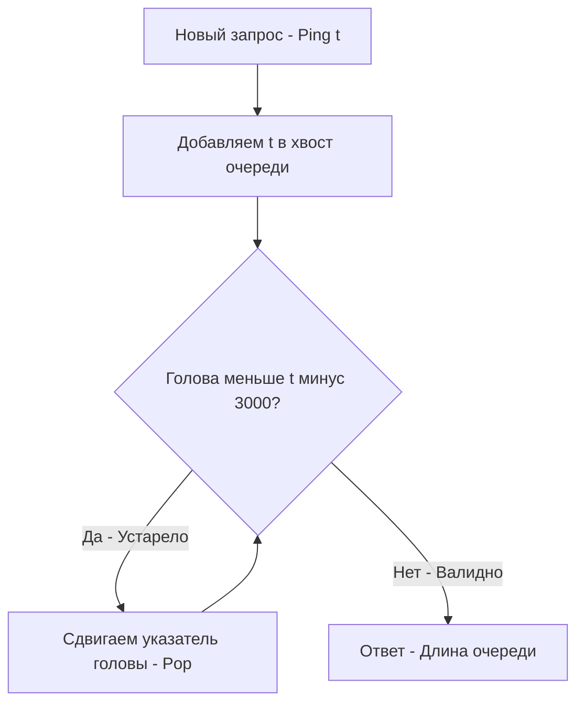

## Временное окно и основы Rate Limiting

До сих пор мы работали с очередями, размер которых зависел от *количества* элементов (например, окно из $K$ последних элементов). Но в распределенных системах и веб-разработке мы гораздо чаще сталкиваемся с ограничениями по *времени*.

Задача **Number of Recent Calls** (LeetCode 933) — это прототип важнейшего паттерна системного дизайна: **Rate Limiter** (Ограничитель частоты запросов). 

**Суть задачи:** Необходимо реализовать класс `RecentCounter`, который принимает поток запросов. Метод `Ping(t int)` получает время текущего запроса `t` (в миллисекундах) и должен вернуть количество запросов, которые произошли за последние 3000 миллисекунд (включая текущий). Гарантируется, что каждый новый вызов `Ping` имеет строго большее значение `t`, чем предыдущий.

---

## Архитектура: Очередь временных меток

Поскольку время `t` монотонно возрастает (события приходят в хронологическом порядке), структура данных идеальна для FIFO очереди. 

Алгоритм (Sliding Window Log):
1. Сохраняем текущую метку времени `t` в хвост очереди.
2. Проверяем голову очереди. Если временная метка на голове старее, чем `t - 3000`, она "протухла". Удаляем её.
3. Повторяем шаг 2, пока на голове не окажется валидная метка (попавшая в 3-секундное окно).
4. Текущий размер очереди (от головы до хвоста) — это и есть ответ.



---

## Уровень Junior vs Уровень Senior

Большинство кандидатов на LeetCode решают эту задачу "в лоб" через слайсинг:

```go
// НАИВНОЕ РЕШЕНИЕ (Не для production!)
func (c *RecentCounter) Ping(t int) int {
    c.reqs = append(c.reqs, t)
    for c.reqs[0] < t-3000 {
        c.reqs = c.reqs[1:] // Срезаем голову
    }
    return len(c.reqs)
}
```

Почему это решение провалит секцию хардовой инженерии?
Из-за механики работы рантайма Go. Операция `c.reqs = c.reqs[1:]` не удаляет данные из памяти, она просто сдвигает внутренний указатель `unsafe.Pointer` базового массива (underlying array) на один элемент вправо. 
По мере поступления тысяч запросов, ваш "активный" срез всегда будет небольшим (например, 100 элементов), но сам базовый массив будет **бесконечно ползти вправо**, постоянно упираясь в capacity и вызывая функцию `runtime.growslice`. 
Это приведет к бесконечным аллокациям все больших кусков памяти и копированию данных. В долгоживущем демоне (long-running daemon) это **классическая утечка памяти (OOM)**.

### Идиоматичное решение (Memory Compaction)

Опытный бэкендер использует указатель головы `head`, а для предотвращения бесконечного роста базового массива — реализует периодическую "Сборку мусора" (сжатие памяти).

```go
package main

// RecentCounter отслеживает запросы за последние 3 секунды.
type RecentCounter struct {
	requests []int
	head     int
}

// Constructor инициализирует счетчик.
func Constructor() RecentCounter {
	return RecentCounter{
		// Предвыделяем память (capacity) для типичного числа запросов.
		// Это позволяет избежать аллокаций на старте.
		requests: make([]int, 0, 4096),
		head:     0,
	}
}

// Ping регистрирует запрос и возвращает их количество за последние 3000 мс.
func (c *RecentCounter) Ping(t int) int {
	// 1. Добавляем новый запрос
	c.requests = append(c.requests, t)

	// 2. Инвалидируем старые запросы, просто сдвигая виртуальный указатель
	for c.head < len(c.requests) && c.requests[c.head] < t-3000 {
		c.head++
	}

	// 3. Mechanical Sympathy: Ручное сжатие памяти (Memory Compaction)
	// Если "мертвая" зона в начале массива стала слишком большой (например, > 2000 элементов),
	// мы сдвигаем "живые" данные в начало базового массива.
	if c.head > 2048 {
		// Встроенная функция copy оптимизирована на уровне ассемблера (memmove)
		// и абсолютно безопасна при работе с перекрывающимися областями памяти.
		copy(c.requests, c.requests[c.head:])
		
		// Отрезаем хвост и обнуляем голову
		c.requests = c.requests[:len(c.requests)-c.head]
		c.head = 0
	}

	// 4. Возвращаем размер "активного" окна
	return len(c.requests) - c.head
}
```

---

## Взгляд под капот: Почему `copy` лучше Ring Buffer?

Вы могли задаться вопросом: *"Почему мы просто не использовали кольцевой буфер из статьи про теорию очередей?"*

Кольцевой буфер (Ring Buffer) идеален, когда мы **точно знаем максимальный размер окна**. Но в этой задаче размер окна по количеству элементов непредсказуем! За 3 секунды может прийти 5 запросов, а может 50 000 (DDoS атака). Динамически расширять кольцевой буфер — сложная и чреватая багами задача (нужно аккуратно "разворачивать" кольцо при переносе в новую память).

Встроенная функция `copy(dst, src)` в Go написана на ассемблере и использует векторные инструкции процессора (SIMD, если доступны). Скопировать пару тысяч `int` (скалярных значений) в кэше L1 занимает буквально наносекунды. 
Делая `copy` только когда "мертвых" элементов накапливается достаточно много (амортизация), мы получаем:
1. Идеальную локальность кэша (Cache Locality).
2. Защиту от фрагментации памяти.
3. Полное отсутствие системных аллокаций (Zero allocations) в устоявшемся режиме работы.

> [!warning] Ловушка / Gotcha: Утечка указателей
> В данной задаче слайс `requests` хранит скалярный тип `int`. Если бы мы хранили указатели на сложные структуры `*Request`, перед тем как делать сдвиг (compaction) или обрезать `requests`, мы были бы **обязаны** занулить старые элементы: `for i := 0; i < c.head; i++ { c.requests[i] = nil }`. Иначе Garbage Collector не смог бы собрать старые запросы, так как базовый массив продолжал бы держать на них ссылки.

> [!tip] Собеседование: System Design (Rate Limiter)
> На System Design секции интервьюер может спросить: *"Этот код работает в памяти одного инстанса. Как масштабировать этот Rate Limiter на кластер из 10 микросервисов?"*
> 
> **Ответ:** Реализация `Sliding Window Log` (которую мы написали) в распределенной среде (например, через Redis `ZSET`) потребляет слишком много памяти, так как хранит каждый timestamp. Для кластера лучше использовать алгоритмы **Sliding Window Counter** (агрегация по секундам) или классический **Token Bucket** (корзина токенов). Они хранят всего пару чисел на пользователя (например, в Memcached/Redis) и работают за $O(1)$ по времени и памяти.

## Итог

Задача **Number of Recent Calls** демонстрирует переход от абстрактных алгоритмов к реальным инженерным проблемам. Мы увидели, как безобидный срез слайса `q = q[1:]` может обрушить сервер, и как стратегия Memory Compaction спасает ситуацию, сохраняя производительность.

Синтезировав знания о монотонных структурах (для поиска экстремумов) и скользящих окнах (для потоков), мы готовы сразиться с одной из самых сложных и популярных задач на границе стека и очереди. Переходим к хардкору: [[6. Sliding Window Maximum]].