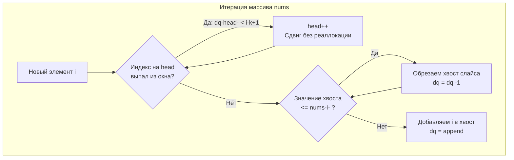

Задача **Sliding Window Maximum** (LeetCode 239, уровень Hard) — это кульминация темы очередей. Если на секции алгоритмов в FAANG или Yandex вы уверенно пишете решение этой задачи за $O(N)$ и можете объяснить каждую строчку с точки зрения работы с памятью — это прямой путь к офферу на позицию Middle+/Senior.

В статье [[2. Монотонная очередь]] мы разобрали теоретический концепт и построили красивую абстракцию `Deque`. Но на реальном собеседовании у вас не будет времени писать 50 строк методов структуры, а интервьюер захочет увидеть **максимально компактный и эффективный код**.

В этой статье мы разберем "боевую" реализацию монотонной очереди на сырых слайсах с указателями и обсудим альтернативные подходы, которыми можно впечатлить интервьюера.

---

## Архитектура решения: Сырой слайс и Виртуальная голова

Напомню основную идею: мы должны поддерживать "линию видимости" текущего максимума. В окне нас интересуют только те элементы, которые имеют шанс стать максимумом. Если в окно заходит большое число, все меньшие числа перед ним мгновенно становятся бесполезными.

Вместо структуры `Deque`, мы будем использовать обычный `[]int` (слайс) для хранения индексов и целочисленную переменную `head` для имитации извлечения с головы очереди.



---

## Идиоматичный Go-код (Уровень Senior)

Это код, который ожидают увидеть от опытного Go-разработчика. Он пишется за 3 минуты, не содержит ничего лишнего и выжимает максимум из рантайма.

```go
package main

// maxSlidingWindow находит максимумы в скользящем окне размера k
func maxSlidingWindow(nums []int, k int) []int {
	n := len(nums)
	if n == 0 || k == 0 {
		return nil
	}

	// 1. Аллокация памяти
	res := make([]int, 0, n-k+1)
	
	// Используем слайс как Deque для ИНДЕКСОВ
	// ВАЖНО: capacity = n, а не k. Это защита от реаллокаций.
	dq := make([]int, 0, n)
	head := 0 // Виртуальный указатель на начало очереди

	for i := 0; i < n; i++ {
		// Шаг 1: Очистка головы (удаляем индексы, вышедшие за окно)
		// Условие i-k+1 - это левая граница текущего окна
		if head < len(dq) && dq[head] < i-k+1 {
			head++
		}

		// Шаг 2: Поддержание монотонности (строго убывающей)
		// Обрезаем хвост слайса, пока значения там меньше либо равны текущему
		for len(dq) > head && nums[dq[len(dq)-1]] <= nums[i] {
			dq = dq[:len(dq)-1]
		}

		// Шаг 3: Добавление текущего индекса в дек
		dq = append(dq, i)

		// Шаг 4: Формирование ответа
		// Начинаем писать в ответ только когда прошли первые k-1 элементов
		if i >= k-1 {
			res = append(res, nums[dq[head]])
		}
	}

	return res
}
```

---

## Взгляд под капот: Mechanical Sympathy

Вышеприведенный код содержит несколько невидимых глазу оптимизаций, которые стоит озвучить на интервью.

### 1. Почему `capacity` для `dq` равен `n`, а не `k`?
Самая частая ошибка кандидатов — писать `dq := make([]int, 0, k)`. Кажется логичным: в окне ведь $k$ элементов! 
Но что будет, если массив строго убывающий: `[10, 9, 8, 7, 6, 5]`, а `k = 3`?
В этом случае условие `nums[dq[len(dq)-1]] <= nums[i]` **никогда не выполнится**. Элементы будут только добавляться в хвост и удаляться с головы (через `head++`). 
Мы будем постоянно делать `append` в слайс, который логически содержит не более $k$ элементов, но физически указатель хвоста постоянно ползет вправо. Если `capacity` будет равно `k`, рантайму придется постоянно выделять новую память в куче (`growslice`) и переносить массив. Сделав `capacity = n`, мы гарантируем **Zero Allocations** внутри цикла навсегда.

### 2. Избежание утечек памяти (Memory Leak)
Почему мы не пишем `dq = dq[1:]` для удаления с головы?
Если бы мы делали `dq = dq[1:]`, рантайм двигал бы указатель `unsafe.Pointer` базового массива вправо. Но так как `capacity` равен `n`, мы бы не вызвали реаллокацию. 
Казалось бы, `dq[1:]` красивее, чем переменная `head`. Но в Go срез слайса не сбрасывает длину базового массива. Если бы мы хранили в `dq` указатели `*Node`, срез `dq[1:]` привел бы к тому, что "отрезанные" элементы зависли бы в памяти до конца работы функции, так как Garbage Collector видел бы, что базовый массив жив. 
Использование `head` — это привычка из системного программирования. Да, для скалярных `int` срез безопасен, но использование явного указателя показывает вашу осознанность.

---

## Усложнение (Follow-ups) на интервью

Когда вы быстро напишете решение за $O(N)$, интервьюер начнет "копать" вширь, проверяя вашу эрудицию.

> [!tip] Собеседование: Альтернативные подходы
> **Интервьюер:** Отличное решение. А что если бы мы использовали Max-Heap (Приоритетную очередь)?
> **Вы:** Мы могли бы хранить в куче пары `{value, index}`. При сдвиге окна мы кладем новый элемент за $O(\log N)$, а корень извлекаем, только если его `index` выпал из окна.
> **Минус:** Сложность становится $O(N \log N)$. В худшем случае (строго убывающий массив) все $N$ элементов будут лежать в куче, и мы будем делать `Push` в огромную структуру. Это значительно медленнее монотонной очереди.

### "Божественный уровень" (God Tier): Динамическое программирование блоками

Самый сложный вопрос: *"Можете ли вы решить это за $O(N)$ БЕЗ монотонной очереди, вообще без стеков и деков?"*

Да, с помощью **алгоритма декомпозиции на блоки** (подход, который используется в Sparse Tables).
Идея:
1. Разбиваем массив на блоки размера `k`.
2. Создаем два массива: `leftMax` и `rightMax`.
3. `leftMax[i]` хранит максимальный элемент от начала текущего блока до `i`.
4. `rightMax[i]` хранит максимальный элемент от конца текущего блока до `i`.
5. Любое окно размера `k` гарантированно покрывает либо один блок, либо пересекает границу ровно двух блоков.
6. Тогда максимум в окне `[i, j]` — это просто `max(rightMax[i], leftMax[j])`.

Этот алгоритм требует $O(N)$ памяти, три последовательных прохода по массиву (что идеально для кэша L1) и **не содержит сложных ветвлений (Branching)**, что делает его иногда даже быстрее монотонной очереди на уровне процессора! Знание такого подхода мгновенно выделяет вас среди 99% кандидатов.

## Итог

Монотонная очередь в задаче Sliding Window Maximum — это красивый симбиоз математического инварианта и знания "железа" языка. Мы доказали, что амортизированная сложность $O(1)$ на элемент достигается только при аккуратном контроле за аллокациями.

На этом мы завершаем изучение линейных структур (массивов, стеков, очередей). Но в реальном бэкенде данные редко лежат в непрерывных массивах. Часто они разбросаны по памяти, образуя графы и цепи. Мы переходим к фундаментальному блоку, который научит нас работать со ссылками и указателями: [[1. Теория. Связные списки]].