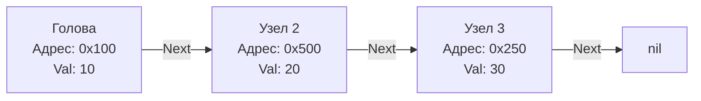

До сих пор мы работали с массивами и слайсами — структурами данных, где элементы лежат в памяти строго друг за другом. Это идеальный сценарий для процессора, но в программировании часто возникает потребность в структурах, которые могут динамически расти, менять свою форму, разрываться и склеиваться за $O(1)$, не требуя копирования мегабайтов памяти (как это делает `growslice`).

Здесь на сцену выходят **Связные списки (Linked Lists)**. На собеседованиях задачи на связные списки — это проверка того, насколько уверенно вы работаете с указателями (pointers) и умеете ли вы держать в голове связи между объектами, не теряя контекст.

---

## Что такое Связный список

**Связный список** — это структура данных, состоящая из узлов (Nodes). Каждый узел хранит само значение и указатель (адрес в памяти) на следующий узел. 
В отличие от массива, узлы связного списка разбросаны по куче (Heap) в хаотичном порядке.



### Реализация в Go (Идиоматика LeetCode)

В Go стандартная структура односвязного списка, с которой вы будете работать в 100% задач на LeetCode, выглядит предельно просто:

```go
package main

// ListNode - базовый узел односвязного списка.
type ListNode struct {
	Val  int
	Next *ListNode
}
```

> [!info] Под капотом: Указатели в Go vs C/C++
> Если вы пришли из C/C++, вы знаете, что указатель — это просто числовое значение адреса в памяти. В C++ вы можете взять указатель на узел и прибавить к нему `8` байт, чтобы прочитать следующий кусок памяти (адресная арифметика). 
> В Go **адресная арифметика запрещена** на уровне компилятора (без использования пакета `unsafe`). Указатель в Go — это строго типизированная, безопасная ссылка. Кроме того, Go — язык со сборщиком мусора (GC). Если в C++ вы обязаны сделать `delete node`, то в Go узел будет удален автоматически, когда на него не останется активных ссылок (указателей) из корневых объектов (GC Roots).

---

## Mechanical Sympathy: Почему списки — это боль для CPU

На собеседовании на позицию Middle+ / Senior вас могут спросить: *"Что быстрее для обхода и чтения всех элементов: слайс из 1 миллиона интов или связный список из 1 миллиона интов?"*

Ответ неопытного разработчика: *"Одинаково, сложность обхода $O(N)$ в обоих случаях"*.
Ответ Senior-инженера: **"Слайс будет быстрее в десятки, а то и в сотни раз"**.

Причины кроются в архитектуре железа и рантайме Go:

1. **CPU Cache Locality (Локальность кэша):** Процессор читает данные из RAM не побайтово, а кэш-линиями (обычно по 64 байта). Когда вы читаете первый элемент слайса, CPU аппаратно подтягивает в кэш L1 сразу несколько следующих элементов. Обход слайса происходит на скорости кэша L1 (единицы наносекунд). Узлы связного списка разбросаны по памяти случайным образом. Переход по `node.Next` — это почти гарантированный **Cache Miss**, заставляющий процессор простаивать (CPU Stall), ожидая данные из медленной оперативной памяти (сотни наносекунд).
2. **Memory Overhead (Накладные расходы памяти):** В слайсе `[]int` каждый элемент занимает ровно 8 байт (на 64-битной архитектуре). В `ListNode` мы храним `Val` (8 байт) и `Next` (указатель, тоже 8 байт). Мы тратим в 2 раза больше памяти просто на поддержание структуры.
3. **GC Pressure (Давление на сборщик мусора):** Слайс — это один объект (одна аллокация базового массива). Связный список из 1 миллиона узлов — это **1 миллион отдельных объектов** в куче. Аллокатор Go тратит время на поиск свободного места для каждого узла (Escape Analysis почти всегда отправляет узлы списка в кучу, так как они ссылаются друг на друга и живут дольше стека функции). Во время фазы `Mark` сборщик мусора будет вынужден "ходить" по всем миллиону указателей, потребляя процессорное время.

> [!warning] Ловушка / Gotcha: Использование `container/list`
> В стандартной библиотеке Go есть пакет `container/list`, реализующий двусвязный список. **Никогда не используйте его в высоконагруженном production-коде** (разве что вы пишете LRU-кэш и точно понимаете трейдоффы). 
> Вплоть до появления дженериков (и даже сейчас, так как пакет не переписали), `list.List` хранит значения как `interface{}`. Это означает, что каждое добавление `int` в список вызывает невидимую аллокацию (Boxing), превращая `int` в интерфейс на куче. Это убивает производительность на корню. Всегда пишите свои легковесные структуры на дженериках, если вам действительно нужен связный список.

---

## Главный паттерн: Dummy Node (Фиктивный узел)

Если и есть один секрет, который упрощает 90% задач на связные списки, то это **Dummy Node (Sentinel Node)**.

Во многих задачах вам нужно изменять список: удалять узлы, вставлять новые, менять их местами. Самая частая ошибка — забыть обработать случай, когда изменяется **самая первая нода (Голова / Head)**. Если вы удаляете голову, вам нужно вернуть новую голову. Логика кода обрастает кучей `if head == nil` и `if prev == nil`.

**Dummy Node** — это фиктивный узел, который мы искусственно ставим *перед* настоящей головой. Он гарантирует, что у настоящей головы всегда есть "предыдущий" (prev) элемент.

### Пример без Dummy Node (Плохо)
```go
// Удаление элемента со значением val
func removeElements(head *ListNode, val int) *ListNode {
	// Приходится отдельно обрабатывать случаи, когда удаляемые элементы в начале
	for head != nil && head.Val == val {
		head = head.Next
	}
	
	curr := head
	for curr != nil && curr.Next != nil {
		if curr.Next.Val == val {
			curr.Next = curr.Next.Next // Пропускаем удаляемый узел
		} else {
			curr = curr.Next
		}
	}
	return head
}
```

### Пример с Dummy Node (Идиоматично и безопасно)
```go
// Удаление элемента со значением val с использованием Dummy Node
func removeElements(head *ListNode, val int) *ListNode {
	// 1. Создаем фиктивный узел, указывающий на реальную голову
	dummy := &ListNode{Next: head}
	
	// 2. Начинаем обход с фиктивного узла
	curr := dummy
	
	for curr.Next != nil {
		if curr.Next.Val == val {
			// Пропускаем узел. Если это была реальная голова, 
			// dummy.Next просто начнет указывать на второй элемент.
			curr.Next = curr.Next.Next
		} else {
			curr = curr.Next
		}
	}
	
	// 3. Возвращаем реальную новую голову (всё, что после dummy)
	return dummy.Next
}
```

В этом коде аллокация `dummy := &ListNode{...}` — это копеечная цена за абсолютную надежность и отсутствие дублирующихся ветвлений (`if`). Escape Analysis компилятора Go легко увидит, что `dummy` не "убегает" за пределы функции (мы возвращаем не сам `dummy`, а его `.Next`), и разместит этот объект на стеке горутины, что обеспечит **Zero Allocation** в куче.

---

## Ловушки при работе с указателями

Работа со связными списками требует максимальной концентрации на том, куда смотрят ваши стрелочки (указатели).

> [!tip] Собеседование: "Nil Pointer Dereference"
> Самая частая причина провала live-coding секции — паника приложения (Panic). В Go, если вы обратитесь к `node.Next` в ситуации, когда `node == nil`, рантайм выбросит панику `panic: runtime error: invalid memory address or nil pointer dereference`.
> 
> **Золотое правило:** Прежде чем написать `.Next`, задайте себе вопрос: *"Доказал ли я выше в коде, что объект слева от точки точно не равен `nil`?"*. 
> Именно поэтому цикл `for curr != nil && curr.Next != nil` так популярен.

Вторая классическая ошибка — потерять ссылку на остаток списка.
Если вы хотите вставить узел `B` между `A` и `C`:
1. **НЕВЕРНО:** `A.Next = B` -> Теперь `B` указывает на `nil`, а ссылка на `C` безвозвратно потеряна. Сборщик мусора радостно удалит половину вашего списка.
2. **ВЕРНО:** `B.Next = A.Next` (сначала `B` берет за руку `C`), а затем `A.Next = B` (`A` берет за руку `B`).

## Итог

Связные списки — это фундаментальная концепция для понимания того, как работают графы, деревья и управление памятью. Да, в современном высокопроизводительном бэкенде их избегают ради слайсов из-за проблем с кэшом процессора, но они остаются незаменимыми там, где элементы должны хаотично перегруппировываться.

Разобравшись с базовым обходом списка с помощью одного указателя, мы готовы к главному алгоритмическому паттерну этой темы, который позволяет находить циклы, середину списка и решать половину всех задач уровня Medium. Переходим к: [[2. Быстрый и медленный указатели]].