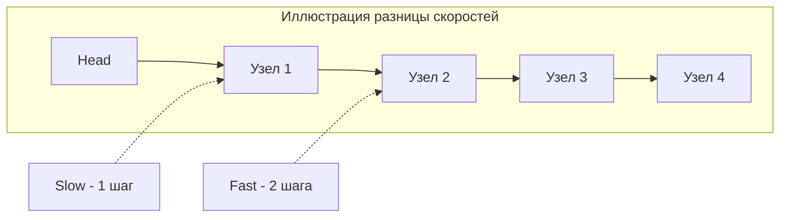

В прошлой статье мы разобрали, почему связные списки — это испытание для кэша процессора, и как фиктивный узел (Dummy Node) спасает от лишних ветвлений. Теперь мы переходим к самому мощному алгоритмическому паттерну для этой структуры данных.

Поскольку узлы списка не имеют индексов, мы не можем мгновенно прыгнуть в его середину или проверить размер за $O(1)$. Любой поиск требует последовательного обхода. Но что, если нам нужно найти середину списка за один проход? Или, что еще сложнее, узнать, нет ли в списке зацикливания (когда хвост указывает на один из предыдущих узлов)?

Для решения этого класса задач применяется паттерн **Быстрый и медленный указатели (Fast and Slow Pointers)**, также известный как **Алгоритм черепахи и зайца (Floyd's Cycle-Finding Algorithm)**.

---

## Суть алгоритма (Черепаха и Заяц)

Идея гениально проста. Мы запускаем по связному списку два указателя, которые стартуют одновременно из головы (`Head`), но движутся с разной скоростью:
- **Slow (Черепаха):** делает 1 шаг за итерацию (`slow = slow.Next`).
- **Fast (Заяц):** делает 2 шага за итерацию (`fast = fast.Next.Next`).

Из этой разницы скоростей вытекают два фундаментальных математических свойства, на которых строятся решения задач LeetCode.



---

## Паттерн 1: Поиск середины списка

Представьте, что два бегуна стартуют на прямой дистанции. Заяц бежит в два раза быстрее Черепахи. Когда Заяц пересечет финишную черту, где будет находиться Черепаха? Ровно на половине пути!

В связном списке это означает, что когда `fast` достигает конца списка (`fast == nil` или `fast.Next == nil`), указатель `slow` будет указывать **ровно на середину списка**.

### Идиоматичный код на Go

```go
package main

// ListNode - базовый узел
type ListNode struct {
	Val  int
	Next *ListNode
}

// middleNode возвращает средний узел связного списка.
func middleNode(head *ListNode) *ListNode {
	slow := head
	fast := head

	// Заяц должен безопасно сделать 2 шага.
	// Проверяем fast (для списков четной длины) и fast.Next (для нечетной).
	for fast != nil && fast.Next != nil {
		slow = slow.Next      // 1 шаг
		fast = fast.Next.Next // 2 шага
	}

	return slow
}
```

> [!tip] Собеседование: Четное количество узлов
> Если в списке четное количество узлов (например, 6), середин будет две (3-й и 4-й узлы). Стандартное условие `fast != nil && fast.Next != nil` (при старте обоих указателей с `head`) вернет **вторую** середину (4-й узел). 
> Если для вашего алгоритма (например, при сортировке слиянием Merge Sort) нужно получить **первую** середину (3-й узел), просто инициализируйте `fast` на один шаг впереди: `fast := head.Next`.

---

## Паттерн 2: Обнаружение цикла (Cycle Detection)

Если связный список имеет цикл, Заяц никогда не добежит до конца (так как `nil` не существует). Он будет бесконечно бегать по кругу. Поскольку Заяц бежит быстрее, он рано или поздно "догонит" Черепаху сзади и обгонит ее (они окажутся на одном и том же узле).

Если цикл есть — `fast` и `slow` совпадут. Если цикла нет — `fast` достигнет `nil`.

### Код (LeetCode 141)

```go
// hasCycle определяет, есть ли зацикливание в связном списке
func hasCycle(head *ListNode) bool {
	if head == nil {
		return false
	}

	slow := head
	fast := head

	for fast != nil && fast.Next != nil {
		slow = slow.Next
		fast = fast.Next.Next

		// Если указатели встретились - цикл обнаружен!
		if slow == fast {
			return true
		}
	}

	return false
}
```

---

## Mechanical Sympathy: Два указателя vs Хэш-таблица

На собеседовании вас обязательно спросят: *"А зачем такие сложности? Почему просто не складывать пройденные узлы в `map[*ListNode]bool` и при каждом шаге проверять, не были ли мы здесь раньше?"*

Этот вопрос — идеальный момент, чтобы проявить себя как Senior Backend Engineer. Да, решение с мапой алгоритмически верное, но оно **уничтожает производительность и память**.

1. **Пространственная сложность (Space Complexity):**
   - **Хэш-таблица:** $O(N)$ дополнительной памяти. При миллионе узлов ваша мапа вырастет до огромных размеров.
   - **Два указателя:** $O(1)$ дополнительной памяти. Мы аллоцируем всего две переменные `slow` и `fast`. На 64-битной архитектуре это $2 \times 8 = 16$ байт памяти на стеке горутины.
2. **Давление на Garbage Collector (GC Pressure):**
   - **Хэш-таблица:** Создание `map` внутри функции с непредсказуемым размером с вероятностью 100% приведет к аллокации (Escape to Heap). По мере роста бакетов `hmap`, рантайм Go будет постоянно делать эвакуацию (rehash), вызывая системные аллокации. При выходе из функции весь этот огромный объект останется мусором для GC.
   - **Два указателя:** Переменные-указатели лежат на стеке. После `return` стек мгновенно очищается за $O(1)$ без единой аллокации в куче и без работы для GC (Zero Allocation Policy).
3. **CPU Cache Misses:** Использование мапы требует вычисления хэша от адреса памяти при каждой вставке и проверке. Это значительно медленнее простого побитового сравнения двух адресов в регистрах процессора (`if slow == fast`), которое компилируется в одну инструкцию ассемблера `CMP`.

> [!warning] Ловушка / Gotcha: Nil Pointer Dereference
> Самая частая ошибка новичков — написать в цикле условие `for fast.Next != nil` или вообще забыть проверку. Внутри цикла происходит вызов `fast.Next.Next`. Если `fast.Next` равен `nil`, обращение к его свойству `.Next` вызовет **панику рантайма** (Panic: nil pointer dereference). Всегда строго пишите `for fast != nil && fast.Next != nil`. В Go ленивое вычисление логических операторов (Short-circuit evaluation) гарантирует, что если `fast == nil`, правая часть `fast.Next != nil` даже не будет вычисляться, что спасает от паники.

---

## Уровень Senior: Математика начала цикла (LeetCode 142)

На хардкорных секциях вас могут попросить не просто найти факт наличия цикла, но и вернуть **узел, с которого цикл начинается**.
Это делается продолжением алгоритма черепахи и зайца.

**Алгоритм:**
1. Находим точку их встречи (внутри цикла).
2. Оставляем Черепаху (`slow`) в точке встречи, а Зайца (`fast`) переносим обратно в самое начало (`Head`).
3. Теперь **оба бегут с одинаковой скоростью** (по 1 шагу).
4. Точка, где они встретятся во второй раз — это и есть начало цикла!

**Математическое доказательство:**
Пусть $L$ — расстояние от начала списка до начала цикла.
Пусть $C$ — длина цикла.
Когда они впервые встретились в точке $X$ (расстояние $X$ от начала цикла), `slow` прошел расстояние: $L + X$.
`fast` бежал в два раза быстрее, поэтому он прошел $2 \times (L + X)$, но при этом он совершил $K$ полных кругов внутри цикла, то есть его расстояние также равно $L + X + K \times C$.

Приравниваем: $2(L + X) = L + X + K \times C$
Получаем: $L + X = K \times C$
Отсюда: $L = K \times C - X = (K - 1) \times C + (C - X)$

Что значит $L = C - X$? Это значит, что расстояние от начала списка до старта цикла ($L$) **в точности равно** расстоянию от точки их встречи (где сейчас Черепаха) до старта цикла, если идти вперед. Поэтому, когда один указатель идет от начала списка, а другой от точки встречи, они встретятся ровно в начале цикла.

## Итог

Паттерн быстрого и медленного указателей — это математически красивый трюк, который позволяет находить середину списка и циклы без использования дополнительной памяти, сохраняя Mechanical Sympathy и дружелюбность к сборщику мусора Go.

В следующей статье мы применим знания об указателях для решения самой популярной в мире задачи на связные списки, которую просят решить буквально на каждом втором собеседовании: [[3. Reverse Linked List]].