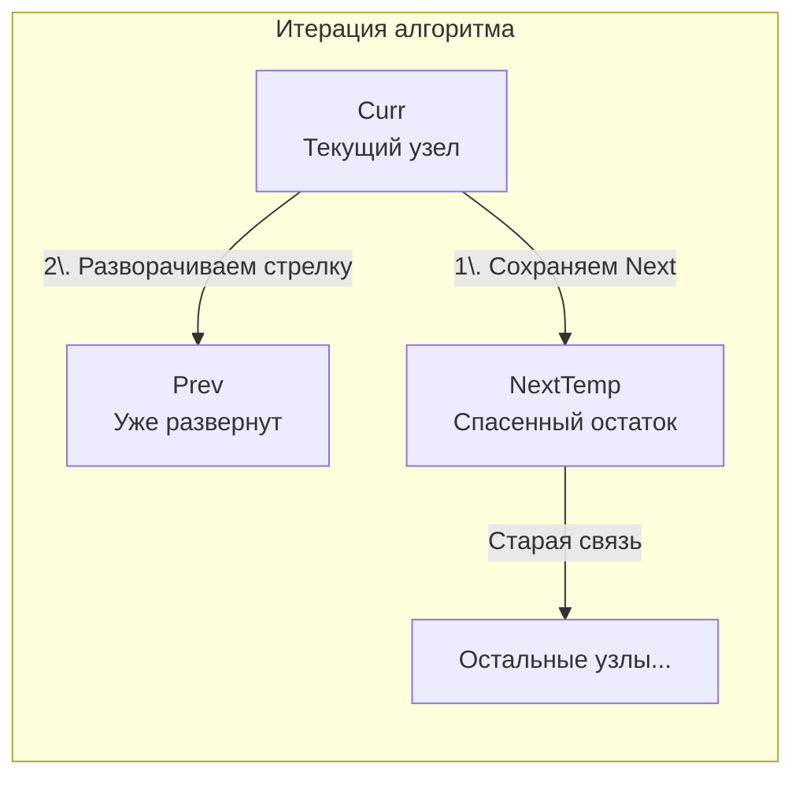

## Самая частая задача в мире

Если бы среди алгоритмических задач проводили "Оскар", задача **Reverse Linked List** (LeetCode 206) забрала бы статуэтку за лучшую мужскую роль. Это абсолютный "Hello World" мира собеседований (от Junior до Staff уровней). Интервьюеры любят её за то, что она за 5 минут обнажает вашу способность работать с указателями (pointers) и держать в голове связи объектов, не теряя куски памяти.

**Суть задачи:** Дан указатель на голову (Head) односвязного списка. Нужно развернуть все указатели `Next` в обратном направлении и вернуть новую голову (бывший хвост).

---

## Архитектура: Жонглирование тремя указателями

Главная ловушка этой задачи, в которую попадают джуниоры: **потеря остатка списка**.
Допустим, мы находимся на узле `A`, который указывает на `B`, а `B` на `C`. Нам нужно сказать `A`, чтобы он указывал "назад" (на `nil` или предыдущий узел). 
Если мы просто напишем `curr.Next = prev`, то указатель на `B` (и весь остаток списка `C, D...`) будет мгновенно потерян! Мы больше не сможем до них добраться. Сборщик мусора (GC) в Go увидит, что на `B` больше нет ссылок, и удалит половину ваших данных.

Поэтому для безопасного разворота нам нужны **три указателя**:
1. `prev` (Предыдущий) — куда должен указывать наш текущий узел. Изначально `nil`.
2. `curr` (Текущий) — узел, чью стрелку мы сейчас разворачиваем.
3. `nextTemp` (Временный следующий) — "спасательный круг". Мы сохраняем в него ссылку на остаток списка *до того*, как разорвем связь.



---

## Идиоматичное решение (Iterative)

Это стандартный, production-ready подход. Он работает за $O(N)$ времени и $O(1)$ памяти.

```go
package main

// ListNode - базовый узел связного списка.
type ListNode struct {
	Val  int
	Next *ListNode
}

// reverseList разворачивает односвязный список итеративно.
func reverseList(head *ListNode) *ListNode {
	// prev будет указывать на новую голову (в конце алгоритма)
	var prev *ListNode 
	
	// curr - наш рабочий указатель, начинаем с головы
	curr := head

	for curr != nil {
		// 1. СПАСАЕМ остаток списка.
		// Если этого не сделать, следующая строка навсегда сотрет путь вперед.
		nextTemp := curr.Next

		// 2. РАЗВОРАЧИВАЕМ указатель текущего узла назад.
		curr.Next = prev

		// 3. СДВИГАЕМ окно (prev и curr) на один шаг вперед для следующей итерации.
		prev = curr
		curr = nextTemp
	}

	// Когда curr дошел до nil (конец списка), prev указывает на последний реальный узел.
	// Он и становится новой головой.
	return prev
}
```

---

## Взгляд под капот: Mechanical Sympathy

Почему этот код работает молниеносно на уровне процессора и рантайма Go?

### 1. Zero-Allocation (Отсутствие аллокаций в куче)
Мы не создаем ни одного нового узла `ListNode`. Мы просто меняем значения существующих полей `Next`. Указатель в Go на 64-битной архитектуре — это всего лишь `int64` (8 байт). Вся работа цикла `for` сводится к перекладыванию 8-байтовых чисел (адресов памяти) между регистрами процессора. Garbage Collector даже не узнает о том, что эта функция запускалась, так как `prev`, `curr` и `nextTemp` выделяются на стеке (Call Stack) и уничтожаются мгновенно при выходе из функции.

### 2. Цена Cache Misses
В статье [[1. Теория. Связные списки]] мы говорили, что связные списки неэффективны из-за кэш-промахов (Cache Miss). При вызове `curr.Next` процессор почти наверняка промахнется мимо L1-кэша, так как узлы разбросаны по куче (Heap). 
Однако, поскольку внутри цикла мы не выполняем никаких тяжелых вычислений (нет системных вызовов, нет логики), время работы функции упирается исключительно в задержку (Latency) оперативной памяти. Это идеальный пример операции, ограниченной пропускной способностью памяти (Memory Bound), а не процессором (CPU Bound).

---

## Рекурсивный подход: Ловушка на собеседовании

На интервью вас могут спросить: *"Можешь ли ты написать это рекурсивно?"*

**Да, можете. Но в production так делать нельзя.** Давайте напишем код, а потом уничтожим его аргументами Senior-инженера.

```go
// reverseListRecursive разворачивает список с помощью рекурсии.
// ВНИМАНИЕ: Не рекомендуется для длинных списков в production!
func reverseListRecursive(head *ListNode) *ListNode {
	// Базовый случай: пустой список или мы дошли до последнего узла.
	// Последний узел и станет новой головой для всех предыдущих фреймов.
	if head == nil || head.Next == nil {
		return head
	}

	// Погружаемся на самое дно списка. p всегда будет указывать на новую голову (бывший хвост).
	p := reverseListRecursive(head.Next)

	// Разворот на этапе всплытия (возврата из рекурсии).
	// Пример: A -> B -> nil. Мы стоим на A. head.Next - это B.
	// Мы говорим B: "Твой Next теперь указывает на меня (A)".
	head.Next.Next = head
	
	// Обрываем старую связь A -> B, чтобы не получить зацикливание.
	head.Next = nil

	return p // Пробрасываем новую голову наверх
}
```

### Разнос рекурсивного подхода (Continuous Stacks)

Временная сложность рекурсии такая же — $O(N)$. Но пространственная сложность становится $O(N)$ из-за **Стека вызовов (Call Stack)**.

В Go горутины стартуют с очень маленьким стеком (всего 2 КБ). Если связный список содержит 100 000 узлов, рекурсия вызовет функцию 100 000 раз. 
Что произойдет "под капотом" в рантайме Go?
1. Стек горутины быстро переполнится.
2. Сработает механизм **Continuous Stacks**. Рантайм остановит горутину, выделит новый стек в 2 раза больше (4 КБ, потом 8 КБ, 16 КБ и т.д.), скопирует старый стек в новый и обновит все указатели.
3. Этот процесс (Stack Growth) будет повторяться десятки раз, съедая процессорное время и оперативную память.
4. В худшем случае (на 32-битных системах или при жестких лимитах) мы получим `runtime.abort` или упремся в максимальный размер стека (обычно 1 ГБ) и приложение упадет с **Stack Overflow**.

Именно поэтому опытный инженер всегда выбирает итеративный подход $O(1)$ для задач, где глубина обхода потенциально не ограничена.

## Итог

Разворот связного списка — это проверка базовой инженерной гигиены: умения жонглировать ссылками, не создавая утечек памяти (через потерю ссылок) и паник (через `nil pointer dereference`). 

Освоив этот микро-паттерн, мы можем переходить к более сложным структурам. Что если нам нужно объединить два независимых списка в один отсортированный, не создавая новых узлов? Это прямая отсылка к алгоритму Merge Sort. Переходим к задаче: [[4. Merge Two Sorted Lists]].