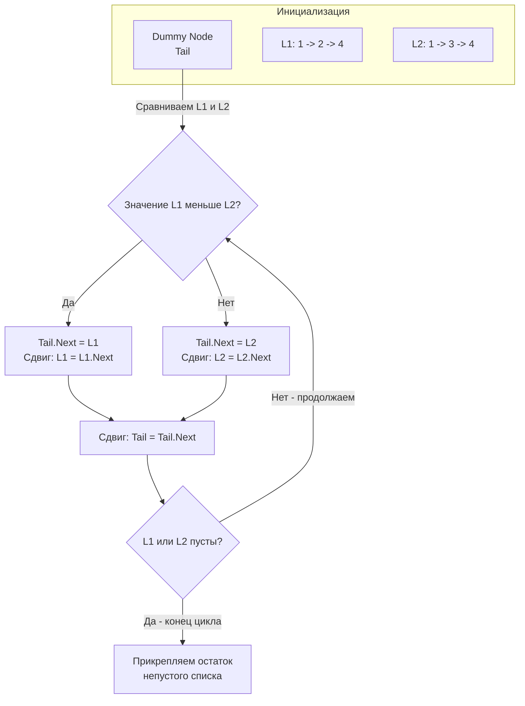

## Слияние как искусство перекладывания ссылок

Задача **Merge Two Sorted Lists** (LeetCode 21) — это базовый строительный блок для алгоритма сортировки слиянием (Merge Sort). На собеседованиях она встречается постоянно, так как позволяет интервьюеру проверить:
1. Понимаете ли вы паттерн Dummy Node (фиктивный узел).
2. Умеете ли вы перестраивать связи в памяти (in-place), не выделяя новые объекты.
3. Понимаете ли вы разницу между итеративным и рекурсивным подходами в контексте рантайма Go.

**Суть задачи:** Даны указатели на головы двух отсортированных односвязных списков `list1` и `list2`. Нужно слить их в один отсортированный список и вернуть его новую голову. 

---

## Архитектура: Паттерн Dummy Node в действии

Представьте, что вы застегиваете молнию на куртке: вы поочередно берете зубчики (узлы) то с левой, то с правой стороны, выбирая тот, который должен идти следующим по размеру.

Главная проблема при слиянии: **какой узел станет самой первой головой нового списка?** Если писать код "в лоб", вам придется сделать сложный `if` в самом начале алгоритма, чтобы выбрать минимальный элемент из первых двух, назначить его головой, а затем запустить цикл для остальных узлов. Это дублирование логики и частый источник багов.

Как мы обсуждали в статье [[1. Теория. Связные списки]], нас спасает **Dummy Node**. Мы создаем виртуальный стартовый узел. Нам не важно, какое у него значение. Мы просто "пристегиваем" к нему минимальные элементы из двух списков один за другим с помощью указателя `tail` (хвост). В конце мы просто возвращаем `dummy.Next`.



---

## Идиоматичный Go-код (Итеративный)

Это production-ready решение, которое работает за $O(N + M)$ времени и требует $O(1)$ дополнительной памяти.

```go
package main

// ListNode - базовый узел.
type ListNode struct {
	Val  int
	Next *ListNode
}

// mergeTwoLists сливает два отсортированных списка в один in-place.
func mergeTwoLists(list1 *ListNode, list2 *ListNode) *ListNode {
	// 1. Создаем фиктивный узел на стеке.
	// Это избавляет от проблемы "кто будет первой головой".
	var dummy ListNode 
	
	// tail всегда указывает на последний элемент слитого списка.
	// Берем адрес нашего локального dummy.
	tail := &dummy 

	// 2. Идем по обоим спискам, пока один из них не закончится
	for list1 != nil && list2 != nil {
		if list1.Val < list2.Val {
			tail.Next = list1
			list1 = list1.Next
		} else {
			tail.Next = list2
			list2 = list2.Next
		}
		// Сдвигаем хвост вперед
		tail = tail.Next
	}

	// 3. Один из списков закончился. 
	// Прикрепляем остаток другого списка целиком за O(1).
	if list1 != nil {
		tail.Next = list1
	} else {
		tail.Next = list2
	}

	// dummy.Next содержит указатель на настоящую голову слитого списка
	return dummy.Next
}
```

---

## Взгляд под капот: Mechanical Sympathy и Escape Analysis

Код выглядит простым, но в нем есть важные инженерные нюансы, отличающие Senior'а от Junior'а.

### 1. Выделение Dummy Node на стеке
Обратите внимание, что мы написали `var dummy ListNode` и взяли указатель `&dummy`, а не сделали `dummy := &ListNode{}`.
Оба варианта в Go работают, но первый — это явная декларация значения (struct value). Компилятор Go (его подсистема **Escape Analysis**) анализирует время жизни `dummy`. 
Так как мы возвращаем `dummy.Next` (указатель на кучу, где лежат исходные узлы `list1` или `list2`), а не сам адрес `&dummy`, компилятор докажет, что структура `dummy` **не покидает область видимости функции**. Следовательно, она будет аллоцирована на стеке горутины, а не в куче (Heap). 
Это дает **честный Zero-Allocation**: наша функция работает исключительно с регистрами и стеком, не создавая ни грамма мусора (Garbage) для GC.

### 2. In-place перестроение
Мы не создаем новые узлы для объединенного списка (как это часто делают новички через `tail.Next = &ListNode{Val: list1.Val}`). Мы просто "перевешиваем" стрелочки (изменяем 8-байтные указатели `Next`) у существующих узлов. Память не копируется, данные не дублируются.

### 3. Нагрузка на Branch Predictor
Единственное "слабое" место алгоритма с точки зрения процессора — это условие `if list1.Val < list2.Val`. Если значения в списках переплетаются хаотично (например, `L1 = 1, 3, 5` и `L2 = 2, 4, 6`), предсказатель ветвлений (Branch Predictor) в CPU будет постоянно ошибаться, что приведет к сбросу конвейера (Pipeline Flush). Однако в контексте связных списков, где Cache Miss при переходе по `list.Next` занимает сотни наносекунд, задержка от неверного предсказания ветвления (~10-15 тактов) будет практически незаметна. Списки в принципе медленные для железа (Memory Bound задача).

---

## Ловушки и Альтернативы (Gotchas)

> [!tip] Собеседование: Рекурсивный подход
> Часто на собеседовании (особенно если интервьюер любит функциональное программирование) вас могут попросить написать рекурсивное слияние.
> 
> **Код рекурсии:**
> ```go
> func mergeTwoListsRec(l1 *ListNode, l2 *ListNode) *ListNode {
>     if l1 == nil { return l2 }
>     if l2 == nil { return l1 }
>     
>     if l1.Val < l2.Val {
>         l1.Next = mergeTwoListsRec(l1.Next, l2)
>         return l1
>     } else {
>         l2.Next = mergeTwoListsRec(l1, l2.Next)
>         return l2
>     }
> }
> ```
> **Как это комментировать:** Код красив и лаконичен (нет нужды в Dummy Node), но **строго не рекомендуется для Production**. 
> Пространственная сложность становится $O(N + M)$ из-за роста стека вызовов (Call Stack). При слиянии списков длиной в десятки тысяч узлов, стек горутины будет вынужден постоянно расширяться (Continuous Stacks), копируя сам себя в новую память, и в итоге может упасть с `Stack Overflow`. Итеративный подход с Dummy Node за $O(1)$ памяти — это стандарт индустрии.

> [!warning] Ловушка: Забытый остаток
> Очень частая опечатка при live-coding: кандидаты пишут цикл слияния, но забывают блок после цикла (где `tail.Next = list1` или `list2`). 
> Помните: цикл `for list1 != nil && list2 != nil` останавливается, как только **хотя бы один** список исчерпан. Второй список в этот момент еще содержит элементы (возможно, целый хвост из 100 узлов). Так как он уже отсортирован, нам не нужно идти по нему циклом! Достаточно одной операцией `tail.Next = ...` приклеить весь оставшийся кусок целиком за $O(1)$.

## Итог

Задача **Merge Two Sorted Lists** демонстрирует элегантность паттерна "Фиктивный узел" (Dummy Node) и учит нас бережно относиться к памяти рантайма через In-place перестановку указателей. 

Но что происходит, когда указатели начинают вести себя неправильно и замыкаются сами на себя? В следующей статье мы вернемся к мощному алгоритму "Черепахи и зайца", чтобы найти выход из бесконечного лабиринта: [[5. Linked List Cycle]].