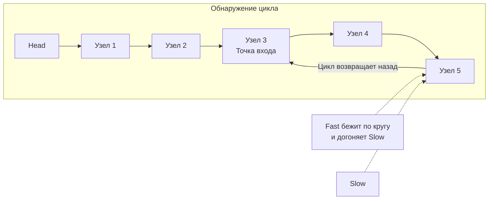

В статье [[2. Быстрый и медленный указатели]] мы заложили теоретический фундамент алгоритма "Черепахи и зайца" (Floyd's Cycle-Finding Algorithm). Настало время применить его на практике для решения одной из самых известных задач — **Linked List Cycle** (LeetCode 141).

Эта задача — лакмусовая бумажка на собеседованиях. Любой кандидат способен решить её с помощью хэш-таблицы (мапы). Но от Senior-инженера ожидают решения, которое не создает нагрузку на сборщик мусора (GC) и работает за $O(1)$ дополнительной памяти.

**Суть задачи:** Дан указатель `head` на начало односвязного списка. Необходимо определить, есть ли в списке цикл. Цикл возникает, если указатель `Next` какого-либо узла ссылается на один из предыдущих узлов, создавая бесконечное кольцо.

---

## Архитектура решения: Гонка по кругу

Как доказать наличие цикла, если мы не можем сохранять историю пройденных узлов в дополнительную память? 

Представьте гоночную трассу. Если трасса прямая, то более быстрая машина (Заяц) просто уедет вперед и пересечет финишную черту. Но если трасса закольцована, быстрая машина неизбежно догонит медленную (Черепаху) сзади, обойдя её на круг.

Алгоритм:
1. Запускаем два указателя из головы списка: `slow` (Черепаха) и `fast` (Заяц).
2. На каждой итерации `slow` делает 1 шаг (`slow.Next`), а `fast` делает 2 шага (`fast.Next.Next`).
3. Если Заяц достиг конца списка (`fast == nil` или `fast.Next == nil`), значит трасса прямая — цикла нет.
4. Если Заяц и Черепаха оказались на одном и том же узле (`slow == fast`), значит Заяц обогнал Черепаху на круг — цикл есть.



---

## Идиоматичный Go-код

Решение пишется в несколько строк, но каждое условие в нем критически важно.

```go
package main

// ListNode - базовый узел.
type ListNode struct {
	Val  int
	Next *ListNode
}

// hasCycle проверяет наличие цикла в связном списке за O-1- памяти.
func hasCycle(head *ListNode) bool {
	// Базовый случай: пустой список или список из одного узла без цикла
	if head == nil || head.Next == nil {
		return false
	}

	slow := head
	fast := head

	// ВАЖНО: Проверяем и fast, и fast.Next, чтобы безопасно сделать 2 шага.
	// Ленивое вычисление в Go гарантирует, что если fast == nil, 
	// обращение к fast.Next не произойдет.
	for fast != nil && fast.Next != nil {
		slow = slow.Next      // Черепаха делает 1 шаг
		fast = fast.Next.Next // Заяц делает 2 шага

		// Проверка совпадения АДРЕСОВ в памяти, а не значений узлов
		if slow == fast {
			return true
		}
	}

	// Заяц добежал до конца (nil) - цикла нет
	return false
}
```

---

## Взгляд под капот: Разгром наивного подхода

На интервью вас могут специально спровоцировать: *"Твой алгоритм с двумя указателями математически сложный. Почему бы просто не использовать `map[*ListNode]struct{}` и проверять, видели ли мы этот узел раньше?"*

Это ваш выход. Вы должны продемонстрировать **Mechanical Sympathy** и объяснить, почему использование мапы здесь — это архитектурная ошибка.

### 1. Цена аллокации (Escape Analysis)
Если вы создаете `seen := make(map[*ListNode]struct{})` внутри функции, размер этого списка заранее неизвестен. Компилятор не сможет безопасно разместить мапу на стеке горутины, и она "убежит" в кучу (Heap Allocation). Выделение памяти в куче требует системного вызова, поиска свободного блока аллокатором (mcache/mcentral) и установки блокировок.

### 2. Давление на Garbage Collector (GC Pressure)
При обходе списка из 1 миллиона узлов ваша мапа вырастет до гигантских размеров. В процессе роста (`growslice` для бакетов мапы) рантайм Go будет выполнять эвакуацию данных (перехэширование). 
Но самое страшное начнется, когда функция `hasCycle` завершит работу. Огромная мапа останется в куче без активных ссылок. Сборщик мусора в фазе *Mark* будет вынужден просканировать её, а в фазе *Sweep* — очистить. Мы нагрузили систему мусором ради банальной проверки.

### 3. Производительность CPU
Алгоритм Флойда (два указателя) выделяет ровно 16 байт на стеке (два указателя по 8 байт). Обращения к стеку мгновенны. Сравнение `slow == fast` — это одна инструкция ассемблера `CMP` (сравнение регистров). 
Поиск в хэш-таблице требует вычисления хэша от адреса памяти, вычисления смещения бакета и потенциального прохода по цепочке коллизий — всё это сопровождается катастрофическими промахами мимо кэша процессора (Cache Misses).

> [!warning] Ловушка / Gotcha: `map[*ListNode]bool` vs `map[*ListNode]struct{}`
> Если кандидат всё же решает использовать мапу (например, в другой задаче, где без неё не обойтись), джуниоры часто пишут `map[*ListNode]bool`. 
> Senior всегда пишет `map[*ListNode]struct{}`. Пустая структура `struct{}` в Go весит **ровно 0 байт**. Тип `bool` весит 1 байт. На миллионе записей использование пустой структуры сэкономит целый мегабайт оперативной памяти.

---

## Углубление: Поиск точки входа в цикл (LeetCode 142)

> [!tip] Собеседование: Follow-up
> Интервьюер: *"Отлично, ты нашел цикл. А теперь верни мне узел, с которого этот цикл начинается. И тоже за $O(1)$ памяти."*

Это классическая задача **Linked List Cycle II**. Продолжение алгоритма опирается на строгую математику:

Если цикл есть, и Заяц с Черепахой встретились внутри него, то **расстояние от головы списка до начала цикла в точности равно расстоянию от точки встречи до начала цикла**.

**Алгоритм для интервью:**
1. Находим точку встречи (как в коде выше).
2. Оставляем Зайца в точке встречи, а Черепаху (или наоборот, неважно) переносим обратно на `head`.
3. Теперь оба указателя делают **ровно по одному шагу**.
4. Узел, в котором они встретятся — это и есть начало цикла.

**Код для Follow-up:**
```go
func detectCycle(head *ListNode) *ListNode {
	slow, fast := head, head
	hasCycle := false

	for fast != nil && fast.Next != nil {
		slow = slow.Next
		fast = fast.Next.Next
		if slow == fast {
			hasCycle = true
			break
		}
	}

	if !hasCycle {
		return nil
	}

	// Переносим один указатель в начало
	slow = head
	// Теперь оба двигаются с одинаковой скоростью
	for slow != fast {
		slow = slow.Next
		fast = fast.Next
	}

	// Точка их встречи - начало цикла
	return slow
}
```

## Итог

Задача **Linked List Cycle** — это торжество оптимизации по памяти. Она показывает, что зачастую математическое свойство движения позволяет полностью отказаться от "тяжелых" структур данных вроде хэш-таблиц.

Отработав навыки разворота ссылок и поиска циклов с помощью указателей, мы переходим к задачам на "взгляд в прошлое" — как удалить элемент с конца списка, если мы не знаем его длину и можем двигаться только вперед? Об этом в следующей статье: [[6. Remove Nth Node From End]].