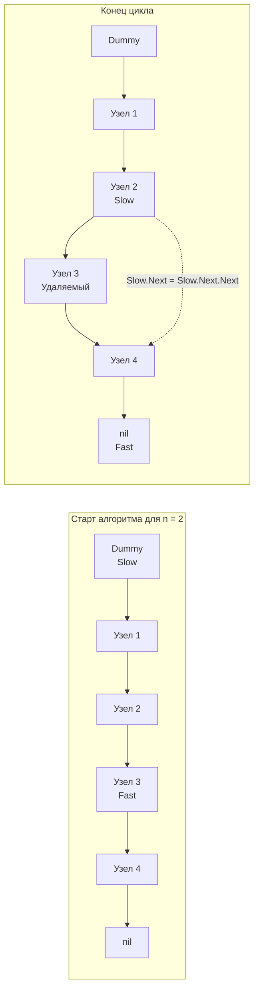

В предыдущих статьях мы обсуждали паттерн «Dummy Node» (фиктивный узел) и технику двух указателей. Задача **Remove Nth Node From End of List** (LeetCode 19) — это элегантный синтез этих двух концепций. 

На собеседованиях эта задача обычно дается как "разогревочная", но интервьюер всегда ждет от кандидата ответа на вопрос: *"Можно ли сделать это за один проход, и почему это важно для процессора?"*

**Суть задачи:** Дан указатель на голову связного списка. Необходимо удалить $n$-ный узел с конца списка и вернуть голову модифицированного списка.

---

## Архитектура: Окно фиксированного размера

Наивное решение уровня Junior: пройти по списку один раз, чтобы узнать его длину $L$. Затем вычислить индекс удаляемого элемента с начала ($L - n$) и пройти по списку второй раз до нужного узла, чтобы его удалить.
Это решение работает за $O(N)$ времени, но требует **двух полных проходов** по памяти.

Решение уровня Senior: использовать **два указателя с заданным интервалом (Gap)**.

Если мы выпустим указатель `Fast` вперед ровно на $n + 1$ шагов, а затем начнем двигать оба указателя `Fast` и `Slow` одновременно, то в момент, когда `Fast` достигнет конца списка (`nil`), указатель `Slow` окажется **ровно перед тем узлом, который нужно удалить**. 

Это классическое скользящее окно (Sliding Window), но реализованное поверх разрозненных узлов списка. И, конечно же, нам понадобится **Dummy Node**, чтобы изящно обработать краевой случай — удаление самой первой головы списка.



---

## Идиоматичный Go-код (One-pass solution)

В этом решении мы объединяем безопасность фиктивного узла и эффективность одного прохода.

```go
package main

// ListNode - базовый узел.
type ListNode struct {
	Val  int
	Next *ListNode
}

// removeNthFromEnd удаляет n-ный узел с конца за один проход.
func removeNthFromEnd(head *ListNode, n int) *ListNode {
	// 1. Создаем фиктивный узел на стеке.
	// Это защитит нас от panic, если нужно удалить саму head.
	var dummy ListNode
	dummy.Next = head

	slow := &dummy
	fast := &dummy

	// 2. Выдвигаем Fast вперед на n + 1 шагов.
	// +1 шаг нужен для того, чтобы Slow остановился ПЕРЕД удаляемым узлом,
	// а не на нем (нам нужен доступ к предыдущему узлу, чтобы перекинуть ссылку).
	for i := 0; i <= n; i++ {
		fast = fast.Next
	}

	// 3. Двигаем оба указателя синхронно, пока Fast не выйдет за пределы списка.
	for fast != nil {
		slow = slow.Next
		fast = fast.Next
	}

	// 4. Удаляем целевой узел, перекидывая ссылку через него.
	// В Go сборщик мусора сам очистит старый узел, если на него нет ссылок.
	slow.Next = slow.Next.Next

	return dummy.Next
}
```

---

## Взгляд под капот: Оптимизация Cache Locality

Зачем мы так боремся за "один проход" (One-pass), если $2N$ (два прохода) асимптотически тоже равны $O(N)$? 
Собеседующие задают этот вопрос, чтобы проверить ваше понимание **Mechanical Sympathy** и иерархии памяти процессора.

Как мы разбирали в [[1. Теория. Связные списки]], связный список — это кошмар для CPU. Узлы разбросаны по куче (Heap Allocation). Чтение `node.Next` — это обращение к случайному адресу в RAM, которое с вероятностью 99% приводит к промаху мимо L1/L2-кэша (Cache Miss). 

Каждый промах мимо кэша заставляет конвейер процессора простаивать (CPU Stall) от 50 до 100 наносекунд в ожидании данных из оперативной памяти.
- Если мы делаем **два прохода** по списку из 100 000 узлов, мы получаем 200 000 кэш-промахов.
- Если мы делаем **один проход** двумя указателями (причем `fast` подгружает кэш-линии первым, а `slow` идет по его следам, возможно, попадая в еще горячий L3-кэш), мы сокращаем количество кэш-промахов почти вдвое. 

В wall-clock времени (реальном времени выполнения) однопроходное решение на связных списках работает физически в 1.5–2 раза быстрее, чем двухпроходное, хотя алгоритмическая сложность одинакова. 

> [!warning] Ловушка / Gotcha: Утечка памяти (Memory Leak)
> В Go, когда мы пишем `slow.Next = slow.Next.Next`, мы "отцепляем" узел от основного списка. Если это обычный короткоживущий список в рамках одного HTTP-запроса, Garbage Collector легко соберет "отцепленный" узел. 
> 
> **Но есть нюанс уровня Senior:** Если вы пишете долгоживущий кэш (например, LRU) или системную очередь, удаленный узел (хоть на него больше никто не ссылается из `head`) сам **продолжает хранить указатель** на остаток списка в своем поле `Next`. В очень редких и специфичных случаях сложных графов это может замедлить сборку мусора или привести к "фантомным" удержаниям (если ссылка на удаленный узел случайно осталась где-то в другом месте приложения, например, в мапе). 
> Хорошей инженерной привычкой при удалении из долгоживущих структур является явное зануление указателей:
> ```go
> target := slow.Next
> slow.Next = target.Next
> target.Next = nil // Явно разрываем связь удаленного узла с миром
> ```
> Для задачи на LeetCode это избыточно, но на System Design интервью это жирный плюс.

> [!info] Под капотом: Удаление `head`
> Краш-тест этой задачи — ситуация, когда $n$ равно длине списка (т.е. нас просят удалить первый элемент — `head`). 
> Если бы у нас не было фиктивного узла `dummy`, `fast` прошел бы до конца списка на этапе инициализации, и нам пришлось бы писать отдельный `if`, чтобы вернуть `head.Next`. 
> С `dummy` мы просто выдвигаем `fast` до `nil`, `slow` остается стоять на `dummy`, и мы делаем `dummy.Next = dummy.Next.Next` (удаляя бывший `head`). Код остается абсолютно монолитным и без ветвлений (Branchless).

## Итог

Мы объединили концепции двух указателей и фиктивного узла, чтобы создать элегантный алгоритм, оптимизирующий пропускную способность памяти (Memory Bandwidth). 

Но что, если у нас есть два разных списка, которые в какой-то момент сливаются в один? Как найти точку их пересечения без использования мапы? Переходим к следующей классической задаче, где математика и указатели творят чудеса: [[7. Intersection of Two Linked Lists]].