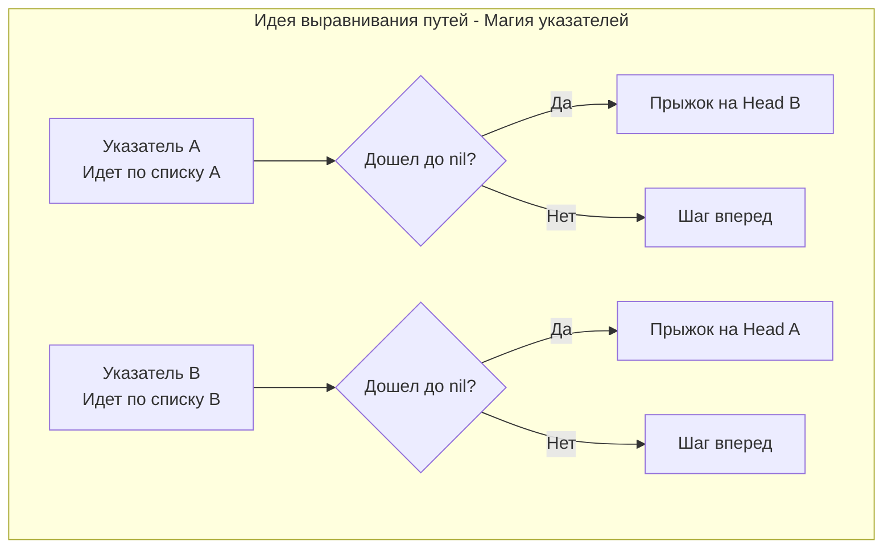

## Точка слияния двух миров

В реальном системном программировании мы часто сталкиваемся с переиспользованием памяти. Например, в системах контроля версий (Git) разные ветки могут иметь общие коммиты, а в LRU-кэшах разные ключи могут ссылаться на один и тот же базовый объект (чтобы экономить RAM). В терминах структур данных это означает, что два независимых связных списка в какой-то момент сливаются в один и продолжают путь вместе.

Задача **Intersection of Two Linked Lists** (LeetCode 160) просит найти именно этот узел — точку пересечения. Если пересечения нет, вернуть `nil`.

Интервьюер на позиции Middle/Senior ожидает решения за $O(N + M)$ по времени и **строго за $O(1)$ по дополнительной памяти**.

---

## Архитектура: Почему наивный подход не работает

Представьте два списка:
- **Список A:** `a1 -> a2 -> c1 -> c2 -> c3`
- **Список B:** `b1 -> b2 -> b3 -> c1 -> c2 -> c3`

Пересечение начинается в узле `c1`.
Главная проблема поиска: **разная длина "хвостов" до пересечения**. Мы не можем просто запустить два указателя одновременно и пошагово их сравнивать, так как они достигнут узла `c1` в разное время (указатель A придет туда на 3-м шаге, а указатель B — на 4-м).

> [!warning] Ловушка / Gotcha: Хэш-таблица
> Джуниоры сразу предлагают `map[*ListNode]struct{}`. Пройти первый список, сложить все адреса узлов в мапу, затем идти по второму списку и проверять наличие адреса в мапе.
> **Почему это плохо?** Это $O(N)$ памяти. Вы аллоцируете структуру в куче (Heap), нагружаете сборщик мусора (GC) и ловите Cache Misses при каждом вычислении хэша от указателя. На хардкорном интервью такое решение забракуют сразу, сославшись на нехватку RAM.

### Математический трюк: Выравнивание путей

Если проблема в разной длине до пересечения, давайте сделаем так, чтобы оба указателя прошли **абсолютно одинаковое расстояние**.

Пусть длина непересекающейся части списка A равна $LenA$, непересекающейся части списка B равна $LenB$, а длина их общей части равна $Shared$.
- Полный путь A: $LenA + Shared$
- Полный путь B: $LenB + Shared$

Что если указатель, дойдя до конца своего списка, **перепрыгнет на начало чужого**?
Тогда первый указатель пройдет путь: $LenA + Shared + LenB$.
Второй указатель пройдет путь: $LenB + Shared + LenA$.

Внезапно, оба пути становятся математически равными! Это значит, что они гарантированно окажутся в узле начала общей части ($Shared$) **ровно в один и тот же момент времени**.



---

## Идиоматичный Go-код

Код, реализующий эту элегантную математику, состоит всего из нескольких строк.

```go
package main

// ListNode - базовый узел связного списка.
type ListNode struct {
	Val  int
	Next *ListNode
}

// getIntersectionNode находит узел пересечения двух списков за O-1- памяти.
func getIntersectionNode(headA, headB *ListNode) *ListNode {
	// Базовая проверка
	if headA == nil || headB == nil {
		return nil
	}

	ptrA := headA
	ptrB := headB

	// Цикл идет до тех пор, пока указатели не встретятся.
	// ВНИМАНИЕ: Сравниваются АДРЕСА в памяти, а не значения Val!
	for ptrA != ptrB {
		// Если указатель A дошел до конца, перекидываем его на голову B
		if ptrA == nil {
			ptrA = headB
		} else {
			ptrA = ptrA.Next
		}

		// Если указатель B дошел до конца, перекидываем его на голову A
		if ptrB == nil {
			ptrB = headA
		} else {
			ptrB = ptrB.Next
		}
	}

	// Когда цикл прервется, ptrA (и ptrB) будут указывать либо на 
	// узел пересечения, либо на nil (если пересечения нет).
	return ptrA
}
```

---

## Взгляд под капот: Mechanical Sympathy

### 1. Как работает сравнение `ptrA != ptrB` в Go
В языке Go переменные типа `*ListNode` хранят 64-битные числа (адреса виртуальной памяти). Операция `ptrA != ptrB` компилируется в одну-единственную процессорную инструкцию сравнения `CMP`. 
Здесь нет перегрузки операторов (как в C++), нет вызова методов `equals()` (как в Java). Мы работаем на максимально низком уровне, доступном в безопасном языке. Если узлы в разных списках имеют одинаковое значение `Val == 5`, но лежат в разных местах кучи — они **не равны**. Пересечение — это физическое слияние в одном участке RAM.

### 2. Что если списки НЕ пересекаются?
Частый вопрос на собеседовании: *"А твой код не уйдет в бесконечный цикл, если пересечения нет?"*
**Не уйдет.** Давайте посчитаем: указатель A пройдет $Length(A) + Length(B)$ узлов и станет равен `nil`. Указатель B пройдет $Length(B) + Length(A)$ узлов и тоже станет равен `nil`.
На этой итерации сработает проверка `nil == nil` (которая в Go абсолютно валидна и истинна), цикл завершится, и функция вернет `nil`. Идеальная математическая симметрия.

### 3. Branch Prediction (Предсказатель ветвлений)
Внутри цикла у нас есть условия `if ptrA == nil`. Как это скажется на конвейере CPU? 
Замечательно скажется! 99% времени указатель **не равен** `nil`. Предсказатель ветвлений (Branch Predictor) процессора быстро "поймет" этот паттерн и будет всегда спекулятивно выполнять ветку `else { ptrA = ptrA.Next }`. Ошибка предсказания (Branch Misprediction) и сброс конвейера (Pipeline Flush) произойдет ровно **один раз** для каждого указателя — в момент прыжка. Это делает код фантастически быстрым.

---

## Альтернативный подход: Выравнивание через длину

> [!tip] Собеседование: Инженерный подход vs "Трюк"
> Некоторым интервьюерам не нравится решение с "магическим" прыжком указателей, так как оно больше похоже на алгоритмический фокус, чем на системную инженерию.
> В этом случае нужно продемонстрировать **второй подход (разница длин)**, который тоже работает за $O(1)$ памяти:
> 
> 1. Проходим первый список, считаем длину $L_A$.
> 2. Проходим второй список, считаем длину $L_B$.
> 3. Вычисляем дельту (разницу длин): $\Delta = |L_A - L_B|$.
> 4. Берем указатель на **более длинный** список и делаем им $\Delta$ шагов вперед. Теперь до конца обоих списков осталось ровно одинаковое количество узлов!
> 5. Запускаем оба указателя параллельно шаг за шагом. Узел, где они совпадут — и есть пересечение.
> 
> *Этот код длиннее, но логика его железобетонна и очевидна любому разработчику, который будет читать ваш код в Pull Request.*

## Итог

Задача о пересечении двух связных списков учит нас смотреть на структуры данных не только как на контейнеры, но и как на графы в памяти. Выравнивание путей через математическую симметрию — один из самых красивых приемов на LeetCode.

Теперь, когда мы научились разворачивать списки, искать их середину и пересечения, настало время собрать все эти знания в единый "комбайн". В следующей задаче мы применим сразу три разных паттерна связных списков, чтобы полностью перестроить структуру: [[8. Reorder List]].