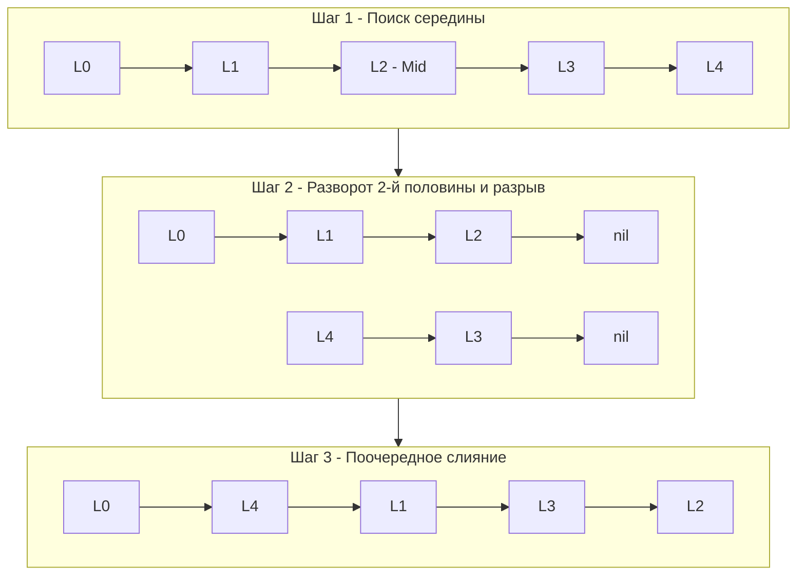

## Экзамен на знание связных списков

В предыдущих статьях мы разобрали три фундаментальных паттерна работы со связными списками: поиск середины, разворот ссылок и слияние. 

Задача **Reorder List** (LeetCode 143) — это своеобразный "выпускной экзамен" по этой теме. Интервьюеры обожают её, потому что она не требует знания каких-то хитрых математических трюков, но заставляет кандидата написать 30-40 строк кода, объединяя **три разных алгоритма в один**, ни разу не ошибившись в указателях.

**Суть задачи:** Дан односвязный список `L0 -> L1 -> ... -> Ln-1 -> Ln`. 
Нужно перестроить его in-place (без выделения новой памяти) в формате: `L0 -> Ln -> L1 -> Ln-1 -> L2 -> Ln-2 -> ...`
То есть мы берем первый узел, затем последний, затем второй, затем предпоследний и так далее, складывая их гармошкой.

---

## Архитектура: Разделяй и властвуй

Наивный подход, который часто предлагают джуниоры: *"Давайте сложим все узлы в слайс `[]*ListNode`, а затем пойдем двумя указателями с начала и с конца слайса, переставляя `Next`"*.
Это рабочее решение, но оно требует $O(N)$ дополнительной памяти. Интервьюер сразу скажет: *"У нас эмбеддед-система или высоконагруженный сервис, мы не можем аллоцировать слайс на 100 000 указателей для каждого запроса. Сделайте за $O(1)$ памяти"*.

Чтобы решить задачу за $O(1)$ памяти, мы разобьем её на три независимых этапа, каждый из которых мы уже умеем решать:

1. **Найти середину списка.** Используем паттерн "Черепаха и заяц" ([[2. Быстрый и медленный указатели]]).
2. **Развернуть вторую половину.** Используем классический разворот ([[3. Reverse Linked List]]). **Критически важно:** разорвать связь между первой и второй половиной, иначе мы получим зацикливание!
3. **Слить две половины поочередно.** Модифицированная версия слияния ([[4. Merge Two Sorted Lists]]), где мы вплетаем элементы одного списка в другой.



---

## Идиоматичный Go-код

В отличие от многих задач, здесь функция не возвращает новую голову. Сигнатура `func reorderList(head *ListNode)` подразумевает модификацию исходного списка (in-place).

```go
package main

// ListNode - базовый узел.
type ListNode struct {
	Val  int
	Next *ListNode
}

// reorderList перестраивает список "гармошкой".
func reorderList(head *ListNode) {
	// Базовый случай: список пуст или слишком мал для перестроения
	if head == nil || head.Next == nil || head.Next.Next == nil {
		return
	}

	// === ШАГ 1: Поиск середины (Черепаха и Заяц) ===
	slow, fast := head, head
	for fast != nil && fast.Next != nil {
		slow = slow.Next
		fast = fast.Next.Next
	}

	// === ШАГ 2: Разворот второй половины ===
	// slow сейчас указывает на середину (или конец первой половины)
	var prev *ListNode
	curr := slow.Next // Голова второй половины
	
	// КРИТИЧЕСКИЙ МОМЕНТ: разрываем список на две независимые части!
	slow.Next = nil 

	for curr != nil {
		nextTemp := curr.Next
		curr.Next = prev
		prev = curr
		curr = nextTemp
	}

	// === ШАГ 3: Поочередное слияние (Interleave) ===
	// first - голова первой (нетронутой) половины
	// second - голова второй (развернутой) половины (сейчас это prev)
	first := head
	second := prev

	for second != nil {
		// Спасаем следующие узлы в обеих половинах
		tmp1 := first.Next
		tmp2 := second.Next

		// Вплетаем узел из второй половины после узла из первой
		first.Next = second
		second.Next = tmp1

		// Сдвигаем указатели вперед для следующей итерации
		first = tmp1
		second = tmp2
	}
}
```

---

## Взгляд под капот: Memory Bandwidth и CPU Registers

Почему решение со слайсом `[]*ListNode` (которое занимает 5 строк кода) хуже, чем эта 40-строчная простыня?

### 1. Escape Analysis и Garbage Collector
Если вы создаете слайс `nodes := make([]*ListNode, 0)`, компилятор Go с высокой долей вероятности отправит его в кучу (Heap Allocation). Если эта функция вызывается тысячами горутин одновременно, вы создаете огромное давление на аллокатор памяти (mcache) и провоцируете частые паузы Stop-The-World для сборщика мусора. 
Наше решение с указателями использует **Zero Allocations**. Переменные `slow`, `fast`, `prev`, `curr`, `first`, `second` — это просто 64-битные числа (адреса), которые идеально ложатся в регистры процессора. Мы не создаем ни одного нового объекта.

### 2. Цена Cache Miss
В решении со слайсом мы сначала делаем проход по списку ($N$ промахов кэша), записывая указатели в слайс (запись в оперативную память). Затем мы прыгаем по этим указателям ($N$ промахов кэша).
В in-place решении мы делаем ровно те же $2N$ промахов кэша, но без накладных расходов на запись в RAM и без потребления Memory Bandwidth (пропускной способности шины памяти) на аллокацию слайса. Для CPU жонглировать адресами в регистрах — это бесплатная операция, процессор простаивает только в ожидании подгрузки следующей кэш-линии из-за `node.Next`.

> [!warning] Ловушка / Gotcha: Забытый разрыв списка
> Строка `slow.Next = nil` — это место, где ошибается 50% кандидатов на live-coding.
> Если вы не обнулите хвост первой половины, он продолжит ссылаться на узел, который теперь стал частью второй половины. При слиянии вы создадите цикл (Cycle), и ваш `for second != nil` уйдет в бесконечность, вызвав Time Limit Exceeded (или Out of Memory, если вы где-то аллоцируете данные). 
> **Золотое правило:** Если вы логически делите связный список на части, вы **обязаны** физически разорвать связи между ними.

> [!tip] Собеседование: Четные и нечетные длины
> При написании цикла слияния `for second != nil` может возникнуть сомнение: а что если длины половин не совпадают (при нечетном числе узлов в исходном списке)?
> Благодаря тому, как работает алгоритм "черепахи и зайца", первая половина (до `slow` включительно) всегда будет больше или равна второй половине (которую мы начинаем с `slow.Next`). Поэтому цикл `for second != nil` абсолютно безопасен. Когда вторая половина закончится, последний элемент первой половины просто останется на своем месте с правильным указателем на `nil`.

## Итог

Задача **Reorder List** не вводит новых концепций, но является прекрасным тренажером системного мышления. Способность разбить сложную трансформацию на три простых, изолированных этапа (Поиск -> Разворот -> Слияние) — это то, что отличает инженера от кодера.

До сих пор мы работали с односвязными списками, где узел ссылается только на соседа. Но что если структура памяти сложнее, и узел может ссылаться на *любой* другой узел в куче? Переходим к задаче, которая проверяет понимание графов в памяти и глубокого копирования объектов: [[9. Copy List with Random Pointer]].