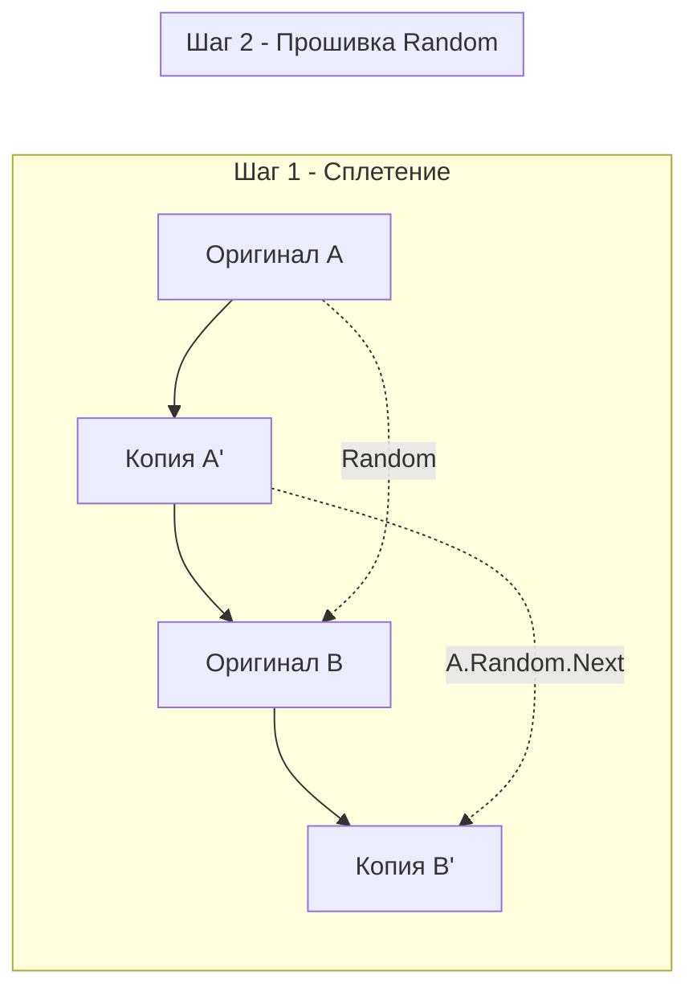

Завершая тему связных списков, мы сталкиваемся с задачей, которая перекидывает мостик между линейными структурами данных и графами. 

Задача **Copy List with Random Pointer** (LeetCode 138) проверяет, понимаете ли вы концепцию глубокого копирования (Deep Copy) и способны ли управлять сложными ссылочными структурами в памяти, не прибегая к ресурсоемким "костылям".

**Суть задачи:** Дан связный список, где каждый узел, помимо стандартного указателя `Next`, содержит указатель `Random`. Этот `Random` может указывать на абсолютно любой узел в этом же списке (вперед, назад, на самого себя) или быть `nil`.
Необходимо вернуть глубокую копию этого списка (все узлы должны быть новыми объектами в памяти, но структура связей должна полностью повторять оригинал).

---

## Архитектура: Проблема ссылок в будущее

Почему мы не можем просто пройтись по списку и скопировать его?
Представьте узел `A`, чей `Random` указывает на узел `C`. Мы находимся на узле `A`, мы создаем его копию `A'`, но мы еще не дошли до узла `C`, поэтому копии `C'` еще не существует в памяти! Нам некуда направить `A'.Random`.

В программировании это классическая проблема циклических или опережающих ссылок (Forward References).

### Подход 1: Наивный (Уровень Middle)
Самое очевидное решение — использовать хэш-таблицу. 
Мы делаем два прохода. В первом проходе мы создаем копию каждого узла и сохраняем соответствие в мапу: `map[Оригинал]Копия`. 
Во втором проходе мы снова идем по оригинальному списку, смотрим в мапу и проставляем ссылки: `Копия.Next = map[Оригинал.Next]`, `Копия.Random = map[Оригинал.Random]`.

> [!warning] Ловушка / Gotcha: Цена мапы с указателями
> Написание `map[*Node]*Node` в Go — это огромный стресс для рантайма. 
> 1. Это $O(N)$ дополнительной памяти.
> 2. Ключи и значения — указатели. Сборщик мусора (GC) в фазе сканирования (Mark) будет вынужден "ходить" по всем бакетам этой мапы, проверяя живость объектов. 
> 3. Хэширование адресов памяти и поиск по бакетам вызывает постоянные кэш-промахи (Cache Misses).
> Интервьюер обязательно спросит: *"Можешь сделать за $O(1)$ дополнительной памяти, не используя мапу?"*

### Подход 2: Идиоматичный (Уровень Senior)
Решение за $O(1)$ памяти использует сам исходный список в качестве временной "мапы". Алгоритм (Weaving / Сплетение) состоит из трех изящных проходов:

1. **Сплетение (Clone and Weave):** Идем по списку. Для каждого узла `A` создаем его копию `A'` и вставляем её прямо *между* `A` и `B`. Получаем список: `A -> A' -> B -> B' -> C -> C'`.
2. **Копирование Random:** Снова идем по списку (прыгая через один). Узел `A` знает свой `Random` (например, `C`). А где лежит копия `C'`? Она лежит прямо за `C`! Значит: `A'.Random = A.Random.Next`.
3. **Разделение (Extract and Restore):** Мы должны не только вытащить наши копии в новый список, но и **обязательно восстановить исходный список**. Мутировать входные данные навсегда — это архитектурное преступление.



---

## Идиоматичный Go-код

```go
package main

// Node - структура узла со случайным указателем.
type Node struct {
	Val    int
	Next   *Node
	Random *Node
}

// copyRandomList создает глубокую копию списка за O-1- доп. памяти.
func copyRandomList(head *Node) *Node {
	if head == nil {
		return nil
	}

	// === ШАГ 1: Сплетение (A -> A' -> B -> B') ===
	curr := head
	for curr != nil {
		// Создаем копию текущего узла
		clone := &Node{Val: curr.Val}
		
		// Вставляем копию между текущим и следующим узлом
		clone.Next = curr.Next
		curr.Next = clone
		
		// Прыгаем на следующий оригинальный узел
		curr = clone.Next
	}

	// === ШАГ 2: Копирование Random ===
	curr = head
	for curr != nil {
		if curr.Random != nil {
			// Random копии должен указывать на копию целевого узла (она лежит сразу за ним)
			curr.Next.Random = curr.Random.Next
		}
		// Прыгаем на следующий оригинальный узел (через один)
		curr = curr.Next.Next
	}

	// === ШАГ 3: Разделение списков и восстановление оригинала ===
	curr = head
	cloneHead := head.Next // Голова нашего нового списка
	
	for curr != nil {
		clone := curr.Next
		
		// Восстанавливаем оригинальный Next
		curr.Next = clone.Next
		
		// Формируем Next для копии (осторожно с концом списка)
		if clone.Next != nil {
			clone.Next = clone.Next.Next
		}
		
		// Двигаемся дальше
		curr = curr.Next
	}

	return cloneHead
}
```

---

## Взгляд под капот: Mechanical Sympathy

### 1. Почему $O(1)$ Memory? Мы же создаем новые узлы!
В оценке пространственной сложности (Space Complexity) алгоритмов **результирующие данные (сам скопированный список) не учитываются**. 
Когда мы говорим про $O(1)$ память, мы имеем в виду *дополнительную* (вспомогательную) память, необходимую самому алгоритму для работы. Решение с мапой требует $O(N)$ дополнительной памяти на ключи, хэши и бакеты. Наше решение-сплетение использует только 3-4 локальные переменные-указателя на стеке (Zero Allocation для управляющей логики).

### 2. Cache Locality (Локальность кэша)
На первый взгляд, 3 прохода цикла (вместо двух в решении с мапой) кажутся замедлением. Но с точки зрения CPU это не так. 
- В решении с мапой вы постоянно прыгаете по оперативной памяти (Random Access) при поиске адреса в хэш-таблице.
- В решении со сплетением вы делаете 3 строго **последовательных** прохода (Sequential Access). При первом проходе вы аллоцируете новые узлы. Аллокатор Go `mcache` с высокой вероятностью разместит их кучно в одном `span`. Последующие проходы будут значительно лучше предсказываться аппаратным Prefetcher-ом процессора, подтягивая кэш-линии L1/L2 быстрее, чем при случайном доступе в мапе.

> [!tip] Собеседование: Восстановление оригинала
> На интервью (особенно в FAANG) интервьюер будет внимательно смотреть на ваш третий цикл (Шаг 3). 
> Многие кандидаты просто выдирают `clone` узлы и оставляют оригинальный список "изуродованным" (`A -> B`, где `A.Next` может указывать на мусор или вообще быть разорванным). 
> В System Design глубокое копирование не должно ломать состояние исходного объекта. Если в вашем коде нет строки `curr.Next = clone.Next`, вы провалите проверку на безопасность (Side-effect free behavior). Обязательно озвучьте это вслух, когда будете писать код: *"Я восстанавливаю оригинальные связи, чтобы избежать side-effects"*.

## Итог

Задача Copy List with Random Pointer — это вершина раздела "Связные списки". Она демонстрирует, как структура графа может быть временно сериализована в линейный список для решения проблемы адресации, не прибегая к тяжеловесным хэш-таблицам. 

Мы завершили огромный блок работы с линейными структурами, памятью, сдвигами и указателями. Научившись обходить данные и перестраивать их, мы переходим к самому фундаментальному алгоритму поиска в computer science, который является основой для работы любых индексов в базах данных: [[1. Теория. Бинарный поиск]].