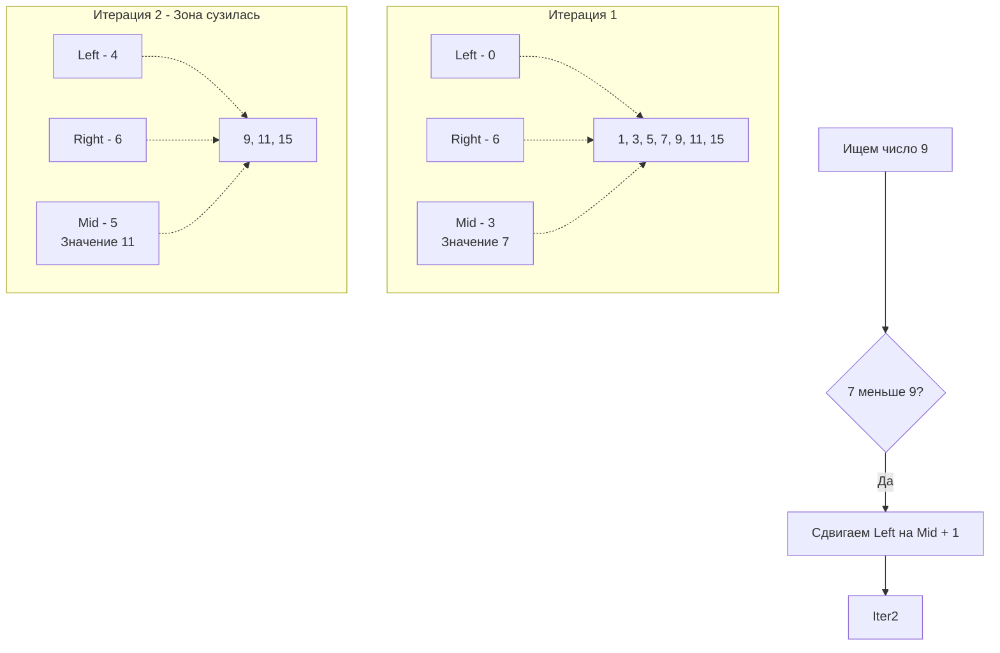

## Больше, чем просто поиск

Поиск элемента в отсортированном массиве за $O(\log N)$ — это то, чему учат на первом курсе Computer Science. Но на собеседованиях уровня Middle+/Senior от вас не будут требовать просто найти число. Вас будут просить найти **границы**, искать **ответ в абстрактном диапазоне** или применять бинарный поиск на **повернутых массивах**.

Бинарный поиск (Binary Search) — это фундамент, который превращает алгоритмы, работающие годами (за $O(N)$), в алгоритмы, отрабатывающие за миллисекунды. 

Но прежде чем переходить к сложным задачам, мы обязаны разобрать базовую механику глазами инженера: как избежать целочисленного переполнения, почему бинарный поиск иногда работает *медленнее* линейного, и как устроены функции поиска в стандартной библиотеке Go.

---

## Архитектура алгоритма и главная ловушка (Gotcha)

Идея бинарного поиска — на каждом шаге отбрасывать половину элементов, сужая зону поиска (отрезок от `left` до `right`).



### Ловушка вычисления середины
Самая известная ошибка в истории алгоритмов, которая годами существовала даже в стандартной библиотеке Java и алгоритмах сортировки, кроется в одной безобидной строке:
```go
mid := (left + right) / 2
```
> [!warning] Ловушка / Gotcha: Integer Overflow
> Если массив огромный, и индексы `left` и `right` приближаются к максимальному значению `int` (например, `math.MaxInt`), их сумма `left + right` вызовет целочисленное переполнение. Значение станет отрицательным, и программа упадет с паникой `index out of range`.
> 
> **Классическое решение:** `mid := left + (right - left) / 2`
> 
> **Go-way решение (как под капотом рантайма):** `mid := int(uint(left+right) >> 1)`
> Приведение к `uint` сбрасывает знаковый бит (sign bit), а побитовый сдвиг вправо `>> 1` работает как деление на 2, но выполняется процессором быстрее.

---

## Идиоматичный Go: Базовый шаблон

Давайте напишем каноничную реализацию поиска, которая не просто ищет элемент, а находит **первое вхождение** элемента (Lower Bound). Это самый частый и универсальный шаблон на LeetCode.

```go
package main

// lowerBound находит первый индекс, где значение больше или равно target.
// Если все элементы меньше target, вернет len(nums).
func lowerBound(nums []int, target int) int {
	left, right := 0, len(nums) // right не указывает на последний элемент!

	for left < right {
		// Защита от переполнения + быстрый битовый сдвиг
		mid := int(uint(left+right) >> 1)

		if nums[mid] >= target {
			// Если текущий элемент больше или равен, ответ где-то тут или левее.
			// Сдвигаем правую границу, НЕ исключая mid.
			right = mid
		} else {
			// Если строго меньше, ответ точно правее mid.
			// Исключаем mid.
			left = mid + 1
		}
	}

	return left
}
```

> [!tip] Собеседование: `left < right` vs `left <= right`
> В сети можно встретить шаблоны с `left <= right` и `right = len(nums) - 1`. 
> Какой выбрать? Для поиска конкретного элемента можно использовать любой. Но для задач на границы (First Bad Version, Search Insert Position) **шаблон `left < right` (полуинтервал) на порядок удобнее**. Он гарантирует, что цикл завершится, когда `left == right`, и вам не придется гадать, какой из указателей возвращать.

---

## Mechanical Sympathy: Миф о безоговорочной скорости $O(\log N)$

С точки зрения асимптотики, $\log_2(1 \ 000 \ 000) \approx 20$ операций. Это кажется невероятно быстрым по сравнению с $1 \ 000 \ 000$ операций линейного поиска ($O(N)$). 

Но на собеседованиях в High-Frequency Trading (HFT) или системное программирование вас спросят: *"Какой поиск отработает быстрее на отсортированном массиве из 30-50 элементов?"*
Правильный ответ: **Линейный поиск ($O(N)$) будет быстрее бинарного ($O(\log N)$) на маленьких массивах.**

Почему процессор "ненавидит" бинарный поиск?

1. **Разрушение локальности кэша (Cache Locality):** Линейный поиск читает память строго последовательно (`nums[0]`, `nums[1]`, `nums[2]`). Аппаратный Prefetcher видит паттерн и загружает кэш-линии L1 заранее. Бинарный поиск делает непредсказуемые прыжки (`nums[50]`, `nums[25]`, `nums[37]`), что вызывает **Cache Misses** (промахи мимо кэша) и заставляет CPU простаивать, ожидая данные из медленной RAM.
2. **Branch Misprediction (Ошибки предсказания ветвлений):** Инструкция `if nums[mid] >= target` в бинарном поиске в 50% случаев будет `true`, а в 50% — `false`. Предсказатель ветвлений (Branch Predictor) не может угадать паттерн. В линейном поиске условие `if nums[i] == target` почти всегда `false` (до самого конца), предсказатель работает идеально, выполняя код спекулятивно.

> [!info] Под капотом
> Именно поэтому внутри алгоритма сортировки `sort.Sort` (или `slices.Sort` в Go 1.21+) рантайм Go переключается с быстрой сортировки (которая тоже делит массивы) на `Insertion Sort` (линейные проходы), когда размер подмассива становится меньше 12 элементов. Железо любит линейность.

---

## Бинарный поиск в стандартной библиотеке Go

В Go есть два способа использовать бинарный поиск из коробки. Вы должны знать их отличия.

### Старый подход: `sort.Search`
Функция `sort.Search(n int, f func(int) bool) int` появилась в первых версиях языка. Она не принимает срез, она принимает длину и функцию-предикат.
Она ищет минимальный индекс `i` в диапазоне `[0, n)`, для которого `f(i)` возвращает `true`.

```go
idx := sort.Search(len(nums), func(i int) bool {
    return nums[i] >= target
})
```
**Минус:** Замыкание (closure) `func(i int)` вызывается на каждой итерации. Это overhead на вызов функции, который не инлайнится (inlining) компилятором в старых версиях Go, что делает этот поиск медленнее ручного `for`.

### Новый подход (Go 1.21+): пакет `slices`
В Go 1.21 добавили долгожданный пакет `slices`, основанный на дженериках.
```go
// Возвращает индекс (или место для вставки) и флаг (найдено или нет)
idx, found := slices.BinarySearch(nums, target)
```
**Плюс:** Код внутри пакета `slices` написан с использованием дженериков без интерфейсов и замыканий. Компилятор генерирует высокооптимизированный машинный код под конкретный тип (мономорфизация), что делает `slices.BinarySearch` таким же быстрым, как рукописный алгоритм.

## Итог

Бинарный поиск — это не просто деление массива пополам. Это мощный инструмент для работы с абстрактными монотонными функциями. 
Мы разобрали классический поиск по массиву, поняли, почему индексы не переполняются, и почему CPU предпочитает линейный доступ.

Но что, если нам не дают никакого массива? Что, если нам нужно найти оптимальное время доставки курьера, минимальную скорость поедания бананов или максимальный вес груза на корабле? Переходим к самому могущественному паттерну бинарного поиска на LeetCode: [[2. Поиск по ответу]].