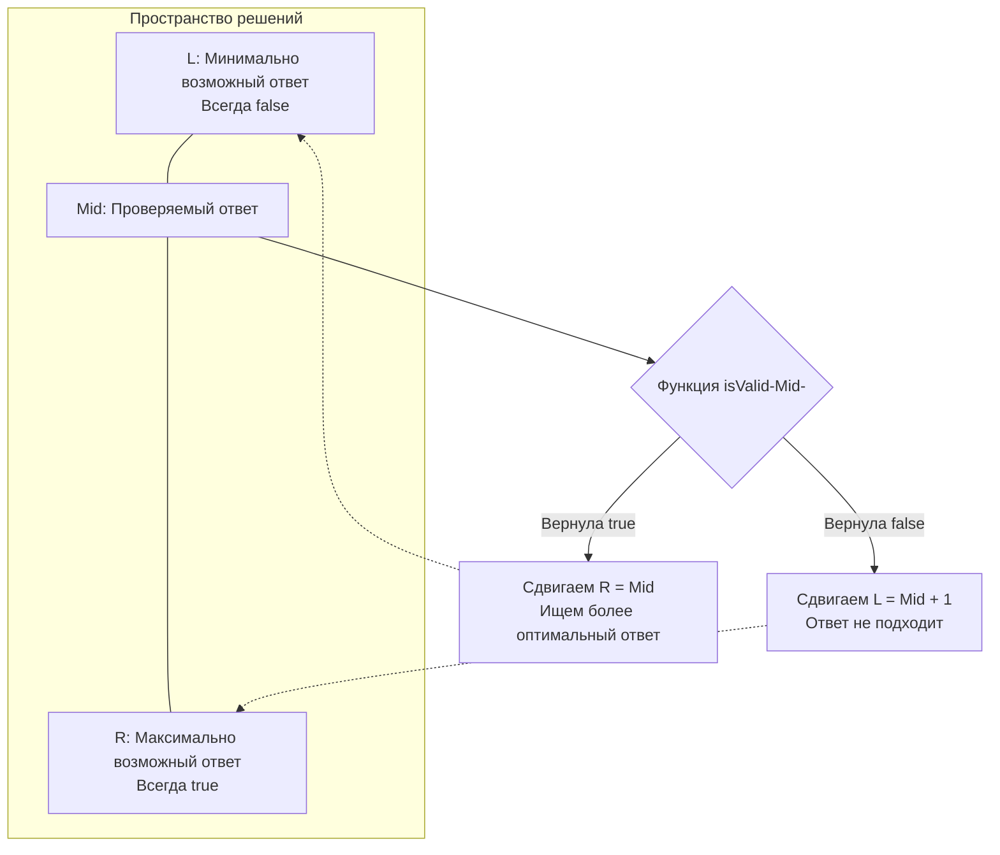

В прошлой статье мы разобрали классический бинарный поиск, где мы ищем конкретный элемент в заранее отсортированном массиве памяти. Но на собеседованиях уровня Middle+/Senior в FAANG и Яндексе классический поиск встречается редко. Гораздо чаще попадается класс задач, где **массива для поиска вообще нет**, либо он не отсортирован, а найти нужно абстрактное "минимальное время", "максимальную скорость" или "оптимальную грузоподъемность".

Этот паттерн называется **"Поиск по ответу" (Binary Search on Answer)** или поиск по пространству решений (Search Space). Умение распознать этот паттерн — один из главных навыков алгоритмического мышления.

---

## Суть паттерна: Монотонность функции

Представьте задачу: "Какова минимальная скорость $V$, с которой нужно ехать, чтобы успеть в аэропорт за $H$ часов?". 
У нас нет массива скоростей. Но у нас есть логика реального мира:
- Если мы успеваем при скорости $100$ км/ч, то мы **гарантированно** успеем при скорости $101$, $150$ и $200$ км/ч.
- Если мы опаздываем при скорости $50$ км/ч, то мы **гарантированно** опоздаем при $49$, $30$ и $10$ км/ч.

Это свойство называется **Монотонностью**. Если мы превратим проверку "успеваем ли мы при скорости $V$" в функцию-предикат `isValid(V) bool`, то на всем диапазоне возможных скоростей от $1$ до $\infty$ результаты функции образуют строго отсортированную последовательность:
`[false, false, false, true, true, true, true]`

Наша задача — с помощью бинарного поиска найти точку перехода (Lower Bound), то есть первый `true`.



---

## Архитектура решения: Шаблон поиска по ответу

Любая задача этого типа решается по одному и тому же железобетонному шаблону из трех шагов:

1. **Определить пространство решений `[L, R]`:** Каков теоретический минимум ответа? Каков теоретический максимум? (Например, минимальная скорость = 1, максимальная = сумма всех элементов).
2. **Написать предикат `isValid(mid)`:** Функция, которая принимает кандидата на ответ (`mid`) и за $O(N)$ (линейным проходом по входным данным) проверяет, выполнимо ли условие задачи при таком `mid`.
3. **Запустить бинарный поиск:** Использовать стандартный цикл для сужения границ `L` и `R`.

### Идиоматичный Go-код (Абстрактный шаблон)

В реальном коде на собеседовании это выглядит примерно так:

```go
package main

import "math"

// solveTask - абстрактная функция поиска ответа
func solveTask(nums []int, limit int) int {
	// 1. Определяем границы поиска (зависят от задачи)
	left := 1 
	right := 1000000000 // Либо вычисляется динамически (например, сумма элементов)

	// 2. Предикат-проверка. 
	// Вынесена в замыкание (closure) или отдельную функцию.
	isValid := func(mid int) bool {
		currentSum := 0
		operations := 1

		for _, num := range nums {
			// Какая-то бизнес-логика симуляции для проверки mid
			currentSum += num
			if currentSum > mid {
				operations++
				currentSum = num
			}
		}
		
		// Возвращаем, уложились ли мы в лимит при текущем mid
		return operations <= limit
	}

	// 3. Классический бинарный поиск (Lower Bound)
	for left < right {
		mid := int(uint(left+right) >> 1) // Защита от переполнения и быстрый сдвиг
		
		if isValid(mid) {
			// Если mid подходит, возможно есть ответ ЕЩЕ МЕНЬШЕ.
			// Сужаем правую границу, но сам mid оставляем как потенциальный ответ.
			right = mid
		} else {
			// Если mid не подходит, все ответы <= mid тоже не подходят.
			left = mid + 1
		}
	}

	return left
}
```

---

## Взгляд под капот: Оптимизация Предиката и GC

Временная сложность такого подхода: $O(N \log M)$, где $N$ — размер входного массива (сложность функции `isValid`), а $M$ — размер пространства решений ($R - L$).

Поскольку функция `isValid` вызывается на каждой итерации логарифмического цикла (около 30 раз для диапазона в миллиард), **любая неэффективность внутри `isValid` умножается на 30**.

### 1. Zero Allocations внутри `isValid`
Никогда не аллоцируйте слайсы или мапы внутри функции `isValid`. Если вам нужны вспомогательные структуры для проверки, выделяйте их *до* цикла бинарного поиска и переиспользуйте, передавая по указателю, либо просто зануляя их (`slice = slice[:0]`). Сборщик мусора (GC) не должен работать во время симуляции.

### 2. Inlining и Замыкания (Closures)
В шаблоне выше `isValid` объявлена как анонимная функция. Компилятор Go (Escape Analysis) обычно достаточно умен, чтобы не выделять захваченные переменные (`nums`, `limit`) в куче, если замыкание не покидает область видимости. 
Однако, в высокопроизводительном системном коде (или если `isValid` очень объемная), лучше сделать её обычной функцией на уровне пакета и передавать состояние явно: `isValid(nums []int, limit int, mid int)`. Это гарантирует, что функция сможет быть заинлайнена (Inlined) компилятором, избавляя процессор от накладных расходов на вызов функции (Function Call Overhead) и манипуляции со стеком.

> [!tip] Собеседование: Как распознать этот паттерн?
> Если в условии задачи есть фразы:
> - *"Найдите **минимальное** значение $X$, при котором **возможно** выполнить..."*
> - *"Какова **максимальная** величина $Y$, чтобы лимит не был превышен..."*
> И при этом задача выглядит так, будто её нужно решать сложным Динамическим Программированием (DP), но ограничения на числа огромные (например, $10^9$) — **это на 99% поиск по ответу**. DP с массивом на миллиард элементов упадет по OOM, а логарифм от миллиарда — это всего $\approx 30$ итераций.

> [!warning] Ловушка / Gotcha: Верхняя граница поиска `right`
> Частая ошибка на интервью — поставить `right = math.MaxInt64` "на всякий случай". 
> Во-первых, если сложить `left` и `math.MaxInt64`, вы гарантированно получите переполнение (Integer Overflow), даже с безопасной формулой `mid := left + (right-left)/2`, если вычислять неосторожно.
> Во-вторых, чем точнее вы зададите верхнюю границу, тем меньше итераций сделает цикл. Всегда пытайтесь найти логический максимум из входных данных (например, умножить максимальный элемент массива на его длину).

## Итог

Поиск по ответу — это смена парадигмы. Мы перестаем искать данные, и начинаем "угадывать" решение, используя бинарный поиск как высокоскоростной механизм подбора, а функцию `isValid` — как валидатор догадок.

Поняв монотонность абстрактных функций, мы готовы закрепить базовые механики. В следующей статье мы вернемся к "классике" и разберем самую первую задачу этой темы с LeetCode, написав эталонный, Production-Ready код для базового поиска: [[3. Binary Search]].