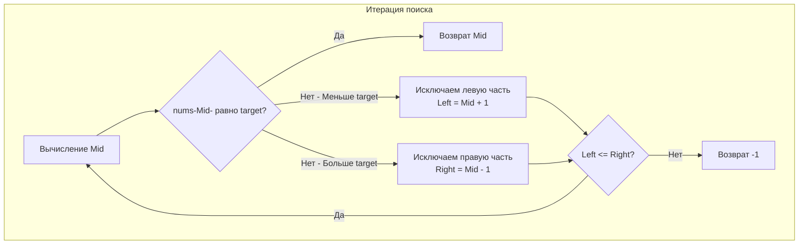

## "Hello World" алгоритмических секций

Задача **Binary Search** (LeetCode 704) — это отправная точка для любого разработчика. Если вы не можете написать безошибочный бинарный поиск за 2 минуты с закрытыми глазами, секция алгоритмов на Middle+/Senior позиции для вас закончится, не успев начаться.

**Суть задачи:** Дан массив целых чисел `nums`, отсортированный по возрастанию, и число `target`. Напишите функцию для поиска `target` в `nums`. Если цель найдена, верните её индекс, иначе верните `-1`. Алгоритм должен работать за время $O(\log N)$.

В этой статье мы напишем эталонный код и разберем, как компилятор Go оптимизирует его под капотом.

---

## Архитектура: Классический шаблон

В статье [[1. Теория. Бинарный поиск]] мы обсуждали шаблон с полуинтервалом (`left < right`), который идеален для поиска границ (Lower Bound). 

Однако для задачи **точного поиска конкретного элемента** (когда нам не важно первое или последнее это вхождение, а нужен просто факт наличия), классическим и самым читаемым считается шаблон с закрытым интервалом `[left, right]`.

Правила закрытого интервала:
1. `right` инициализируется как `len(nums) - 1`.
2. Цикл работает, пока `left <= right` (знак равенства обязателен, иначе мы пропустим массив из одного элемента).
3. При сужении границ мы **исключаем** `mid`, делая `left = mid + 1` или `right = mid - 1`.



---

## Идиоматичный Go-код

```go
package main

// search находит индекс элемента target в отсортированном массиве nums.
func search(nums []int, target int) int {
	left, right := 0, len(nums)-1

	// Используем <=, так как границы включительны.
	for left <= right {
		// Оптимизированное вычисление середины (защита от переполнения)
		mid := int(uint(left+right) >> 1)

		if nums[mid] == target {
			return mid
		}
		
		if nums[mid] < target {
			// Цель справа, отбрасываем левую половину вместе с mid
			left = mid + 1
		} else {
			// Цель слева, отбрасываем правую половину вместе с mid
			right = mid - 1
		}
	}

	return -1 // Элемент не найден
}
```

---

## Взгляд под капот: Bounds Check Elimination (BCE)

На собеседовании в Яндекс или VK вас могут спросить: *"Зачем ты написал `mid := int(uint(left+right) >> 1)`? Разве `mid := left + (right-left)/2` не делает то же самое?"*

Вы должны ответить: *"Математически — да, но для рантайма Go это две огромные разницы"*.

В Go каждый раз, когда вы обращаетесь к массиву по индексу (например, `nums[mid]`), компилятор вставляет проверку границ (Bounds Check), чтобы защитить вас от паники `index out of range`. Если индекс меньше нуля или больше/равен длине, программа падает. Эта проверка занимает такты процессора на каждой итерации цикла.

Компилятор Go имеет механизм **BCE (Bounds Check Elimination)**. Он пытается статически доказать, что индекс всегда валиден, и если доказывает — вырезает эти проверки из финального бинарного файла, ускоряя код.

Когда вы пишете `mid := left + (right-left)/2`, компилятор видит знаковые типы `int` и не может на 100% гарантировать, что результат не станет отрицательным (например, из-за какой-то сложной арифметики).
Когда вы приводите сумму к **беззнаковому типу `uint`**, вы сообщаете компилятору: *"Это число гарантированно $\ge 0$"*. А битовый сдвиг `>> 1` гарантирует, что число не превысит исходную длину. 
Благодаря этому трюку, компилятор (в большинстве современных версий Go) **вырезает проверки границ для `nums[mid]`**, делая ваш бинарный поиск максимально близким к скорости C/C++.

> [!info] Под капотом: Пустой массив
> Что будет, если на вход подать пустой массив `nums = []`?
> Переменная `right` станет `0 - 1 = -1`. 
> Условие цикла `left <= right` превратится в `0 <= -1`, что является `false`. Цикл даже не начнется, и функция безопасно вернет `-1`. Код пуленепробиваем без дополнительных `if len(nums) == 0`.

---

## Ловушки и Альтернативы (Gotchas)

> [!warning] Ловушка / Gotcha: Дубликаты в массиве
> В задаче 704 по условию все числа уникальны. 
> Но что если вас спросят: *"Измени алгоритм так, чтобы он возвращал индекс **первого** вхождения, если в массиве есть дубликаты?"*
> 
> Наш закрытый шаблон с `return mid` сразу при нахождении больше не сработает! Мы наткнемся на случайный `target` где-то в середине цепочки дубликатов.
> Здесь мы обязаны переключиться на шаблон полуинтервала (Lower Bound), который мы разбирали в теории:
> ```go
> left, right := 0, len(nums)
> for left < right {
>     mid := int(uint(left+right) >> 1)
>     if nums[mid] >= target { // Даже если нашли, продолжаем искать левее!
>         right = mid
>     } else {
>         left = mid + 1
>     }
> }
> // После цикла проверяем, действительно ли мы нашли элемент
> if left < len(nums) && nums[left] == target {
>     return left
> }
> return -1
> ```

> [!tip] Собеседование: Использование стандартной библиотеки
> Если задача не подразумевает написание поиска с нуля (например, бинарный поиск — это лишь часть большего алгоритма), покажите знание пакета `slices` (Go 1.21+):
> ```go
> import "slices"
> 
> func search(nums []int, target int) int {
>     idx, found := slices.BinarySearch(nums, target)
>     if found {
>         return idx
>     }
>     return -1
> }
> ```
> Это покажет, что вы следите за развитием языка и не изобретаете велосипед в production-коде.

## Итог

Классический бинарный поиск — это тест на внимательность. Ошибетесь на плюс-минус единицу в сдвиге границ — получите бесконечный цикл. Забудете про переполнение — получите панику на больших данных.

Освоив поиск точного значения, мы переходим к более "жизненным" сценариям: что делать, если числа в массиве нет, но нам нужно узнать, *куда* его вставить, чтобы не нарушить сортировку? Эту задачу решает Lower Bound. Переходим к: [[4. Search Insert Position]].