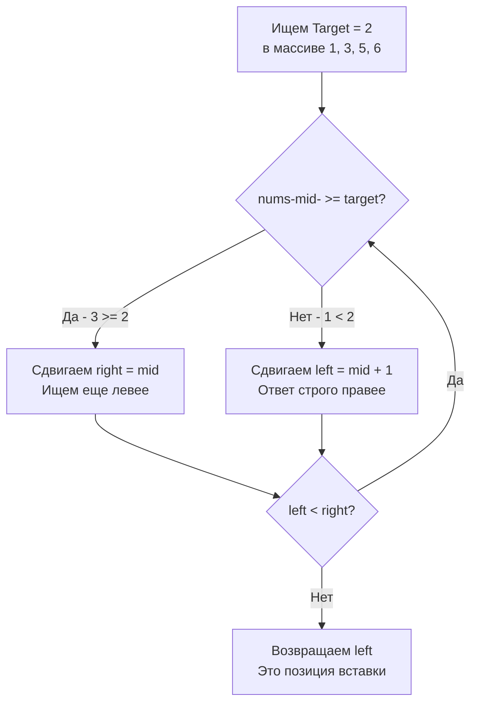

В предыдущей статье мы разобрали классический бинарный поиск (Exact Match), который отвечает на вопрос: *"Есть ли это число в массиве?"*. 

Но в системном программировании, особенно при разработке баз данных (вставка в B-Tree индексы) или поддержании отсортированных in-memory структур, нас чаще интересует другой вопрос: *"Если числа нет, то **куда** его нужно вставить, чтобы не нарушить сортировку?"*.

Задача **Search Insert Position** (LeetCode 35) — это идеальная иллюстрация паттерна **Lower Bound** (Нижняя граница). Это тот самый фундамент, на котором строятся более сложные алгоритмы поиска по ответу.

---

## Архитектура: Отличие Lower Bound от Exact Match

В классическом поиске (как в задаче 704) мы использовали три ветки: `< target`, `> target` и `== target`. Если находили элемент — сразу выходили из цикла (`return mid`). 
Границы мы инициализировали как `[0, len(nums)-1]`.

В поиске позиции для вставки (Lower Bound) логика меняется:
1. Мы ищем **первый элемент, который больше или равен** нашему `target`. 
2. Мы **не выходим из цикла досрочно**, даже если нашли точное совпадение! Почему? Потому что в массиве с дубликатами точных совпадений может быть несколько, а вставлять новый элемент принято перед первым из них (для сохранения стабильности).
3. **Верхняя граница `right` инициализируется как `len(nums)`, а не `len(nums)-1`**. Это критически важно. Если `target` больше всех элементов в массиве, его нужно вставить в самый конец. Индекс для вставки в конец равен длине массива!



---

## Идиоматичный Go-код

Этот шаблон — золотой стандарт для задач на бинарный поиск. Выучив его, вы решите 90% задач раздела Binary Search.

```go
package main

// searchInsert возвращает индекс элемента, если он найден.
// Если нет, возвращает индекс, куда его следовало бы вставить.
func searchInsert(nums []int, target int) int {
	// ВАЖНО: right указывает за пределы массива (длина массива).
	// Это возможное место для вставки, если target больше всех элементов.
	left, right := 0, len(nums)

	// Цикл работает, пока полуинтервал [left, right) не схлопнется в одну точку.
	for left < right {
		// Быстрое вычисление середины с защитой от переполнения
		mid := int(uint(left+right) >> 1)

		if nums[mid] >= target {
			// Если текущий элемент больше или равен, ответ может быть здесь (mid)
			// или еще левее. Сужаем правую границу, НЕ исключая mid.
			right = mid
		} else {
			// Если текущий элемент строго меньше, он нам точно не подходит.
			// Ответ гарантированно правее. Исключаем mid.
			left = mid + 1
		}
	}

	// Когда left == right, мы нашли идеальную позицию для вставки.
	return left
}
```

---

## Взгляд под капот: Mechanical Sympathy

### 1. Branch Prediction (Предсказатель ветвлений)
Посмотрите на цикл `for`. В нем всего **один условный оператор** `if ... else ...`. 
В классическом поиске с ранним выходом (Exact Match) у нас было два `if` (три ветки выполнения). 
Для предсказателя ветвлений (Branch Predictor) современного процессора (например, архитектуры Zen или Core) две ветки предсказывать значительно проще, чем три. 
Более того, цикл без раннего выхода `return mid` будет всегда выполняться строго $\approx \log_2 N$ раз. CPU "любит" циклы с детерминированным (или хотя бы постоянным) количеством итераций, так как это позволяет эффективно планировать конвейер (Pipeline scheduling).

### 2. Избежание паник (Bounds Check)
Вы можете спросить: *"Если `right` изначально равно `len(nums)`, не получим ли мы `index out of range` при обращении к `nums[mid]`?"*
Нет, не получим. 
Математика бинарного поиска гарантирует, что `mid` вычисляется с округлением вниз (за счет целочисленного деления `>> 1`). Даже если `left = len(nums) - 1`, а `right = len(nums)`, их сумма будет нечетной, и деление на 2 даст `mid = len(nums) - 1`. 
Мы **никогда** не обратимся к `nums[len(nums)]` внутри цикла. Это математически безопасно, и компилятор Go способен это доказать (Bounds Check Elimination).

---

## Ловушки и Corner Cases (Gotchas)

> [!warning] Ловушка / Gotcha: Шаблон `left <= right`
> Если вы попытаетесь решить эту задачу через шаблон точного поиска (с `left <= right` и `right = len(nums) - 1`), код превратится в месиво:
> ```go
> left, right := 0, len(nums)-1
> for left <= right {
>     mid := int(uint(left+right)>>1)
>     if nums[mid] == target { return mid }
>     if nums[mid] < target { left = mid + 1 }
>     else { right = mid - 1 }
> }
> return left // <- Магический возврат left
> ```
> Хотя это работает, логика возврата `left` после цикла неочевидна и требует долгого обдумывания краевых случаев (что если вышли за левую границу? за правую?). 
> Использование шаблона `left < right` с `right = len(nums)` избавляет от ментальной нагрузки.

> [!info] Под капотом: Базы данных
> Алгоритм `Lower Bound` — это именно то, что происходит под капотом PostgreSQL или MySQL, когда вы вставляете новую строку в таблицу с индексом (B-Tree). Страница памяти (Page) в дереве представляет собой отсортированный массив байт. Движок БД использует бинарный поиск позиции для вставки (сдвигая остальные данные вправо через `memmove`), чтобы записать новый ключ и сохранить инвариант сортировки.

## Итог

**Search Insert Position** — это мост между абстрактной теорией и реальной инженерией. Поняв принцип полуинтервала `[left, right)` и то, почему `right` может указывать за пределы массива, вы навсегда закроете для себя вопрос "какой шаблон бинарного поиска использовать".

В следующей задаче мы применим этот же паттерн Lower Bound к абстрактному API, где массива нет вообще, а есть только "черный ящик", отвечающий на наши запросы. Переходим к: [[5. First Bad Version]].