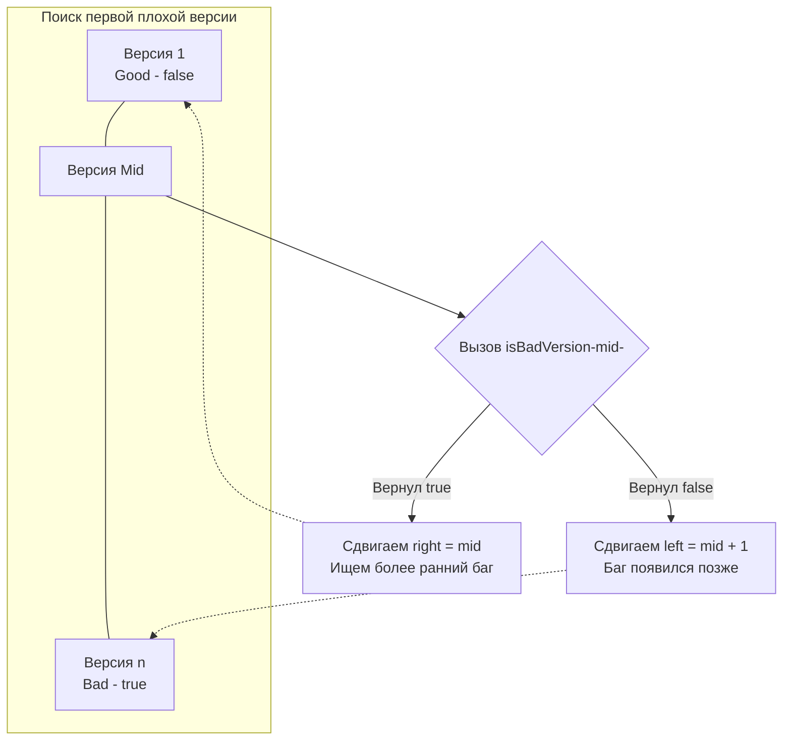

В статье [[4. Search Insert Position]] мы научились искать абстрактную границу в физическом массиве, который целиком лежит в оперативной памяти. Но в реальной инженерии мы часто не имеем доступа ко всем данным сразу. Данные могут лежать в базе данных, за сетевым балансировщиком или генерироваться "на лету" тяжелыми вычислениями.

Задача **First Bad Version** (LeetCode 278) — это классический пример бинарного поиска поверх **абстрактного API (черного ящика)**. В мире DevOps и бэкенда этот алгоритм каждый день используется инструментом `git bisect`, чтобы за логарифмическое время найти конкретный коммит, который сломал сборку.

**Суть задачи:** У вас есть продукт с версиями от $1$ до $n$. Известно, что одна из версий стала "плохой" (бажной), и все последующие версии тоже стали плохими. Дан API `isBadVersion(version int) bool`. Нужно найти первую плохую версию, минимизировав количество вызовов API.

---

## Архитектура: Маппинг на Lower Bound

Массива у нас нет, но у нас есть **монотонная функция**. Вызовы `isBadVersion` от $1$ до $n$ всегда дадут последовательность вида:
`[false, false, false, ..., true, true, true]`

Наша задача — найти индекс первого `true`. Это абсолютно идентично поиску позиции для вставки (Lower Bound), только вместо обращения по индексу `nums[mid] >= target` мы вызываем функцию `isBadVersion(mid)`.



---

## Идиоматичный Go-код

Используем эталонный шаблон с полуинтервалом, который мы вывели в прошлых статьях.

```go
package main

// Предполагается, что эта функция реализована где-то в системе.
// func isBadVersion(version int) bool

// firstBadVersion находит первую версию с багом.
func firstBadVersion(n int) int {
	// Границы: версии начинаются с 1 и заканчиваются n.
	// right инициализируем как n, так как по условию баг ГАРАНТИРОВАННО есть,
	// и в худшем случае это самая последняя версия.
	left, right := 1, n

	for left < right {
		// Быстрое вычисление середины с защитой от целочисленного переполнения
		mid := int(uint(left+right) >> 1)

		if isBadVersion(mid) {
			// Текущая версия сломана. 
			// Она может быть первой сломанной, а может и нет.
			// Сужаем окно поиска влево, оставляя mid в качестве кандидата.
			right = mid
		} else {
			// Текущая версия рабочая.
			// Значит, первая сломанная версия строго позже.
			left = mid + 1
		}
	}

	// Когда left и right схлопнулись в одну точку, мы нашли ответ.
	return left
}
```

---

## Взгляд под капот: Mechanical Sympathy и Цена Вызова

Для начинающего алгоритмиста разница между обращением к элементу массива `nums[mid]` и вызовом функции `isBadVersion(mid)` минимальна. Но для Principal Engineer-а это два принципиально разных мира.

### 1. Function Call Overhead (Накладные расходы)
Доступ к элементу слайса `nums[mid]` (при вырезанном Bounds Check) компилируется в одну ассемблерную инструкцию `MOV`, выполняемую за долю наносекунды.
Вызов функции `isBadVersion` — это прыжок (Jump) к другому участку машинного кода. Если эта функция сложная, компилятор Go не сможет её заинлайнить (Inline). При каждом вызове:
- В регистры (или на стек) складываются аргументы.
- Выполняется инструкция `CALL`.
- Сбрасывается часть конвейера процессора (Pipeline).
- Функция может аллоцировать память, заставляя переменные "убегать" в кучу (Escape Analysis).

Бинарный поиск сокращает количество таких вызовов с $O(N)$ до $O(\log N)$. Для $n = 1\ 000\ 000$ мы делаем всего $\approx 20$ вызовов вместо $1\ 000\ 000$.

### 2. IO-Bound vs CPU-Bound
В реальной системе `isBadVersion` — это почти наверняка RPC-вызов к другому микросервису по gRPC (сетевая задержка $\sim 1$-2 мс) или запрос к базе данных (задержка $\sim 5$ мс).
В этом сценарии бинарный поиск перестает быть алгоритмом, упирающимся в процессор или кэш (CPU Bound / Memory Bound). Он становится алгоритмом, упирающимся в ввод-вывод (IO Bound). Экономия на сетевых задержках — это главная причина, почему бинарный поиск применяется в распределенных системах (например, в алгоритмах консенсуса вроде Raft для синхронизации логов).

> [!warning] Ловушка / Gotcha: Превышение лимитов (Time Limit Exceeded)
> На собеседованиях кандидаты часто пытаются оптимизировать бинарный поиск, кешируя результаты вызова `isBadVersion` в `map[int]bool`, думая, что это ускорит повторные проверки.
> **Это антипаттерн!** Логика логарифмического поиска устроена так, что мы **никогда** не проверяем один и тот же `mid` дважды (на каждой итерации границы строго сужаются). Использование мапы только замедлит код за счет аллокаций и хеширования, не сэкономив ни одного вызова API.

> [!tip] Собеседование: Тестирование распределенных систем
> Если вас спросят, как протестировать распределенную транзакцию, которая сломалась где-то в цепочке из 10 микросервисов, вы можете смело сослаться на этот паттерн. Вместо того чтобы читать логи всех 10 сервисов последовательно, вы опрашиваете 5-й сервис (середину). Если в нем данные уже испорчены, вы "сужаете окно" до сервисов 1-4. Если нет — до 6-10. Это реальное применение First Bad Version в System Design.

## Итог

Задача **First Bad Version** учит абстрагировать алгоритм поиска от физического хранения данных. Мы используем монотонность бизнес-логики для навигации по пространству решений, экономя колоссальное количество времени и сетевых ресурсов.

До этого момента мы работали со строго отсортированными и монотонными функциями. Но что, если массив был отсортирован, а затем его "разрезали" и поменяли куски местами? Логика монотонности ломается. Разбор этого популярного класса хардкорных задач мы начнем со следующей статьи: [[6. Find Minimum in Rotated Sorted Array]].