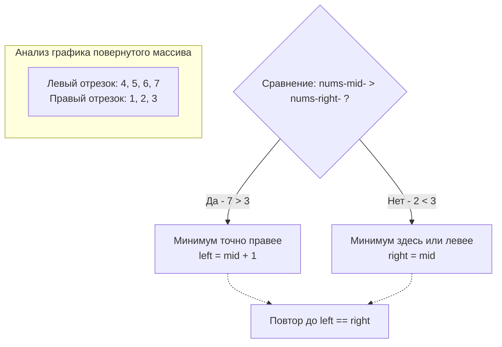

## Слом монотонности: Повернутый массив

До сих пор мы применяли бинарный поиск к идеально отсортированным массивам или строгим монотонным функциям (где значения только растут или только убывают). Но на собеседованиях любят проверять способность кандидата адаптировать базовые паттерны к сломанным условиям.

Задача **Find Minimum in Rotated Sorted Array** (LeetCode 153) вводит новую абстракцию: отсортированный массив был циклически сдвинут (повернут) неизвестное количество раз. 
Пример: `[1, 2, 3, 4, 5, 6, 7]` превращается в `[4, 5, 6, 7, 1, 2, 3]`.

Вам нужно найти минимальный элемент за время $O(\log N)$.

---

## Архитектура: Два восходящих отрезка

Если нарисовать график значений повернутого массива, мы увидим не одну прямую линию, а **два восходящих отрезка**. Левый отрезок всегда содержит значения, которые **строго больше** любых значений правого отрезка (ведь левый отрезок — это "хвост" оригинального массива, перенесенный вперед).

Минимальный элемент — это первая точка правого отрезка. Это место, где происходит "обрыв" или "сброс" значений.

Как применить бинарный поиск? Нам нужно сравнивать центральный элемент `nums[mid]` с элементом на **правой границе** `nums[right]`.

1. Если `nums[mid] > nums[right]`: Это значит, что `mid` находится на высоком (левом) отрезке, а "обрыв" (минимум) гарантированно находится где-то **справа**. Мы отбрасываем левую часть вместе с `mid`.
2. Если `nums[mid] < nums[right]`: Это значит, что `mid` находится на низком (правом) отрезке. Так как отрезок возрастающий, минимальный элемент — это сам `mid` или кто-то **левее** него.



> [!warning] Ловушка / Gotcha: Сравнение с левой границей
> Джуниоры часто пытаются сравнивать `nums[mid]` с `nums[left]`. Это интуитивно кажется логичным, но ломается на краевом случае: **массив не был повернут вообще** (например, `[1, 2, 3, 4, 5]`). 
> Если вы сравните `3` и `1` (`nums[mid] > nums[left]`), вы можете ошибочно подумать, что нужно идти вправо. Сравнение с `right` элегантно обрабатывает как повернутые, так и неповернутые массивы без дополнительных `if`.

---

## Идиоматичный Go-код

Используем наш проверенный шаблон поиска границ с полуинтервалом `left < right`.

```go
package main

// findMin находит минимальный элемент в повернутом массиве.
func findMin(nums []int) int {
	left, right := 0, len(nums)-1

	for left < right {
		// Оптимизированное вычисление середины
		mid := int(uint(left+right) >> 1)

		if nums[mid] > nums[right] {
			// Левая половина - это "высокий" отрезок. 
			// Минимум (провал) находится справа.
			left = mid + 1
		} else {
			// Мы находимся на "низком" отрезке (или массив идеально отсортирован).
			// Минимум это сам mid или что-то слева.
			right = mid
		}
	}

	// Когда left == right, мы стоим прямо на минимальном элементе
	return nums[left]
}
```

---

## Взгляд под капот: Branch Prediction Penalty

С точки зрения **Mechanical Sympathy**, этот алгоритм демонстрирует интересное поведение предсказателя ветвлений процессора (Branch Predictor).

В классическом бинарном поиске по равномерно распределенному массиву условие `nums[mid] < target` непредсказуемо (50/50). 
В повернутом массиве условие `nums[mid] > nums[right]` имеет другую природу. По мере сужения окна поиска мы очень быстро (за пару итераций) "сваливаемся" либо полностью в левый, либо полностью в правый отрезок. 
Как только `left` и `right` оказываются на одном (правом) отрезке, условие `nums[mid] > nums[right]` начинает стабильно возвращать `false` (так как массив на этом отрезке отсортирован). Branch Predictor быстро улавливает этот паттерн и начинает выполнять ветку `else` спекулятивно, что делает последние итерации логарифмического поиска невероятно быстрыми на уровне тактов CPU.

---

## Усложнение задачи (Follow-up)

> [!tip] Собеседование: Наличие дубликатов
> На Senior-секциях вам гарантированно зададут усложненную версию: **Find Minimum in Rotated Sorted Array II** (LeetCode 154).
> **Интервьюер:** *"А что если в массиве есть дубликаты? Например: `[3, 3, 1, 3]` или `[3, 1, 3, 3, 3]`. Твой код сломается?"*
> 
> **Ваш ответ:** *"Да, сломается. Когда `nums[mid] == nums[right]`, мы не можем точно сказать, в какой половине находится минимум. Например, в `[3, 1, 3, 3, 3]` (mid=3, right=3) минимум слева, а в `[3, 3, 3, 1, 3]` (mid=3, right=3) минимум справа. Единственный безопасный шаг в случае равенства — это **сузить правую границу на 1** (`right--`), так как мы точно знаем, что значение `nums[right]` дублируется в `mid`, и мы его не потеряем."*
> 
> Это понизит сложность в худшем случае (когда все элементы равны) до $O(N)$, но в среднем останется $O(\log N)$. Это классический компромисс при работе с деградировавшими данными.

## Итог

Мы научились находить "точку разлома" (minimum) в сломанной монотонной последовательности, используя правый край как эталон для сравнения. 

Но поиск минимума — это лишь подготовка. Настоящее испытание заключается в поиске *произвольного* числа `target` в таком "разрезанном" массиве. Эта задача объединяет знания классического поиска и логики повернутых отрезков. Переходим к: [[7. Search in Rotated Sorted Array]].