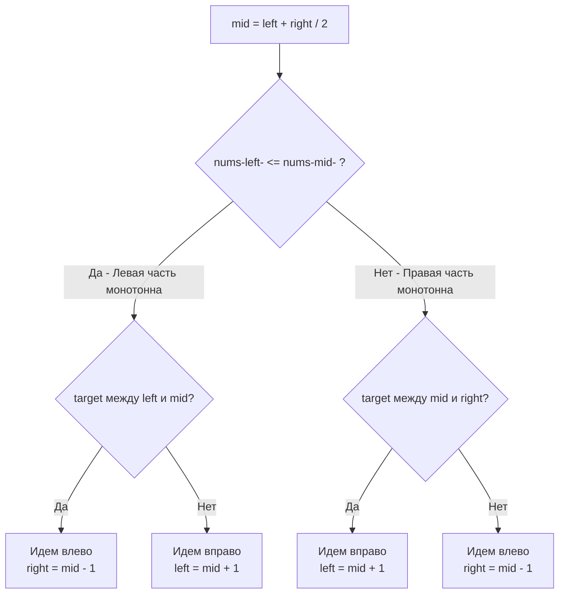

В прошлой статье [[6. Find Minimum in Rotated Sorted Array]] мы научились находить "точку перелома" в массиве, который был отсортирован, а затем циклически сдвинут. 

Задача **Search in Rotated Sorted Array** (LeetCode 33) — это логическое развитие этой темы и одна из самых любимых задач на алгоритмических секциях FAANG. Она проверяет, способны ли вы объединить логику классического бинарного поиска с пониманием инвариантов сломанной структуры.

**Суть задачи:** Дан массив уникальных целых чисел `nums`, отсортированный по возрастанию, а затем повернутый вокруг неизвестного индекса (например, `[0,1,2,4,5,6,7]` мог стать `[4,5,6,7,0,1,2]`). Дан `target`. Нужно найти индекс `target` в массиве за время $O(\log N)$ или вернуть `-1`.

---

## Архитектура: Инсайт отсортированной половины

Многие кандидаты пытаются решить эту задачу в два прохода (2 Pass): сначала найти индекс минимума (точку перелома) за $O(\log N)$, а затем запустить классический бинарный поиск либо в левой, либо в правой части (еще $O(\log N)$). 
Это рабочее решение, но интервьюер обязательно попросит: *"А можешь сделать это за один проход?"* (One-pass solution).

Главный инсайт задачи: **Если разрезать повернутый отсортированный массив в ЛЮБОМ месте (по индексу `mid`), то хотя бы ОДНА из двух получившихся половин будет строго и непрерывно отсортирована.**

Алгоритм (на каждой итерации):
1. Находим `mid`. Если `nums[mid] == target`, мы победили.
2. Определяем, **какая половина отсортирована**:
   - Если `nums[left] <= nums[mid]` — левая половина строго отсортирована (без переломов).
   - Иначе — правая половина строго отсортирована.
3. Проверяем, **лежит ли `target` в границах отсортированной половины**:
   - Если половина отсортирована, мы точно знаем её минимум и максимум!
   - Если `target` попадает в этот диапазон, отбрасываем другую половину.
   - Если нет — значит `target` прячется в "сломанной" (повернутой) половине, идем туда.



---

## Идиоматичный Go-код

Поскольку нам нужен конкретный элемент (Exact Match), мы используем классический шаблон бинарного поиска с закрытым интервалом `left <= right` и ранним выходом.

```go
package main

// search находит индекс элемента target в повернутом массиве за один проход.
func search(nums []int, target int) int {
	left, right := 0, len(nums)-1

	for left <= right {
		// Оптимизированное вычисление середины
		mid := int(uint(left+right) >> 1)

		if nums[mid] == target {
			return mid // Элемент найден
		}

		// 1. Проверяем, отсортирована ли левая половина
		if nums[left] <= nums[mid] {
			// Левая половина [left...mid] строго возрастает
			
			// Проверяем, находится ли target в этом диапазоне
			if nums[left] <= target && target < nums[mid] {
				// Цель слева, отбрасываем правую половину
				right = mid - 1
			} else {
				// Цель не в отсортированной зоне, значит она справа (в повернутой)
				left = mid + 1
			}
		} else {
			// 2. Левая половина "сломана", значит правая [mid...right] строго возрастает
			
			// Проверяем, находится ли target в правой отсортированной зоне
			if nums[mid] < target && target <= nums[right] {
				// Цель справа, отбрасываем левую половину
				left = mid + 1
			} else {
				// Цель не в отсортированной зоне, значит она слева (в повернутой)
				right = mid - 1
			}
		}
	}

	return -1
}
```

---

## Взгляд под капот: Branch Misprediction и Цена ветвлений

На интервью в high-load проекты (особенно HFT или разработка СУБД) могут спросить про эффективность такого кода на уровне процессора.

Внутри цикла `for` у нас находится сложная конструкция `if-else` с вложенными `if-else`. Для предсказателя ветвлений (Branch Predictor) современного CPU это сложная задача.
Если мы ищем элементы в равномерно распределенном повернутом массиве, направления ветвлений будут меняться хаотично. Каждый раз, когда процессор ошибается в предсказании (Branch Misprediction), он сбрасывает конвейер инструкций (Pipeline Flush), теряя от 10 до 20 тактов.

**Является ли One-pass решение всегда быстрее Two-pass решения?**
С алгоритмической точки зрения (Big O) — да, $1 \log N$ лучше $2 \log N$. 
С точки зрения **Mechanical Sympathy** — не всегда. Решение в два прохода (сначала поиск минимума, затем классический поиск) использует очень простые и хорошо предсказуемые циклы (особенно на этапе поиска минимума, как мы обсуждали в предыдущей статье). В некоторых микробенчмарках на C++ или Go Two-pass решение на коротких массивах может обгонять One-pass за счет меньшего количества ошибок предсказания ветвлений.
Упоминание этого факта на собеседовании — жирный плюс в карму инженера.

---

## Ловушки и Усложнения (Gotchas)

> [!warning] Ловушка / Gotcha: Важность знака "Равно"
> В строке `if nums[left] <= nums[mid]` знак равенства **критически важен**.
> Представьте ситуацию, когда окно поиска сузилось до двух элементов: `left` и `mid` указывают на один и тот же нулевой элемент (например, в массиве `[3, 1]`, где `left=0`, `right=1` $\rightarrow$ `mid=0`). 
> Если мы напишем строго `nums[left] < nums[mid]`, условие `3 < 3` вернет `false`, и алгоритм ошибочно решит, что левая половина сломана, а отсортирована правая. Из-за этого мы пойдем по неверному пути. Равенство обрабатывает случай микро-массивов (длиной 1 или 2), утверждая, что массив из одного элемента всегда отсортирован.

> [!tip] Собеседование: Наличие дубликатов (LeetCode 81)
> Как и в задаче с поиском минимума, интервьюер может усложнить задачу: *"А что если в массиве есть повторяющиеся числа? Например: `[3, 1, 2, 3, 3, 3, 3]`, а ищем мы `2`"*.
> 
> **Ответ:** Наличие дубликатов ломает наш главный инсайт. Если `nums[left] == nums[mid] == nums[right]`, мы физически не можем понять, какая из половин является строго отсортированной (перелом может быть как слева, так и справа от `mid`).
> В этом случае мы должны добавить проверку в начало цикла:
> ```go
> if nums[left] == nums[mid] && nums[mid] == nums[right] {
>     left++
>     right--
>     continue
> }
> ```
> Это единственный способ безопасно сузить границы. Сложность алгоритма в худшем случае (когда весь массив состоит из одинаковых чисел) деградирует до $O(N)$.

## Итог

Мы завершили разбор поиска в повернутых массивах. Этот класс задач показывает, как можно доверять инвариантам, даже если структура данных повреждена, находя в ней островки стабильности (отсортированные половины).

Теперь мы покидаем работу с массивами в памяти и переходим в мир чистой абстракции. В следующей статье мы применим паттерн "Поиск по ответу" (Binary Search on Answer) для оптимизации бизнес-процессов: как найти минимальную скорость, чтобы успеть выполнить работу вовремя? Переходим к знаменитой задаче: [[8. Koko Eating Bananas]].