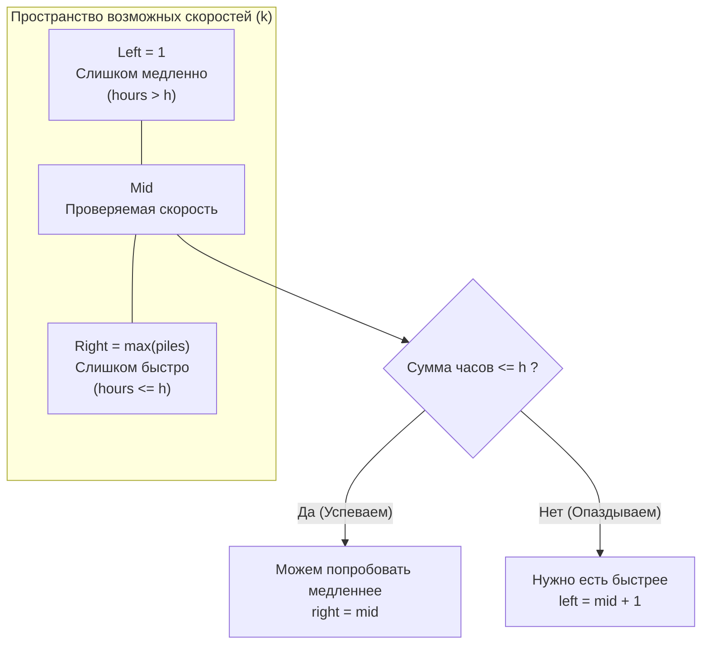

## От обезьян к Rate Limiter-ам

В статье [[2. Поиск по ответу]] мы заложили теоретический фундамент поиска по абстрактному пространству решений. Теперь мы применим его к задаче, которая стала абсолютной классикой собеседований (LeetCode 875). 

Забавный факт: хотя в задаче фигурирует обезьяна Коко и бананы, в реальном System Design это типичная задача на **настройку пропускной способности (Rate Limiting)**. Замените "бананы" на "сообщения в Kafka", "связки" на "партиции", а "часы" на "дедлайн обработки", и вы получите реальную задачу из бэкенд-разработки.

**Суть задачи:** Есть массив `piles`, где `piles[i]` — количество бананов в $i$-й связке. Охранник ушел на `h` часов. Коко может съедать $k$ бананов в час. Если в связке меньше $k$ бананов, она съест их все и будет отдыхать до конца часа (нельзя переходить к следующей связке в тот же час). 
Нужно найти **минимальную** скорость $k$, при которой Коко успеет съесть все бананы за $h$ часов.

---

## Архитектура: Определение пространства решений

Чтобы применить шаблон поиска по ответу, нам нужно определить три вещи: минимальную границу, максимальную границу и функцию проверки (предикат).

1. **Минимальная скорость (`left`):** Коко должна есть хотя бы 1 банан в час (скорость не может быть нулем). `left = 1`.
2. **Максимальная скорость (`right`):** Коко физически не может есть бананы из двух разных связок в течение одного часа. Значит, нет никакого смысла есть со скоростью, превышающей размер самой большой связки. Максимальная полезная скорость — это размер самой большой связки в массиве. `right = max(piles)`.
3. **Предикат `isValid(k)`:** При заданной скорости $k$, сколько всего часов уйдет на все связки? 
   Для одной связки размером `p` потребуется $\lceil p / k \rceil$ часов (округление вверх). Если сумма часов для всех связок $\le h$, значит скорость $k$ нам подходит.



---

## Идиоматичный Go-код

```go
package main

// minEatingSpeed находит минимальную скорость поедания бананов.
func minEatingSpeed(piles []int, h int) int {
	// 1. Находим максимальный элемент для верхней границы
	maxPile := 0
	for _, p := range piles {
		if p > maxPile {
			maxPile = p
		}
	}

	left := 1
	right := maxPile

	// 2. Бинарный поиск (Lower Bound)
	for left < right {
		mid := int(uint(left+right) >> 1) // Быстрое вычисление середины

		// 3. Инлайн-проверка предиката
		hours := 0
		for _, p := range piles {
			// Округление вверх при целочисленном делении: (p + mid - 1) / mid
			hours += (p + mid - 1) / mid
		}

		// 4. Сдвиг границ
		if hours <= h {
			// Успеваем. Но, возможно, есть скорость еще меньше.
			right = mid
		} else {
			// Не успеваем. Эта и все меньшие скорости не подходят.
			left = mid + 1
		}
	}

	return left
}
```

---

## Взгляд под капот: Разгром `math.Ceil`

На живом собеседовании джуниоры (и даже мидлы) в 90% случаев пишут подсчет часов так:
```go
hours += int(math.Ceil(float64(p) / float64(mid)))
```
И это именно тот момент, когда интервьюер понимает: перед ним человек, который не думает о том, как код исполняется на железе (отсутствие Mechanical Sympathy).

Почему эта строка — архитектурный кошмар в контексте высоконагруженного цикла?
1. **Переключение контекста CPU:** Вы заставляете процессор конвертировать целые числа (`int`) в числа с плавающей точкой (`float64`). Для этого CPU должен задействовать FPU (Floating Point Unit).
2. **Дорогостоящее деление:** Операция деления чисел с плавающей точкой занимает в разы больше тактов процессора, чем целочисленное деление.
3. **Накладные расходы на вызов функции:** Вызов `math.Ceil` — это вызов отдельной функции (Function Call Overhead), который может не заинлайниться внутри сложного цикла, требуя работы со стеком.
4. **Обратная конвертация:** После вычисления вам нужно снова привести `float64` к `int`.

Поскольку этот код находится внутри предиката, который вызывается в цикле бинарного поиска $\sim 30$ раз, а массив `piles` может содержать $10^4$ элементов, вы делаете **300 000** бесполезных конвертаций и вызовов FPU. Ваше решение за $O(N \log M)$ алгоритмически верно, но физически будет работать в 5-10 раз медленнее эталонного.

### Элегантная математика
Формула `(p + mid - 1) / mid` — это золотой стандарт целочисленного округления вверх в системном программировании (C/C++, Go, Rust). 
Она компилируется в базовые инструкции целочисленной арифметики (`ADD`, `DIV`), которые процессор выполняет молниеносно в основных регистрах (ALU) без переключений.

> [!info] Под капотом: Как работает `(p + mid - 1) / mid`
> Допустим, $p = 10$, $mid = 3$. Правильный ответ $\lceil 10/3 \rceil = 4$.
> Подставляем в формулу: $(10 + 3 - 1) / 3 = 12 / 3 = 4$.
> Допустим, $p = 9$, $mid = 3$. Правильный ответ $\lceil 9/3 \rceil = 3$.
> Подставляем: $(9 + 3 - 1) / 3 = 11 / 3 = 3$ (остаток отбрасывается при целочисленном делении).
> Мы искусственно добавляем "почти полный делитель" (`mid - 1`), чтобы перевалить через границу целого числа, если есть хотя бы минимальный остаток.

---

## Ловушки и Граничные случаи (Gotchas)

> [!warning] Ловушка / Gotcha: `hours` и переполнение
> В Go тип `int` на 64-битных системах равен `int64`. Сумма часов `hours` в этой задаче не может превысить $10^9$ (максимальное ограничение по условию), поэтому обычный `int` безопасен. 
> Но если бы $h$ могло быть больше, или массив был бы длиннее, мы могли бы получить целочисленное переполнение (Integer Overflow) переменной `hours`. Это важный нюанс, который стоит озвучить интервьюеру: *"Я использую `int`, так как по условиям задачи $h \le 10^9$, что безопасно помещается даже в 32-битный `int`"*.

> [!tip] Собеседование: Инициализация верхней границы
> Некоторые кандидаты ленятся писать цикл для поиска максимума и просто пишут `right = 1000000000` (максимально возможное значение `p[i]` по условию).
> **Интервьюер спросит:** "Что лучше: один проход $O(N)$ для поиска максимума + бинарный поиск, или сразу бинарный поиск с константной границей в $10^9$?"
> **Ответ:** Зависит от данных. Поиск максимума забирает $O(N)$ времени, но сужает $M$ (размер пространства поиска). Если массив огромный (например $10^7$ элементов), а числа в нем маленькие, поиск максимума может быть медленнее, чем лишние 10-15 итераций бинарного поиска ($O(N)$ vs $O(N \log M)$). Однако, на практике, проход по массиву для поиска максимума максимально дружелюбен к кэшу L1, поэтому он выполняется почти мгновенно. Лучше всегда искать `maxPile` — это показывает вашу аккуратность.

## Итог

Задача о поедании бананов учит нас тому, что бинарный поиск — это не только алгоритм для массивов, но и мощный метод решения оптимизационных уравнений. А отказ от плавающей арифметики в пользу целочисленного деления отличает инженера, знающего как работает процессор, от человека, просто вызубрившего алгоритмы.

Двигаемся дальше. Что если функция проверки `isValid` требует не простой суммы, а сложной симуляции, включающей жадные алгоритмы? Переходим к задаче, где нам нужно распределить вес по кораблям: [[9. Capacity To Ship Packages]].