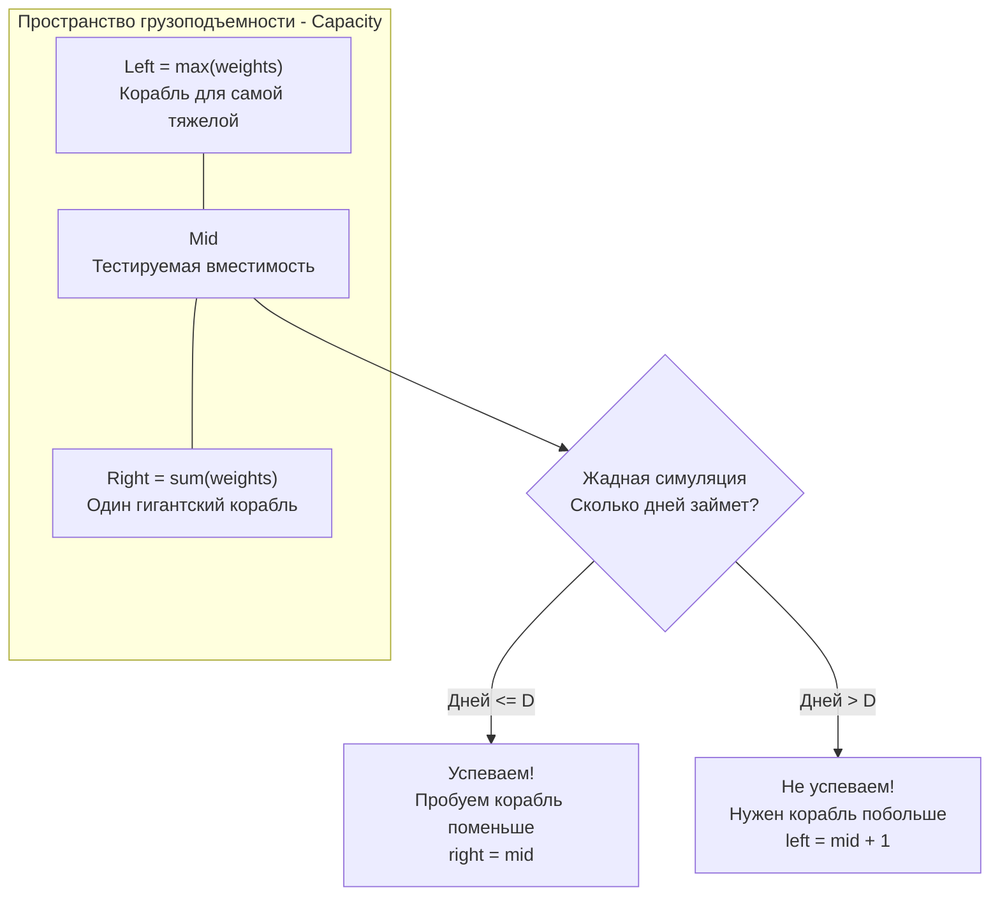

В прошлой статье [[8. Koko Eating Bananas]] мы познакомились с концепцией поиска по ответу и поняли, как математическая формула помогает избежать тяжелых вычислений.

Но в реальном production-коде (и в сложных задачах LeetCode) проверка условия (`isValid`) редко сводится к простой математической формуле. Гораздо чаще предикат представляет собой **симуляцию процесса**.

Задача **Capacity To Ship Packages Within D Days** (LeetCode 1011) — это квинтэссенция этого подхода. Она объединяет логарифмический поиск с линейным жадным алгоритмом (Greedy Algorithm).

**Суть задачи:** Есть конвейер с посылками, заданными массивом `weights`. Посылки должны быть погружены на корабль **строго в том порядке, в котором они лежат на конвейере**. Грузоподъемность корабля неизменна каждый день.

Нужно найти минимальную грузоподъемность, при которой все посылки будут доставлены не более чем за `days` дней.

---

## Архитектура: Жадный предикат и Пространство решений

Чтобы решить задачу через бинарный поиск, нам нужно ответить на три вопроса:

1. **Минимальная граница (`left`):** Корабль не может разделить одну посылку на части. Значит, его грузоподъемность должна быть как минимум равна весу **самой тяжелой посылки** в массиве. Иначе мы вообще не сможем ее погрузить. `left = max(weights)`.
2. **Максимальная граница (`right`):** В худшем случае (если `days = 1`), корабль должен увезти все посылки за один рейс. Значит, максимальная полезная грузоподъемность — это **сумма всех весов**. `right = sum(weights)`.
3. **Функция проверки `isValid(capacity)`:** Это жадная симуляция. Мы грузим посылки по очереди, пока не упремся в лимит `capacity`. Как только следующая посылка не влезает, мы отправляем корабль (закрываем день) и начинаем грузить ее на следующий день. Если итоговое количество дней $\le days$, грузоподъемность подходит.



---

## Идиоматичный Go-код

Этот код демонстрирует идеальный баланс: $O(N)$ для первичного поиска границ и $O(N \log M)$ для бинарного поиска, где $M$ — разница между суммой и максимумом весов.

```go
package main

// shipWithinDays находит минимальную грузоподъемность корабля.
func shipWithinDays(weights []int, days int) int {
	left, right := 0, 0

	// 1. Определяем границы поискового пространства за один проход O(N)
	for _, w := range weights {
		if w > left {
			left = w // Максимальный вес
		}
		right += w   // Сумма всех весов
	}

	// 2. Бинарный поиск по ответу (Lower Bound)
	for left < right {
		mid := int(uint(left+right) >> 1)

		// 3. Предикат: Жадная симуляция погрузки
		daysNeeded := 1
		currentLoad := 0

		for _, w := range weights {
			// Если добавление текущей посылки превысит лимит корабля
			if currentLoad+w > mid {
				daysNeeded++     // Отправляем корабль, начинается новый день
				currentLoad = 0  // Обнуляем текущую загрузку
			}
			currentLoad += w // Грузим посылку на новый (или текущий) день
		}

		// 4. Сдвиг границ на основе результатов симуляции
		if daysNeeded <= days {
			// Уложились в срок. Сохраняем mid и пробуем еще меньше.
			right = mid
		} else {
			// Не уложились. Эта грузоподъемность слишком мала.
			left = mid + 1
		}
	}

	return left
}
```

---

## Взгляд под капот: Синергия Кэша и Жадных алгоритмов

Почему предикат `isValid` работает так быстро, несмотря на то, что мы запускаем внутренний цикл `for _, w := range weights` десятки раз?

Ответ кроется в **строгом последовательном доступе (Sequential Access)** и паттерне жадного алгоритма (Greedy Algorithm).

1. Условие задачи ("посылки должны быть отправлены в заданном порядке") избавляет нас от необходимости сортировать массив или искать оптимальные комбинации (как в задаче о рюкзаке - Knapsack Problem). Жадный выбор здесь математически оптимален.
2. Процессор обожает линейные проходы. Когда цикл начинает читать слайс `weights`, аппаратный Prefetcher (упреждающий загрузчик) загружает данные из оперативной памяти в кэш L1 целыми блоками по 64 байта (Cache Lines).
3. За время $\approx 20-30$ итераций логарифмического поиска, массив `weights` (если он не гигантский) навсегда "оседает" в горячем L1/L2 кэше ядра процессора. Все последующие симуляции `isValid` происходят на скорости регистров процессора, без единого промаха мимо кэша.

Это идеальный пример **Memory-Bound алгоритма, который стал CPU-Bound** за счет правильной организации доступа к памяти.

> [!warning] Ловушка / Gotcha: Неверная нижняя граница
> 
> Кандидаты часто инициализируют границы "на глазок": `left = 1`.
> 
> Что произойдет в нашей симуляции, если `mid` окажется меньше веса хотя бы одной посылки `w`?
> 
> Код: `if currentLoad + w > mid` сработает. Мы увеличим `daysNeeded`, сбросим `currentLoad` в 0. Но затем мы выполним `currentLoad += w`. Получится, что мы "погрузили" посылку, вес которой больше грузоподъемности корабля! Логика сломается, функция вернет неверное количество дней, и бинарный поиск сойдет с ума.
> 
> Строгая инициализация `left = max(weights)` — это **фундаментальный инвариант** безопасности этого алгоритма.

---

### Интерактивная визуализация: Жадная упаковка

Лучший способ понять монотонность этого алгоритма — увидеть, как изменение грузоподъемности (Capacity) влияет на группировку посылок по дням. Поиграйте с ползунком в виджете ниже, чтобы понять, почему при достижении определенного порога корабли начинают "вмещать" ровно столько, сколько нужно для укладывания в дедлайн.

Показать визуализацию

## Итог

Задача **Capacity To Ship Packages Within D Days** учит нас внедрять бизнес-логику (жадную симуляцию) внутрь строгих математических рамок бинарного поиска. Правильное определение границ `[max, sum]` — это ключ к тому, чтобы симуляция никогда не перешла в неконсистентное состояние.