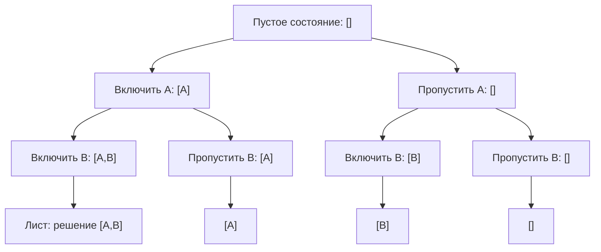

**Backtracking** — это не просто «рекурсивный перебор». Это фундаментальная техника обхода **пространства состояний**, которое имеет экспоненциальный размер, но при этом обладает **естественной древовидной структурой**. В отличие от динамического программирования, где подзадачи перекрываются и мы мемоизируем результаты, в backtracking каждая ветвь уникальна, и мы вынуждены явно **строить** все допустимые комбинации, но можем **отсекать** заведомо тупиковые пути.

Для Go-разработчика уровня Senior backtracking — это ещё и полигон для демонстрации инженерной культуры: как работать со слайсами без лишних аллокаций, как переиспользовать один и тот же буфер для состояния, как безопасно копировать результаты и как глубина рекурсии взаимодействует со стеком горутины.

### Что такое backtracking: дерево решений и откат

Представьте, что вам нужно сгенерировать все возможные комбинации длины `k` из `n` элементов. Полный перебор всех вариантов дал бы C(n, k). Вместо того чтобы строить каждую комбинацию с нуля, backtracking строит её **пошагово**: на каждом уровне рекурсии мы принимаем решение (включить элемент или нет, выбрать следующий символ и т.п.), спускаемся глубже, а затем **отменяем** это решение (откат), чтобы попробовать альтернативный вариант.

Таким образом, обход пространства состояний образует **дерево**, где:
- **Корень** — пустое начальное состояние.
- **Вершина** — некоторое частичное решение.
- **Рёбра** — допустимые варианты выбора.
- **Листья** — завершённые решения (или тупики, если нарушены ограничения).



В процессе обхода мы «спускаемся» вглубь, накапливая состояние в некоторой структуре (слайс, строка), а при возврате из рекурсии **удаляем** последний добавленный элемент. Этот процесс называется **откатом (backtrack)**.

### Общий рекурсивный каркас на Go

Сердце любого backtracking-решения — рекурсивная функция, принимающая текущее состояние и глубину. В Go идиоматично:

- Хранить состояние в **слайсе**, передаваемом в функцию.
- Изменять состояние путём `append` перед рекурсивным вызовом и **усекать** его после возврата (`state = state[:len(state)-1]`). Это позволяет избежать аллокации нового слайса на каждом шагу — мы переиспользуем один и тот же нижележащий массив, пока хватает capacity.
- При добавлении завершённого решения в результат — **явно копировать** слайс, потому что его содержимое будет изменено последующими откатами.

```go
func backtrack(state []int, start int, n int, result *[][]int) {
    // Добавляем копию текущего состояния в результат
    // (если оно удовлетворяет условиям, или для задач генерации всех подмножеств)
    cp := make([]int, len(state))
    copy(cp, state)
    *result = append(*result, cp)

    for i := start; i < n; i++ {
        // Выбор: включаем элемент i
        state = append(state, i)
        backtrack(state, i+1, n, result)
        // Откат: удаляем последний добавленный элемент
        state = state[:len(state)-1]
    }
}
```

**Почему `state[:len(state)-1]` не вызывает проблем с памятью:**  
Эта операция лишь уменьшает поле `Len` в заголовке слайса, не трогая нижележащий массив. Элемент остаётся в памяти, но будет перезаписан следующим `append`. Это эффективно и позволяет держать **нулевое количество дополнительных аллокаций** на каждом шагу, кроме тех, что возникают при копировании результата и расширении capacity.

> [!warning] Ловушка / Gotcha
> Запись `*result = append(*result, state)` без копирования приведёт к тому, что все сохранённые решения будут указывать на один и тот же нижележащий массив, и в итоге вы получите множество одинаковых слайсов с последним состоянием. **Всегда делайте копию**: `cp := make([]int, len(state)); copy(cp, state)`.

### Инварианты backtracking и гарантии корректности

Senior-разработчик не просто пишет рекурсию, а формулирует **инвариант**:
> На каждом уровне рекурсии слайс `state` представляет собой **валидный префикс** решения для данной глубины. После возврата из рекурсивного вызова `state` находится в том же состоянии, что и до вызова (благодаря откату).

Это гарантирует, что:
- Мы не пропускаем ни одной ветви (перебраны все допустимые варианты).
- Состояние не загрязняется «левыми» данными из параллельных ветвей.
- Глубина рекурсии не превышает максимального размера решения (и, следовательно, не переполняет стек при разумных ограничениях).

### Pruning (отсечение): как не делать лишнюю работу

Сила backtracking'а не в полном переборе, а в возможности **досрочно прекращать** спуск по ветви, если текущее состояние уже не может привести к допустимому решению. Это называется **pruning**.

Типичные условия отсечения:
- **Сумма превысила цель** (Combination Sum, Subset Sum).
- **Оставшихся элементов не хватит** для набора нужной длины (k < remaining).
- **Текущий кандидат лексикографически больше уже найденного** (в задачах оптимизации).
- **Нарушены правила размещения** (N Queens — атака).

Хорошее правило: «Если можно доказать, что из текущего состояния ни один потомок не даст ответа — выходим немедленно». Это превращает экспоненциальный ад в приемлемые времена.

```go
// Пример: Combination Sum с отсечением по сумме
func combinationSum(candidates []int, target int) [][]int {
    sort.Ints(candidates) // для корректного отсечения
    var res [][]int
    var state []int
    var backtrack func(start, remain int)
    backtrack = func(start, remain int) {
        if remain == 0 {
            cp := make([]int, len(state))
            copy(cp, state)
            res = append(res, cp)
            return
        }
        for i := start; i < len(candidates); i++ {
            if candidates[i] > remain { // Pruning: оставшиеся кандидаты ещё больше
                break
            }
            state = append(state, candidates[i])
            backtrack(i, remain-candidates[i]) // можно повторять тот же элемент
            state = state[:len(state)-1]
        }
    }
    backtrack(0, target)
    return res
}
```

### Основные разновидности backtracking

1. **Генерация всех подмножеств (Subsets).**  
   Каждый элемент либо включается, либо нет. Простейший каркас: для каждого индекса два рекурсивных вызова — с элементом и без.
   Вариация: битовые маски (но backtracking позволяет легко обрабатывать дубликаты).

2. **Генерация перестановок (Permutations).**  
   На каждом шагу выбираем, какой из оставшихся элементов поставить на текущую позицию. Нужно отслеживать использованные элементы (через `visited []bool` или swap in-place). Для уникальных перестановок с дубликатами — сортировка и пропуск одинаковых на одном уровне.

3. **Задачи с ограничениями (N Queens, Sudoku).**  
   Состояние — частично заполненное поле. Выбор — куда поставить фигуру. Отсечение — проверка атак.

4. **Обход лабиринта (Word Search).**  
   Состояние — пройденный путь. Отсечение — выход за границы, посещённая ячейка, несовпадение символа.

Каждая разновидность будет детально разобрана в следующих статьях кластера ([[2. Генерация комбинаций]], [[3. Subsets]], [[5. Permutations]], [[8. Word Search]], [[9. N Queens]]).

### Механическая симпатия: backtracking и рантайм Go

**Рекурсия и стек горутины.**  
В Go стек горутины динамически растёт (начинается с 2 КБ). Для глубины рекурсии до ~10⁴ это безопасно, хотя может вызвать несколько расширений стека (stack copying) — операция не бесплатная, но пренебрежимая на фоне экспоненциального времени backtracking'а. Если глубина потенциально очень велика (например, дерево вырождено), Senior рассматривает итеративный backtracking с собственным стеком на слайсе, но в большинстве задач рекурсия читаемее и предпочтительнее.

**Аллокации и переиспользование буфера.**  
Ключевая оптимизация в Go — передавать один и тот же слайс `state` по всем вызовам, а не создавать новый `append` в каждом рекурсивном вызове с копированием. Подход `state = append(state, x)`; ...; `state = state[:len(state)-1]` гарантирует:
- Нулевые аллокации при спуске и откате, пока `cap(state)` достаточно.
- Если capacity превышено, `append` аллоцирует новый массив, но это происходит только при переходе к более глубоким уровням, и старый массив остаётся для более высоких уровней. Такой «многоуровневый» слайс может привести к тому, что на разных уровнях рекурсии `state` указывает на разные массивы — это **корректно**, потому что откат усекает длину, и вышестоящий уровень видит свой массив.

**Копирование в результат.**  
Неизбежная плата — копирование каждого найденного решения. Но это необходимость: без копии все решения будут указывать на один и тот же слайс. Копирование `make` + `copy` аллоцирует новый массив. Если решений очень много (например, все перестановки N=10), объём копий значителен, но это output, без которого не обойтись. Senior может предложить использовать `append` без `make`, если длина решения фиксирована и мы точно знаем вместимость — но тогда откат влияет на результат.

> [!info] Под капотом
> Когда вы делаете `cp := make([]int, len(state))`, компилятор Go через escape analysis обнаруживает, что `cp` «убегает» в результат, и размещает его в куче. Это создаёт работу для GC. Альтернатива — выделить один плоский слайс под все решения и копировать в него с контролем индекса, но такой код значительно сложнее и редко оправдан на собеседовании. Senior упомянет это как возможную микрооптимизацию.

### Go-идиомы в backtracking

**Замыкания (closures).**  
Очень удобно определить рекурсивную функцию внутри основной и захватывать результат (`res *[][]int`), входные данные (`nums []int`), счётчики. Это избавляет от необходимости передавать множество параметров явно.

```go
func subsets(nums []int) [][]int {
    var res [][]int
    var cur []int
    var backtrack func(start int)
    backtrack = func(start int) {
        cp := make([]int, len(cur))
        copy(cp, cur)
        res = append(res, cp)

        for i := start; i < len(nums); i++ {
            cur = append(cur, nums[i])
            backtrack(i + 1)
            cur = cur[:len(cur)-1]
        }
    }
    backtrack(0)
    return res
}
```

**Использование указателей на слайс.**  
При передаче слайса `state` по указателю (`*[]int`) мы можем изменять его длину и ёмкость через оператор разыменования, но это тяжеловесно. Идиоматично передавать слайс по значению (заголовок копируется), а откат делать через переприсваивание внешней переменной (как в замыкании выше) или возвращать новый слайс (но это приведёт к копированию на каждом шагу). Стандартный подход — замыкание + внешняя переменная `cur`.

**Сортировка для отсечений.**  
Если задача требует уникальных комбинаций без повторений или отсечения по сумме, сортировка входного массива — стандартный первый шаг. `sort.Ints` работает in-place и дёшева.

> [!warning] Ловушка / Gotcha
> При генерации перестановок с дубликатами (Permutations II) недостаточно просто отсортировать массив — нужно пропускать одинаковые элементы на одном уровне рекурсии, используя `if i > 0 && nums[i] == nums[i-1] && !visited[i-1] { continue }`. Это классическое место, где ошибаются даже опытные кандидаты.

### Типичные ошибки и как их избежать

1. **Забыли скопировать состояние перед добавлением в результат.**  
   Симптом: все решения в результате одинаковые. Решение: `cp := make([]int, len(state)); copy(cp, state)`.

2. **Неправильный откат.**  
   Забыли `state = state[:len(state)-1]` — рекурсия «уходит в бесконечность» или состояние портится.  
   Перепутали порядок: сначала откат, потом обработка — тогда рекурсивный вызов видит неполное состояние.

3. **Неконтролируемый рост capacity.**  
   Если вы переиспользуете слайс `state` и на каждом шагу делаете `append`, а capacity не хватает, происходит аллокация нового массива. Когда рекурсия возвращается на уровень выше, `state` продолжает указывать на старый массив (так как заголовок был скопирован по значению), а изменения в новом массиве не видны. Это **правильное поведение**: каждый уровень должен иметь свой заголовок. Однако если вы используете явную передачу указателя на слайс (`*[]int`), то после переаллокации все уровни увидят новый массив, и старые элементы могут быть затерты. Поэтому **не рекомендуется** передавать `state` по указателю, если вы планируете `append`; используйте замыкание и переприсваивание внешней переменной (она будет указывать на текущий массив).

4. **Переполнение стека.**  
   Для задач с глубиной рекурсии > 10⁴ стек горутины растёт, но медленно. Если задача допускает N до 20, глубина 20 безопасна. Если необходимо больше, Senior предлагает итеративный подход с собственным стеком.

### Заключение

Backtracking — это стратегия обхода дерева возможностей с откатом, позволяющая эффективно генерировать комбинации, перестановки и решать ограниченные задачи. В Go она реализуется через рекурсивные замыкания и слайсы с переиспользованием буфера, что даёт минимальные накладные расходы на аллокации и максимальную читаемость. Senior-разработчик не просто помнит шаблон, а понимает инварианты, умеет строить отсечения и осознаёт, как его код взаимодействует со стеком горутины и GC.

Теперь, вооружившись теорией, мы переходим к следующей статье, где детально разберём, как генерировать комбинации различных типов с помощью этого паттерна. [[2. Генерация комбинаций]]