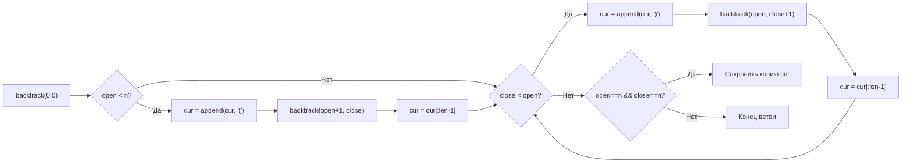

**LeetCode 22. Generate Parentheses.** Дано целое число `n` — количество пар скобок. Требуется сгенерировать **все** правильные комбинации из `n` пар круглых скобок и вернуть их в виде списка строк. Правильная комбинация — это такая строка, в которой в любом префиксе количество закрывающих скобок не превышает количества открывающих, а в конце их число равно.

Эта задача завершает кластер **Backtracking**, объединяя всё, чему мы научились: генерацию последовательностей ([[2. Генерация комбинаций]]), отсечения по локальным условиям ([[7. Combination Sum]]) и построение строк с переиспользованием буфера ([[8. Word Search]]). В отличие от N Queens ([[9. N Queens]]), где ограничения были глобальными (диагонали, колонки), здесь условие правильности **локально** и проверяется по двум счётчикам: сколько открывающих скобок уже поставлено и сколько закрывающих. Для Senior Go-разработчика эта задача — идеальный полигон для демонстрации того, как замена конкатенации строк на `[]byte` с откатом устраняет лавину аллокаций, а передача счётчиков вместо построения подстрок на каждом шагу превращает экспоненциальный перебор в элегантный обход дерева Каталана.

### Формулировка и уточнения

**Условие:** функция `generateParenthesis(n int) []string`. Возвращает слайс всех правильных скобочных последовательностей длины `2n`. Порядок строк не важен.

**Вопросы интервьюеру (Senior-стиль):**
- *Может ли `n` быть равно 0?* Обычно `n >= 1`, но если `n = 0`, правильной является пустая строка. Уточним: если `n = 0`, вернуть `[""]` или `[]string{}`. По соглашению LeetCode, `n >= 1`, но проверка не помешает.
- *Есть ли ограничения на символы?* Нет, только `'('` и `')'`.
- *Каков максимальный `n`?* До 8 (LeetCode), что даёт 1430 комбинаций для n=8, так что перебор с отсечениями легко укладывается.
- *Допустимо ли модифицировать промежуточный буфер?* Да, мы будем переиспользовать слайс байтов.

### Наивное решение: генерация всех строк с последующей проверкой

Можно сгенерировать все возможные строки длины `2n`, состоящие из `'('` и `')'`, и отфильтровать правильные. Всего таких строк `2^(2n)`. Для `n=8` это 65536 строк — терпимо, но для `n` побольше — экспоненциальный взрыв без необходимости. Более того, проверка правильности каждой строки занимает O(N) и требует дополнительного прохода. Это неэффективно и не демонстрирует владение backtracking.

```go
// Наивный подход: перебор всех битовых масок и фильтрация
```

Senior сразу переходит к целенаправленному построению только правильных последовательностей.

### Оптимальное решение: backtracking с двумя счётчиками

**Идея.** Мы строим строку посимвольно слева направо. В каждый момент мы можем добавить `'('`, если количество уже поставленных открывающих скобок меньше `n`. Мы можем добавить `')'`, если количество закрывающих скобок строго меньше количества открывающих (иначе скобка не будет иметь пары или нарушит баланс). Это два простых правила гарантируют, что мы никогда не зайдём в тупик, где правильная последовательность невозможна, и каждое полное построение даст правильную комбинацию.

**Состояние:** текущая строка (представленная как `[]byte`), количество открытых `open` и закрытых `close` скобок.

**Инвариант:** на каждом шагу `open >= close` и `open <= n`. При `open == n` и `close == n` последовательность завершена и добавляется в результат.

**Отсечения** встроены в правила добавления: мы не можем добавить закрывающую, если она нарушит баланс; не можем добавить открывающую сверх `n`. Это автоматически отсекает все неправильные ветви.

```go
func generateParenthesis(n int) []string {
    if n == 0 {
        return []string{""}
    }

    var res []string
    cur := make([]byte, 0, 2*n) // единый буфер для построения

    var backtrack func(open, close int)
    backtrack = func(open, close int) {
        if open == n && close == n {
            // Сохраняем копию, так как cur будет изменён
            cp := make([]byte, len(cur))
            copy(cp, cur)
            res = append(res, string(cp))
            return
        }
        // Можем добавить '('?
        if open < n {
            cur = append(cur, '(')
            backtrack(open+1, close)
            cur = cur[:len(cur)-1] // откат
        }
        // Можем добавить ')'?
        if close < open {
            cur = append(cur, ')')
            backtrack(open, close+1)
            cur = cur[:len(cur)-1] // откат
        }
    }

    backtrack(0, 0)
    return res
}
```

**Go-идиомы и комментарии:**
- `cur := make([]byte, 0, 2*n)` — предвыделение вместимости под максимальную длину строки. Это исключает переаллокации при `append` внутри backtracking.
- Откат через `cur = cur[:len(cur)-1]` — стандартный трюк, не выделяющий память.
- `cp := make([]byte, len(cur)); copy(cp, cur)` — копирование перед сохранением, обязательно.
- Замыкание `backtrack` захватывает `res` и `cur`, что делает сигнатуру лёгкой.
- Порядок ветвей: сначала пытаемся добавить `'('`, потом `')'` — это даёт лексикографический порядок (открывающая раньше), но может быть любым.



### Почему это работает: связь с Каталановыми числами

Количество правильных скобочных последовательностей из `n` пар равно `C_n` — числу Каталана. Наш алгоритм генерирует каждую из них ровно один раз, потому что каждая последовательность однозначно строится пошагово: на каждом префиксе мы принимаем решение «открыть» или «закрыть» при соблюдении баланса. Дерево решений — это дерево путей в сетке от `(0,0)` до `(n,n)`, не пересекающих диагональ `open = close + 1`. Отсечения гарантируют, что мы не переходим запрещённые границы. Таким образом, алгоритм посещает ровно `C_n` листьев и некоторое количество внутренних узлов, которое пропорционально числу листьев.

### Edge Cases

- **n = 0:** возвращаем `[""]`. В нашем коде добавили специальную проверку, чтобы не делать `make([]byte, 0, 0)` и не заходить в backtracking.
- **n = 1:** `["()"]`. Цикл: добавляем `'('` → добавляем `')'` → сохраняем. Попытка добавить вторую `'('` невозможна (`open < n` ложно), попытка добавить `')'` первой невозможна (`close < open` ложно). Корректно.
- **n = 3:** 5 комбинаций, алгоритм сгенерирует их все.
- **Большие n (8):** 1430 комбинаций, ~0.5 млн вызовов `backtrack`. Быстро.

### Анализ сложности

- **Время:** O(N * C_n), где C_n — n-е число Каталана (≈ 4^n / (n^(3/2) * sqrt(pi))). Каждый лист (комбинация) копируется за O(N). Внутренние узлы пропорциональны числу листьев.
- **Память:** O(N * C_n) для хранения всех строк (результат). Глубина стека рекурсии O(2N). Дополнительный буфер `cur` — O(2N) байт, переиспользуется.

### Mechanical Sympathy: аллокации и переиспользование `[]byte`

- **Единый буфер `cur`** ёмкостью `2n` аллоцируется один раз. В процессе backtracking `append` добавляет байты, заполняя этот буфер; откат лишь уменьшает длину, не освобождая память. После завершения буфер собирается GC.
- **Копирование в результат** `cp := make([]byte, len(cur))` — это единственная аллокация на каждую найденную комбинацию. Она неизбежна, так как мы должны сохранить строку, не зависящую от дальнейших мутаций `cur`.
- **Альтернатива `string(cur)` без копирования?** Если бы мы использовали `string(cur)`, а затем продолжали мутировать `cur`, сохранённые строки испортились бы, потому что `string` в Go иммутабельна, но ссылается на тот же массив байтов. Чтобы избежать этого, мы обязаны копировать.
- **Использование `strings.Builder`** вместо `[]byte` также возможно, но `Builder` не предоставляет удобного отката (нельзя просто уменьшить длину). `[]byte` с операциями среза — самый гибкий и лёгкий инструмент для backtracking в Go.
- **Стек рекурсии** глубина до 2*8 = 16, всё на стеке, никаких проблем.

> [!info] Под капотом
> Escape analysis помещает `cur` в кучу, потому что он передаётся по указателю? Нет, `cur` — слайс, его заголовок копируется, но нижележащий массив был выделен через `make` и, следовательно, уже в куче. Замыкание `backtrack` захватывает `cur` по ссылке, но заголовок слайса (Data, Len, Cap) хранится на стеке внешней функции, а данные в куче. Это эффективно и безопасно.

### Альтернатива: динамическое программирование

Можно строить множество строк для каждого n рекуррентно: `dp[n] = set("(" + a + ")" + b for i in 0..n-1, a in dp[i], b in dp[n-1-i])`. Это тоже даст все комбинации, но потребует генерации промежуточных множеств и большего объёма аллокаций (копирование строк при конкатенации). Backtracking с общим буфером значительно экономнее по памяти и времени на этапе построения. На собеседовании Senior упомянет DP-подход для сравнения.

### Итог

Generate Parentheses завершает кластер Backtracking, объединяя перебор с простыми локальными отсечениями. В Go задача решается с одним буфером `[]byte` и двумя счётчиками, без единой лишней аллокации в горячем пути. Мы прошли путь от подмножеств и перестановок до сеток и скобок — теперь вы готовы к любым задачам, требующим обхода пространства состояний с возвратом.

Следующий кластер — **Поиск в глубину (DFS)**, где backtracking-мышление будет применено к графам и деревьям, а состояния станут вершинами. Мы начнём с фундаментальной теории, связывающей рекурсивный обход с явным стеком, и разберём, как избежать переполнения стека горутины в глубоких графах. [[1. Теория. DFS]]