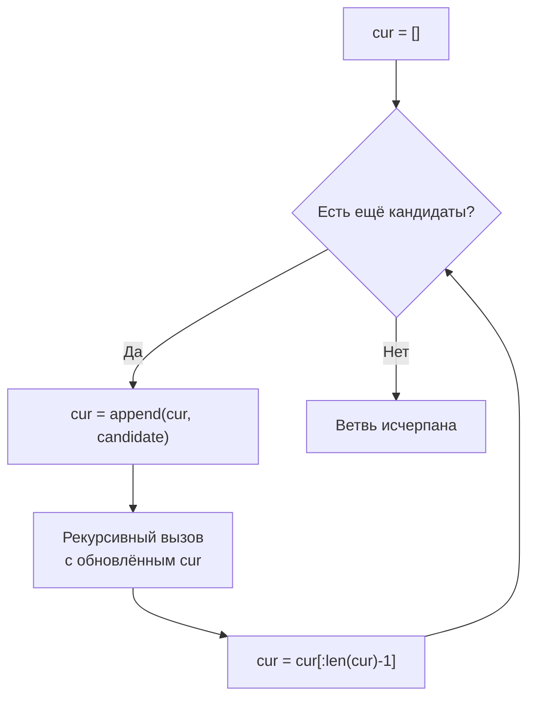

В предыдущей статье [[1. Теория. Backtracking]] мы заложили фундамент: общий рекурсивный каркас, переиспользование слайса, инварианты и отсечения. Теперь мы переходим к конкретным разновидностям генерации комбинаций — основе, на которой строятся задачи кластера: Subsets, Permutations, Combination Sum и их вариации с дубликатами. В отличие от абстрактного «дерева решений», здесь мы работаем с конкретными типами комбинаторных объектов: **подмножествами**, **сочетаниями**, **перестановками** и **комбинациями с повторениями**.

Senior Go-разработчик не просто помнит шаблоны — он понимает, как выбор представления состояния (слайс, массив, битовая маска) влияет на аллокации, как отсечения меняют константу, и как корректно обрабатывать дубликаты, не плодя идентичные ветви. В этой статье мы систематизируем три основных каркаса генерации, разберём их механическую симпатию и подготовимся к штурму конкретных задач.

### Единая основа: состояние как слайс

Все каркасы объединяет работа с мутабельным слайсом `cur`, который представляет текущую строящуюся комбинацию. Алгоритм на каждом шагу **добавляет** элемент, **рекурсивно спускается** и затем **откатывает** изменение. Благодаря переиспользованию одного и того же нижележащего массива через `append` и срез `cur = cur[:len(cur)-1]`, мы избегаем лавины аллокаций — все промежуточные состояния живут в одном буфере, пока хватает `cap`.



Этот каркас неизменен, а различия заключаются в том, **как мы выбираем кандидатов** на каждом шагу и **когда фиксируем результат**.

### Каркас 1: Подмножества и сочетания (Subsets, Combinations)

Здесь порядок элементов в комбинации **не важен**. Мы рассматриваем элементы исходного множества в фиксированном порядке (обычно индексы от 0 до n-1) и на каждом шагу решаем, **включать ли текущий элемент** или пропустить. Чтобы избежать дублирования комбинаций, отличающихся только перестановкой, мы передаём параметр `start` — минимальный индекс, с которого можно брать следующий элемент.

**Идиоматичный каркас на Go:**

```go
func subsets(nums []int) [][]int {
    var res [][]int
    var cur []int
    var backtrack func(start int)
    backtrack = func(start int) {
        // Копируем cur в результат (каждое состояние — валидное подмножество)
        cp := make([]int, len(cur))
        copy(cp, cur)
        res = append(res, cp)

        for i := start; i < len(nums); i++ {
            cur = append(cur, nums[i])
            backtrack(i + 1) // следующий элемент строго правее
            cur = cur[:len(cur)-1]
        }
    }
    backtrack(0)
    return res
}
```

**Что здесь важно:**
- Мы добавляем текущее состояние в результат **до** цикла — это даёт пустое подмножество и все промежуточные.
- Инкремент `start` гарантирует, что каждый элемент либо включается один раз, либо пропускается навсегда.
- Если бы нам нужны были сочетания ровно длины `k`, мы бы завершали рекурсию при `len(cur) == k`.

**Отсечения:** если оставшихся элементов не хватит для набора нужной длины, можно прервать цикл досрочно (`if len(nums)-i < k-len(cur) { break }`). Это радикально сокращает перебор для больших N и малых k.

### Каркас 2: Перестановки (Permutations)

Здесь порядок **важен**, и каждый элемент используется ровно один раз. На каждом шагу мы выбираем **любой из ещё не использованных** элементов. Для отслеживания используется `visited []bool` или swap in-place на исходном слайсе (но swap реже применяется в Go из-за необходимости восстанавливать порядок).

**Идиоматичный каркас с `visited`:**

```go
func permute(nums []int) [][]int {
    var res [][]int
    var cur []int
    visited := make([]bool, len(nums))
    var backtrack func()
    backtrack = func() {
        if len(cur) == len(nums) {
            cp := make([]int, len(cur))
            copy(cp, cur)
            res = append(res, cp)
            return
        }
        for i := 0; i < len(nums); i++ {
            if visited[i] {
                continue
            }
            visited[i] = true
            cur = append(cur, nums[i])
            backtrack()
            cur = cur[:len(cur)-1]
            visited[i] = false
        }
    }
    backtrack()
    return res
}
```

**Особенности:**
- Состояние завершено, когда `len(cur) == len(nums)`.
- Массив `visited` — срез `bool` в куче (одна аллокация). Альтернатива — битовая маска в `int` (для N ≤ 64) даёт ещё более быстрый код без аллокации под `visited`.
- Откат восстанавливает и `cur`, и `visited`.

**Вариация с дубликатами (Permutations II):** если входной массив содержит дубликаты, просто `visited` недостаточно — мы можем сгенерировать одинаковые перестановки. Решение: сортировка массива и пропуск элемента, если `i > 0 && nums[i] == nums[i-1] && !visited[i-1]`. Это гарантирует, что на одной позиции одинаковые элементы выбираются только в одном порядке, не плодя дубликаты ветвей.

### Каркас 3: Комбинации с повторениями (Combination Sum)

Элементы можно использовать **неограниченное число раз**, но сумма (или иное условие) ограничивает глубину. Вместо `start = i+1` мы передаём `start = i`, позволяя выбирать тот же элемент снова. Отсечение — по превышению целевой суммы.

```go
func combinationSum(candidates []int, target int) [][]int {
    sort.Ints(candidates) // для отсечений
    var res [][]int
    var cur []int
    var backtrack func(start, remain int)
    backtrack = func(start, remain int) {
        if remain == 0 {
            cp := make([]int, len(cur))
            copy(cp, cur)
            res = append(res, cp)
            return
        }
        for i := start; i < len(candidates); i++ {
            if candidates[i] > remain {
                break // все последующие ещё больше
            }
            cur = append(cur, candidates[i])
            backtrack(i, remain-candidates[i]) // i, а не i+1
            cur = cur[:len(cur)-1]
        }
    }
    backtrack(0, target)
    return res
}
```

**Почему сортировка?** Чтобы отсечение `candidates[i] > remain` было эффективным: после первого неподходящего все следующие заведомо больше, и цикл прекращается.

### Go-специфика: переиспользование слайса и копирование

Как обсуждалось в [[1. Теория. Backtracking]], ключевое правило: **всегда копировать `cur` перед сохранением в результат**. Без этого все элементы `res` будут указывать на один и тот же массив, и финальный результат превратится в набор одинаковых слайсов с последним состоянием.

```go
cp := make([]int, len(cur))
copy(cp, cur)
res = append(res, cp)
```

Это единственная регулярная аллокация в процессе backtracking. Всё остальное — манипуляции с заголовками слайсов через `append` и срезы — бесплатно.

**Переиспользование `cur` между ветвями одного уровня:**  
Цикл `for i := start; i < n; i++` для каждого `i` добавляет элемент, вызывает рекурсию и откатывает. Благодаря откату каждое следующее `i` видит `cur` в том же состоянии, что и в начале итерации. Никакого копирования между итерациями не требуется.

### Отсечения: когда и как обрезать дерево

Senior отличает «слепой» backtracking от эффективного именно наличием осмысленных отсечений. Основные типы:

1. **По длине:** если нужны комбинации фиксированной длины `k`, завершаем рекурсию при `len(cur) == k` и не идём глубже.
2. **По сумме:** для задач с суммой (`remain`). Если все числа положительные, превышение — стоп-сигнал. Если есть отрицательные — сортировка не даёт гарантий, отсечения сложнее, и стоит рассмотреть мемоизацию (DP).
3. **По лексикографическому порядку:** для генерации уникальных последовательностей вроде скобок (Generate Parentheses) — проверка баланса.
4. **По доступным ресурсам:** если оставшихся кандидатов меньше, чем требуется для достижения целевой длины — `break`.

Каждое отсечение многократно окупает себя при больших N, превращая экспоненту в нечто обозримое.

### Механическая симпатия: бенчмарки и кэш

Поскольку backtracking порождает экспоненциальное количество узлов, константа на каждом шагу критична. Вот что влияет на неё в Go:

- **Аллокация `visited` или битовая маска.** Слайс `[]bool` для 20 элементов — 20 байт в куче, одна аллокация. Битовая маска в `int` (до 64 элементов) — ноль аллокаций, все операции — регистровые AND/OR. Для Permutations Senior может выбрать маску и объяснить выбор.
- **Передача параметров.** Замыкания захватывают переменные бесплатно, но если передавать слайс по значению на каждый вызов (копирование заголовка — 24 байта) — это дешевле, чем разыменование указателя. Избегайте лишних указателей.
- **Стек рекурсии.** Глубина до нескольких десятков — безопасна. Если глубина больше 1000, стек растёт, но стоимость расширения стека (stack copying) пренебрежима на фоне экспоненциального времени.
- **Кэш-локальность.** Слайс `cur` и `visited` живут в одном массиве в памяти, доступ последовательный — максимум попаданий в L1. Никаких map, никаких pointer chasing.

> [!info] Под капотом
> Escape analysis в замыкании: переменные `res`, `cur`, `visited` захвачены замыканием `backtrack`. Компилятор Go видит, что они используются внутри функции и могут пережить выход из внешней функции (если `backtrack` возвращается наружу — в нашем случае нет, она вызывается синхронно). Обычно они размещаются на стеке, но `res` и `cur` — слайсы, их заголовки могут быть на стеке, а нижележащие массивы — в куче (потому что `append` может переаллоцировать массив). Это штатная ситуация.

### Типичные ошибки при реализации комбинаций

1. **Сохранение `cur` без копии.** Симптом: все ответы одинаковы. Исправление: обязательное `make` + `copy`.
2. **Забытый инкремент `start` в цикле.** Для подмножеств передача `i` вместо `i+1` приводит к повторному включению того же элемента на следующих уровнях и дублированию ветвей.
3. **Использование `visited` без отката.** В перестановках забывают `visited[i] = false` после рекурсии — последующие ветви теряют элемент.
4. **Неправильная обработка дубликатов.** В Subsets II / Permutations II без сортировки и проверки `!visited[i-1]` результат будет содержать повторяющиеся комбинации.
5. **Отсутствие сортировки перед отсечениями.** Без сортировки `break` по `candidates[i] > remain` не имеет смысла.

Каждая из этих ошибок может стоить оффера, потому что демонстрирует непонимание инвариантов. Перед написанием кода Senior проговаривает: «Мой инвариант: после каждой итерации цикла `cur` и `visited` возвращаются в состояние до итерации».

### Заключение

Генерация комбинаций в Go — это три слаженных каркаса (подмножества, перестановки, комбинации с повторениями), опирающиеся на единый механизм: рекурсивное замыкание, мутабельный слайс `cur` с откатом и копирование результата. Ключ к эффективности — отсечения, переиспользование буфера и осознанный выбор структуры для учёта использованных элементов. Освоив эти каркасы, вы сможете без труда адаптировать их к конкретным задачам кластера, начиная с самой фундаментальной — **Subsets**, где мы применим каркас подмножеств для генерации всех подмножеств уникального набора. [[3. Subsets]]