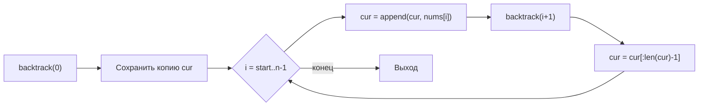

**LeetCode 78. Subsets.** Дан целочисленный массив `nums`, все элементы которого **уникальны**. Требуется вернуть **все возможные подмножества** (включая пустое) в виде списка списков. Порядок элементов внутри подмножества не важен, как и порядок самих подмножеств в ответе, но обычно ожидают лексикографический или естественный порядок обхода.

Эта задача — идеальный старт для практики backtracking после теоретического каркаса из [[2. Генерация комбинаций]]. Она минималистична: нет дубликатов (в отличие от [[4. Subsets II]]), нет ограничений на сумму или размер. Здесь мы впервые применяем полный цикл «добавил элемент → рекурсия → откатил» для генерации степенного множества, и именно на этом примере Senior Go-разработчик показывает, как переиспользование одного слайса и аккуратное копирование результата превращают экспоненциальный алгоритм в образец эффективности без скрытых аллокаций.

### Формулировка и уточнения

**Условие:** функция `subsets(nums []int) [][]int`. Все элементы `nums` уникальны, длина `n` от 0 до 10.

**Вопросы интервьюеру (Senior-стиль):**
- *Может ли `nums` быть пустым?* Да, тогда ответ — `[[]]` (множество, содержащее только пустое подмножество).
- *Допустимы ли отрицательные числа?* Да, значения любые, это не влияет на логику.
- *Важен ли порядок подмножеств?* Обычно нет, но естественный порядок генерации через backtracking даст лексикографический (по индексам) без дополнительных усилий.
- *Можно ли изменять входной массив?* Мы его не модифицируем, только читаем.

Ответы фиксируют выбор: рекурсивный backtracking с параметром `start`, где на каждом шагу мы принимаем решение, включать ли `nums[i]` или нет.

### Наивное решение: итеративное расширение

Существует простой итеративный метод: начать с `[[]]`, затем для каждого элемента `num` из `nums` создать новые подмножества, добавив `num` ко всем существующим. Время O(N * 2^N), память O(2^N) для хранения всех результатов. Это работает, но требует постоянного копирования и расширения слайса, что может порождать множество аллокаций. Более того, это не демонстрирует владение backtracking, который ожидается на собеседовании.

```go
func subsetsIterative(nums []int) [][]int {
    res := [][]int{{}}
    for _, num := range nums {
        n := len(res)
        for i := 0; i < n; i++ {
            // Копируем существующее подмножество и добавляем num
            subset := make([]int, len(res[i]))
            copy(subset, res[i])
            subset = append(subset, num)
            res = append(res, subset)
        }
    }
    return res
}
```
Этот код корректен, но на собеседовании Senior сразу предложит backtracking, объяснив его преимущества: единый буфер для построения, меньше аллокаций, естественная рекурсивная структура.

### Оптимальное решение: backtracking с переиспользованием слайса

**Идея.** Мы рекурсивно обходим индексы массива. На каждом шагу у нас есть текущее состояние `cur` (собранное подмножество) и индекс `start`, с которого можно продолжать добавление. Мы **всегда** сохраняем копию `cur` в результат, потому что любое промежуточное состояние — валидное подмножество. Затем для каждого `i` от `start` до `n-1` добавляем `nums[i]` в `cur`, вызываем рекурсию с `i+1` и откатываем добавление.

**Инвариант цикла:** после обработки всех элементов правее `start`, слайс `cur` возвращается в то же состояние, что и до начала цикла. Это гарантирует, что ветви не загрязняют друг друга.

```go
func subsets(nums []int) [][]int {
    var res [][]int
    var cur []int
    var backtrack func(start int)
    backtrack = func(start int) {
        // Сохраняем копию текущего подмножества
        cp := make([]int, len(cur))
        copy(cp, cur)
        res = append(res, cp)

        for i := start; i < len(nums); i++ {
            cur = append(cur, nums[i])
            backtrack(i + 1)
            cur = cur[:len(cur)-1] // откат
        }
    }
    backtrack(0)
    return res
}
```

**Go-идиомы и комментарии:**
- `cur` — единственный мутабельный слайс, переиспользуемый между всеми ветвями. Это минимизирует аллокации: все промежуточные состояния живут в одном нижележащем массиве (пока хватает capacity).
- `cp := make([]int, len(cur)); copy(cp, cur)` — обязательная копия перед сохранением. Без неё все элементы `res` будут указывать на один и тот же массив и в конце станут идентичными.
- `backtrack` — замыкание, захватывающее `res`, `cur` и `nums`. Это чище, чем передавать множество параметров.
- Порядок обхода гарантирует, что подмножества генерируются в лексикографическом порядке индексов без дополнительной сортировки.



### Почему итеративное решение не идеально для демонстрации глубины

Итеративный метод подходит для быстрого решения, но он менее гибок: если в задаче появятся дополнительные условия (например, Subsets II с дубликатами, требующими пропуска), backtracking с отсечениями адаптируется естественно, а итеративный — с трудом. Кроме того, backtracking демонстрирует понимание рекурсивного обхода дерева состояний, что является ключевым для многих сложных задач.

### Edge Cases

- **Пустой массив:** `n = 0`. `backtrack(0)` сразу сохранит копию пустого `cur` и выйдет из цикла (так как `start = len(nums) = 0`). Результат: `[[]]`.
- **Один элемент:** `[1]`. Генерируются `[]` и `[1]`. Корректно.
- **Максимальная длина (N=10):** 2^10 = 1024 подмножества. Отлично вписывается в лимиты. Механизм отката на слайсе с начальным `cap` 0 будет расширяться до 10, что не создаёт проблем.

### Анализ сложности

- **Время:** O(N * 2^N). Количество подмножеств — 2^N. Для каждого подмножества мы тратим O(N) на копирование в результат (длина подмножества ≤ N). Но сумма длин всех подмножеств равна N * 2^(N-1), так что общее время копирования O(N * 2^N). Сам обход делает ровно столько же операций.
- **Память:** O(N * 2^N) для хранения всех подмножеств (выходные данные). Дополнительная память помимо результата — O(N) на стек рекурсии и слайс `cur`.

### Mechanical Sympathy: где выигрывает Go

- **Переиспользование `cur`.** Слайс `cur` растёт и усекается. Пока его capacity достаточно (а максимальная длина — N), `append` не вызывает новых аллокаций после того, как capacity достигнет N. При спуске вглубь `append` может расширить массив, но тогда на более высоких уровнях будет использоваться старый массив — это безопасно, так как каждый уровень рекурсии имеет свой заголовок слайса, указывающий на соответствующий массив. Откат просто уменьшает длину, не трогая массив.
- **Копирование в результат.** `make([]int, len(cur))` аллоцирует новый массив в куче ровно нужного размера. Это неизбежная плата за сохранение. `copy` копирует данные — эффективно, так как элементы `int` маленькие и лежат в L1-кэше.
- **Стек рекурсии.** Глубина не превышает N (≤10). Никаких расширений стека горутины, всё быстро.
- **Отсутствие map и pointer chasing.** Обход чисто линейный по индексам, доступ к массиву `nums` прямой.

> [!info] Под капотом
> При `append(cur, nums[i])` компилятор видит, что `cur` — локальная переменная замыкания, и её заголовок хранится на стеке внешней функции, а нижележащий массив — в куче (потому что он был расширен через `append`). Escape analysis в этом случае помещает массив в кучу. Это одна аллокация на всё время работы — при первом расширении с 0 до 1. После capacity станет достаточно.

### Альтернативы и trade-off

- **Битовые маски.** Можно обойтись без рекурсии: перебрать все целые числа от 0 до 2^N - 1 и для каждого бита, равного 1, включить соответствующий элемент. Это O(N * 2^N) времени и O(1) дополнительной памяти (не считая результата), но не требует копирования промежуточных состояний и рекурсии. Однако это менее наглядно для демонстрации backtracking.
- **Библиотечные решения.** В Go нет встроенной функции `subsets`, и писать её самому — стандарт.

> [!tip] Собеседование
> Вопрос: «Чем ваш backtracking лучше битовых масок?»
> Ответ: «Backtracking естественно расширяется на задачи с дубликатами и отсечениями, а битовые маски ограничены N ≤ 64 и сложнее адаптируются к условиям. Кроме того, backtracking с переиспользованием слайса даёт меньше аллокаций, чем создание нового слайса на каждой итерации битовой маски. Но для N ≤ 20 оба подхода приемлемы, и я готов реализовать любой».

### Итог

Subsets — это первая практическая демонстрация backtracking в действии. Всего несколько строк кода, использующих единый буфер `cur` и рекурсию с откатом, генерируют степенное множество. Senior Go-разработчик не только выдаёт это решение, но и объясняет, как переиспользование слайса экономит аллокации, как копирование гарантирует изоляцию результатов и как тот же каркас будет расширен для обработки дубликатов в следующей задаче — **Subsets II**, где простого перебора уже недостаточно. [[4. Subsets II]]