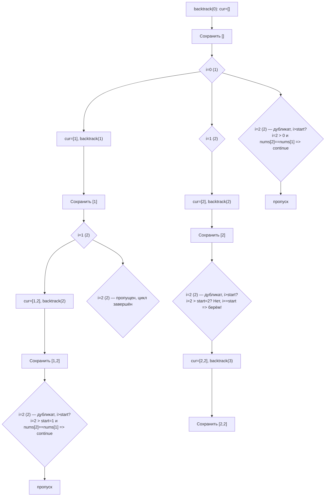

**LeetCode 90. Subsets II.** Дан целочисленный массив `nums`, который может содержать **дубликаты**. Требуется вернуть все возможные подмножества (включая пустое), при этом результирующий набор не должен содержать повторяющихся подмножеств. Порядок подмножеств и элементов внутри них не регламентирован.

Эта задача — прямое продолжение [[3. Subsets]] и естественный тест на зрелость владения backtracking. Если генерация всех подмножеств уникального набора решается простым циклом «включить/пропустить», то появление дубликатов ломает наивный подход: теперь две разные рекурсивные ветви могут породить идентичные комбинации, и просто перебрать всё — значит получить мусорный результат. Senior Go-разработчик обязан не просто применить трюк с сортировкой и пропуском, но и объяснить инвариант, гарантирующий уникальность без использования `map` для дедупликации.

### Формулировка и уточнения

**Условие:** функция `subsetsWithDup(nums []int) [][]int`. Элементы `nums` — целые числа, могут повторяться. Длина `n` от 1 до 10.

**Вопросы интервьюеру:**
- *Может ли массив быть пустым?* Да, тогда ответ — `[[]]`.
- *Дубликаты в исходном массиве могут быть неупорядочены?* Да, они произвольны.
- *Нужно ли сортировать подмножества или элементы?* Обычно нет, но для алгоритма мы отсортируем `nums` для группировки дубликатов.
- *Ожидается ли порядок в ответе?* Нет, но естественный порядок обхода даст лексикографический порядок подмножеств (по значению) после сортировки.

### Наивное решение: генерация всех подмножеств и дедупликация

Можно применить стандартный backtracking из [[3. Subsets]], а затем удалить дубликаты, например, сохраняя каждое подмножество в `map[string]struct{}` или проверяя перед добавлением. Это работает, но выполняет массу лишней работы: генерирует дублирующиеся ветви, тратит время и память на их обработку и сравнения. При N=10 с несколькими дубликатами количество уникальных подмножеств может быть значительно меньше 2^N, но наивный перебор всё равно обойдёт все 2^N вершин.

```go
// Наивный подход с map[string]struct{} — неэффективен и не показывает глубины
```

Senior сразу предложит исключить дубликаты на уровне рекурсии, чтобы не порождать лишние ветви.

### Оптимальное решение: backtracking с сортировкой и пропуском на уровне

**Идея.** Если мы отсортируем массив `nums`, то все одинаковые значения окажутся рядом. Тогда, строя подмножества, мы можем гарантировать, что для каждой группы одинаковых чисел мы будем включать их **только в одном порядке**: либо вообще не включаем, либо включаем первый элемент группы, затем, возможно, второй, третий и т.д., но никогда не включаем второй, пропуская первый. Это исключает дублирование подмножеств, которые отличаются лишь выбором разных экземпляров одного и того же значения.

Формально: на каждом уровне рекурсии мы перебираем кандидатов, начиная с индекса `start`. Если текущий элемент `nums[i]` равен предыдущему `nums[i-1]` **и предыдущий не был пропущен?** — стоп, важный момент. Стандартное условие пропуска: `if i > start && nums[i] == nums[i-1] { continue }`. Это означает: на одном уровне (для одного и того же `start`) мы берём только первый из серии одинаковых элементов, а остальные пропускаем. Почему это корректно? Потому что любое подмножество, которое могло бы быть построено с использованием второго, третьего и т.д. элементов, уже будет получено в ветке, где первый элемент был включён на более раннем уровне (или на том же уровне, но раньше). Подробное объяснение через дерево решений будет ниже.

Таким образом, мы не генерируем дублирующие ветви, и итоговое количество узлов в дереве рекурсии равно количеству уникальных подмножеств.

**Инвариант цикла:** после сортировки в каждой группе равных чисел первый элемент на текущем уровне рекурсии может быть выбран, а все последующие в этой группе на том же уровне пропускаются. Благодаря откату `cur` возвращается в состояние до выбора, что позволяет перейти к следующей группе.

```go
func subsetsWithDup(nums []int) [][]int {
    sort.Ints(nums) // группируем дубликаты
    var res [][]int
    var cur []int
    var backtrack func(start int)
    backtrack = func(start int) {
        // Копируем текущее подмножество
        cp := make([]int, len(cur))
        copy(cp, cur)
        res = append(res, cp)

        for i := start; i < len(nums); i++ {
            // Пропускаем дубликат на том же уровне
            if i > start && nums[i] == nums[i-1] {
                continue
            }
            cur = append(cur, nums[i])
            backtrack(i + 1)
            cur = cur[:len(cur)-1]
        }
    }
    backtrack(0)
    return res
}
```

**Go-идиомы и комментарии:**
- `sort.Ints(nums)` — in-place сортировка, O(N log N). Необходима и достаточна.
- Условие `if i > start && nums[i] == nums[i-1]` — ключевая строка, предотвращающая дублирование подмножеств. Она не влияет на ветки, где первый из дубликатов уже был взят на предыдущем уровне (там `start` уже указывает за пределы этой группы).
- Всё остальное — как в [[3. Subsets]]: переиспользование `cur`, откат, копирование в результат.



На диаграмме для `nums = [1,2,2]` показано, как на уровне `start=1` (после выбора 1) дубликат 2 на позиции 2 пропускается, а на уровне `start=2` (после выбора первого 2) второй 2 доступен. Таким образом, генерируются только уникальные комбинации.

### Почему это работает: инвариант и доказательство

Отсортированный массив группирует одинаковые значения. На конкретной глубине рекурсии с параметром `start` мы принимаем решение о включении элементов начиная с `start`. Если есть несколько одинаковых элементов `nums[i] == nums[i-1]`, то:
- Первый из них (`i == start`) **может быть взят** — это соответствует включению этого значения в подмножество на данном уровне.
- Для последующих таких же (`i > start`) элемент **пропускается**, потому что любое подмножество, которое начало бы формироваться с использованием этого экземпляра, уже будет сгенерировано в ветке, где на этом или более раннем уровне был взят первый экземпляр, а затем добавлены следующие (на больших глубинах).  
Формально, пропуск гарантирует, что для каждого значения `v` мы генерируем подмножества, содержащие `v` ровно `k` раз, только одним способом: включая первые `k` экземпляров `v` в порядке их следования.

### Edge Cases

- **Пустой массив:** `n = 0`. `backtrack(0)` сохранит `[]` и завершится. Результат `[[]]`.
- **Все элементы одинаковы:** `[2,2,2]`. Должны получиться подмножества: `[], [2], [2,2], [2,2,2]`. Проверим: `i=0` — берём 2, дальше на уровне `start=1` можем взять следующий 2, на уровне `start=2` — третий. На каждом уровне дубликаты пропускаются, так что генерируются только эти 4 комбинации.
- **Все элементы уникальны:** условие `i > start && nums[i] == nums[i-1]` никогда не срабатывает, алгоритм эквивалентен обычным Subsets.
- **Дубликаты вразнобой:** сортировка всё упорядочивает.

### Анализ сложности

- **Время:** O(N * 2^N) в худшем случае (когда все элементы уникальны). Для массива с дубликатами количество узлов в дереве рекурсии равно числу уникальных подмножеств, что может быть значительно меньше 2^N. Дополнительное время на сортировку O(N log N).
- **Память:** O(N * K) для хранения результатов, где K — число уникальных подмножеств. Стек рекурсии O(N). Дополнительная память для `cur` — O(N).

### Mechanical Sympathy

- **Сортировка `sort.Ints`** — in-place, без аллокаций. Она группирует дубликаты, что необходимо для корректного пропуска.
- **Переиспользование `cur`** — как и в Subsets, слайс растёт до максимальной длины N. После сортировки элементы копируются, но сам `cur` не создаёт новых аллокаций при откате.
- **Копирование в результат** — каждая копия требует аллокации, но только для уникальных комбинаций. В наихудшем случае (все элементы уникальны) аллокаций столько же, сколько в Subsets.
- **Отсутствие map** — мы не используем дополнительную память для трекинга уникальности, в отличие от наивного подхода. Это экономит память и избегает pointer chasing.

> [!info] Под капотом
> Условие `if i > start && nums[i] == nums[i-1]` — это простой целочисленный индекс, сравнение и переход. Оно не требует вызова `runtime.mapaccess` и полностью предсказуемо для branch predictor'а после сортировки (поскольку дубликаты идут подряд).

### Альтернативы и trade-off

- **Использование map для дедупликации.** Генерируем все подмножества, преобразуем каждое в строку и добавляем в `map[string]struct{}`. Это просто, но потребляет O(N * 2^N) памяти и времени на хеширование, а также неэлегантно.
- **Битовые маски с фильтрацией.** Перебрать все 2^N комбинаций битовых масок, но отбрасывать те, которые соответствуют невалидным комбинациям дубликатов. Можно, но сложнее и не даёт преимуществ.

Backtracking с пропуском на уровне — канонический идиоматичный метод, ожидаемый на собеседовании.

> [!tip] Собеседование
> Вопрос: «Почему условие `if i > start && nums[i] == nums[i-1]`, а не `if i > 0 && nums[i] == nums[i-1]`?»
> Ответ: «Если использовать `i > 0`, мы пропустим дубликат на любой глубине, включая случай, когда первый экземпляр уже был взят на предыдущем уровне. Например, для `[2,2]` при `start=1` после взятия первого 2, второй 2 является кандидатом с индексом 2, и `i=2 > 0` истинно, и `nums[2]==nums[1]` истинно, поэтому он будет пропущен, и мы не получим `[2,2]`. `i > start` гарантирует, что пропускаются только повторы на одном и том же уровне выбора, но разрешается брать следующий экземпляр на более глубоких уровнях».

### Итог

Subsets II учит нас контролировать дубликаты не постфактум, а в момент их возникновения — через сортировку и аккуратное условие в цикле. Это сохраняет асимптотику, избегает лишней работы и демонстрирует зрелый подход к backtracking. В Go решение реализуется минимальным добавлением к каркасу Subsets — строкой `if i > start && nums[i] == nums[i-1] { continue }` — и полностью сохраняет механическую симпатию: минимум аллокаций, in-place сортировка и никаких map.

Теперь, освоив генерацию подмножеств с дубликатами, мы переходим к следующей эволюции backtracking — генерации всех перестановок, где порядок элементов важен, а учёт использованных элементов становится центральной задачей. [[5. Permutations]]