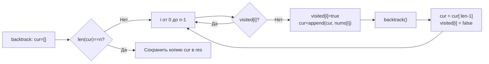

**LeetCode 46. Permutations.** Дан массив различных целых чисел `nums`. Требуется вернуть все возможные перестановки элементов этого массива. Порядок перестановок в ответе не важен.

После генерации подмножеств в [[3. Subsets]] и обработки дубликатов в [[4. Subsets II]] мы переходим к следующему фундаментальному комбинаторному объекту — **перестановкам**. Здесь меняется ключевое правило: каждый элемент должен быть использован ровно один раз, а порядок становится значимым. Backtracking-каркас трансформируется: «включать или пропускать» больше не работает, теперь на каждом шагу мы выбираем **любой из ещё не использованных** элементов. Для Senior Go-разработчика это повод продемонстрировать владение `visited`-массивом, его альтернативами (swap in-place) и понимание того, как переиспользование слайса для построения перестановки взаимодействует с escape analysis и сборщиком мусора.

### Формулировка и уточнения

**Условие:** функция `permute(nums []int) [][]int`. Все элементы `nums` уникальны, длина `n` от 1 до 6 (в классической версии LeetCode, но алгоритм работает и для больших N). Перестановки — это все возможные последовательности длины `n`, содержащие каждый элемент ровно один раз.

**Вопросы интервьюеру (Senior-стиль):**
- *Может ли `nums` быть пустым?* По условию `1 <= n`, но проверка не помешает — возвращаем `nil` или `[][]int{}`.
- *Допустимы ли дубликаты?* Нет, все элементы различны (для дубликатов есть [[6. Permutations II]]).
- *Важен ли порядок перестановок?* Обычно нет, ожидается любой порядок.
- *Можно ли изменять входной слайс?* Мы можем читать, но если используем swap-подход, то модифицируем его временно, восстанавливая позже.

### Наивное решение: вложенные циклы или случайная генерация

При N ≤ 6 полный перебор с проверкой уникальности через map был бы O(N! * N log N) — терпимо, но не идиоматично. Строить вложенные циклы для переменной длины N невозможно. Правильный путь — рекурсивный backtracking.

### Оптимальное решение: backtracking с `visited`

**Идея.** Мы поддерживаем флаги `visited []bool`, указывающие, использован ли уже элемент. На каждом уровне рекурсии мы перебираем все индексы `i`, и если `!visited[i]`, добавляем `nums[i]` в текущую перестановку `cur`, помечаем `visited[i] = true`, рекурсивно спускаемся вглубь, затем откатываем изменения. Когда длина `cur` достигает `n`, мы сохраняем копию в результат.

**Инвариант цикла:** на каждом уровне рекурсии слайс `cur` содержит начальный фрагмент перестановки, а массив `visited` точно отражает, какие элементы уже заняты. После возврата из рекурсии состояние `cur` и `visited` восстанавливается до того же, что было перед итерацией.

```go
func permute(nums []int) [][]int {
    n := len(nums)
    if n == 0 {
        return nil
    }

    var res [][]int
    var cur []int
    visited := make([]bool, n) // одна аллокация под visited

    var backtrack func()
    backtrack = func() {
        if len(cur) == n {
            cp := make([]int, n)
            copy(cp, cur)
            res = append(res, cp)
            return
        }
        for i := 0; i < n; i++ {
            if visited[i] {
                continue
            }
            visited[i] = true
            cur = append(cur, nums[i])
            backtrack()
            cur = cur[:len(cur)-1] // откат
            visited[i] = false
        }
    }

    backtrack()
    return res
}
```

**Go-идиомы и комментарии:**
- `visited := make([]bool, n)` — слайс булевых значений в куче, одна аллокация. Для N ≤ 64 можно использовать битовую маску `int`, что дало бы нулевую аллокацию и более быстрые проверки, но для читаемости на собеседовании чаще используют `[]bool`.
- `cur` — мутабельный слайс, переиспользуемый между ветвями. Расширяется до `n`, откатывается через `cur = cur[:len(cur)-1]`.
- Копирование `cp := make([]int, n)` — обязательная аллокация результата.
- Замыкание `backtrack` захватывает `res`, `cur`, `visited` — минимум параметров.



### Альтернативное решение: swap in-place (меньше памяти)

Вместо `visited` и отдельного слайса `cur` можно генерировать перестановки путём обменов элементов в самом слайсе `nums`. На каждом уровне `start` мы перебираем `i` от `start` до `n-1`, меняем местами `nums[start]` и `nums[i]`, вызываем рекурсию для `start+1`, а затем меняем обратно (откат). Когда `start == n`, текущее состояние `nums` — это очередная перестановка.

Этот подход не требует дополнительного слайса `cur` и массива `visited`, а использует единственный входной массив. Он эффективен по памяти (O(1) дополнительной), но меняет исходные данные, что нужно оговорить. Код компактнее, но менее очевиден.

```go
func permuteSwap(nums []int) [][]int {
    var res [][]int
    var backtrack func(start int)
    backtrack = func(start int) {
        if start == len(nums) {
            cp := make([]int, len(nums))
            copy(cp, nums)
            res = append(res, cp)
            return
        }
        for i := start; i < len(nums); i++ {
            nums[start], nums[i] = nums[i], nums[start]
            backtrack(start + 1)
            nums[start], nums[i] = nums[i], nums[start] // откат
        }
    }
    backtrack(0)
    return res
}
```

Этот вариант демонстрирует более глубокое понимание backtracking, но на собеседовании Senior объяснит оба и выберет один с обоснованием.

### Edge Cases

- **Пустой массив:** `n = 0`. По условию не бывает, но можно вернуть `nil`.
- **Один элемент:** `[1]` → `[[1]]`. Цикл `for i` выполнится один раз, `backtrack` при `len(cur) == 1` сохранит результат.
- **Максимальное N (6):** 720 перестановок, всё быстро.
- **Отрицательные числа:** `visited` трекает индексы, значения не влияют.

### Анализ сложности

- **Время:** O(N * N!). Количество перестановок — N!. Каждая перестановка длиной N копируется в результат за O(N). Общий объём работы пропорционален N * N!.
- **Память:** O(N * N!) для хранения всех перестановок (выходные данные). Дополнительная память: O(N) на стек рекурсии и слайс `cur` (или O(1) для swap-подхода, без учёта результата).

### Mechanical Sympathy: `visited` vs swap и кэш

- **Подход с `visited`:** требует слайса `[]bool` (N байт). Каждая проверка `visited[i]` — чтение из памяти (L1-кэш после первого обращения). Абсолютно предсказуемо.
- **Swap-подход:** не требует `visited`, но меняет входной слайс. Оперирует на том же непрерывном массиве, что хорошо для кэша. Однако копирование при сохранении результата требует аллокации (как и в visited-подходе).
- **Битовая маска (оптимизация):** для N ≤ 64 можно использовать `int` с битовыми операциями. Это ноль аллокаций на `visited` и мгновенные проверки. Senior может упомянуть этот вариант: «Если бы N было до 20 и производительность была критична, я бы использовал битовую маску вместо `[]bool`».

> [!info] Под капотом
> В visited-подходе `cur` растёт путём `append`. На первом проходе capacity увеличивается от 0 до N, что вызывает несколько аллокаций. Но после этого `cap(cur) == N`, и все последующие операции `append` и откат не аллоцируют новых массивов (пока длина не превышает N). Escape analysis помещает нижележащий массив `cur` в кучу, потому что он используется в замыкании и «убегает». Это одна аллокация на весь backtracking.

### Альтернативы и trade-off

- **Рекурсивный DFS с `visited`** — самый читаемый и универсальный, легко адаптируется под дубликаты (Permutations II).
- **Swap-подход** — элегантен и экономит память на `visited`, но требует модификации входа и менее нагляден.
- **Битовые маски** — производительная микрооптимизация.

> [!tip] Собеседование
> Вопрос: «Какой из подходов вы выберете и почему?»
> Ответ: «На собеседовании я предпочту `visited` за читаемость и лёгкость адаптации к дубликатам в Permutations II. Swap-подход я бы выбрал, если бы требовалась минимальная память и допустима модификация входа. Битовая маска — для максимальной производительности, но может ухудшить читаемость, поэтому применяется осознанно».

### Итог

Permutations — это ключевая задача на backtracking с отслеживанием использованных элементов. В Go она решается чистым рекурсивным замыканием с `visited` и переиспользованием слайса `cur`, либо элегантным in-place swap. Senior-разработчик демонстрирует оба варианта, объясняет их trade-off по памяти и читаемости, а также готов к усложнению — **Permutations II**, где дубликаты потребуют дополнительной логики пропуска на уровне. [[6. Permutations II]]