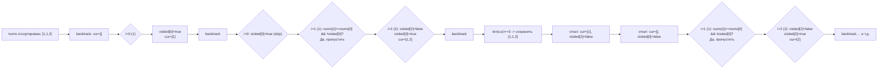

**LeetCode 47. Permutations II.** Дан массив целых чисел `nums`, который может содержать **дубликаты**. Требуется вернуть все **уникальные** перестановки элементов этого массива. Порядок перестановок в ответе не важен.

Эта задача — естественное продолжение [[5. Permutations]]. Если в Permutations достаточно было отследить использование элемента через флаг, то с появлением дубликатов наивный перенос каркаса порождает идентичные перестановки, отличающиеся лишь выбором разных экземпляров одного и того же числа. Senior Go-разработчик обязан не просто добавить `map` для дедупликации, а встроить логику пропуска прямо в рекурсию, сохранив асимптотику и не плодя лишних ветвей. Здесь вступает в силу техника **сортировки + пропуск на уровне**, знакомая по [[4. Subsets II]], но адаптированная к перестановкам с учётом `visited`.

### Формулировка и уточнения

**Условие:** функция `permuteUnique(nums []int) [][]int`. Массив может содержать дубликаты, длина `n` от 1 до 8 (LeetCode), но алгоритм работает и для больших N. Перестановки должны быть уникальны как последовательности значений.

**Вопросы интервьюеру (Senior-стиль):**
- *Может ли `nums` быть пустым?* По условию нет, но проверка на `len(nums) == 0` — good practice.
- *Какие значения?* Целые, могут быть отрицательные, нули.
- *Нужно ли сортировать ответ?* Обычно нет, но мы отсортируем входной массив для группировки дубликатов.
- *Допустимо ли изменять входной слайс?* При использовании swap-подхода — да, с восстановлением; при `visited` — только читаем.

### Наивное решение: генерация всех перестановок + дедупликация

Прямолинейно применить алгоритм из [[5. Permutations]] (с `visited`), а затем удалить дубликаты, преобразуя каждую перестановку в строку и сохраняя в `map[string]struct{}`. Это генерирует все N! перестановок, даже если уникальных значительно меньше (например, для массива из восьми нулей — всего 1 уникальная перестановка, но наивный метод пройдёт все 40320 ветвей). Время O(N! * N), память под map — O(N!). На собеседовании Senior обязан предложить более разумное решение.

### Оптимальное решение: backtracking с `visited` и пропуском дубликатов

**Идея.** Мы сохраняем каркас из Permutations: `visited []bool` отслеживает, какие индексы уже заняты. Ключевое добавление — **сортировка** `nums` и условие пропуска: если текущий элемент равен предыдущему (`nums[i] == nums[i-1]`) **и предыдущий ещё не использован** (`!visited[i-1]`), мы пропускаем текущий. Это гарантирует, что в каждой группе одинаковых значений мы всегда выбираем их в порядке возрастания индекса, и никакая перестановка не будет сгенерирована дважды.

**Почему `!visited[i-1]`, а не `visited[i-1]`?**
- Если `nums[i] == nums[i-1]` и `visited[i-1] == false`, это означает, что на предыдущем шаге мы **не взяли** более ранний экземпляр. Если мы сейчас возьмём `nums[i]`, то получим перестановку, в которой этот элемент появляется раньше своего дубликата, тогда как такая же перестановка уже могла бы быть получена, если бы мы взяли `nums[i-1]` на предыдущем уровне. Чтобы избежать дублирования, мы **запрещаем** брать `nums[i]`, пока не использован его предшественник.
- Если `visited[i-1] == true`, значит, более ранний экземпляр уже стоит на какой-то позиции в `cur`, и мы можем безопасно добавить следующий экземпляр — это уже другая структура (например, два одинаковых числа на разных местах).

Таким образом, мы не порождаем лишних ветвей, и каждый узел дерева рекурсии соответствует уникальной частичной перестановке.

**Инвариант:** после сортировки на каждом уровне рекурсии мы перебираем оставшиеся индексы. Для группы равных значений мы рассматриваем только первый ещё не использованный экземпляр в этой группе, остальные пропускаются. `visited` и `cur` всегда возвращаются к исходному состоянию после отката.

```go
func permuteUnique(nums []int) [][]int {
    sort.Ints(nums) // группируем дубликаты
    n := len(nums)
    if n == 0 {
        return nil
    }

    var res [][]int
    var cur []int
    visited := make([]bool, n)

    var backtrack func()
    backtrack = func() {
        if len(cur) == n {
            cp := make([]int, n)
            copy(cp, cur)
            res = append(res, cp)
            return
        }
        for i := 0; i < n; i++ {
            // Пропускаем уже использованные
            if visited[i] {
                continue
            }
            // Пропускаем дубликат, если предыдущий такой же ещё не использован
            if i > 0 && nums[i] == nums[i-1] && !visited[i-1] {
                continue
            }
            visited[i] = true
            cur = append(cur, nums[i])
            backtrack()
            cur = cur[:len(cur)-1]
            visited[i] = false
        }
    }
    backtrack()
    return res
}
```

**Go-идиомы и комментарии:**
- `sort.Ints(nums)` — in-place сортировка, необходимая для работы условия пропуска.
- Проверка `if i > 0 && nums[i] == nums[i-1] && !visited[i-1]` — канонический паттерн для уникальных перестановок.
- `visited` и `cur` переиспользуются; `cur` растёт до `n`, откат — через срез.
- Копирование в результат `make([]int, n)` — обязательная изоляция.



### Альтернативное решение: swap in-place с пропуском

Как и в Permutations, можно использовать swap-подход, модифицируя сам `nums` и передавая `start`. Для уникальности при каждом `start` мы не должны менять `nums[start]` с одинаковым значением, которое уже было на этой позиции. Для этого можно использовать `set` для отслеживания уже опробованных значений на данном уровне, или сортировать и пропускать `i > start && nums[i] == nums[i-1]`. Swap-подход требует восстановления порядка после рекурсии и менее нагляден, но экономит память на `visited`.

```go
func permuteUniqueSwap(nums []int) [][]int {
    sort.Ints(nums)
    var res [][]int
    var backtrack func(start int)
    backtrack = func(start int) {
        if start == len(nums) {
            cp := make([]int, len(nums))
            copy(cp, nums)
            res = append(res, cp)
            return
        }
        for i := start; i < len(nums); i++ {
            // Пропуск дубликата на одном уровне
            if i > start && nums[i] == nums[i-1] {
                continue
            }
            nums[start], nums[i] = nums[i], nums[start]
            backtrack(start + 1)
            nums[start], nums[i] = nums[i], nums[start]
        }
    }
    backtrack(0)
    return res
}
```

**Важно:** Swap меняет исходный массив, но сортировка в начале и откат восстанавливают его. Этот подход не требует `visited`, но менее интуитивен. Senior-разработчик демонстрирует знание обоих методов и выбирает исходя из требований к памяти и читаемости.

### Edge Cases

- **Все элементы уникальны:** условие пропуска никогда не срабатывает, алгоритм эквивалентен обычным Permutations.
- **Все элементы одинаковы:** `[1,1,1]`. После сортировки мы всегда будем брать первый элемент (индекс 0), затем на следующем уровне первый из оставшихся (индекс 1), затем последний. Будет сгенерирована ровно одна перестановка. Никакого лишнего перебора.
- **Пустой массив:** `n=0` → возвращаем `nil`.
- **Смешанные дубликаты:** `[2,2,0,1]` — сортировка `[0,1,2,2]`, уникальные перестановки корректны.
- **Максимальные N (8):** максимум 8! = 40320 перестановок, даже при уникальных — приемлемо.

### Анализ сложности

- **Время:** O(N * K), где K — количество уникальных перестановок. Поскольку мы не генерируем дублирующиеся ветви, количество вызовов `backtrack` равно числу уникальных перестановок. Каждая перестановка копируется за O(N). Худший случай (все элементы уникальны) — O(N * N!).
- **Память:** O(N) для `visited` или O(1) для swap-подхода (дополнительная память, не считая результата). Глубина рекурсии O(N). Хранение всех K перестановок — O(N * K).

### Mechanical Sympathy

- **Сортировка** `sort.Ints` in-place, без аллокаций, улучшает кэш-локальность.
- **`visited` как `[]bool`** — для N ≤ 8 это малозатратно. Для больших N (до 20) Senior может перейти на битовую маску `int`, избегая аллокации слайса и ускоряя проверки.
- **Переиспользование `cur`** — один массив в куче (аллоцирован при первом расширении), откат через срез не трогает память.
- **Отсутствие map** — дедупликация происходит на уровне индексов, без хеширования и pointer chasing.

> [!info] Под капотом
> В swap-подходе массив `nums` мутирует, но каждый swap — это обмен двух `int` (регистровая операция). Нет аллокаций, вся работа на стеке/в регистрах. Однако восстановление порядка обязательно, иначе родительские ветви увидят испорченные данные. В visited-подходе `cur` управляется через `append`, что может использовать регистры для заголовка слайса, но данные в куче. Оба подхода эффективны; выбор — вопрос стиля.

### Итог

Permutations II учит нас элегантно справляться с дубликатами в задачах на перестановки, не прибегая к постобработке. Техника «сортировка + пропуск по `!visited[i-1]`» (или через swap с проверкой `i > start`) является канонической и демонстрирует глубокое понимание backtracking. Senior Go-разработчик не просто запоминает условие, а может вывести его, нарисовав дерево рекурсии.

Теперь, освоив перестановки, мы переходим к задаче, где порядок не важен, но элементы можно использовать многократно — **Combination Sum**. Здесь на первый план выйдут отсечения по сумме и передача `start` для контроля повторений. [[7. Combination Sum]]