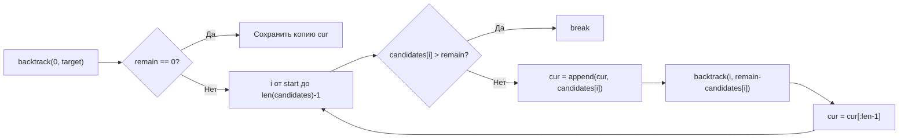

**LeetCode 39. Combination Sum.** Дан массив **уникальных** положительных целых чисел `candidates` и целевое число `target`. Требуется найти все уникальные комбинации чисел из `candidates`, которые в сумме дают `target`. Одно и то же число можно использовать **неограниченное количество раз**. Каждая комбинация должна быть уникальна по набору чисел (порядок не важен).

После задач на подмножества и перестановки мы переходим к задаче, в которой backtracking получает новое измерение — **ограничение по сумме**. Это первая задача кластера, где отсечения (pruning) не просто опциональны, а обязательны для прохождения лимитов по времени. Для Senior Go-разработчика Combination Sum становится полигоном демонстрации того, как сортировка и жёсткие ограничения на сумму превращают экспоненциальный перебор в управляемый процесс, а переиспользование слайса для состояния и `remain`-счётчика сохраняет нулевые аллокации в горячем пути.

### Формулировка и уточнения

**Условие:** функция `combinationSum(candidates []int, target int) [][]int`. Элементы `candidates` уникальны, положительны (≥ 1). Длина массива от 1 до 30, значения до 200, `target` до 500. Комбинации можно возвращать в любом порядке.

**Вопросы интервьюеру (Senior-стиль):**
- *Может ли `target` быть нулём?* Нет, `target` >= 1, но в коде обработка `remain == 0` обязательна.
- *Может ли `candidates` содержать отрицательные числа?* Нет, все положительные.
- *Можно ли изменять входной массив?* Мы его сортируем для оптимизации, но не модифицируем глобально (сортировка in-place — допустимо, если оговорено).
- *Важен ли порядок комбинаций?* Нет.

### Наивное решение: полный перебор без отсечений

Можно было бы генерировать все возможные последовательности элементов, проверяя сумму на каждом шагу, но без ограничений это приведёт к бесконечной рекурсии (так как элементы можно использовать бесконечно). Даже с ограничением глубины, наивный перебор всех комбинаций длины от 1 до `target/min(candidate)` будет экспоненциально большим. Без отсечения по превышению суммы и без сортировки алгоритм будет делать множество бесполезных ветвей.

Например, при `candidates = [2,3,5]` и `target = 8` без отсечений мы можем зайти в ветку `2+2+2+2+2 = 10` и только потом понять, что превысили цель, но уже потратили время на рекурсивные спуски. Отсутствие сортировки не позволяет досрочно выйти из цикла при превышении.

### Оптимальное решение: backtracking с сортировкой и отсечением по сумме

**Идея.** Мы сортируем `candidates` по возрастанию. Заводим слайс `cur` для построения комбинации и параметр `remain` — остаток до `target`. На каждом уровне рекурсии мы перебираем кандидатов, начиная с индекса `start`. Поскольку каждое число можно использовать многократно, следующий рекурсивный вызов получает **тот же** `start`, а не `start+1` (в отличие от Subsets). Если `candidates[i] > remain`, мы немедленно выходим из цикла (`break`), так как все последующие кандидаты ещё больше, и ни один из них не может быть частью решения.

Когда `remain == 0`, мы сохраняем копию `cur` в результат. Когда `remain < 0`, мы просто возвращаемся (этот случай предотвращается отсечением, но лишняя проверка не помешает).

**Инвариант цикла:** для текущего `start` и `remain` мы ищем все комбинации, использующие элементы из `candidates[start:]`, сумма которых равна `remain`. Слайс `cur` содержит префикс комбинации. После возврата из рекурсивных вызовов `cur` восстанавливается.

```go
func combinationSum(candidates []int, target int) [][]int {
    sort.Ints(candidates) // необходимо для отсечения
    var res [][]int
    var cur []int
    var backtrack func(start, remain int)
    backtrack = func(start, remain int) {
        if remain == 0 {
            cp := make([]int, len(cur))
            copy(cp, cur)
            res = append(res, cp)
            return
        }
        for i := start; i < len(candidates); i++ {
            if candidates[i] > remain {
                // все последующие кандидаты ещё больше
                break
            }
            cur = append(cur, candidates[i])
            backtrack(i, remain-candidates[i]) // i, а не i+1 — можно повторять
            cur = cur[:len(cur)-1]
        }
    }
    backtrack(0, target)
    return res
}
```

**Go-идиомы и комментарии:**
- `sort.Ints(candidates)` — in-place, O(N log N). Это основа эффективности: без сортировки `break` не имеет смысла.
- `cur` — переиспользуемый слайс. Откат через `cur = cur[:len(cur)-1]`.
- `backtrack(i, remain-candidates[i])` — передача `i` позволяет использовать один и тот же элемент неограниченно.
- Отсечение `if candidates[i] > remain { break }` — ранний выход из цикла, радикально сокращает дерево перебора.
- Копирование `cp := make([]int, len(cur)); copy(cp, cur)` — обязательна.



### Почему это работает: инвариант и отсечение

Сортировка гарантирует, что как только `candidates[i] > remain`, все элементы с индексами `>= i` также больше `remain` (так как массив упорядочен). Следовательно, никакая комбинация с этими элементами не может дать ровно `remain` (все числа положительные). Это позволяет нам безопасно прервать цикл. Без сортировки такое отсечение было бы невозможно, и код вынужден был бы перебирать все кандидаты на каждом уровне, что привело бы к экспоненциальному взрыву даже для небольших `target`.

Передача `start = i` гарантирует, что решение вида `[2,3,2]` не будет продублировано как `[3,2,2]` или `[2,2,3]` — мы всегда строим комбинации в неубывающем порядке индексов (а значит, и значений, после сортировки). Это естественно обеспечивает уникальность без дополнительных проверок, знакомых нам по [[4. Subsets II]].

### Edge Cases

- **`target` меньше любого кандидата:** `candidates = [5,10]`, `target = 3`. Сортировка `[5,10]`, на первой же итерации `candidates[0] = 5 > 3` → `break`, цикл по `i` не выполнится, `res` останется пустым. Вернётся `nil` или `[]int{}`. В нашем коде `res` не инициализирован, будет `nil`. Можно вернуть `[][]int{}` для консистентности, но nil также допустим.
- **`target` == 0:** по условию не бывает, но если бы было, `remain == 0` сработает сразу, сохраним пустой `cur`. Уточним на собеседовании.
- **Все кандидаты больше `target`:** аналогично первому пункту, пустой результат.
- **Отрицательных чисел нет:** код опирается на положительность для отсечения.
- **Большое количество комбинаций:** при `target=500` и `candidates=[1,2,5]` количество комбинаций огромно, но алгоритм сгенерирует их все. В production-коде Senior может добавить ограничение на максимальное количество комбинаций или перейти к DP (количество способов, а не перечисление), но задача требует именно перечисления.

### Анализ сложности

- **Время:** O(K * N), где K — количество сгенерированных комбинаций. Каждая комбинация длиной до `target/min(candidate)` копируется. Количество комбинаций может быть экспоненциальным относительно `target` в худшем случае (например, `candidates=[1]`). Но отсечения делают константу значительно меньше.
- **Память:** O(K * L) для хранения всех комбинаций (L — средняя длина). Дополнительная память для `cur` — O(L), глубина стека рекурсии — O(L).

### Mechanical Sympathy: кэш и аллокации

- **Сортировка `sort.Ints`** — in-place, без аллокаций.
- **Переиспользование `cur`** — как и во всех задачах backtracking, слайс `cur` растёт до максимальной длины комбинации, затем откатывается усечением. Никаких дополнительных аллокаций в горячем пути, кроме случаев расширения capacity (происходит несколько раз, пока длина не станет достаточно большой).
- **Отсечение `candidates[i] > remain`** — это простое сравнение целых чисел, выполняемое за такты. Без него алгоритм бы порождал миллионы лишних узлов, увеличивая давление на кэш инструкций и данных.
- **Отсутствие map и динамических структур** — всё линейно и плоско, максимальная локальность.

> [!info] Под капотом
> Escape analysis: `cur` — локальная переменная замыкания, его нижележащий массив размещается в куче из-за `append` и возможного переиспользования после возврата из `backtrack`. Но это одна аллокация, амортизируемая на всё время работы. `res` и `cp` также уходят в кучу, что оправдано (результат должен пережить вызов функции). Никаких утечек: `cur` после завершения `combinationSum` станет недостижимым и будет собран GC.

### Альтернативы и trade-off

- **Динамическое программирование (количество комбинаций).** Задача "Coin Change 2" (LeetCode 518) просит количество комбинаций, а не сами комбинации. DP даёт O(N * target) время и O(target) память. Для перечисления комбинаций DP менее удобен, так как требует восстановления путей.
- **Использование `map` для дедупликации.** Избыточно, правильный выбор `start` уже гарантирует уникальность.
- **Отказ от сортировки с filter.** Если кандидаты не сортированы, мы не можем прервать цикл досрочно. Вместо этого можно на каждой итерации проверять `candidates[i] <= remain`, но продолжать перебор — это уберёт отсечение, и производительность упадёт.

> [!tip] Собеседование
> Вопрос: «Можно ли обойтись без сортировки?»
> Ответ: «Можно, но тогда мы не сможем досрочно выйти из цикла при превышении остатка, и вынуждены будем перебирать всех кандидатов на каждом уровне, что резко замедлит алгоритм. Сортировка даёт гарантию монотонности и является стандартным первым шагом во многих backtracking-задачах».

### Итог

Combination Sum — это каноническая задача на backtracking с неограниченным использованием элементов и отсечением по сумме. Она завершает блок о базовых комбинаторных генерациях и готовит нас к более сложным сценариям, где отсечения и инварианты становятся ещё более изощрёнными. В Go решение пишется компактно, с использованием `sort.Ints` и переиспользования слайса, и демонстрирует зрелость инженера, понимающего, как несколько строк кода превращают экспоненциальный взрыв в управляемый перебор.

Следующая задача — **Word Search** — перенесёт нас из мира комбинаций на двумерные сетки, где backtracking будет применяться для обхода соседей в поисках пути. [[8. Word Search]]