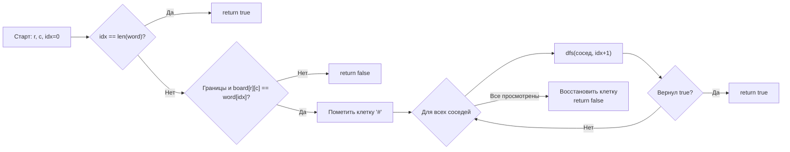

**LeetCode 79. Word Search.** Дана двумерная сетка символов `board` (слайс слайсов байтов или рун) и строка `word`. Требуется проверить, можно ли составить `word`, двигаясь по сетке от клетки к соседней (по горизонтали или вертикали), не используя одну и ту же клетку дважды. Функция возвращает `true`, если такое возможно.

После задач на комбинации и перестановки мы переносим backtracking в новое измерение — **пространственное**. Теперь состояние — это не только последовательность выбранных элементов, но и **позиция на двумерной сетке**. Здесь дерево решений ветвится не по индексам массива, а по четырём направлениям движения. Для Senior Go-разработчика Word Search становится идеальным полигоном для демонстрации того, как аккуратно управлять пометкой посещённых клеток in-place (чтобы избежать аллокаций под `visited`-матрицу) и как глубина рекурсии взаимодействует со стеком горутины.

### Формулировка и уточнения

**Условие:** функция `exist(board [][]byte, word string) bool`. Сетка `board` размером `m×n`. Символы — английские буквы (верхний/нижний регистр). Слово `word` — строка ASCII.

**Вопросы интервьюеру (Senior-стиль):**
- *Из каких символов состоит сетка?* Байты (ASCII). Для Unicode потребовались бы руны.
- *Может ли `board` быть пустым?* Да, `m=0` или `n=0` → `false`.
- *Может ли `word` быть пустым?* По условию `word.length >= 1`, но проверка не помешает.
- *Регистрозависимость?* Да, `'A' != 'a'`.
- *Можно ли изменять `board`?* Мы можем временно модифицировать, если потом восстановим. Это ключевое решение, влияющее на память.

Ответы фиксируют выбор: для отслеживания посещённых клеток мы будем временно изменять символ в клетке на специальный маркер (например, `'#'`), а после возврата из рекурсии — восстанавливать. Это даёт O(1) дополнительной памяти вместо O(m*n) для `visited [][]bool`.

### Наивное решение: DFS без восстановления или с отдельным `visited`

Простейший подход — для каждой клетки запускать DFS, передавая отдельную матрицу `visited`, которую копируют на каждом шагу, или использовать `visited` глобально, но тогда нужно аккуратно откатывать. Наивная реализация с копированием `visited` размером m×n на каждый рекурсивный вызов дала бы O(m*n * 3^L) времени и памяти, что неприемлемо. Без восстановления мы просто не найдём все пути.

```go
// Наивное решение — создавать новый visited на каждом шагу — убийственно по памяти.
```

### Оптимальное решение: backtracking с модификацией доски in-place

**Идея.** Для каждой стартовой клетки, совпадающей с первым символом `word`, запускаем рекурсивный DFS. На каждом шагу:
1. Проверяем, что текущая клетка в границах и её символ совпадает с текущим символом `word` (по индексу `idx`).
2. Если `idx == len(word)-1`, слово найдено → `true`.
3. Временно помечаем клетку как использованную: `ch := board[r][c]; board[r][c] = '#'`.
4. Рекурсивно пробуем четыре направления.
5. **Восстанавливаем** клетку: `board[r][c] = ch`.

**Инвариант:** после каждого выхода из рекурсии доска возвращается в точности в то состояние, в котором была до вызова. Это гарантирует, что разные стартовые клетки и разные ветви не мешают друг другу.

**Почему модификация in-place выигрывает у `visited`?** Она не требует выделения O(m*n) дополнительной памяти под матрицу флагов. В production-коде это особенно ценно для больших досок или ограниченных сред (например, встроенные системы). Однако она изменяет входные данные, что может быть запрещено условиями. На собеседовании Senior обязательно упомянет этот trade-off и спросит разрешения модифицировать `board`.

```go
func exist(board [][]byte, word string) bool {
    if len(word) == 0 {
        return true
    }
    m, n := len(board), len(board[0])

    // Определяем четыре направления: вверх, вниз, влево, вправо
    dirs := [][2]int{{-1, 0}, {1, 0}, {0, -1}, {0, 1}}

    var dfs func(r, c, idx int) bool
    dfs = func(r, c, idx int) bool {
        if idx == len(word) {
            return true
        }
        // Проверка границ и совпадения символа
        if r < 0 || r >= m || c < 0 || c >= n || board[r][c] != word[idx] {
            return false
        }
        // Временно помечаем клетку
        ch := board[r][c]
        board[r][c] = '#'

        // Пробуем все направления
        for _, d := range dirs {
            if dfs(r+d[0], c+d[1], idx+1) {
                return true
            }
        }

        // Откат: восстанавливаем символ
        board[r][c] = ch
        return false
    }

    // Ищем стартовую клетку
    for r := 0; r < m; r++ {
        for c := 0; c < n; c++ {
            if board[r][c] == word[0] {
                if dfs(r, c, 0) {
                    return true
                }
            }
        }
    }
    return false
}
```

**Go-идиомы и комментарии:**
- `dirs` — слайс структур, переиспользуется во всех вызовах.
- `dfs` — замыкание, захватывающее `board`, `word`, `dirs`.
- Пометка через замену на `'#'` — классический трюк для backtracking на досках.
- Восстановление `board[r][c] = ch` после цикла — обязательный откат.
- Если бы символы могли включать `'#'`, следовало бы выбрать другой маркер или использовать `visited`. Но в ASCII `'#'` — редкий символ; в рамках задачи символы — буквы, так что безопасно.



### Решение с отдельным `visited` (альтернатива)

Если модификация входных данных недопустима, мы создаём `visited := make([][]bool, m)`, инициализируем каждую строку `make([]bool, n)`. Это требует O(m*n) дополнительной памяти, но сохраняет `board` неизменным. Логика аналогична: перед рекурсией `visited[r][c] = true`, после — `false`. На собеседовании Senior скажет: «Если доска огромна, а слово короткое, маркер in-place выигрывает по памяти. Если же доска маленькая или контракт запрещает мутировать вход, я выберу `visited`».

### Edge Cases

- **Пустая доска:** `m=0` или `n=0` → возвращаем `false`.
- **Пустое слово:** `len(word)==0` → по условию не бывает, но можно вернуть `true` (технически пустое слово всегда можно составить).
- **Слово длиннее числа клеток:** `len(word) > m*n` → немедленный `false`. Эту проверку Senior добавит в начале функции.
- **Все клетки одинаковы:** например, `board` из букв 'A', слово `"AAAAA"` — алгоритм найдёт, глубина рекурсии будет до `len(word)`. Если слово слишком длинное, быстро исчерпает пути.
- **Спецсимволы:** используем маркер `'#'`, который не встречается среди букв. Если бы ввод мог содержать `'#'`, нужно было бы выбрать другой маркер или массив visited.

> [!warning] Ловушка / Gotcha
> Не забывайте восстанавливать клетку после цикла. Если вы поставите `board[r][c] = ch` внутри цикла или забудете вовсе, последующие стартовые клетки увидят испорченную доску, и результат будет неверным. Это классическая ошибка в backtracking на досках.

### Анализ сложности

- **Время:** O(m * n * 3^L), где L — длина слова. Для каждой стартовой клетки (их m*n) мы запускаем DFS, который в худшем случае ветвится на 3 направления (исключая то, откуда пришли). На практике отсечение по несовпадению символов резко сокращает перебор.
- **Память:** O(L) — глубина стека рекурсии (максимальная длина слова). Дополнительная память O(m*n), если используется `visited`; O(1), если модифицируется доска.

### Mechanical Sympathy: как работает обход сетки на процессоре

- **Двумерный слайс в Go** — это слайс указателей на строки (`[]byte`). Доступ `board[r][c]` требует двух разыменований: чтения указателя на строку из `board` и затем чтения байта из строки. Это double indirection, который немного хуже плоского одномерного массива, но для типичных размеров сетки (m,n ≤ 200) потери пренебрежимы. Если бы производительность была критичной, Senior мог бы предложить выровнять доску в плоский `[]byte` и индекс `r*n + c`.
- **Модификация in-place** меняет байт в строке слайса — эта операция локальна, не затрагивает другие строки, не вызывает аллокаций.
- **Кэш-локальность:** DFS прыгает по соседним клеткам; при небольших размерах вся строка может уместиться в L1-кэше. При больших — неизбежны промахи, но предсказатель путей компенсирует это.
- **Рекурсия и стек горутины:** глубина до L (обычно ≤ 15) не вызывает расширения стека, всё быстро.

> [!info] Под капотом
> Escape analysis: `board` — это слайс слайсов, переданный снаружи. Его заголовок (24 байта) на стеке, данные — в куче. Замыкание `dfs` захватывает `board`, но это бесплатно (копирование указателя на слайс). `dirs` — глобальный слайс, не аллоцируется на каждый вызов. Никаких выделений памяти в горячем пути, кроме стека рекурсии.

### Итог

Word Search — это элегантный пример backtracking на графе-сетке, где состояние отслеживается через временное изменение входных данных. В Go задача решается с минимальным потреблением памяти либо через маркер in-place, либо через `visited`-матрицу, и Senior-разработчик обосновывает выбор. Откат гарантирует корректность, а предварительная проверка на длину слова и пустую доску демонстрирует зрелость.

Следующая задача — **N Queens** — поднимет ставки: теперь ограничения не локальны (атака ферзей по линиям и диагоналям), и потребуется более сложный инвариант и отсечения. [[9. N Queens]]