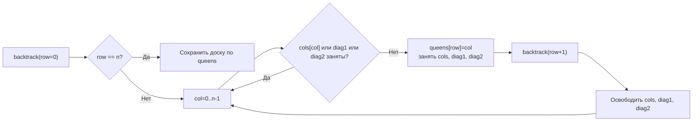

**LeetCode 51. N-Queens.** Дана целочисленная доска размером `n x n`. Требуется разместить `n` ферзей так, чтобы никакие два ферзя не атаковали друг друга. Ферзь атакует все клетки, находящиеся с ним в одной строке, одном столбце или на одной диагонали. Нужно вернуть **все возможные уникальные расстановки** в виде списка досок, где каждая доска представлена как `[]string`, а `'.'` обозначает пустую клетку, `'Q'` — ферзя.

Это вершина backtracking в кластере: после комбинаций, перестановок и обхода сеток мы выходим на классическую задачу с нелокальными ограничениями. Недостаточно отследить «использован ли элемент» — теперь выбор в одной строке исключает множество клеток по вертикалям и диагоналям. Для Senior Go-разработчика N Queens — это демонстрация того, как заменить дорогие проверки атак за O(N) на константные проверки через **множества колонок и диагоналей**, как переиспользовать буфер для построения строк и как битовые маски могут превратить backtracking в практически register-only алгоритм.

### Формулировка и уточнения

**Условие:** функция `solveNQueens(n int) [][]string`. Возвращает список всех возможных конфигураций доски, где `'Q'` обозначает ферзя, `'.'` — пустую клетку.

**Вопросы интервьюеру (Senior-стиль):**
- *Каков диапазон `n`?* Обычно от 1 до 9 (LeetCode), но алгоритм должен работать и для больших (до 12–13 за вменяемое время).
- *Может ли `n` быть 0?* По условию нет, но проверка не помешает: для `n=0` вернуть пустой список.
- *Важен ли порядок расстановок в ответе?* Нет, любой порядок.
- *Допустимо ли использовать `string` для представления доски?* Да, это стандартный формат вывода.
- *Можно ли изменять промежуточные структуры?* Да, мы будем переиспользовать буферы.

Ответы определяют выбор: для отслеживания атак мы используем три булевых массива (или битовые маски), а для построения строк — `[]byte` с переиспользованием.

### Наивное решение: полный перебор с проверкой всех клеток

Первый порыв — ставить ферзя в каждую клетку, если она не атакована, и для проверки атаки пробегаться по всем ранее поставленным ферзям (O(N) на каждый шаг). Это даёт астрономическое количество операций, хотя и допустимо для N ≤ 9. Но Senior сразу видит: проверка атак может быть O(1) за счёт предподсчитанных структур. Более того, перебор по всем клеткам всех строк, а не построчное размещение, порождает массу симметричных дубликатов.

```go
// Наивный код опущен — он нежизнеспособен на больших N
```

Узкое место — проверка атаки и отсутствие структуры в переборе. Правильный подход: размещаем ферзей **построчно**. В каждой строке ровно один ферзь. Это сразу сокращает пространство поиска до N^N (или N! при перестановках столбцов) и позволяет свести задачу к **перестановкам столбцов** с диагональными ограничениями.

### Оптимальное решение: построчный backtracking с трекингом колонок и диагоналей

**Идея.** Мы обходим строки от 0 до `n-1`. Для текущей строки `row` перебираем столбцы `col` от 0 до `n-1`. Если столбец или одна из двух диагоналей, проходящих через `(row, col)`, уже заняты предыдущими ферзями — пропускаем. Иначе ставим ферзя, помечаем колонку и диагонали как занятые, рекурсивно переходим к `row+1`, затем откатываем пометки.

Диагонали индексируются так:
- **Главная диагональ (\),** идущая с северо-запада на юго-восток: все клетки на ней имеют одинаковую **разность** координат `row - col`. Для размера `n` эта разность лежит в диапазоне `[-(n-1), n-1]`. Сдвинем на `n-1`, чтобы индексы были `[0, 2n-2]`.
- **Побочная диагональ (/),** идущая с северо-востока на юго-запад: все клетки имеют одинаковую **сумму** `row + col`. Сумма лежит в диапазоне `[0, 2n-2]`.

Таким образом, мы храним три булевых массива: `cols [n]bool`, `diag1 [2*n-1]bool`, `diag2 [2*n-1]bool`. Проверка атаки сводится к трём обращениям по индексу за O(1).

**Инвариант:** после размещения `k` ферзей (строки 0..k-1) массивы `cols`, `diag1`, `diag2` точно отражают занятые колонки и диагонали. При переходе к строке `row = k` все клетки, атакованные предыдущими ферзями, исключены из рассмотрения. После возврата из рекурсии массивы возвращаются в исходное состояние.

```go
func solveNQueens(n int) [][]string {
    if n == 0 {
        return nil
    }

    var res [][]string
    // cols, diag1, diag2 для трекинга атак
    cols := make([]bool, n)
    diag1 := make([]bool, 2*n-1) // индекс = row - col + n - 1
    diag2 := make([]bool, 2*n-1) // индекс = row + col

    // Текущая расстановка: queens[row] = col
    queens := make([]int, n)

    var backtrack func(row int)
    backtrack = func(row int) {
        if row == n {
            // Все строки заполнены — формируем доску
            board := make([]string, n)
            for r := 0; r < n; r++ {
                // Строим строку из '.' и одной 'Q'
                rowBytes := make([]byte, n)
                for c := 0; c < n; c++ {
                    rowBytes[c] = '.'
                }
                rowBytes[queens[r]] = 'Q'
                board[r] = string(rowBytes)
            }
            res = append(res, board)
            return
        }

        for col := 0; col < n; col++ {
            d1Idx := row - col + n - 1
            d2Idx := row + col
            if cols[col] || diag1[d1Idx] || diag2[d2Idx] {
                continue
            }
            // Размещаем
            queens[row] = col
            cols[col], diag1[d1Idx], diag2[d2Idx] = true, true, true
            backtrack(row + 1)
            // Откат
            cols[col], diag1[d1Idx], diag2[d2Idx] = false, false, false
        }
    }

    backtrack(0)
    return res
}
```

**Go-идиомы и комментарии:**
- `cols`, `diag1`, `diag2` — слайсы `bool` в куче (одна аллокация на каждый). Для N ≤ 9 это пренебрежимо мало. Для N до 32 можно было бы использовать битовые маски `int32`/`uint32`, что дало бы нулевые аллокации и более быстрые операции.
- `queens` — слайс `int` длиной `n`, хранит позицию ферзя в каждом ряду. Используется только при построении итоговой доски.
- При формировании доски для каждой строки создаётся `[]byte` длиной `n` (через `make`) и затем конвертируется в `string`. Это неизбежные аллокации под результат.
- Откат простой: `cols[col] = false` и аналогично для диагоналей. Никаких `append` и срезов, так как состояние не накапливается в слайсе переменной длины.



### Альтернатива: битовые маски (максимальная производительность)

Для N ≤ 8–32 можно использовать три целых числа: `colMask`, `diag1Mask`, `diag2Mask` (тип `int`). Установка бита соответствует занятой колонке/диагонали. Проверка: `colMask & (1 << col) == 0`. Обновление: `colMask |= 1 << col; diag1Mask |= 1 << d1Idx` и т.д. Откат: `colMask ^= 1 << col`. При построении ответа `queens` всё равно нужен. Это даст нулевые аллокации и максимальную скорость, но менее читаемо. Senior может упомянуть этот вариант как финальную оптимизацию для большого N (например, N=32 для задачи о подсчёте количества решений, LeetCode 52).

```go
func totalNQueens(n int) int {
    var count int
    var backtrack func(row int, cols, d1, d2 int)
    backtrack = func(row int, cols, d1, d2 int) {
        if row == n {
            count++
            return
        }
        // available — биты, где можно поставить ферзя
        available := ^(cols | d1 | d2) & ((1 << n) - 1)
        for available != 0 {
            // выбираем последний установленный бит
            col := available & -available
            available -= col
            // рекурсивно, сдвигая маски диагоналей
            backtrack(row+1, cols|col, (d1|col)<<1, (d2|col)>>1)
        }
    }
    backtrack(0, 0, 0, 0)
    return count
}
```
На собеседовании Senior предложит битовую маску для подсчёта количества решений, а для построения всех досок — более читаемый вариант с булевыми массивами.

### Edge Cases

- **`n = 1`:** одна клетка, единственный ферзь. Ответ: `[["Q"]]`. Алгоритм: `row=0`, `col=0`, все флаги false, помещаем, `row=1` → сохраняем доску.
- **`n = 2` или `n = 3`:** решений нет, возвращаем пустой слайс. Алгоритм корректно отработает и не найдёт ни одной ветки до `row == n`.
- **`n = 0`:** возвращаем `nil` или `[][]string{}`.
- **Большие `n` (9):** число решений 352, алгоритм отрабатывает миллисекунду.

### Анализ сложности

- **Время:** O(N!). В худшем случае (первое решение или все решения) мы перебираем перестановки столбцов, но отсечения по диагоналям резко сокращают перебор. Точное количество узлов дерева существенно меньше N!.
- **Память:** O(N) для `queens`, `cols`, `diag1`, `diag2`. Глубина рекурсии O(N). Результат занимает O(K * N²), где K — количество решений.

### Mechanical Sympathy: массивы, кэш и биты

- **Булевы слайсы** `cols`, `diag1`, `diag2` размещаются в куче при `make`. Для N=9 их суммарный размер ~9 + 17 + 17 = 43 байта — смехотворно. Все проверки — чтение из памяти, которая помещается в одну кэш-линию.
- **Битовые маски** используют регистры процессора, не требуют памяти, полностью исключают cache miss на проверках. Особенно заметно на больших N (20+). Senior упомянет, что для production-кода, где N может быть до 32, выбрал бы маски.
- **Построение строк** `rowBytes := make([]byte, n)` создаёт новый слайс для каждой строки каждой доски. Это неизбежно для вывода. Внутри цикла можно переиспользовать один `[]byte`? При записи в `board[r] = string(rowBytes)` Go копирует байты, так что переиспользование слайса между рядами возможно: создать один раз `rowBytes := make([]byte, n)` и для каждого ряда заполнять и конвертировать в строку. Однако `string(rowBytes)` копирует данные, так что мы можем спокойно переиспользовать слайс. Это сократит аллокации. Senior способен предложить такую микрооптимизацию:

```go
rowBytes := make([]byte, n)
for r := 0; r < n; r++ {
    for c := 0; c < n; c++ {
        rowBytes[c] = '.'
    }
    rowBytes[queens[r]] = 'Q'
    board[r] = string(rowBytes)
}
```
Всего одна аллокация `[]byte` на всю доску.

> [!info] Под капотом
> Escape analysis: `rowBytes` создан в цикле `backtrack`, но при конвертации в строку `string(rowBytes)` компилятор видит, что строка «убегает» в результат, и размещает копию байтов в куче. Сам `rowBytes` может быть размещён на стеке, если не убегает (в нашей оптимизации он не передаётся наружу). Это экономит одну аллокацию на каждом ряду.

### Альтернативы и trade-off

- **Проверка атаки через цикл.** Медленно O(N) на проверку. На собеседовании можно упомянуть как baseline, но сразу перейти к трекингу.
- **Динамическое программирование?** Не подходит: требуется перечислить все варианты.
- **Симметрии.** Можно генерировать только уникальные относительно отражений и вращений, но это усложнит код. Обычно не требуется.

> [!tip] Собеседование
> Вопрос: «Как бы вы оптимизировали алгоритм для N=20?»
> Ответ: «Я бы использовал битовые маски и backtracking, а также симметрийные отсечения: первую строку можно ограничить первыми ⌈n/2⌉ столбцами для сокращения перебора вдвое. Для N=20 количество решений огромно, но перечисление всех, скорее всего, не требуется — возможно, задача свелась бы к подсчёту количества. Тогда битовая маска без построения досок даст ответ за секунды».

### Итог

N Queens — это кульминация backtracking с нелокальными ограничениями. В Go задача реализуется через построчный перебор с трекингом занятых колонок и диагоналей через компактные слайсы или битовые маски. Senior-разработчик демонстрирует не только работающий код, но и понимание инвариантов, механической симпатии и способность выбрать между читаемостью булевых массивов и максимальной производительностью битовых масок.

На этом завершается наш кластер **Backtracking**. Мы изучили все фундаментальные разновидности: подмножества, перестановки, комбинации с повторениями, обход сеток и задачи с нелокальными ограничениями. Эти навыки теперь образуют ваш личный инструментарий для решения любых переборных задач на собеседовании и в production-коде. Следующий кластер — **Поиск в глубину (DFS)**, где мы перенесём backtracking-мышление с комбинаторных объектов на графы и деревья, а состояния станут вершинами. [[1. Теория. DFS]]