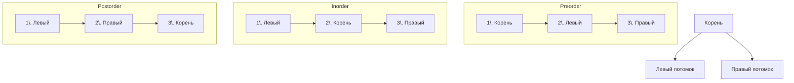

**Поиск в глубину (Depth-First Search, DFS)** — это стратегия обхода графа или дерева, при которой мы, начав с некоторой вершины, идём «вперёд» по одному из путей, пока не упрёмся в тупик (лист, уже посещённую вершину или отсутствие потомков), после чего возвращаемся назад и пробуем другой путь. Если поиск в ширину (BFS), который мы будем изучать в следующем кластере, напоминает волну, заливающую уровни, то DFS — это упорное путешествие вглубь, вплоть до исчерпания всех возможностей.

После того как мы освоили backtracking — обход пространства состояний с построением и откатом решений, — DFS воспринимается как его естественное продолжение. Backtracking и есть DFS на дереве решений, но DFS как самостоятельный паттерн применяется не только к комбинаторным объектам, а к **конкретным структурам данных**: деревьям, графам, матрицам. Здесь состояние — это вершина (или клетка), а переходы — рёбра (или соседние клетки). Для Senior Go-разработчика DFS — это ещё и выбор между рекурсивным и итеративным обходом, понимание работы стека горутины, умение заменить рекурсию на явный стек на слайсе и осознание того, как порядок обхода влияет на кэш-локальность и аллокации.

### Что такое DFS: три порядка обхода дерева

Наиболее наглядно DFS проявляется при обходе **бинарного дерева**. В зависимости от того, когда мы обрабатываем текущий узел относительно его потомков, различают три классических порядка:

- **Preorder:** узел → левый потомок → правый потомок.
- **Inorder:** левый потомок → узел → правый потомок (для BST даёт отсортированный вывод).
- **Postorder:** левый потомок → правый потомок → узел.

Для графов общего вида порядок сводится к preorder: посетили вершину, отметили её, затем рекурсивно обошли всех непосещённых соседей.



Для обхода графа мы дополнительно ведём **множество посещённых вершин** (`visited`), чтобы не зациклиться. В дереве циклов нет, поэтому `visited` не нужен (хотя для задач с родительскими ссылками может быть полезен).

### Рекурсивный DFS: канонический каркас на Go

Рекурсивная реализация DFS — самая естественная и читаемая. Для дерева она выглядит так:

```go
type TreeNode struct {
    Val   int
    Left  *TreeNode
    Right *TreeNode
}

func dfsRecursive(node *TreeNode) {
    if node == nil {
        return
    }
    // Обработка текущего узла (preorder)
    fmt.Println(node.Val)
    dfsRecursive(node.Left)
    dfsRecursive(node.Right)
}
```

Для графа добавляется массив `visited` и, возможно, дополнительный контекст:

```go
func dfsGraph(adj [][]int, v int, visited []bool) {
    visited[v] = true
    // Обработка вершины v
    for _, neighbor := range adj[v] {
        if !visited[neighbor] {
            dfsGraph(adj, neighbor, visited)
        }
    }
}
```

**Инвариант рекурсивного DFS:** после возврата из вызова для узла `v` все вершины, достижимые из `v` по непосещённым ранее путям, теперь помечены как посещённые. Именно этот инвариант позволяет решать задачи типа «количество островов» ([[3. Number of Islands]]) — после вызова DFS для одной клетки суши все связанные с ней клетки становятся посещёнными, и мы считаем один остров.

**Преимущества рекурсивного подхода:**
- Лаконичность, читаемость.
- Стек вызовов автоматически хранит путь от корня до текущей вершины.
- Не нужно вручную управлять стеком.

**Недостаток:** глубина рекурсии ограничена ёмкостью стека горутины. В Go стек горутины динамически растёт (начинается с 2 КБ, увеличивается копированием), поэтому для глубины 10⁴ проблем нет, но для 10⁶ и более могут быть накладные расходы на многократное копирование стека, а в экстремальных случаях — риск исчерпания памяти. В таких ситуациях Senior-разработчик переходит к итеративному DFS.

### Итеративный DFS: эмуляция стека через слайс

Итеративная реализация заменяет стек вызовов на **явный стек**, реализованный на слайсе. Это даёт полный контроль над памятью и позволяет обходить структуры, глубина которых может быть опасна для рекурсии.

**Каркас итеративного DFS для дерева (preorder):**

```go
func dfsIterative(root *TreeNode) {
    if root == nil {
        return
    }
    stack := []*TreeNode{root}
    for len(stack) > 0 {
        // Pop
        node := stack[len(stack)-1]
        stack = stack[:len(stack)-1]
        // Обработать узел
        fmt.Println(node.Val)
        // Push потомков (правого первым, чтобы левый обработался раньше)
        if node.Right != nil {
            stack = append(stack, node.Right)
        }
        if node.Left != nil {
            stack = append(stack, node.Left)
        }
    }
}
```

Для графа необходимо явно хранить состояние обхода (посещённые вершины, а иногда и итератор по соседям). Классический итеративный DFS для графа использует стек пар `(v, index)`, где `index` — следующий непосещённый сосед, которого нужно обработать. Это имитирует точку возврата в рекурсивной версии.

```go
func dfsIterativeGraph(adj [][]int, start int) {
    n := len(adj)
    visited := make([]bool, n)
    // Стек хранит пары: вершина и индекс следующего соседа для обработки
    type frame struct {
        v   int
        idx int
    }
    stack := []frame{{v: start, idx: 0}}
    visited[start] = true
    // Обработка стартовой вершины (preorder)
    for len(stack) > 0 {
        top := &stack[len(stack)-1]
        if top.idx < len(adj[top.v]) {
            neighbor := adj[top.v][top.idx]
            top.idx++
            if !visited[neighbor] {
                visited[neighbor] = true
                // Обработка соседа (preorder)
                stack = append(stack, frame{v: neighbor, idx: 0})
            }
        } else {
            // Все соседи обработаны — выход из вершины (postorder)
            stack = stack[:len(stack)-1]
        }
    }
}
```

Такой подход позволяет обходить графы с огромной глубиной без риска переполнения стека горутины и более гибко управлять памятью (явный стек можно переиспользовать).

> [!info] Под капотом
> Слайс `stack []frame` хранит фреймы в непрерывном блоке памяти. Каждый `append` потенциально вызывает переаллокацию, но если заранее выделить достаточную вместимость (`make([]frame, 0, maxDepth)`), расширений не будет. Откат через срез `stack = stack[:len(stack)-1]` не освобождает память, но сохраняет её для последующего использования — это тот же трюк, что и переиспользование `cur` в backtracking.

### DFS vs Backtracking: общее и различия

Backtracking, изученный в предыдущем кластере ([[1. Теория. Backtracking]]), по сути является DFS на **неявном дереве состояний**. Различия лежат в практической плоскости:

| Характеристика | Backtracking | DFS (на графе/дереве) |
|---|---|---|
| **Где применяется** | Комбинаторные задачи (подмножества, перестановки, скобки) | Обход графов, деревьев, матриц |
| **Состояние** | Мутабельный слайс `cur`, который модифицируется и откатывается | Вершина + контекст (`visited`, путь) |
| **Отсечения** | Обязательны (pruning по сумме, длине, ограничениям) | Обычно нет, но может быть эвристика |
| **Цель** | Найти все решения, удовлетворяющие условиям | Посетить все вершины, найти путь, проверить связность |
| **Память** | `cur` + стек рекурсии; переиспользование буфера критично | `visited` + стек рекурсии или явный стек |

Оба основаны на одном принципе: идём вглубь, пока возможно, затем откатываемся.

### Mechanical Sympathy: рекурсия, стеки и кэш

**Рекурсивный DFS и стек горутины.**  
В Go вызов функции не аллоцирует память в куче — фрейм размещается на стеке горутины. Пока глубина невелика (сотни-тысячи), это практически бесплатно. При переходе порога расширения стека (stack growth) рантайм копирует весь стек в новую, более крупную область, что может занимать микросекунды. Для глубины 10⁵ это случится log₂(10⁵) ≈ 17 раз, что в сумме даёт ~0.1 мс — приемлемо. Однако сопутствующее потребление памяти (стек горутины размером ~2 МБ для глубины 10⁴) тоже нужно учитывать.

**Итеративный DFS с явным стеком.**  
Явный стек на слайсе `[]frame` выделяется в куче один раз. При `append` внутри цикла, если capacity достаточно, новых аллокаций нет. Память предсказуема и не растёт сверх необходимого. Более того, явный стек можно переиспользовать между вызовами, обнуляя длину (`stack = stack[:0]`), что вообще исключает аллокации для повторных обходов.

**Кэш-локальность.**  
- В дереве/графе, представленном через слайсы смежности (`[][]int`), обход соседей читает индексы из непрерывных блоков памяти — это дружественно кэшу.
- В матрице (`[][]byte`) обход в глубину может прыгать по строкам и столбцам, что иногда хуже для кэша, но для типичных размеров не критично.
- Явный стек на слайсе гарантирует, что все фреймы лежат в одном непрерывном куске памяти, максимально используя L1/L2 кэш.

> [!warning] Ловушка / Gotcha
> Новички иногда пытаются реализовать DFS для графа, не отмечая вершины как посещённые **до** добавления в стек. Это приводит к тому, что одна и та же вершина может быть добавлена в стек несколько раз (от разных соседей), что в лучшем случае замедлит алгоритм, а в худшем — вызовет экспоненциальный взрыв для плотных графов. Senior всегда помечает вершину как посещённую **в момент добавления в стек**, а не при извлечении.

### Применения DFS

1. **Обход дерева/графа** — основа для многих задач.
2. **Поиск компонент связности** ([[3. Number of Islands]]) — запускаем DFS от каждой непосещённой вершины, каждая компонента — один вызов.
3. **Поиск циклов** в орграфе — используем три состояния вершин: белый (не посещена), серый (в процессе обхода), чёрный (обработана). Обнаружение ребра, ведущего в серую вершину, означает цикл.
4. **Топологическая сортировка** ([[3. Course Schedule]]) — postorder DFS на DAG плюс разворот порядка.
5. **Поиск путей** — DFS может найти любой путь (не обязательно кратчайший), но для кратчайшего пути в невзвешенном графе лучше BFS.
6. **Генерация и обход лабиринтов**.
7. **Решение задач на матрицах** (Flood Fill, [[8. Flood Fill]]) — DFS как альтернатива BFS для заливки.

### Типичные ошибки и как их избежать

1. **Отсутствие `visited` для графа.** Даже в дереве, если есть родительские ссылки, можно зациклиться. Всегда думайте, нужен ли `visited`.
2. **Переполнение стека при глубокой рекурсии.** Переходите на итеративный DFS, если глубина потенциально > 10⁵.
3. **Изменение `visited` после извлечения из стека, а не при добавлении.** Приводит к многократному добавлению. Правило: `visited[neighbor] = true` сразу перед `push`.
4. **Путаница с порядком обхода.** В итеративном preorder правый потомок кладётся первым, чтобы левый обработался раньше (LIFO). В рекурсивном варианте это неявно.
5. **Использование `container/list` для стека.** Медленно и с аллокациями. Слайс — идиоматичный и быстрый стек в Go.

### Заключение

Поиск в глубину — это фундаментальный паттерн обхода графов и деревьев, тесно связанный с backtracking. В Go он реализуется либо элегантной рекурсией, либо производительным итеративным стеком на слайсе, что даёт гибкость в управлении памятью. Senior-разработчик не просто выбирает один из способов, а обосновывает выбор глубиной обхода и требованиями к памяти, а также знает типичные ловушки и их решения.

Теперь, освоив теорию, мы переходим к детальному сравнению рекурсивного и итеративного подходов в контексте Go: как работает стек горутины, как его расширение влияет на производительность и как построить итеративный DFS, контролирующий каждый байт памяти. [[2. Рекурсия и стек]]