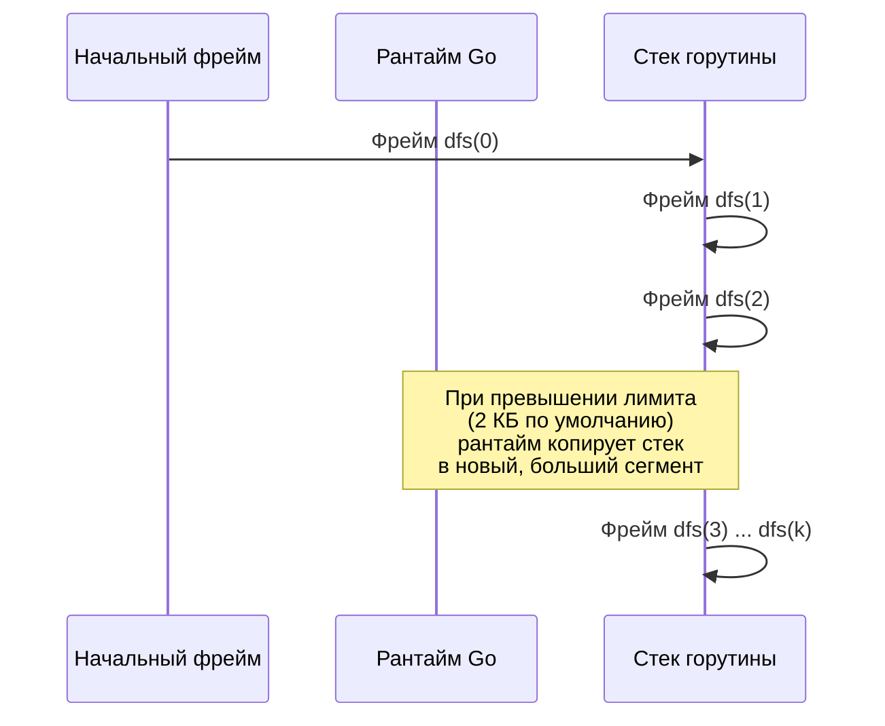

В предыдущей статье [[1. Теория. DFS]] мы определили поиск в глубину как стратегию обхода, которая естественно ложится на рекурсию, но может быть реализована и итеративно с явным стеком. Теперь пришло время заглянуть **под капот** и понять, что именно происходит, когда Go исполняет рекурсивный DFS, как устроен стек горутины, почему он растёт и сколько это стоит. Без этого понимания выбор между рекурсией и итерацией остаётся вкусовщиной, тогда как Senior-разработчик обязан принимать инженерное решение, основанное на данных: глубине обхода, ограничениях по памяти и требуемой производительности.

Эта статья — мост между абстрактным «DFS работает за O(V+E)» и суровой реальностью рантайма Go, где каждый рекурсивный вызов меняет указатель стека, а при пересечении порога — копирует килобайты памяти. Мы разберём механику стека горутины, построим итеративный DFS на слайсе и сравним оба подхода с точки зрения механической симпатии.

### Как работает рекурсивный DFS в рантайме Go

Когда вы вызываете функцию `dfs(node)`, компилятор Go генерирует код, который:

1. **Выделяет фрейм** — блок памяти на стеке текущей горутины для локальных переменных, аргументов и служебных данных (адрес возврата, старый указатель базы).
2. **Передаёт управление** вызываемой функции, смещая указатель стека (stack pointer).
3. При возврате — восстанавливает указатель стека и передаёт управление по адресу возврата.

В рекурсивном DFS каждый вызов создаёт новый фрейм, и стек горутины растёт вглубь.



**Стек горутины** в Go — это сегментированная структура. Начиная с Go 1.4, стек растёт динамически: когда текущий сегмент заполняется, рантайм выделяет новый сегмент в 2 раза большего размера, **копирует** туда весь старый стек, обновляет указатели и освобождает старый сегмент. Начальный размер стека — 2 КБ. При глубокой рекурсии расширения происходят многократно, и каждое копирование занимает время, пропорциональное текущему размеру стека.

> [!info] Под капотом
> За расширение стека отвечает функция `runtime.morestack` (описана в `runtime/stack.go`). Она вызывается прологом каждой функции, если компилятор вставил проверку «достаточно ли места на стеке?». Когда места не хватает, `morestack` выделяет новый сегмент, копирует все фреймы и обновляет указатели. Для глубины 10⁵ это произойдёт порядка 17 раз с суммарным копированием нескольких мегабайт. Сама по себе операция занимает микросекунды, но в высоконагруженных системах может быть заметна.

**Преимущества рекурсивного подхода:**
- **Лаконичность и читаемость.** Код выглядит точно так же, как описание алгоритма: «обойти левое поддерево, обойти правое».
- **Автоматический возврат в предыдущее состояние.** Стек вызовов сам хранит путь и восстанавливает контекст при возврате — не нужно вручную управлять фреймами.
- **Естественная поддержка preorder/inorder/postorder.** Рекурсия позволяет легко разместить код обработки узла до, между или после рекурсивных вызовов.

**Недостатки:**
- **Глубина ограничена размерами стека горутины.** Хотя стек растёт, для глубины 10⁷ он может занять сотни мегабайт и вызвать ошибку `runtime: out of memory`, а копирование стека начнёт занимать ощутимое время.
- **Неконтролируемое потребление памяти.** Вы не можете предсказать, сколько памяти займёт стек при неочевидной структуре графа (например, вырожденное дерево).
- **Сложность с промежуточными состояниями.** Если нужно сохранить состояние обхода (например, итератор), рекурсивный код требует преобразования в итеративный.

### Итеративный DFS: эмуляция стека через слайс

Итеративный подход заменяет стек вызовов на **явный стек**, реализованный на обычном слайсе `[]T`. Это даёт полный контроль над памятью и глубиной обхода.

Рассмотрим обход бинарного дерева в preorder:

```go
func preorderIterative(root *TreeNode) []int {
    if root == nil {
        return nil
    }
    var res []int
    stack := []*TreeNode{root}
    for len(stack) > 0 {
        // Pop
        node := stack[len(stack)-1]
        stack = stack[:len(stack)-1]
        res = append(res, node.Val)
        // Push: сначала правый, чтобы левый обработался раньше (LIFO)
        if node.Right != nil {
            stack = append(stack, node.Right)
        }
        if node.Left != nil {
            stack = append(stack, node.Left)
        }
    }
    return res
}
```

Для графа общего вида необходимо, как и в рекурсивной версии, отслеживать посещённые вершины. Итеративный DFS с полным контролем над порядком использует **стек фреймов**, аналогичный стеку вызовов:

```go
type frame struct {
    v   int
    idx int // индекс следующего соседа для обработки
}

func dfsIterativeGraph(adj [][]int, start int) {
    n := len(adj)
    visited := make([]bool, n)
    stack := []frame{{v: start, idx: 0}}
    visited[start] = true
    // Preorder: обрабатываем start здесь при желании

    for len(stack) > 0 {
        top := &stack[len(stack)-1]
        if top.idx < len(adj[top.v]) {
            neighbor := adj[top.v][top.idx]
            top.idx++
            if !visited[neighbor] {
                visited[neighbor] = true
                // Обработка соседа (preorder)
                stack = append(stack, frame{v: neighbor, idx: 0})
            }
        } else {
            // Все соседи обработаны — postorder
            stack = stack[:len(stack)-1]
        }
    }
}
```

**Ключевые моменты идиоматичного Go:**
- Стек реализован на слайсе. Выделение `make([]frame, 0, maxDepth)` с предварительной вместимостью исключает переаллокации внутри цикла.
- Операция `pop` — срез `stack = stack[:len(stack)-1]` — не копирует данные, а лишь уменьшает длину заголовка слайса.
- Явный фрейм хранит `idx`, чтобы знать, с какого соседа продолжать после возврата из глубины. Это эмулирует счётчик команд в машинном фрейме.
- `visited` помечается **до добавления в стек**, чтобы избежать многократного помещения одной вершины.

> [!info] Под капотом
> Явный стек `[]frame` размещается в куче (если создан через `make`). Однако это одна аллокация на весь обход. В отличие от рекурсивного стека, который растёт и копируется, объём явного стека фиксирован и известен заранее (или ограничен). Никакого копирования стека не происходит, указатели не обновляются. Для графа с глубиной 10⁶ явный стек потребует слайс из 10⁶ фреймов — это ~16 МБ памяти, предсказуемо.

### Сравнение: рекурсия vs итерация с точки зрения Mechanical Sympathy

| Характеристика | Рекурсивный DFS | Итеративный DFS (слайс) |
|---|---|---|
| **Память под стек** | Стек горутины, растёт динамически копированием | Слайс в куче, фиксированного размера |
| **Аллокации** | Нет в куче при нормальном ходе (стек – не куча) | `make` для стека — одна аллокация |
| **Расширение стека** | Копирование всего стека при переполнении (дорого при глубине > 10⁴) | Не происходит (capacity задан) |
| **Управление глубиной** | Неявное, ограничено памятью горутины | Явное, можно задать максимальную глубину |
| **Читаемость** | Высокая для pre/in/postorder | Ниже, особенно при эмуляции всех трёх порядков |
| **Кэш-локальность** | Фреймы в стеке могут фрагментироваться после копирования? Нет, после копирования стек снова непрерывен | Слайс непрерывен в куче, максимум попаданий в L1/L2 |
| **Поддержка отката/backtracking** | Автоматически через возврат | Вручную через индексы |

**Когда выбирать рекурсию:**
- Глубина обхода не превышает ~10⁴ (типичные деревья, лабиринты).
- Важна читаемость и быстрое прототипирование.
- Задача естественно выражается в терминах pre/in/postorder (например, [[5. Path Sum]], [[7. Lowest Common Ancestor]]).

**Когда выбирать итерацию:**
- Глубина может быть очень большой (вырожденное дерево с 10⁵+ узлами, граф-цепочка).
- Требуется жёсткий контроль памяти (встраиваемые системы, ограниченные контейнеры).
- Нужно приостанавливать и возобновлять обход (итератор).

> [!tip] Собеседование
> Вопрос: «Почему вы не использовали рекурсию для обхода графа из миллиона вершин?»
> Ответ: «Рекурсивный DFS опирается на стек горутины, который растёт копированием. При глубине 10⁶ потребуется около 16 МБ только под фреймы, и несколько расширений стека скопируют мегабайты памяти. Итеративный стек на слайсе с предвыделенной вместимостью даёт ту же память, но без дорогих копирований и с предсказуемой производительностью. Для миллиона вершин я предпочту итеративный подход».

### Типичные ошибки и их предотвращение

1. **Забытый `visited` в графе.** Даже если граф ацикличен, но есть несколько путей к вершине, без `visited` вы посетите её экспоненциальное число раз. Правило: `visited[neighbor] = true` перед `push` в стек (или рекурсивным вызовом).

2. **Неправильный порядок push в итеративном preorder.** Чтобы обработать левого потомка раньше правого, в LIFO-стек нужно положить сначала правого, потом левого (как в коде выше). Если перепутать, порядок станет обратным.

3. **Итеративный inorder/postorder без фреймов.** Эмуляция этих порядков требует либо двух стеков, либо фреймов с состоянием, как в примере с графом. Новички часто пытаются обойтись одним стеком и попадают в ловушку бесконечного цикла.

4. **Переполнение стека горутины в рекурсии.** В Go стек растёт, поэтому классического stack overflow не будет, но при глубине > 10⁷ может закончиться память. На собеседовании Senior упомянет, что для глубины > 10⁵ он перейдёт на итеративный подход.

5. **Аллокация стека в цикле.** Если итеративный стек создаётся внутри функции через `make` без capacity, при каждом `append` вне capacity будет переаллокация. Всегда задавайте `make([]frame, 0, expectedDepth)`.

### Заключение

Выбор между рекурсивным и итеративным DFS — это не вопрос вкуса, а инженерный trade-off между читаемостью и контролем над памятью. Рекурсия элегантна и использует встроенный механизм стека горутины, который хорошо работает для умеренных глубин. Итеративный подход на слайсе даёт предсказуемую память, избегает копирования стека и незаменим для глубоких или контролируемых обходов. Senior Go-разработчик осознанно выбирает инструмент, понимая, как каждый из них взаимодействует с рантаймом.

Теперь, вооружившись этим знанием, мы переходим к первой практической задаче кластера — **Number of Islands**, где DFS на матрице станет основным инструментом для подсчёта компонент связности. [[3. Number of Islands]]