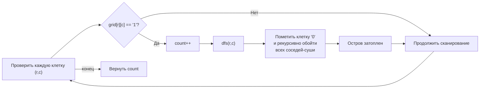

**LeetCode 200. Number of Islands.** Дана двумерная сетка `grid` размером `m x n`, состоящая из символов `'1'` (суша) и `'0'` (вода). Требуется вернуть количество **островов** — групп `'1'`, соединённых друг с другом горизонтально или вертикально (но не диагонально), окружённых водой. Границы сетки также считаются водой.

Это задача-флагман для поиска в глубину (DFS) на сетке — естественное продолжение теории из [[1. Теория. DFS]] и обсуждения стека в [[2. Рекурсия и стек]]. Она проверяет способность кандидата применить DFS не к абстрактному дереву, а к **неявному графу**, где вершины — клетки, а рёбра — соседние `'1'`. Для Senior Go-разработчика задача раскрывает важные нюансы: выбор между рекурсией и итерацией для глубоких островов, модификацию сетки in-place вместо выделения `visited`-матрицы и понимание того, как двумерный слайс взаимодействует с кэш-памятью.

### Формулировка и уточнения

**Условие:** функция `numIslands(grid [][]byte) int`. Сетка `grid` может быть пустой (`m == 0` или `n == 0`). Символы — `'1'` и `'0'`.

**Вопросы интервьюеру (Senior-стиль):**
- *Может ли `grid` быть пустым?* Да, `len(grid) == 0` → возвращаем 0.
- *Можно ли изменять входную сетку?* Обычно да, это позволяет использовать in-place пометку вместо дополнительного `visited`. Если нельзя — потребуется отдельный слайс `visited`.
- *Есть ли ограничения на `m` и `n`?* До 300 (LeetCode), что даёт до 90 000 клеток. Глубина рекурсии может достигать 90 000 в вырожденном случае (змеевидный остров), что для стека горутины в Go приемлемо, но Senior отметит возможность перехода на итеративный подход.
- *Диагонали считаются связью?* Нет, только горизонтальные и вертикальные соседи.

Ответы фиксируют выбор: DFS с пометкой суши в `'0'` (in-place «затопление» острова) как основной метод. Для экстремально глубоких островов — итеративный стек.

### Наивное решение: отдельная матрица `visited` и BFS/DFS без модификации

Можно было бы создать `visited [][]bool` размером `m x n`, запускать DFS для каждой `'1'` и помечать клетки в `visited`. Это корректно, но требует дополнительных O(m*n) памяти. Задача не запрещает менять `grid`, и Senior сразу предложит более экономный вариант — «тонуть» остров, заменяя `'1'` на `'0'`.

### Оптимальное решение: рекурсивный DFS с «затоплением» острова

**Идея.** Проходим по каждой клетке сетки. Если встречаем `'1'`, увеличиваем счётчик островов и запускаем DFS, который **рекурсивно** посещает все связанные с ней клетки суши, немедленно заменяя их на `'0'` (вода). Таким образом, один остров «стирается» с карты, и мы не посетим его повторно при дальнейшем сканировании.

**Инвариант:** после выхода из DFS для стартовой клетки `(r, c)` все клетки острова, содержащего `(r, c)`, превращены в `'0'`. Счётчик островов увеличен на 1. Дальнейшее сканирование сетки не обнаружит уже учтённую сушу.

**Почему рекурсия здесь допустима, но требует комментария:**  
Максимальная глубина рекурсии равна площади одного острова, которая для сетки 300×300 может достигать 90 000. Это вызовет несколько расширений стека горутины (копирование), но не приведёт к переполнению. Стандартный подход на собеседовании — показать рекурсивный DFS, упомянув, что для продакшена с экстремально большими вырожденными островами можно перейти на итеративный DFS или BFS. В Go 1.21+ можно также использовать `GOGC` и ограничения памяти, но в рамках задачи это избыточно.

```go
func numIslands(grid [][]byte) int {
    if len(grid) == 0 {
        return 0
    }
    m, n := len(grid), len(grid[0])
    count := 0

    // Направления: вверх, вниз, влево, вправо
    dirs := [][2]int{{-1, 0}, {1, 0}, {0, -1}, {0, 1}}

    var dfs func(r, c int)
    dfs = func(r, c int) {
        if r < 0 || r >= m || c < 0 || c >= n || grid[r][c] == '0' {
            return
        }
        grid[r][c] = '0' // «топим» сушу
        for _, d := range dirs {
            dfs(r+d[0], c+d[1])
        }
    }

    for r := 0; r < m; r++ {
        for c := 0; c < n; c++ {
            if grid[r][c] == '1' {
                count++
                dfs(r, c)
            }
        }
    }
    return count
}
```

**Go-идиомы и комментарии:**
- `dirs` — статический слайс направлений, переиспользуется во всех вызовах.
- Внутри `dfs` **сначала проверяются границы и вода**, потом клетка топится. Это гарантирует, что каждая `'1'` будет посещена ровно один раз.
- Рекурсивное замыкание захватывает `grid`, `m`, `n`, `dirs` — минимум параметров.
- `grid` — это `[][]byte`, двойной слайс. Доступ `grid[r][c]` — двойное разыменование, но для 90 000 клеток это быстро.



### Итеративная альтернатива: стек на слайсе для защиты от глубокой рекурсии

Как обсуждалось в [[2. Рекурсия и стек]], если форма острова вырождена в длинную змею, глубина рекурсии может стать проблемой. Итеративный DFS с собственным стеком (или BFS с очередью) решает эту проблему полностью. Вот как выглядит итеративный вариант:

```go
func numIslandsIterative(grid [][]byte) int {
    if len(grid) == 0 {
        return 0
    }
    m, n := len(grid), len(grid[0])
    count := 0
    dirs := [][2]int{{-1, 0}, {1, 0}, {0, -1}, {0, 1}}
    stack := make([][2]int, 0, m*n) // предвыделение под максимальный возможный размер

    for r := 0; r < m; r++ {
        for c := 0; c < n; c++ {
            if grid[r][c] == '1' {
                count++
                stack = stack[:0] // переиспользуем стек
                stack = append(stack, [2]int{r, c})
                grid[r][c] = '0'
                for len(stack) > 0 {
                    // Pop
                    cell := stack[len(stack)-1]
                    stack = stack[:len(stack)-1]
                    for _, d := range dirs {
                        nr, nc := cell[0]+d[0], cell[1]+d[1]
                        if nr >= 0 && nr < m && nc >= 0 && nc < n && grid[nr][nc] == '1' {
                            grid[nr][nc] = '0'
                            stack = append(stack, [2]int{nr, nc})
                        }
                    }
                }
            }
        }
    }
    return count
}
```

Этот вариант не использует рекурсию, стек полностью контролируем, и память под него выделена один раз через `make` с capacity, равной максимальному числу клеток (`m*n` гарантированно хватит, но в реальности размер стека примерно равен периметру компоненты). Важно: клетка помечается `'0'` **до** добавления в стек, чтобы избежать дублирования.

> [!info] Под капотом
> Рекурсивный DFS в Go может при глубине 90 000 расширить стек несколько раз. Каждое расширение копирует стек, что на пике может занять несколько миллисекунд. Итеративный подход с явным стеком на слайсе лишён этих копирований: `stack` растёт через `append`, но при достаточной capacity не аллоцирует новых массивов. После обработки острова `stack = stack[:0]` обнуляет длину, сохраняя capacity. Таким образом, все острова используют один и тот же выделенный однажды массив — идеальная механическая симпатия.

### Edge Cases

- **Пустая сетка:** `len(grid) == 0` → `0`. Ранний возврат.
- **Одна клетка `'1'`:** `[["1"]]` → один остров.
- **Все `'0'`:** `count` никогда не инкрементируется, возврат `0`.
- **Все `'1'`:** один большой остров, один вызов DFS.
- **Змеевидный остров (300x300, змейка):** глубина 90000, рекурсия может быть нагружена. Senior упомянет итеративную альтернативу.
- **Сетка с нулевой шириной:** `m > 0`, `n == 0`. Проверка `len(grid[0])` не сработает, но внешний цикл по `c` не выполнится, `count = 0` — корректно.

### Анализ сложности

- **Время:** O(m*n). Каждая клетка посещается не более одного раза: в основном цикле и в DFS. Проверка соседей занимает O(1) на клетку.
- **Память (рекурсивный DFS):** O(m*n) в худшем случае на стек рекурсии (змеевидный остров). Память под `grid` используется in-place, дополнительная память — только стек вызовов.
- **Память (итеративный DFS/BFS):** O(min(m,n, perimeter)) для стека/очереди, но с предвыделением `m*n` — O(m+n) фактически. Без рекурсии — полностью контролируемая память.

### Mechanical Sympathy: двойной слайс и кэш

- `grid` в Go — слайс слайсов: `[]byte` для каждой строки. Каждая строка — непрерывный массив байтов. При переходе к соседней строке (`r+1`) происходит смена указателя, что может вызвать промах в TLB (Translation Lookaside Buffer), но не критично для 300 строк.
- Если бы `grid` был представлен как плоский массив `[]byte` длиной `m*n`, доступ был бы `i := r*n + c`, что обеспечивает идеальную локальность и одну аллокацию, но снижает читаемость. Senior может упомянуть эту оптимизацию для высоконагруженных систем.
- In-place модификация: мы меняем байты в строках, не создавая новых объектов. GC не испытывает давления, так как не порождается мусора внутри DFS (кроме стека вызовов в рекурсивном варианте).
- В итеративном варианте `stack` — это непрерывный массив в куче, дружественный кэшу.

### Альтернативы и trade-off

- **BFS (поиск в ширину).** Использует очередь вместо стека. Очередь также может быть реализована на слайсе (`append` + сдвиг начала), но сдвиг начала (`queue = queue[1:]`) не освобождает память, что может привести к накоплению мусора при долгой работе. Для единоразового обхода это некритично. BFS даёт ту же асимптотику и может быть предпочтительнее при желании избежать глубинной рекурсии.
- **Union Find.** Можно объединять соседние `'1'` в компоненты и в конце подсчитать количество уникальных родительских вершин. Это O(m*n) с обратной функцией Аккермана, но требует дополнительной памяти для `parent` и `rank`. Избыточно для задачи, но демонстрирует знание других подходов.

> [!tip] Собеседование
> Вопрос: «Почему вы выбрали DFS, а не BFS?»
> Ответ: «DFS естественен в рекурсивной формулировке и код лаконичен. Для глубоких островов я готов перейти на итеративный DFS (или BFS) с явным стеком, чтобы избежать копирования стека горутины. BFS также хорош и даёт кратчайший путь, но здесь нам не нужен порядок обхода. Я выбрал DFS за минимализм».

### Итог

Number of Islands — это хрестоматийный пример применения DFS на неявном графе-сетке. В Go задача решается элегантно через рекурсивное «затопление» с нулевыми дополнительными аллокациями, если допустима модификация входа. Senior-разработчик не просто пишет DFS, но и анализирует глубину рекурсии, предлагает итеративную альтернативу и понимает, как его код взаимодействует с кэш-памятью, стеком горутины и сборщиком мусора.

Следующая задача — **Clone Graph** — перенесёт нас от сеток к графам общего вида, где потребуется глубокое копирование структуры с сохранением связей и избеганием циклов. [[4. Clone Graph]]