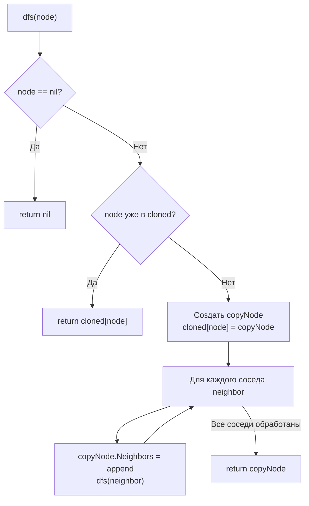

**LeetCode 133. Clone Graph.** Дан указатель на вершину связного неориентированного графа. Каждая вершина имеет уникальное целочисленное значение и список соседей. Требуется создать **глубокую копию** графа — новый граф, структурно идентичный исходному, но не разделяющий с ним узлы. Возвращается указатель на копию стартовой вершины.

После обхода сеток в [[3. Number of Islands]] мы переходим к графам общего вида. Если там DFS применялся для «затопления» неявного графа, то здесь он решает более тонкую задачу: **одновременный обход и конструирование**. Нельзя просто рекурсивно создавать новые узлы, натыкаясь на соседей, — граф содержит циклы, и без запоминания уже созданных копий мы уйдём в бесконечную рекурсию или создадим дубликаты. Для Senior Go-разработчика задача раскрывает важные аспекты: выбор между рекурсивным DFS и итеративным BFS, работа с `map` для отображения оригинал→копия, нюансы указателей и escape analysis, а также предотвращение утечек памяти через early exit.

### Формулировка и уточнения

**Условие:** функция `cloneGraph(node *Node) *Node`. Тип `Node` определён как:
```go
type Node struct {
    Val       int
    Neighbors []*Node
}
```
Граф связный, значения узлов уникальны в пределах графа. Количество узлов до 100.

**Вопросы интервьюеру (Senior-стиль):**
- *Может ли `node` быть `nil`?* Да, тогда возвращаем `nil`.
- *Допустимы ли петли (ребро из узла в самого себя)?* Да, сосед может ссылаться на сам узел.
- *Можно ли модифицировать исходный граф?* Нет, мы его не изменяем.
- *Нужно ли сохранять порядок соседей?* Обычно не регламентируется, но для точности копии желательно сохранить.

Ответы определяют стратегию: используем обход (DFS или BFS) и словарь `visited` (или `cloned`), где ключ — указатель на исходный узел, а значение — указатель на его копию. Это решает проблему циклов: при встрече уже скопированного узла мы просто возвращаем готовую копию, не заходя в рекурсию повторно.

### Наивное решение: рекурсивное копирование без памяти

Простейшая идея — рекурсивно создавать новый узел и для каждого соседа вызывать `cloneGraph`. Без проверки на уже скопированные узлы это мгновенно приводит к бесконечной рекурсии для графа с циклами или к множественному созданию узлов для графа с общими соседями (например, два узла ссылаются на один и тот же третий — он будет скопирован дважды, и граф потеряет структуру).

```go
// Наивный код — ведёт к бесконечной рекурсии при циклах
func cloneGraphNaive(node *Node) *Node {
    if node == nil {
        return nil
    }
    clone := &Node{Val: node.Val}
    for _, neighbor := range node.Neighbors {
        clone.Neighbors = append(clone.Neighbors, cloneGraphNaive(neighbor))
    }
    return clone
}
```

Узкое место очевидно: нужна «память» о том, что узел уже скопирован. Это классический случай применения `map` как `visited`-множества и кэша копий одновременно.

### Оптимальное решение: DFS с map

**Идея.** Запускаем рекурсивный DFS от стартового узла. Поддерживаем `cloned := map[*Node]*Node{}`, где ключ — оригинальный узел, значение — его копия. При заходе в узел:
1. Если `node == nil`, возвращаем `nil`.
2. Если узел уже есть в `cloned`, сразу возвращаем его копию (это предотвращает бесконечную рекурсию и сохраняет общие ссылки).
3. Иначе создаём новый узел-копию, сохраняем в `cloned`, и для каждого соседа рекурсивно получаем его копию (через тот же DFS) и добавляем в список соседей копии.

**Инвариант:** после завершения DFS для узла `v` все узлы, достижимые из `v`, скопированы и помещены в `cloned`. Сам `v` также скопирован. При повторном обращении к `v` (через другой путь) `cloned` немедленно возвращает готовую копию.

```go
func cloneGraph(node *Node) *Node {
    if node == nil {
        return nil
    }
    cloned := make(map[*Node]*Node)
    var dfs func(*Node) *Node
    dfs = func(n *Node) *Node {
        if n == nil {
            return nil
        }
        // Если узел уже скопирован, возвращаем копию
        if clone, ok := cloned[n]; ok {
            return clone
        }
        // Создаём копию и запоминаем
        copyNode := &Node{Val: n.Val}
        cloned[n] = copyNode
        // Рекурсивно копируем соседей
        for _, neighbor := range n.Neighbors {
            copyNode.Neighbors = append(copyNode.Neighbors, dfs(neighbor))
        }
        return copyNode
    }
    return dfs(node)
}
```

**Go-идиомы и комментарии:**
- `cloned := make(map[*Node]*Node)` — одна аллокация под map. Поскольку число узлов ≤ 100, можно не предвыделять capacity, но Senior может добавить `make(map[*Node]*Node, expectedSize)` при желании.
- Проверка `if clone, ok := cloned[n]; ok` — классический comma-ok паттерн.
- Замыкание `dfs` захватывает `cloned`, что упрощает сигнатуру.
- `copyNode.Neighbors = append(...)` — строит слайс соседей. Поскольку мы добавляем результаты DFS, слайс формируется корректно.
- Отсутствие явного `visited` для предотвращения зацикливания — его роль выполняет сам `cloned`: узел добавляется в map **до** обработки соседей, поэтому при попытке соседа сослаться обратно мы сразу возвращаем уже созданную копию, не уходя в бесконечную рекурсию.



### Альтернативное решение: BFS с map

Аналогичный результат даёт поиск в ширину. Вместо рекурсии используется очередь (слайс). BFS также помещает узел в `cloned` при первом обнаружении и обрабатывает соседей, копируя их. Преимущество BFS — отсутствие риска глубокой рекурсии (хотя при 100 узлах это не проблема), недостаток — чуть больше кода для управления очередью.

```go
func cloneGraphBFS(node *Node) *Node {
    if node == nil {
        return nil
    }
    cloned := make(map[*Node]*Node)
    cloned[node] = &Node{Val: node.Val}
    queue := []*Node{node}
    for len(queue) > 0 {
        n := queue[0]
        queue = queue[1:]
        for _, neighbor := range n.Neighbors {
            if _, ok := cloned[neighbor]; !ok {
                cloned[neighbor] = &Node{Val: neighbor.Val}
                queue = append(queue, neighbor)
            }
            cloned[n].Neighbors = append(cloned[n].Neighbors, cloned[neighbor])
        }
    }
    return cloned[node]
}
```

На собеседовании Senior продемонстрирует оба подхода и объяснит выбор: DFS проще и естественен для рекурсивного обхода графа, BFS гарантирует отсутствие рекурсии. При 100 узлах разница только в стиле.

### Edge Cases

- **Пустой граф:** `node == nil` → возвращаем `nil`.
- **Один узел без соседей:** создаётся копия узла с пустым слайсом `Neighbors`. Корректно.
- **Один узел с петлёй:** `node.Neighbors = [node]`. При обработке соседей мы вызываем `dfs(node)`, но он уже в `cloned`, поэтому сразу возвращается копия, и `Neighbors` копии будет содержать ссылку на саму копию. Корректно.
- **Два узла, ссылающихся друг на друга:** классический цикл. При копировании первого узла мы рекурсивно заходим во второй, а второй видит первого уже в `cloned` и добавляет ссылку на его копию. Всё согласованно.

### Анализ сложности

- **Время:** O(V + E), где V — количество узлов, E — количество рёбер. Каждый узел посещается один раз (проверка в map), каждое ребро просматривается один раз при копировании соседей.
- **Память:** O(V) для `cloned` map (хранение копий всех узлов) и стека рекурсии (глубина до V) или очереди BFS. Плюс память под сам скопированный граф (выходные данные).

### Mechanical Sympathy: map указателей и escape analysis

- **`map[*Node]*Node`:** ключом является указатель на оригинальный узел. Хеширование указателя в Go — это прямое использование битов адреса, быстрая операция. Значение — указатель на копию. Каждая вставка в map добавляет запись в бакет, что вызывает аллокацию внутри map. При V ≤ 100 это пренебрежимо.
- **Указатели и GC:** копии узлов создаются в куче (потому что они возвращаются из функции). Исходный граф также в куче. Сборщик мусора будет отслеживать оба графа. Никаких проблем с циклическими ссылками — Go GC обрабатывает циклы корректно.
- **Отсутствие утечек:** `cloned` map живёт только во время работы `cloneGraph`. После возврата он становится недостижимым и очищается GC. Копия графа ссылается сама на себя через указатели, что нормально.
- **Кэш-локальность:** при DFS мы идём вглубь по соседям; порядок обхода непредсказуем, но для малых графов всё в L1/L2. BFS с очередью может дать чуть лучшую локальность при обходе «волной».

> [!info] Под капотом
> В рекурсивном DFS каждое замыкание `dfs` — это функция, которая хранится в переменной. Вызов `dfs(neighbor)` происходит через указатель на функцию, что немного медленнее прямого вызова, но для 100 узлов незаметно. Escape analysis: переменная `copyNode` «убегает» в `cloned` map и в результат, поэтому размещается в куче.

### Альтернативы и trade-off

- **BFS** — итеративен, не использует стек вызовов, более предсказуем по памяти стека. Немного больше кода для очереди.
- **Итеративный DFS с явным стеком** — компромисс между рекурсией и BFS, но здесь избыточен.
- **Глубокое копирование через сериализацию** — можно сериализовать в `[]byte` и восстановить, но это сложнее и медленнее.

> [!tip] Собеседование
> Вопрос: «Почему вы добавляете узел в `cloned` до обработки соседей, а не после?»
> Ответ: «Это принципиально для предотвращения бесконечной рекурсии. Если узел A ссылается на B, а B на A, и мы добавим A в map только после обработки соседей, то при обработке соседа B мы снова вызовем DFS для A, который ещё не в map, и уйдём в бесконечную рекурсию. Добавление до обработки гарантирует, что при любых циклических ссылках мы немедленно возвращаем уже созданную копию».

### Итог

Clone Graph — это элегантная задача на применение DFS (или BFS) для глубокого копирования графа с циклами. Ключевой инсайт — использование `map` для отображения оригинал→копия, что одновременно решает проблему циклов и общих ссылок. В Go решение пишется лаконично, используя замыкания и comma-ok, и демонстрирует понимание указателей, аллокаций и работы GC.

Следующая задача — **Path Sum** — перенесёт нас от копирования графов к поиску пути в бинарном дереве с заданной суммой, где DFS проявит себя в классическом preorder-обходе с накоплением состояния. [[5. Path Sum]]