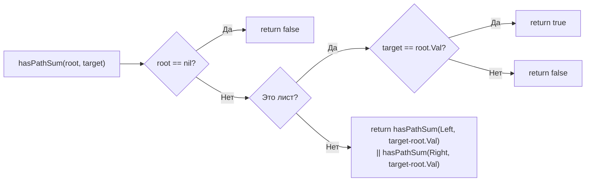

**LeetCode 112. Path Sum.** Дано бинарное дерево с целочисленными значениями в узлах и целевое число `targetSum`. Требуется определить, существует ли в дереве путь от корня до **листового** узла такой, что сумма значений узлов на этом пути равна `targetSum`. Листовым считается узел, у которого оба потомка отсутствуют.

После глубокого копирования графов в [[4. Clone Graph]] мы возвращаемся к деревьям, но теперь DFS используется не для конструирования, а для проверки **существования** пути с накоплением состояния (текущей суммы). Эта задача — идеальный тренажёр для preorder-обхода с передачей изменяемого параметра вниз по рекурсии. Для Senior Go-разработчика она раскрывает нюансы: как избежать аллокаций при передаче накопленной суммы, чем рекурсивный DFS выигрывает у итеративного в читаемости и как досрочный выход из рекурсии экономит драгоценные такты.

### Формулировка и уточнения

**Условие:** функция `hasPathSum(root *TreeNode, targetSum int) bool`. Тип `TreeNode` — стандартный узел бинарного дерева с полями `Val int`, `Left *TreeNode`, `Right *TreeNode`.

**Вопросы интервьюеру (Senior-стиль):**
- *Может ли `root` быть `nil`?* Да, пустое дерево → возвращаем `false`.
- *Могут ли значения узлов быть отрицательными?* Да, это важно: `targetSum` может быть достигнут даже при превышении промежуточной суммы, и простое отсечение «сумма больше target» недопустимо.
- *Что считается листом?* Узел, у которого оба потомка `nil`.
- *Гарантируется ли, что сумма помещается в `int`?* Да, значения узлов и `targetSum` в пределах `int`, переполнение не является проблемой на 64-битных платформах.

Ответы фиксируют выбор: рекурсивный DFS с передачей **оставшейся** суммы (`targetSum - node.Val`) вниз по дереву. Это позволяет избежать передачи накопленной суммы и упрощает проверку.

### Наивное решение: обход всех путей с хранением сумм

Можно было бы обойти всё дерево, собирая суммы путей в слайс, и затем проверить наличие `targetSum`. Это требует O(N) памяти для всех путей и O(N) времени, но не останавливается при первом найденном пути. Senior сразу предложит оптимизацию с досрочным выходом.

### Оптимальное решение: рекурсивный DFS с уменьшением целевой суммы

**Идея.** На каждом шагу мы вычитаем значение текущего узла из `targetSum`. Если мы достигли листа и оставшаяся сумма стала равна нулю — путь найден. Если узел пуст (`nil`) — возвращаем `false`. Рекурсивно проверяем левое и правое поддерево, передавая уменьшенную сумму. Если хотя бы один из рекурсивных вызовов вернул `true`, результат — `true`. Это естественный preorder-обход: сначала обрабатываем узел, затем — потомков.

**Инвариант:** при входе в рекурсивный вызов для узла `node` параметр `remain` равен `targetSum` минус сумма значений всех узлов от корня до родителя `node`. Для листа проверка `remain == node.Val` (или `remain == 0` в альтернативной формулировке) гарантирует корректность.

**Почему не храним сумму?** Передача `targetSum - node.Val` вместо `sum + node.Val` исключает необходимость хранить и сравнивать накопленную сумму — мы работаем с одним целым числом. Это уменьшает количество параметров в замыкании и делает проверку на листе элементарной.

```go
func hasPathSum(root *TreeNode, targetSum int) bool {
    if root == nil {
        return false
    }
    // Если это лист, проверяем, равна ли оставшаяся сумма значению узла
    if root.Left == nil && root.Right == nil {
        return targetSum == root.Val
    }
    // Рекурсивно проверяем поддеревья с уменьшенной целевой суммой
    return hasPathSum(root.Left, targetSum-root.Val) ||
           hasPathSum(root.Right, targetSum-root.Val)
}
```

**Go-идиомы и комментарии:**
- Функция не использует замыканий — чистая рекурсия, предельно ясная.
- Проверка `root == nil` обрабатывает пустой узел.
- Досрочный возврат через `||` позволяет не вычислять правое поддерево, если левое уже нашло путь (short-circuit evaluation). Это экономит обход.
- Нет дополнительных структур данных, никаких слайсов или map.



### Альтернатива: итеративный DFS с явным стеком

Как обсуждалось в [[2. Рекурсия и стек]], глубокие деревья могут потребовать итеративного подхода. Для Path Sum можно использовать явный стек пар `(node, remain)`:

```go
func hasPathSumIterative(root *TreeNode, targetSum int) bool {
    if root == nil {
        return false
    }
    stack := []struct {
        node   *TreeNode
        remain int
    }{{root, targetSum}}
    for len(stack) > 0 {
        // Pop
        top := stack[len(stack)-1]
        stack = stack[:len(stack)-1]
        if top.node.Left == nil && top.node.Right == nil {
            if top.remain == top.node.Val {
                return true
            }
            continue
        }
        if top.node.Left != nil {
            stack = append(stack, struct {
                node   *TreeNode
                remain int
            }{top.node.Left, top.remain - top.node.Val})
        }
        if top.node.Right != nil {
            stack = append(stack, struct {
                node   *TreeNode
                remain int
            }{top.node.Right, top.remain - top.node.Val})
        }
    }
    return false
}
```

Это полностью итеративно, не использует рекурсию, память O(высота дерева) на стеке. Для сбалансированного дерева с 10⁵ узлов это предпочтительнее, но на собеседовании рекурсивный вариант ожидается как основной.

### Edge Cases

- **Пустое дерево:** `root == nil` → `false`.
- **Один узел, равный targetSum:** `true`.
- **Один узел, не равный targetSum:** `false` (проверка на лист гарантирует, что мы не вернём `true`, если узел не лист).
- **Все значения отрицательные:** работает без изменений, отсечение по превышению суммы не используется.
- **Длинный путь, сумма равна targetSum:** алгоритм находит, глубина рекурсии равна высоте дерева. Для сбалансированного дерева с 10⁵ узлов глубина ~17, безопасно.
- **Дерево-змейка (вырожденное в цепочку):** глубина 10⁵, в Go стек горутины справится, но Senior упомянет возможность итеративного подхода для production-окружения.

### Анализ сложности

- **Время:** O(N) в худшем случае, если путь не найден или найден в самом конце обхода. При обнаружении пути досрочно — меньше.
- **Память:** O(H) для стека рекурсии, где H — высота дерева. Для сбалансированного дерева O(log N), для вырожденного O(N). Дополнительная память — только стек вызовов.

### Mechanical Sympathy: рекурсия, аллокации и short-circuit

- **Рекурсия и стек горутины.** Для дерева высотой до 10⁴ проблем нет. Для вырожденного дерева глубиной 10⁵ рантайм Go несколько раз скопирует стек, что займёт микросекунды. Это допустимо для задачи, но Senior упомянет, что в production-коде с потенциально вырожденными деревьями может быть выбран итеративный вариант.
- **Отсутствие аллокаций в куче.** Функция `hasPathSum` не создаёт новых объектов (слайсов, map). Только стековые фреймы. Escape analysis оставляет всё на стеке. GC не испытывает давления.
- **Short-circuit evaluation.** `left || right` — если левое поддерево вернуло `true`, правое не вычисляется. Это не только экономит время, но и уменьшает глубину рекурсии и количество стековых фреймов.
- **Передача `targetSum - root.Val`** — это копирование целого числа (8 байт). Дешевле, чем передача указателя или слайса.

> [!info] Под капотом
> В рекурсивном вызове `hasPathSum(root.Left, targetSum-root.Val)` аргументы передаются через стек (или регистры, в зависимости от оптимизаций компилятора). Никаких аллокаций. Вычитание выполняется непосредственно перед вызовом. Для очень глубоких деревьев накладные расходы на рекурсию могут превысить итеративный вариант с явным стеком, но для типичных сбалансированных деревьев рекурсия быстрее, потому что не тратит время на управление слайсом.

### Альтернативы и trade-off

- **BFS с очередью.** Можно обходить дерево в ширину, храня в очереди пары `(узел, оставшаяся сумма)`. BFS найдёт путь на минимальной глубине, если такой существует, но потребует O(W) памяти, где W — максимальная ширина дерева. Для сбалансированного дерева W ~ N/2, что значительно больше O(H) для DFS.
- **Итеративный DFS.** Как показано выше, полностью контролирует память на стеке, но менее читаем.
- **Передача накопленной суммы.** Можно хранить текущую сумму и сравнивать с `targetSum` на листе. Это эквивалентно, но требует дополнительного параметра. Подход с уменьшением `targetSum` элегантнее, так как использует только один изменяющийся параметр.

> [!tip] Собеседование
> Вопрос: «Что если дерево не помещается в память, и мы не можем использовать рекурсию?»
> Ответ: «Я бы использовал итеративный DFS с явным стеком, который хранит пары (узел, оставшаяся сумма). Стек размещается в куче контролируемого размера. Если и это слишком много, можно рассмотреть внешний обход с сохранением состояния на диске, но это уже выходит за рамки алгоритмического собеседования».

### Итог

Path Sum — это классика DFS на дереве с накоплением состояния. В Go задача решается минималистичной рекурсией с уменьшением целевой суммы, без единой аллокации в куче. Senior-разработчик понимает, как short-circuit evaluation и отсутствие отсечений по сумме (из-за возможных отрицательных значений) влияют на алгоритм, и может предложить итеративную альтернативу для экстремальных глубин.

Следующая задача — **Binary Tree Maximum Path Sum** — резко повышает ставки: теперь недостаточно найти любой путь, нужно найти путь с максимальной суммой, который может проходить через любой узел и не обязан заканчиваться в корне или листе. Это Hard-задача, где DFS используется для пост-обработки и комбинации результатов из левого и правого поддеревьев. [[6. Binary Tree Maximum Path Sum]]