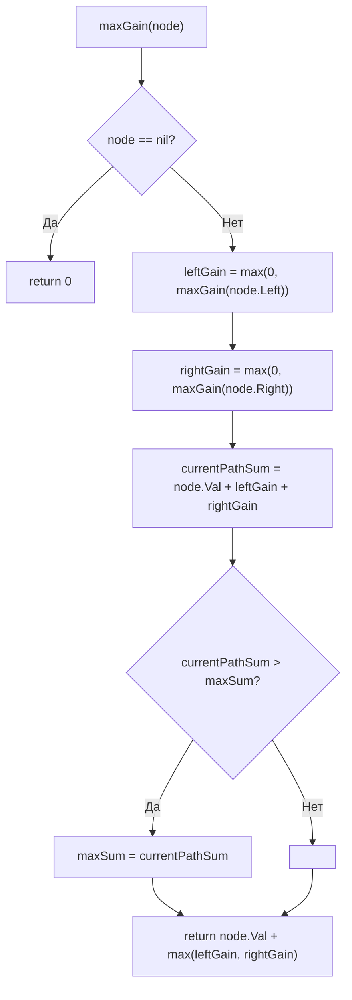

**LeetCode 124. Binary Tree Maximum Path Sum.** Дано бинарное дерево с целыми значениями в узлах. **Путь** определяется как последовательность из одного или нескольких узлов, в которой каждая пара соседних узлов соединена ребром, а каждый узел встречается не более одного раза (т.е. путь не разветвляется). Сумма пути — сумма значений входящих в него узлов. Требуется найти **максимальную сумму пути** среди всех возможных путей в дереве. Путь может начинаться и заканчиваться в любых узлах, не обязательно проходить через корень.

Это первая задача уровня Hard в кластере DFS, и она кардинально отличается от предыдущих: вместо простого поиска ([[5. Path Sum]]) или обхода с построением ([[4. Clone Graph]]) здесь требуется **комбинировать результаты из левого и правого поддеревьев** для вычисления глобального оптимума. Паттерн «postorder DFS + глобальный максимум» — один из самых мощных в арсенале Senior Go-разработчика: он учит разделять «вклад вверх» и «локальный ответ», а также элегантно обрабатывать отрицательные значения через обрезание ветвей. С точки зрения механической симпатии задача демонстрирует, как рекурсивный обход без аллокаций может за O(N) решить проблему, кажущуюся квадратичной.

### Формулировка и уточнения

**Условие:** функция `maxPathSum(root *TreeNode) int`. Тип `TreeNode` стандартный: `Val int`, `Left *TreeNode`, `Right *TreeNode`.

**Вопросы интервьюеру (Senior-стиль):**
- *Может ли `root` быть `nil`?* По условию LeetCode дерево не пустое, но проверка не помешает: если `nil`, вернуть 0 или `math.MinInt`? Лучше уточнить; обычно считаем, что узлы есть.
- *Могут ли значения быть отрицательными?* Да. Это ключевая сложность: нельзя отбрасывать отрицательные листья бездумно, но и включать убыточные ветви в глобальный путь невыгодно.
- *Что считается путём?* Хотя бы один узел (не обязательно лист). Путь не может раздваиваться: в каждом узле он может продолжаться не более чем в одну сторону.
- *Может ли путь состоять из одного узла?* Да.

Эти ответы фиксируют стратегию: нам нужно для каждого узла вычислить **максимальную сумму пути, проходящего через этот узел и обе его ветви** (это кандидат на глобальный максимум), и **максимальную сумму пути, который можно продолжить вверх** (только одна ветвь, чтобы родитель мог её использовать). Отрицательные ветви мы можем обрезать, считая их вклад равным нулю.

### Наивное решение: перебор всех пар узлов

Можно было бы для каждой пары узлов искать путь между ними (через LCA) и вычислять сумму. Сложность O(N²) или O(N³) при обходе — неприемлемо для N до 3×10⁴. Узкое место — независимое рассмотрение пар, тогда как дерево имеет рекурсивную структуру, которую можно использовать.

### Оптимальное решение: postorder DFS с глобальным максимумом

**Идея.** Выполним рекурсивный обход дерева снизу вверх (postorder). Для каждого узла `node` определим функцию `maxGain(node)`, возвращающую **максимальную сумму пути, который начинается в `node` и спускается ровно в одно поддерево** (либо в левое, либо в правое, либо никуда — только сам узел). Этот путь может быть продолжен родителем.

Параллельно с этим на каждом узле мы вычисляем **сумму пути, проходящего через `node` и использующего обе ветви**: `currentSum = node.Val + maxGain(node.Left) + maxGain(node.Right)`. Эта сумма не может быть продолжена вверх (так как путь разветвляется), но является кандидатом на глобальный максимум. Обновляем глобальную переменную `maxSum`.

Чтобы обрабатывать отрицательные ветви, мы **обрезаем** убыточные поддеревья: если `maxGain` для потомка отрицателен, мы не включаем его, считая вклад равным 0. Это эквивалентно тому, что путь просто не идёт в эту сторону.

**Инвариант:**
- `maxGain(node)` возвращает максимальную сумму пути, который стартует в `node`, идёт вниз по одной ветви и может быть пустым (0), если все продолжения убыточны? Нет, путь должен содержать хотя бы один узел, но для обрезания ветвей мы берём `max(0, maxGain(child))`. Однако если узел сам по себе отрицателен, `maxGain` всё равно вернёт `node.Val + max(0, gainLeft, gainRight)`, и этот вклад может быть отрицательным. Тогда родитель, обрезая ветвь, возьмёт `max(0, maxGain(node))`, и эта ветвь не попадёт в глобальный путь. Глобальный максимум обновляется на каждом узле как `node.Val + max(0, gainLeft) + max(0, gainRight)`. Таким образом, узел с отрицательным значением всё равно может стать глобальным максимумом, если через него проходят только нулевые ветви — сумма будет равна `node.Val`, что может быть больше `math.MinInt`.

```go
func maxPathSum(root *TreeNode) int {
    if root == nil {
        return 0
    }
    maxSum := math.MinInt // глобальный максимум, инициализирован минимально возможным значением

    var maxGain func(*TreeNode) int
    maxGain = func(node *TreeNode) int {
        if node == nil {
            return 0
        }
        // Рекурсивно вычисляем вклад левого и правого поддеревьев,
        // обрезая отрицательные ветви (не включаем их в путь)
        leftGain := max(0, maxGain(node.Left))
        rightGain := max(0, maxGain(node.Right))

        // Путь, проходящий через node и обе ветви, не может быть продолжен вверх
        currentPathSum := node.Val + leftGain + rightGain
        if currentPathSum > maxSum {
            maxSum = currentPathSum
        }

        // Для родителя мы можем продолжить только одну ветвь (лучшую)
        return node.Val + max(leftGain, rightGain)
    }

    maxGain(root)
    return maxSum
}

func max(a, b int) int {
    if a > b {
        return a
    }
    return b
}
```

**Go-идиомы и комментарии:**
- `maxSum` инициализирован `math.MinInt`, потому что значения могут быть отрицательными. Простая инициализация нулём привела бы к неверному ответу для дерева из отрицательных узлов.
- Вспомогательная функция `max` — до Go 1.21 встроенной не было (с 1.21 есть `max` в builtin, но для совместимости на собеседовании часто пишут свою).
- `maxGain` — замыкание, захватывающее `maxSum` по указателю (через внешнюю переменную). Это предпочтительнее глобальной переменной.
- Рекурсивный postorder: сначала обрабатываем потомков, затем узел.
- `max(0, ...)` — ключевой трюк, реализующий обрезание убыточных поддеревьев. Без него отрицательные ветви тянули бы глобальный максимум вниз.



### Почему это работает: инвариант и обоснование обрезания

Функция `maxGain(node)` возвращает максимальную сумму пути, который начинается в `node` и идёт **строго вниз** по одной ветви. Почему можно обрезать отрицательные `leftGain`/`rightGain`?
- Если `maxGain(child)` отрицателен, это означает, что любой путь, начинающийся в `child`, имеет сумму ≤ `child.Val` < 0. Продолжение из `node` в `child` только ухудшит сумму пути, поэтому мы можем просто не ходить в эту ветвь, что эквивалентно взятию `max(0, gain)`. Сам `child` при этом не теряется: его собственный вклад как кандидата на глобальный максимум уже учтён, когда мы обрабатывали `child` (там `currentPathSum` был вычислен и сравнён с `maxSum`).

Глобальный максимум обновляется для каждого узла как сумма `node.Val + leftGain + rightGain`. Это покрывает все возможные конфигурации путей, потому что любой путь имеет «вершину» — самый верхний узел, в котором он разветвляется (или не разветвляется). Для этой вершины `leftGain` и `rightGain` дают максимальные суммы путей, уходящих в левое и правое поддеревья (или 0, если ветвь не используется). Таким образом, все пути перебираются.

### Edge Cases

- **Пустое дерево:** функция может вернуть 0 или `math.MinInt`. В условии LeetCode дерево не пусто, но Senior добавит проверку. Если `root == nil`, возвращаем 0 (или уточним у интервьюера).
- **Один узел:** `leftGain = 0`, `rightGain = 0`, `currentPathSum = node.Val`, `maxSum` обновится, возвращаемое значение `node.Val`. Всё корректно.
- **Все узлы отрицательные:** например, `[-3]`. `maxSum` изначально `math.MinInt`. Для узла `-3`: `leftGain=0`, `rightGain=0`, `currentPathSum=-3`, `maxSum` становится `-3`. Возвращается `-3`. Результат `-3` — верно (путь из одного узла). Без `math.MinInt` и с инициализацией 0 ответ был бы 0, что неверно.
- **Дерево с глубокой отрицательной ветвью:** например, `[1, -100, 2]`. Для узла `-100`: `leftGain=0`, `rightGain=0`, `currentPathSum=-100`, `maxSum` пока `-100` или `math.MinInt`. Для узла `1`: `leftGain = max(0, -100) = 0`, `rightGain = max(0, 2) = 2`, `currentPathSum = 1+0+2=3`, `maxSum` становится 3. Ветвь `-100` обрезана, глобальный максимум — путь `2-1` или `1-2`.

### Анализ сложности

- **Время:** O(N). Каждый узел посещается ровно один раз за счёт postorder обхода.
- **Память:** O(H) для стека рекурсии, где H — высота дерева. Для сбалансированного — O(log N), для вырожденного — O(N). Дополнительных структур данных нет.

### Mechanical Sympathy: рекурсия, регистры и обрезание

- **Рекурсия на стеке горутины.** Здесь глубина рекурсии равна высоте дерева. Для сбалансированного дерева (H ~ 17 для N=10⁵) — идеально. Для вырожденного (H=10⁵) — стек горутины расширится несколько раз, но суммарные затраты на копирование стека составят микросекунды. В production-коде Senior может переписать на итеративный postorder с явным стеком, но в рамках собеседования рекурсивный вариант является эталонным.
- **Отсутствие аллокаций в куче.** `maxGain` не создаёт слайсов и map — только целые числа на стеке. GC не испытывает давления.
- **Обрезание `max(0, ...)`** — это не только алгоритмический трюк, но и защита от копирования лишних фреймов? Нет, но он уменьшает количество значимых операций. С точки зрения CPU, инструкция `max` (CMP + CMOV) выполняется за 1–2 такта и не содержит ветвлений (после оптимизации компилятором), что благоприятно для конвейера.
- **Глобальная переменная через замыкание.** `maxSum` захвачена из внешней функции; компилятор Go размещает её на стеке и передаёт по указателю в замыкание. Обращение к ней — быстрое (через указатель, но в пределах стека).

> [!info] Под капотом
> Функция `maxGain` возвращает `int`. Escape analysis: `node` — указатель на узел, уже находящийся в куче (так как дерево аллоцировано там). Локальные переменные `leftGain`, `rightGain`, `currentPathSum` — на стеке. Рекурсивные вызовы `maxGain(node.Left)` — обычные вызовы функций, фреймы на стеке. Никаких неожиданных аллокаций.

### Альтернативы и trade-off

- **Итеративный postorder.** Потребовал бы двух стеков или одного с флагами посещения. Сложнее код, но исключает рекурсию. Применим для экстремально глубоких деревьев.
- **BFS?** Неприменим, так как задача требует bottom-up комбинации результатов.
- **Глобальная переменная вместо замыкания.** Можно использовать поле структуры или глобальную переменную пакета, но замыкание чище и безопаснее в конкурентной среде (при возможных параллельных вызовах).

> [!tip] Собеседование
> Вопрос: «Почему вы инициализировали `maxSum` как `math.MinInt`, а не 0?»
> Ответ: «Потому что все узлы могут иметь отрицательные значения. В этом случае максимальный путь — это наименее отрицательный узел, например, -3. Если бы я инициализировал `maxSum` нулём, то при дереве `[-3]` функция вернула бы 0, что неверно — путь обязан содержать хотя бы один узел. `math.MinInt` гарантирует, что любой реальный путь будет больше начального значения».

### Итог

Binary Tree Maximum Path Sum — это демонстрация силы postorder DFS в сочетании с глобальным максимумом. Задача учит разделять «вклад наверх» (maxGain) и «локальный ответ» (currentPathSum), а также элегантно обрабатывать отрицательные ветви через `max(0, gain)`. В Go решение реализуется рекурсивным замыканием без единой аллокации в куче, с предельно ясной логикой и оптимальной сложностью O(N). Senior-разработчик не только выдаёт код, но и объясняет инвариант, обосновывает инициализацию `math.MinInt` и обсуждает влияние рекурсии на стек горутины.

Следующая задача — **Lowest Common Ancestor** — перенесёт нас в другую плоскость: теперь DFS будет использоваться для поиска общего предка двух заданных узлов, а рекурсивный postorder вновь окажется ключом к элегантному решению. [[7. Lowest Common Ancestor]]