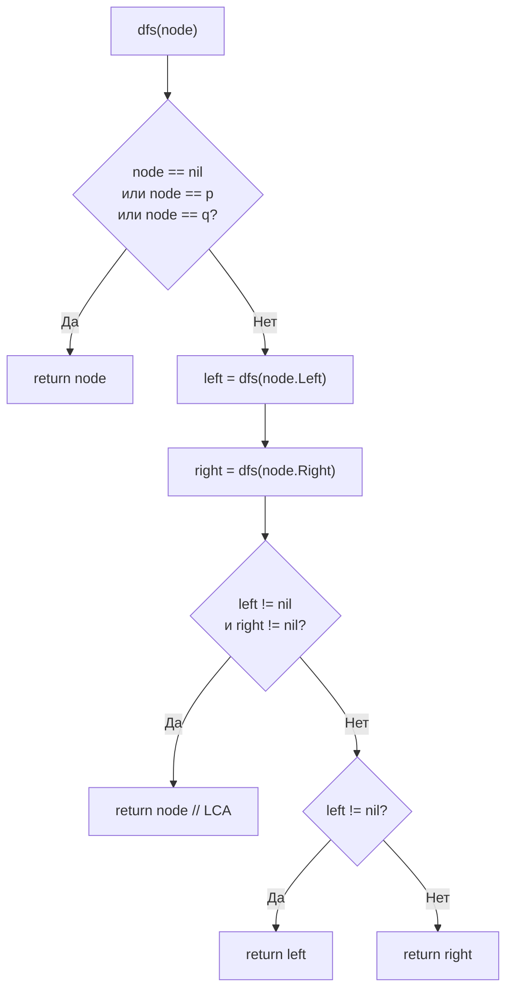

**LeetCode 236. Lowest Common Ancestor of a Binary Tree.** Дано бинарное дерево и два узла `p` и `q`, гарантированно присутствующие в дереве. Требуется найти их **наименьшего общего предка (LCA)** — самый глубокий узел, который является предком одновременно для `p` и для `q`. Узел может быть предком самого себя (т.е. если `p` является предком `q`, то `p` и будет LCA).

После задачи о максимальном пути ([[6. Binary Tree Maximum Path Sum]]), где postorder DFS использовался для комбинации результатов снизу вверх, мы снова обращаемся к этой же стратегии обхода, но с иной целью: теперь снизу вверх передаётся не числовое значение, а **факт обнаружения** искомых узлов. Для Senior Go-разработчика задача является каноническим примером того, как один рекурсивный проход без дополнительной памяти заменяет наивные решения с хранением путей или мап родителей, а понимание «нулевого значения» указателя (`nil`) и его роли в сигнализации становится ключом к лаконичному коду.

### Формулировка и уточнения

**Условие:** функция `lowestCommonAncestor(root, p, q *TreeNode) *TreeNode`. Тип `TreeNode` стандартный. Все значения узлов уникальны, `p != q`, оба узла есть в дереве.

**Вопросы интервьюеру (Senior-стиль):**
- *Может ли `root` быть `nil`?* Если `root == nil`, то по условию `p` и `q` не существуют, но формально можно вернуть `nil`.
- *Может ли `p` или `q` совпадать с `root`?* Да, тогда `root` — ответ.
- *Могут ли значения быть любыми?* Значения не влияют на алгоритм, используются только ссылки.
- *Можно ли модифицировать дерево?* Нет, только читаем.

Ответы фиксируют стратегию: рекурсивный обход снизу вверх, который возвращает `p`, `q` или их общего предка, используя `nil` как сигнал «ничего не найдено».

### Наивное решение: хранение путей

Можно найти путь от корня до `p` и путь до `q`, сохранив их в слайсах, а затем найти последний общий узел в этих путях. Это требует O(N) времени и O(H) памяти на каждый путь, а также два полных обхода. Senior сразу предложит однопроходное рекурсивное решение, которое не хранит пути явно.

```go
// Наивный код — два поиска пути с сохранением слайсов, затем сравнение.
```

### Оптимальное решение: рекурсивный postorder DFS

**Идея.** Рекурсивная функция `dfs(node)` возвращает:
- `nil`, если в поддереве `node` нет ни `p`, ни `q`;
- `p`, если в поддереве найден `p`;
- `q`, если найден `q`;
- сам `node`, если в его поддереве обнаружены оба узла, и этот узел является их LCA (то есть `p` и `q` находятся в разных поддеревьях, либо один из них — сам `node`).

Обход снизу вверх (postorder) гарантирует, что первый узел, получивший из левого и правого поддеревьев ненулевые результаты (один — `p`, другой — `q`), является искомым наименьшим предком. Если же одно из поддеревьев уже вернуло общего предка, он просто пробрасывается наверх без изменений.

**Инвариант:**
Рекурсивный вызов `dfs(node)` возвращает не-`nil` тогда и только тогда, когда поддерево `node` содержит хотя бы один из искомых узлов (`p` или `q`). Если поддерево содержит оба узла, возвращается их LCA (который может быть самим `node` или находиться глубже).

```go
func lowestCommonAncestor(root, p, q *TreeNode) *TreeNode {
    if root == nil {
        return nil
    }
    // Если нашли один из искомых узлов, возвращаем его (нет смысла идти глубже)
    if root == p || root == q {
        return root
    }

    left := lowestCommonAncestor(root.Left, p, q)
    right := lowestCommonAncestor(root.Right, p, q)

    // Если оба поддерева вернули не-nil, значит p и q в разных ветвях,
    // и текущий root является их LCA.
    if left != nil && right != nil {
        return root
    }

    // Иначе пробрасываем наверх тот не-nil результат, который есть
    if left != nil {
        return left
    }
    return right
}
```

**Go-идиомы и комментарии:**
- Функция чиста и не использует замыканий — рекурсивные вызовы возвращают указатели.
- `root == p || root == q` — проверка на совпадение по ссылке, а не по значению, что корректно, так как узлы гарантированно уникальны и доступны по указателю.
- Лакончиная обработка: `if left != nil && right != nil` — ключевое условие LCA.
- Проброс результата через `if left != nil { return left }` — элегантно и без лишних переменных.



### Почему это работает: инвариант и постобход

Алгоритм использует факт, что дерево обходится снизу вверх. Возможны три ситуации для узла `node`:
1. **Один из искомых узлов (`p` или `q`) найден в поддереве.** Тогда узел `node` пробрасывает этот указатель наверх. На этом уровне LCA ещё не определён, потому что второй узел может находиться в другой ветви выше.
2. **Оба узла найдены в разных поддеревьях `node`.** Тогда `left` и `right` оба не-`nil`, и `node` является первым общим предком — его и возвращаем. Поскольку обход снизу вверх, это будет **наименьший** общий предок.
3. **Оба узла уже найдены в одном поддереве глубже.** Тогда один из рекурсивных вызовов уже вернул их LCA (некоторый узел `z`), а второй вызов вернул `nil`. В этом случае мы просто пробрасываем `z` наверх (возвращаем `left` или `right`).

Это гарантирует, что самый первый узел, который получит `left != nil && right != nil`, и есть ответ.

### Edge Cases

- **Пустое дерево:** `root == nil` → вернётся `nil`. По условию `p` и `q` гарантированы, но функция корректна.
- **`p` является предком `q`:** при обходе наткнёмся на `p`, и согласно условию `root == p || root == q` сразу вернём `p`, не проверяя потомков. Это корректно, так как `q` находится в поддереве `p`, и `p` является LCA. Мы не потеряем `q`, потому что LCA уже определён.
- **`p` и `q` — один и тот же узел?** По условию `p != q`, но если бы они совпадали, возврат `root == p` также корректен.
- **Дерево из двух узлов, `p` и `q` — дети корня:** `left` вернёт `p`, `right` вернёт `q`, корень увидит оба не-`nil` и вернёт себя.

### Анализ сложности

- **Время:** O(N). Каждый узел посещается не более одного раза. Обход полный в худшем случае (если `p` и `q` находятся глубоко).
- **Память:** O(H) для стека рекурсии, где H — высота дерева. Дополнительная память O(1) (кроме рекурсивных фреймов).

### Mechanical Sympathy: указатели, nil и стек горутины

- **Сравнение указателей:** `root == p` — это сравнение двух указателей, которое выполняется за одну инструкцию CMP на уровне процессора. Значения узлов не проверяются, что даёт независимость от данных.
- **Отсутствие аллокаций в куче:** функция не создаёт слайсы, map’ы или новые узлы. Только рекурсивные вызовы, которые используют стек горутины. Escape analysis оставляет всё на стеке.
- **Глубина рекурсии:** в сбалансированном дереве O(log N) — великолепно. В вырожденном — O(N). Для N до 10⁵ это может вызвать копирование стека горутины, но не является критичным. Senior упомянет возможность итеративного решения с явным стеком для экстремально глубоких деревьев.
- **Кэш-локальность:** указатели на узлы могут быть разбросаны по куче (дерево аллоцировано динамически). При обходе возможны промахи мимо кэша, но это неизбежно для древовидных структур. Алгоритм, однако, не усугубляет ситуацию лишними обходами.

> [!info] Под капотом
> В Go указатель `*TreeNode` — это машинное слово, содержащее адрес памяти. Сравнение `root == p` — прямое сравнение адресов. Нулевое значение указателя `nil` представлено как 0, что тоже быстро проверяется. Рекурсивная функция `lowestCommonAncestor` не замыкается, а вызывается напрямую, что минимизирует накладные расходы на вызов (прямой вызов вместо косвенного через функциональную переменную). Для ещё более быстрого выполнения можно рассмотреть передачу `p` и `q` через замыкание, но это не обязательно.

### Альтернативные подходы и trade-off

- **Итеративный DFS с сохранением родительских указателей.** Можно обойти дерево один раз (в BFS или DFS), сохранив для каждого узла ссылку на родителя в `map[*TreeNode]*TreeNode`. Затем подняться от `p` до корня, запоминая всех предков в `set`, и подниматься от `q`, пока не встретится узел из этого множества. Время O(N), память O(N) (map и set). Решение полностью итеративно и не зависит от глубины рекурсии, но требует дополнительной памяти и менее элегантно.
- **Поиск путей со слайсами.** Аналогично, хранит пути явно, O(N) памяти.
- **Рекурсивный DFS с возвратом состояния.** Описанный выше подход — золотой стандарт, не требующий дополнительной памяти и работающий за один проход.

> [!tip] Собеседование
> Вопрос: «Что если `p` или `q` не гарантированно присутствует в дереве?»
> Ответ: «Тогда алгоритм нужно модифицировать: возвращать не только узел, но и флаг, были ли найдены оба узла. Можно обернуть результат в структуру или использовать два возвращаемых значения. Если один из узлов отсутствует, LCA не определён, и функция должна вернуть `nil`. Это стандартное расширение задачи».

### Итог

Lowest Common Ancestor — это элегантная демонстрация мощи postorder DFS. Один рекурсивный проход без дополнительной памяти находит общего предка, используя `nil` как сигнал отсутствия искомого узла в поддереве. В Go решение кристально чисто благодаря прямым сравнениям указателей и отсутствию аллокаций. Senior Go-разработчик не просто воспроизводит этот алгоритм, но и объясняет инвариант, анализирует глубину рекурсии и сравнивает с альтернативами на случай отсутствия узлов.

Следующая задача — **Flood Fill** — перенесёт нас от деревьев обратно к матрицам, где DFS будет использоваться для «заливки» области, как в классическом графическом редакторе. [[8. Flood Fill]]