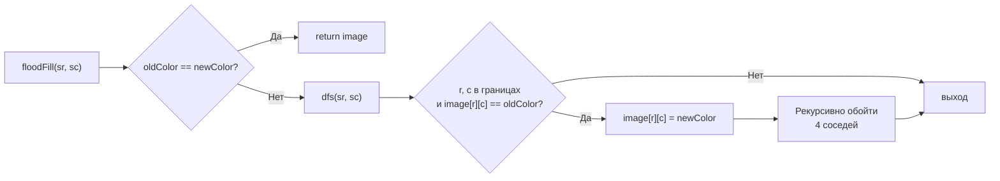

**LeetCode 733. Flood Fill.** Дана двумерная сетка `image` размером `m x n`, представляющая собой массив пикселей с целочисленными значениями цветов. Также даны координаты стартового пикселя `sr, sc` и новый цвет `newColor`. Требуется выполнить «заливку»: заменить цвет стартового пикселя и всех пикселей, соединённых с ним по четырём направлениям (горизонтально и вертикально) и имеющих одинаковый с ним исходный цвет, на `newColor`. Если стартовый пиксель уже имеет цвет `newColor`, сетка не меняется.

Задача завершает кластер **Поиск в глубину (DFS)** и служит мостом к следующему кластеру — **Поиск в ширину (BFS)**. Она минималистична по условию, но именно на таких простых задачах Senior Go-разработчик демонстрирует мастерство: выбор между рекурсивным DFS и итеративным BFS/DFS, понимание, почему модификация in-place быстрее и экономнее, и как избежать переполнения стека горутины при глубокой рекурсии на больших изображениях. Flood Fill — это «Hello, World!» для обхода связных областей на сетке, и с него начинается путь к более сложным задачам вроде [[3. Number of Islands]].

### Формулировка и уточнения

**Условие:** функция `floodFill(image [][]int, sr int, sc int, newColor int) [][]int`. Возвращает модифицированное изображение.

**Вопросы интервьюеру (Senior-стиль):**
- *Может ли `image` быть пустым?* Да, `m == 0` или `n == 0` — возвращаем исходный слайс без изменений.
- *Гарантируется ли, что `sr, sc` в пределах изображения?* Да, координаты валидны.
- *Может ли `newColor` совпадать с исходным цветом?* Да, в этом случае ничего не делаем и возвращаем исходный `image`.
- *Допустимо ли изменять входное изображение?* Да, задача предполагает in-place модификацию.
- *Диагонали считаются связью?* Нет, только четыре направления.

Ответы фиксируют выбор: DFS с рекурсией и пометкой in-place. При совпадении цветов — немедленный возврат, чтобы избежать бесконечной рекурсии (так как пиксель уже «залит»).

### Наивное решение: обход с проверкой и отдельным `visited`

Можно создать матрицу `visited` размером `m x n`, запустить DFS от стартового пикселя, проверяя соседей по исходному цвету, и менять цвет. Это O(m*n) времени и O(m*n) дополнительной памяти. Senior сразу предложит использовать in-place замену, так как исходный цвет мы уже сохранили в отдельной переменной, и он служит естественным маркером «ещё не обработан».

### Оптимальное решение: рекурсивный DFS с запоминанием исходного цвета

**Идея.** Сохраняем `oldColor := image[sr][sc]`. Если `oldColor == newColor`, сразу возвращаем `image` (без этого рекурсия была бы бесконечной — заливка того же цвета будет снова и снова заходить в те же пиксели). Иначе запускаем рекурсивную функцию `dfs(r, c)`, которая:
- Проверяет границы изображения.
- Если цвет пикселя не равен `oldColor`, выходит (это либо уже залитый, либо чуждый пиксель).
- Меняет цвет пикселя на `newColor`.
- Рекурсивно вызывает себя для четырёх соседей.

**Инвариант:** после завершения `dfs(r, c)` все пиксели, принадлежащие связной компоненте исходного цвета, содержащей `(sr, sc)`, заменены на `newColor`. Остальные пиксели не тронуты.

**Почему не нужен `visited`:** замена цвета на `newColor` немедленно исключает пиксель из дальнейшего рассмотрения — при повторном заходе на него (через другого соседа) условие `image[nr][nc] != oldColor` станет истинным, и рекурсия остановится. Это ровно тот же трюк, что и в [[3. Number of Islands]].

```go
func floodFill(image [][]int, sr int, sc int, newColor int) [][]int {
    if len(image) == 0 {
        return image
    }
    oldColor := image[sr][sc]
    if oldColor == newColor {
        return image
    }

    m, n := len(image), len(image[0])
    dirs := [][2]int{{-1, 0}, {1, 0}, {0, -1}, {0, 1}}

    var dfs func(r, c int)
    dfs = func(r, c int) {
        if r < 0 || r >= m || c < 0 || c >= n || image[r][c] != oldColor {
            return
        }
        image[r][c] = newColor
        for _, d := range dirs {
            dfs(r+d[0], c+d[1])
        }
    }

    dfs(sr, sc)
    return image
}
```

**Go-идиомы и комментарии:**
- `dirs` — статический слайс направлений, переиспользуется.
- Проверка `oldColor == newColor` до начала рекурсии предотвращает бесконечный цикл.
- `image[r][c] = newColor` — in-place модификация. Никаких дополнительных матриц.
- Рекурсивное замыкание захватывает `image`, `m`, `n`, `dirs`, `oldColor`, `newColor`.



### Альтернатива: итеративный BFS (или DFS) с очередью/стеком

Как обсуждалось в [[2. Рекурсия и стек]], если связная область может быть очень большой (например, экран 4K с заливкой всего фона), глубина рекурсивного DFS может достигнуть миллионов пикселей, что приведёт к расширению стека горутины и потенциальному OOM. Итеративный BFS или DFS с явным стеком решают эту проблему. BFS традиционно предпочитают для заливки, так как она меньше рискует выйти за пределы стека.

```go
func floodFillBFS(image [][]int, sr int, sc int, newColor int) [][]int {
    if len(image) == 0 {
        return image
    }
    oldColor := image[sr][sc]
    if oldColor == newColor {
        return image
    }
    m, n := len(image), len(image[0])
    dirs := [][2]int{{-1, 0}, {1, 0}, {0, -1}, {0, 1}}
    queue := [][2]int{{sr, sc}}
    image[sr][sc] = newColor // помечаем при добавлении

    for len(queue) > 0 {
        cell := queue[0]
        queue = queue[1:]
        for _, d := range dirs {
            nr, nc := cell[0]+d[0], cell[1]+d[1]
            if nr >= 0 && nr < m && nc >= 0 && nc < n && image[nr][nc] == oldColor {
                image[nr][nc] = newColor
                queue = append(queue, [2]int{nr, nc})
            }
        }
    }
    return image
}
```

Здесь память под очередь — O(ширина области) в случае BFS, или O(периметр) для DFS. Важно: пиксель помечается `newColor` **до** добавления в очередь, иначе один и тот же пиксель может быть добавлен несколько раз.

> [!info] Под капотом
> Рекурсивный DFS для области размером 10⁶ пикселей в Go может потребовать стек горутины порядка нескольких мегабайт (каждый фрейм ~40 байт х 10⁶ = ~40 МБ). Рантайм будет многократно копировать стек, что вызовет заметную задержку. Итеративный BFS с очередью на слайсе использует ровно столько памяти, сколько нужно для хранения периметра (максимум ~2*(m+n) в типичном случае), и не копирует стек. Поэтому для больших заливок Senior выберет BFS.

### Edge Cases

- **Пустое изображение:** `len(image) == 0` → сразу возврат.
- **`newColor` совпадает с исходным:** проверка `oldColor == newColor` спасает от бесконечной рекурсии и ненужной работы.
- **Область из одного пикселя:** `dfs` покрасит его и выйдет.
- **Вся сетка одного цвета:** рекурсивный DFS может упереться в глубину m*n. Для 300x300 (90 000) — терпимо; для 10000x10000 — нет. Senior упомянет BFS.
- **Область с «дырами»** другого цвета: DFS корректно останавливается на границах.

### Анализ сложности

- **Время:** O(m*n). В худшем случае каждый пиксель посещается ровно один раз.
- **Память (рекурсивный DFS):** O(m*n) на стек рекурсии в вырожденном случае (например, змеевидная область). Для BFS — O(ширина области) в очереди, фактически до m*n в худшем случае, но обычно значительно меньше.

### Mechanical Sympathy: слайсы, кэш и in-place

- **In-place модификация** `image[r][c] = newColor` — запись в существующий слайс, без аллокаций. GC не испытывает давления.
- **Сетка `[][]int`** — слайс слайсов. Каждая строка — непрерывный массив, что отлично для кэша при горизонтальном движении. При вертикальном движении переход на следующую строку — это загрузка нового слайса, что может вызвать промах, но не критично.
- **Явная очередь/стек** в итеративном варианте — слайс пар `[2]int` размером 16 байт каждая, что эффективно и без pointer chasing.
- **Рекурсивный вызов** — это инструкции CALL/RET, стек горутины. Для умеренных размеров (до ~10⁵ пикселей) работает на уровне микросекунд.

> [!warning] Ловушка / Gotcha
> Не используйте `image[r][c] = newColor` **после** рекурсивных вызовов, если порядок не важен. В данном случае порядок не имеет значения, но если поставить изменение после рекурсии, то сосед, зашедший обратно, увидит ещё не обновлённый цвет и войдёт в бесконечную рекурсию. Поэтому изменяем до обхода соседей.

### Итог

Flood Fill — это базовая, но важная задача на обход связной области. Она демонстрирует ключевые принципы работы с сетками в Go: in-place модификацию, использование направлений через слайс, выбор между рекурсивным DFS и итеративным BFS в зависимости от размера области и ограничений по памяти. Senior-разработчик не просто пишет работающий код, но и объясняет, почему совпадение цветов требует особой обработки, и когда BFS предпочтительнее DFS.

Теперь, завершив кластер **Поиск в глубину (DFS)**, мы переходим к следующему фундаментальному способу обхода — **поиску в ширину (BFS)**. В первой статье нового кластера мы разберём теорию BFS, сравним его с DFS, научимся реализовывать очередь на слайсе и обсудим, как BFS помогает находить кратчайшие пути в невзвешенных графах. [[1. Теория. BFS]]