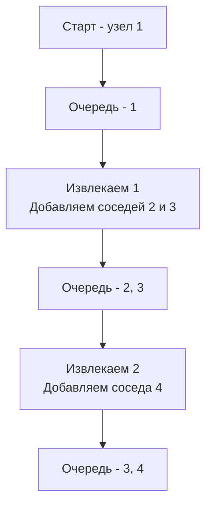

Поиск в ширину (Breadth-First Search, BFS) — это фундаментальный алгоритм обхода графа, который чаще всего ассоциируется с поиском кратчайшего пути в невзвешенном графе. Если DFS (Поиск в глубину) идет до упора по одной ветке, то BFS распространяется "волнами" или "кольцами" от стартовой точки, послойно обходя всех соседей, прежде чем углубляться дальше.

Для бэкенд-инженера BFS — это не просто способ найти выход из лабиринта. Это алгоритм, лежащий в основе маршрутизации (OSPF), поиска ближайших доступных узлов в балансировщиках нагрузки, обхода файловых систем и даже работы сборщика мусора (GC) в некоторых языках.

## Анатомия BFS: Очередь и Пометки

Классический BFS опирается на две структуры данных:
1. **Очередь (Queue):** Хранит узлы, которые нужно посетить. Мы извлекаем узел из начала очереди, а его непосещенных соседей добавляем в конец. Это гарантирует, что узлы будут обработаны в порядке их удаленности от старта.
2. **Множество посещенных (Visited Set):** Предотвращает зацикливание и повторную обработку узлов в графах с циклами.



## Mechanical Sympathy: Утечка памяти в Go при работе с очередями

Главная ловушка при написании BFS на Go кроется в реализации очереди. В C++ есть `std::queue`, в Java — `LinkedList` или `ArrayDeque`. Разработчики, приходящие в Go, часто пытаются использовать слайс в качестве очереди:

```go
// АНТИПАТТЕРН: Утечка памяти
queue := []int{1, 2, 3}
// Извлечение элемента из начала очереди
elem := queue[0]
queue = queue[1:] // ОШИБКА!
```

> [!warning] Ловушка / Gotcha
> Выражение `queue = queue[1:]` не освобождает память! В Go слайс — это merely view (окно просмотра) над базовым массивом (underlying array). Когда вы делаете `queue[1:]`, вы просто сдвигаете указатель начала слайса на один элемент. Сам базовый массив всё ещё находится в куче, и первые элементы (которые вы уже "извлекли") продолжают занимать память.
> 
> В BFS на графе с 1 миллионом узлов вы создадите базовый массив на миллион элементов, и он будет жить в куче до конца работы алгоритма, создавая колоссальное давление на Garbage Collector (GC). Если в узлах хранятся указатели, GC не сможет очистить даже "пройденные" элементы.

### Как правильно: Очередь на слайсе с индексом

Самый производительный и идиоматичный подход для алгоритмических задач на Go — использовать слайс, но не сдвигать начало, а двигать индекс "головы" (`head`). Когда очередь пустеет, мы просто сбрасываем слайс.

```go
type Queue struct {
    data []int
    head int
}

func (q *Queue) Enqueue(v int) {
    q.data = append(q.data, v)
}

func (q *Queue) Dequeue() int {
    if q.IsEmpty() {
        panic("queue is empty")
    }
    v := q.data[q.head]
    q.head++
    // Очистка базового массива, если очередь стала пустой
    if q.head == len(q.data) {
        q.data = q.data[:0]
        q.head = 0
    }
    return v
}

func (q *Queue) IsEmpty() bool {
    return q.head == len(q.data)
}
```

> [!info] Под капотом
> Почему слайс лучше `container/list`?
> Стандартный пакет `container/list` реализует двусвязный список. Каждый `PushBack` аллоцирует новый узел в куче (heap allocation). Для BFS с миллионом узлов это миллион аллокаций и миллион объектов для GC. Кроме того, элементы связного списка разбросаны по памяти, что вызывает **Pointer Chasing** и промахи кэша (Cache Miss).
> 
> Слайс `[]int` — это непрерывный блок памяти. Процессор загружает элементы пачками по 64 байта (Cache Line). Dequeue из слайса с индексом `head` работает в сотни раз быстрее, чем обход связного списка, и создает нулевое давление на GC.

## Кратчайший путь: Почему BFS всегда находит его?

В невзвешенном графе (где каждое ребро имеет вес 1) BFS гарантированно находит кратчайший путь. Почему? 

Потому что BFS расширяет фронт поиска равномерно. Когда мы впервые достигаем узла `V`, мы делаем это через минимально возможное количество ребер от старта. Любой другой путь к `V` прошел бы через большее или равное количество узлов, но BFS уже посетил бы `V` раньше.

> [!tip] Собеседование
> Интервьюер часто спрашивает: *"А что если граф взвешенный (ребра имеют разный вес)?"*
> Ответ: BFS не найдет кратчайший путь. Для взвешенных графов используется Алгоритм Дейкстры (с приоритетной очередью / Min-Heap). По сути, Дейкстра — это обобщение BFS, где вместо обычной очереди (FIFO) используется очередь с приоритетом, чтобы всегда вытаскивать ближайший по стоимости узел.

## System Design: Где BFS в бэкенде?

1. **Социальные графы:** Поиск "друзей друзей" (Mutual Friends). Чтобы найти людей на расстоянии 2-х рукопожатий, мы запускаем BFS от пользователя и останавливаемся на 2-м уровне (уровень = количество переходов).
2. **Service Discovery (Consul, Eureka):** При поиске здорового инстанса микросервиса в топологии сети используется BFS-подобный поиск ближайшего узла с минимальным сетевым хопом.
3. **Сборщик мусора (Tracing GC):** Современные GC (включая Go) используют модифицированный BFS (часто называемый "tri-color marking") для обхода графа объектов от корней (stack, globals). BFS удобнее для кэша процессора при обходе больших графов в куче, чем DFS, так как он обходит смежные объекты (которые часто лежат рядом в памяти) последовательно.

## Итог

1. **Алгоритм:** BFS обходит граф волнами, используя очередь. Гарантирует кратчайший путь в невзвешенных графах.
2. **Очередь в Go:** Никогда не используйте `queue = queue[1:]` для извлечения элементов. Это вызывает утечку памяти. Используйте индекс `head` или кольцевой буфер.
3. **Кэш процессора:** Использование непрерывного слайса для очереди радикально превосходит `container/list` по производительности из-за локальности кэша (Cache Locality).
4. **Графы:** В отличие от DFS, BFS требует памяти $O(W)$, где $W$ — максимальная ширина графа. В дереве с миллионом узлов ширина может быть огромной, учитывайте это при оценке Memory Complexity.

В следующей статье мы разберем самую частую задачу на BFS — обход деревьев горизонтальными слоями: [[2. Обход по уровням]].