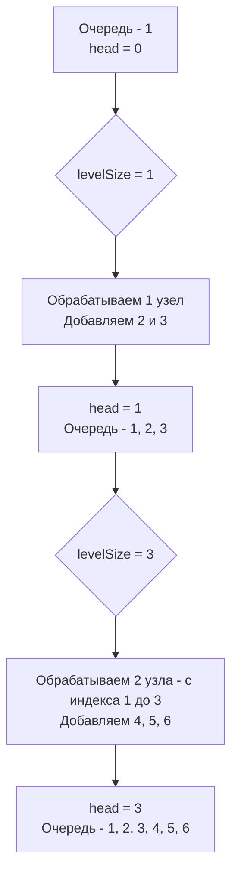

Обход по уровням (Level Order Traversal) — это каноническое применение BFS для деревьев. Если в [[1. Теория. BFS]] мы обсуждали общие принципы волнового обхода графов, то здесь мы сталкиваемся с конкретной инженерной задачей: как не просто обойти узлы, но и сохранить информацию о том, к какому уровню (слою) они принадлежат.

Для бэкенд-инженера этот паттерн моделирует обработку иерархических данных: от каталогов товаров (категории -> подкатегории -> товары) до распространения прав доступа (Root -> Admin -> User) и вычисления агрегированных метрик по слоям организации.

## Главная проблема: Как отделить уровни?

Стандартный BFS с очередью просто выплевывает узлы один за другим. В итоге получается плоский массив: `[1, 2, 3, 4, 5, 6, 7]`. Но нам нужна структура `[[1], [2, 3], [4, 5, 6, 7]]`.

Существует три подхода:
1. **Две очереди:** Хранить текущий уровень в одной очереди, а детей складывать в другую. По окончании текущего уровня меняем их местами. (Плохо: двойной оверхед).
2. **Сентинел (Divider):** Добавлять `nil` маркер в очередь, сигнализирующий о конце уровня. (Плохо: засоряет очередь пустыми значениями, требует приведения типов в универсальных реализациях).
3. **Снимок размера очереди (Размер уровня):** Перед началом обработки уровня мы сохраняем текущий размер очереди `size := len(queue)`. Это и есть количество узлов на текущем уровне. Затем мы делаем ровно `size` итераций. Это самый элегантный и производительный подход.

## Идиоматичный Go: Слайс с индексом `head`

Как мы обсуждали в предыдущей статье, использование `queue = queue[1:]` ведет к утечке памяти (memory leak) из-за особенностей устройства слайсов в Go. Здесь мы применим паттерн со сдвигом индекса `head`, который идеально ложится в концепцию "снимка размера уровня".

```go
type TreeNode struct {
    Val   int
    Left  *TreeNode
    Right *TreeNode
}

func levelOrder(root *TreeNode) [][]int {
    if root == nil {
        return nil
    }
    
    // Используем слайс как очередь, без удаления из начала
    queue := []*TreeNode{root}
    head := 0 // Индекс "головы" очереди
    result := [][]int{}
    
    for head < len(queue) {
        // КРИТИЧЕСКИ ВАЖНО: снимок размера текущего уровня
        levelSize := len(queue) 
        level := make([]int, 0, levelSize) // Предаллоцируем слайс уровня
        
        // Обрабатываем ровно levelSize узлов
        for i := head; i < levelSize; i++ {
            node := queue[i]
            level = append(level, node.Val)
            
            if node.Left != nil {
                queue = append(queue, node.Left)
            }
            if node.Right != nil {
                queue = append(queue, node.Right)
            }
        }
        
        // Сдвигаем голову очереди на следующий уровень
        head = levelSize
        
        result = append(result, level)
    }
    
    return result
}
```



> [!info] Под капотом
> Почему `level := make([]int, 0, levelSize)` лучше, чем `var level []int`?
> Когда вы делаете `append` в слайс с нулевой емкостью, рантайм Go вынужден аллоцировать новый базовый массив при каждом переполнении. Для узлов на уровне `i` может потребоваться до нескольких аллокаций на уровень. Задавая емкость `levelSize` заранее, мы говорим рантайму: "Выдели память один раз". Это сокращает количество аллокаций в куче (heap allocations) и вызовов GC ровно в `N` раз (где `N` — количество уровней дерева).

## Mechanical Sympathy: Pointer Chasing и prefetching

В структуре `TreeNode` поля `Left` и `Right` — это указатели. Обход деревьев в Go — это классический **Pointer Chasing**. Узлы разбросаны по куче (heap) случайным образом.

Когда алгоритм BFS извлекает узел 2 и добавляет в очередь указатели на его детей 4 и 5, процессор вынужден идти в оперативную память (Cache Miss). 

Однако, у BFS есть скрытое преимущество перед DFS перед подсчетом метрик. Если мы обходим дерево уровнями, и на уровне 100 узлов, мы можем обработать их "пачкой". Современные процессоры и компиляторы умеют векторизовать (SIMD) простые операции над массивами. Если ваша бизнес-логика на уровне (например, сумма значений) не имеет зависимостей по данным, теоретически её можно распараллелить. В Go для этого можно передать слайс `level` в горутину (Worker Pool), чего нельзя сделать при DFS, пока вы не спуститесь до самого дна.

> [!warning] Ловушка / Gotcha
> Если вы используете классический подход с `queue = queue[1:]`, будьте осторожны со сборщиком мусора. Если дерево огромное, базовый массив очереди будет расти до размера самого широкого уровня дерева и *никогда не уменьшится*, удерживая указатели на уже пройденные узлы. GC не сможет очистить память от пройденных узлов, пока на них ссылается базовый массив очереди. Подход с индексом `head` решает эту проблему: старые указатели в начале слайса могут быть перезаписаны (в идеале), но до тех пор они просто недоступны для логики, хотя память массива всё еще занята. Для production систем лучше использовать кольцевой буфер (Ring Buffer) поверх слайса.

## System Design: MapReduce и Иерархии

В распределенных системах данные часто организованы иерархически. Например, AWS IAM политики: если право выдано корневой организационной единице (OU), оно каскадно распространяется вниз.

Если вам нужно посчитать бюджет для каждого слоя компании, вы используете Level Order Traversal. В распределенной среде (если дерево хранится в БД или распределенном кэше) один сервер не может обойти всё дерево в памяти.

Паттерн "снимок размера уровня" ложится на парадигму **Bulk Synchronous Parallel (BSP)** / MapReduce:
1. На шаге `N` мы запрашиваем из БД все узлы текущего слоя (Map).
2. Агрегируем их данные.
3. На основе их ID формируем批量 (batch) запрос в БД для получения всех детей уровня `N+1`.

Это позволяет избежать боли N+1 запросов (когда вы делаете запрос в БД на каждого ребенка каждого узла), собирая всех детей одного уровня одним SQL `IN (...)` запросом.

> [!tip] Собеседование
> Если вы решили задачу Level Order, интервьюер почти гарантированно попросит вас сделать **Zigzag Level Order** (зигзагообразный обход: слева направо, затем справа налево).
> 
> Неправильный подход: использовать Deque или менять порядок добавления детей (это ломает логику BFS).
> Правильный подход: обходить дерево всегда строго слева направо (классический BFS). Единственное, что меняется — это формирование слайса `level`. Если уровень нечетный, вы просто разворачиваете его: 
> ```go
> if len(result) % 2 == 1 {
>     for l, r := 0, len(level)-1; l < r; l, r = l+1, r-1 {
>         level[l], level[r] = level[r], level[l]
>     }
> }
> ```
> Это сохраняет сложность $O(N)$ по времени и не ломает очередь.

## Итог

1. **Снимок размера:** Ключ к обходу по уровням — фиксация `len(queue)` перед обработкой уровня. Это избавляет от нужды в сентинах и вторых очередях.
2. **Утечка памяти:** Избегайте `queue = queue[1:]`. Используйте индекс `head` для имитации очереди на базе слайса.
3. **Предаллокация:** Всегда резервируйте емкость для слайса уровня: `make([]int, 0, levelSize)`. Это экономит аллокации.
4. **Масштабирование:** Паттерн обхода по уровням идеально ложится на пакетные запросы (Batching) в распределенных БД и архитектуру MapReduce.

В следующей статье мы закрепим этот паттерн на классической задаче LeetCode: [[3. Binary Tree Level Order Traversal]].