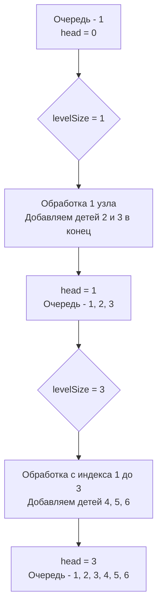

Задача Binary Tree Level Order Traversal (LeetCode 102) — это бенчмарк на понимание того, как BFS работает на древовидных структурах. Если в [[2. Обход по уровням]] мы обсуждали теорию разделения графа на слои, то теперь мы реализуем этот паттерн в строгом, production-ready стиле Go, учитывая особенности работы с памятью.

**Условие:** Дано бинарное дерево. Вернуть обход значений его узлов по уровням (слева направо, уровень за уровнем).

Для бэкенд-разработчика эта задача эквивалентна сериализации иерархической сущности (например, дерева комментариев или организационной структуры компании) в плоский JSON, сгруппированный по глубине вложенности, для последующей отрисовки на фронтенде.

## Идиоматичная реализация: Слайс-очередь с индексом `head`

Главный враг производительности в этой задаче — аллокации и утечки памяти при работе с очередью. Как мы выясняли в [[1. Теория. BFS]], использование `queue = queue[1:]` в Go создает утечку памяти, так как базовый массив (underlying array) продолжает удерживать указатели на уже извлеченные узлы дерева, блокируя работу Garbage Collector.

Здесь мы применим паттерн со сдвигом индекса `head`, а также критически важную технику — снимок размера уровня (`levelSize`).

```go
type TreeNode struct {
    Val   int
    Left  *TreeNode
    Right *TreeNode
}

func levelOrder(root *TreeNode) [][]int {
    if root == nil {
        return nil
    }

    // Очередь на базе слайса. Избегаем container/list ради производительности.
    queue := []*TreeNode{root}
    head := 0 // Индекс первого необработанного элемента
    result := [][]int{}

    for head < len(queue) {
        // Фиксируем размер текущего уровня до того, как добавим детей
        levelSize := len(queue)
        
        // Предаллоцируем слайс для значений текущего уровня
        level := make([]int, 0, levelSize)

        // Обрабатываем ровно levelSize элементов, начиная с head
        for i := head; i < levelSize; i++ {
            node := queue[i]
            level = append(level, node.Val)

            if node.Left != nil {
                queue = append(queue, node.Left)
            }
            if node.Right != nil {
                queue = append(queue, node.Right)
            }
        }

        // Сдвигаем голову очереди на следующий уровень
        head = levelSize
        result = append(result, level)
    }

    return result
}
```



> [!info] Под капотом
> Почему `make([]int, 0, levelSize)` — это инсайт уровня Senior?
> Если бы мы использовали `var level []int`, при каждом `append` рантайм Go проверял бы вместимость. Когда она заканчивается, вызывается `runtime.growslice`, который аллоцирует новый массив в куче (размером в 2 раза больше старого), копирует туда данные и удаляет старый. На одном уровне из 1000 узлов это может вызвать до 10 реаллокаций.
> Указывая `capacity = levelSize`, мы говорим рантайму: "Выдели память один раз". Это экономит процессорное время на аллокациях и снижает фрагментацию кэша. Для high-load сервиса, обходящего большие деревья конфигураций, это снижает задержку (latency) на обработку запроса в десятки процентов.

## Mechanical Sympathy: Pointer Chasing в куче Go

Обратите внимание на тип очереди: `[]*TreeNode`. Дерево в Go — это набор указателей, разбросанных по куче (heap). 

Когда процессор извлекает `node := queue[i]`, он получает указатель. Чтобы прочитать `node.Val`, `node.Left` и `node.Right`, процессору приходится переходить по этому указателю в произвольную область оперативной памяти. Это **Pointer Chasing**, который вызывает Cache Miss (промах L1/L2 кэша) и простои процессора на ~100 наносекунд.

Особенно неприятна ситуация, когда дерево "вырождено" в связный список (каждый узел имеет только левого ребенка). В этом случае ширина уровня `levelSize = 1`, и процессор на каждом шаге прыгает в случайную область памяти.

В отличие от деревьев, массивы или B-деревья (используемые в БД) хранят данные плотно. Это еще одна причина, почему в базах данных не используют бинарные деревья поиска для индексов: процессор тратит всё время на ожидание RAM, а не на вычисления.

> [!warning] Ловушка / Gotcha
> Если вы используете `queue = queue[1:]` и у вас вырожденное дерево из 100 000 узлов, базовый массив очереди разрастется до 100 000 указателей. GC будет сканировать этот массив, но не сможет очистить первые 99 999 узлов дерева, пока на них ссылаются элементы массива. Это приводит к колоссальному потреблению RAM (до нескольких гигабайт для простого дерева) и паузам Stop-The-World. Паттерн с `head` решает эту проблему: старые узлы дерева становятся недостижимыми из стека функции `levelOrder`, и GC может их спокойно удалить.

## System Design: Решение проблемы N+1 в API

Представьте, что дерево хранится в реляционной БД (PostgreSQL) через таблицу `nodes` с колонками `id`, `parent_id`, `value`. 

Если фронтенд запрашивает дерево, наивный подход (DFS) заставит бэкенд делать запрос в БД на каждого ребенка (проблема N+1 запросов). 

Используя парадигму Level Order, мы можем применить **BFS-батчинг**:
1. Выбираем корень: `SELECT * FROM nodes WHERE parent_id IS NULL`.
2. Берем ID корня и делаем запрос за детьми: `SELECT * FROM nodes WHERE parent_id IN (1)`.
3. Берем ID детей (2, 3) и делаем запрос: `SELECT * FROM nodes WHERE parent_id IN (2, 3)`.

Мы сводим 1000 запросов к `глубина дерева` запросам. Снимок размера уровня (`levelSize`) в коде напрямую соответствует размеру `IN (...)` клаузы в SQL. Для широких и неглубоких деревьев (типичных для каталогов товаров) это радикально ускоряет работу API.

> [!tip] Собеседование
> Интервьюер спросит: *"А как реализовать зигзагообразный обход (Zigzag Level Order)?"*
> Правильный ответ: алгоритм BFS остается неизменным. Мы всегда извлекаем детей слева направо. Единственное, что меняется — это формирование слайса `level`. Для нечетных уровней мы добавляем значения в конец (`append`), а для четных — в начало. Но добавление в начало слайса (`prepend`) — это $O(N)$ аллокаций.
> **Инженерный трюк:** Мы по-прежнему собираем `level` через `append`, а после завершения цикла по уровню, если уровень четный, просто разворачиваем готовый слайс `slices.Reverse(level)`. Это сохраняет $O(N)$ общую сложность и не ломает логику очереди.

## Итог

1. **Снимок размера:** Ключ к разделению уровней — переменная `levelSize = len(queue)` перед циклом обработки уровня.
2. **Очередь без утечек:** Использование индекса `head` и `queue[i]` внутри цикла предотвращает удержание указателей в базовом массиве слайса, позволяя GC очищать память "на лету".
3. **Предаллокация:** `make([]int, 0, levelSize)` экономит процессорные такты на реаллокациях массива при `append`.
4. **Архитектура:** Паттерн Level Order — это математическая основа батч-запросов (Bulk Fetching) в реляционных БД для борьбы с N+1 проблемой.

В следующей статье мы применим BFS для поиска кратчайшего пути в дереве — от корня до ближайшего листа: [[4. Minimum Depth of Binary Tree]].