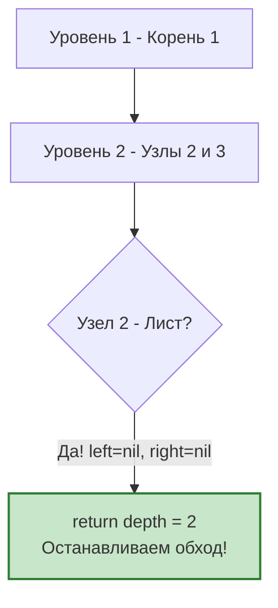

Задача Minimum Depth of Binary Tree (LeetCode 111) — это классический пример того, как правильный выбор алгоритма радикально меняет производительность системы. Если в [[3. Binary Tree Level Order Traversal]] мы обходили всё дерево ради статистики по слоям, то здесь наша цель — найти кратчайший путь от корня до ближайшего листа. И здесь BFS раскрывается во всей красе как алгоритм поиска кратчайшего пути.

**Условие:** Найти минимальную глубину бинарного дерева. Минимальная глубина — это количество узлов на кратчайшем пути от корневого узла до ближайшего листового узла.

В бэкенде это моделирует задачу поиска ближайшего доступного ресурса в иерархии (например, поиск свободного воркера в дереве кластеров: Root -> Rack -> Server -> Worker), где мы хотим остановиться, как только найдем первый валидный endpoint.

## DFS vs BFS: Цена полного обхода

Эту задачу можно решить двумя способами:
1. **DFS (Поиск в глубину):** Обойти всё дерево, вычислить глубину каждого листа и взять минимум. Сложность: строго $O(N)$ времени и $O(H)$ памяти (где $H$ — высота дерева).
2. **BFS (Поиск в ширину):** Обходить дерево по уровням. Как только мы встречаем первый листовой узел, мы **немедленно возвращаем ответ**.

> [!tip] Собеседование
> Если интервьюер просит решить задачу на минимальную глубину, всегда предлагайте BFS и объясняйте почему. В сбалансированном дереве с 1000 узлов DFS посетит все 1000. BFS найдет лист на 3-м уровне, посетив всего $1 + 2 + 4 = 7$ узлов. Это $O(\log N)$ против $O(N)$. В высоконагруженных системах раннее завершение (Early Exit) — это экономия CPU и памяти.

## Идиоматичный Go: BFS с Early Exit

Применим наш проверенный паттерн со слайс-очередью и индексом `head`, добавив логику остановки при обнаружении первого листа.

```go
type TreeNode struct {
    Val   int
    Left  *TreeNode
    Right *TreeNode
}

func minDepth(root *TreeNode) int {
    if root == nil {
        return 0
    }
    
    queue := []*TreeNode{root}
    head := 0
    depth := 1 // Корень уже считается за уровень
    
    for head < len(queue) {
        levelSize := len(queue)
        
        // Обрабатываем текущий уровень целиком
        for i := head; i < levelSize; i++ {
            node := queue[i]
            
            // Проверка на лист: нет ни левого, ни правого ребенка
            if node.Left == nil && node.Right == nil {
                return depth // Early Exit!
            }
            
            if node.Left != nil {
                queue = append(queue, node.Left)
            }
            if node.Right != nil {
                queue = append(queue, node.Right)
            }
        }
        
        // Если на этом уровне листьев не нашлось, идем глубже
        head = levelSize
        depth++
    }
    
    return depth
}
```



## Ловушка DFS: Односторонние деревья

Хотя DFS не оптимален для этой задачи, на собеседовании вас могут попросить написать именно его. И здесь кроется классическая ловушка.

Многие пишут рекурсивный DFS так:
```go
// ОШИБОЧНОЕ РЕШЕНИЕ DFS
func minDepth(node *TreeNode) int {
    if node == nil { return 0 }
    return 1 + min(minDepth(node.Left), minDepth(node.Right))
}
```

> [!warning] Ловушка / Gotcha
> Этот код ломается на односторонних деревьях (например, когда есть только правые дети). Если у узла есть правый ребенок, но нет левого (`node.Left == nil`), формула посчитает, что левая ветка имеет глубину 0, и вернет 1. Но узел, у которого есть дети, **не является листом**! Путь обязан заканчиваться строго на листе.
> 
> Правильный DFS должен явно проверять наличие детей:
> ```go
> if node.Left == nil { return 1 + minDepth(node.Right) }
> if node.Right == nil { return 1 + minDepth(node.Left) }
> return 1 + min(minDepth(node.Left), minDepth(node.Right))
> ```
> BFS полностью избавлен от этого класса ошибок, так как он проверяет статус "листа" напрямую перед добавлением в очередь.

## Mechanical Sympathy: Мгновенный сброс очереди

Что происходит на уровне операционной системы и рантайма Go, когда мы делаем `return depth` внутри цикла BFS?

В этот момент слайс `queue` всё ещё содержит указатели на узлы дерева, которые мы добавили на предыдущих уровнях, а также базовый массив (underlying array) зарезервированной памяти. 

Поскольку мы возвращаемся из функции `minDepth`, фрейм этой функции на стеке горутины разрушается. Все локальные переменные (`queue`, `head`, `depth`) перестают существовать. Указатель на базовый массив слайса теряется.

> [!info] Под капотом
> В этот момент включается Garbage Collector Go. Поскольку мы использовали BFS с Early Exit, мы не успели загадить память указателями на все узлы дерева. GC нужно очистить только те узлы, что успели попасть в `queue`. 
> 
> Если бы мы использовали DFS и дерево было вырождено в связный список длиной 1 000 000, стек горутины разросся бы до мегабайта, и при возврате GC пришлось бы рекурсивно помечать миллион объектов. BFS с ранним выходом потребляет память пропорционально ширине самого мелкого уровня, что делает работу GC мгновенной.

## System Design: Circuit Breaker и Поиск инстанса

В распределенных системах поиска (Service Discovery) архитектура часто выглядит как дерево. Запрос приходит в Load Balancer (корень), который знает о нескольких Availability Zones (уровень 2), которые знают о серверах (уровень 3), которые знают о воркерах (уровень 4).

Когда нам нужно найти *любой* живой воркер для выполнения задачи, мы не обходим всё дерево (DFS), чтобы составить полный список. Мы делаем BFS:
1. Спрашиваем AZ.
2. Спрашиваем серверы в первой AZ.
3. Находим первого живого воркера — **Early Exit**.

Если на уровне 3 сервер сообщает, что он жив (но мы еще не дошли до воркеров), мы не останавливаемся — он не "лист" (не конечный исполнитель). Мы останавливаемся только на "листе" — конкретном воркере. Этот алгоритм гарантирует, что мы найдем ближайшего (в терминах сетевой топологии) доступного исполнителя за минимальное количество хопов.

## Итог

1. **BFS для кратчайшего пути:** Задачи на минимальное расстояние в невзвешенных графах и деревьях — естественная среда обитания BFS.
2. **Early Exit:** Главное преимущество BFS — возможность остановить выполнение, как только найден первый лист, экономя огромное количество процессорного времени.
3. **Ловушка DFS:** Если пишете DFS, помните, что узел с одним ребенком — это не лист. Глубина пустого поддерева не может учитываться.
4. **Профилирование памяти:** BFS с ранним выходом радикально снижает нагрузку на Garbage Collector, так как объекты в очереди не успевают накопиться.

В следующей статье мы выйдем за рамки бинарных деревьев и применим BFS к поиску кратчайшего пути в словесных графах: [[5. Word Ladder]].