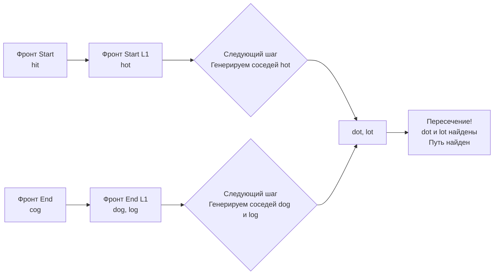

Задача Word Ladder (LeetCode 127) — это классический переход от простых BFS на деревьях к реальным BFS на графах. Если в [[4. Minimum Depth of Binary Tree]] структура была задана явно (указатели `Left`/`Right`), то здесь граф **неявный**. Мы должны построить его на лету, и то, как мы это сделаем, определит, получит ли наше решение Time Limit Exceeded (TLE) или пройдет с запасом.

**Условие:** Даны два слова, `beginWord` и `endWord`, и словарь `wordList`. Все слова одной длины. За один шаг можно изменить одну букву в слове так, чтобы новое слово было в словаре. Найти длину кратчайшей последовательности трансформаций от `beginWord` к `endWord`.

В бэкенде это моделирует задачи поиска минимального количества мутаций (например, генетических или трансформаций конфигурационных файлов), а также лежит в основе алгоритмов автокоррекции и поиска синонимов в поисковых движках.

## Проблема неявного графа: O(N^2 * L) vs O(N * L^2)

Самая большая ошибка — пытаться построить граф полным перебором: сравнивать каждое слово с каждым другим словом в словаре, чтобы найти отличающиеся на одну букву пары. Для словаря из 5000 слов это 25 миллионов сравнений.

**Инсайт:** Вместо того чтобы искать соседей для слова, мы можем генерировать **промежуточные маски (wildcards)**.
Для слова `hot` маски будут: `*ot`, `h*t`, `ho*`.
Если два слова отличаются на одну букву, они обязательно будут иметь общую маску. Мы можем заранее построить `map[mask][]words`, и тогда поиск всех соседей для слова займет генерацию $L$ масок (где $L$ — длина слова), что невероятно быстро.

```go
// Построение словаря масок
adj := make(map[string][]string)
for _, word := range wordList {
    chars := []byte(word)
    for i := range chars {
        original := chars[i]
        chars[i] = '*'
        mask := string(chars)
        adj[mask] = append(adj[mask], word)
        chars[i] = original
    }
}
```

> [!warning] Ловушка / Gotcha
> Конвертация `string(chars)` в Go создает новую строку в куче. На каждый шаг генерации масок мы делаем $L$ аллокаций. Для больших словарей это создает колоссальное давление на GC. В production-системах (например, в поиске по словарю БД) часто используют хеширование масок (например, CRC32 или FNV от массива байт), чтобы использовать в качестве ключа мапы `uint64` вместо `string`. Это радикально снижает оверхед аллокаций.

## Оптимизация Senior-уровня: Двунаправленный BFS (Bidirectional BFS)

Классический BFS расширяет фронт волны только со стороны старта. Если кратчайший путь имеет длину $D$, а каждое слово имеет в среднем $B$ соседей (ветвистость графа), BFS посетит $O(B^D)$ узлов. Для глубоких трансформаций это число экспоненциально.

**Двунаправленный BFS** запускает две волны одновременно: от `beginWord` и от `endWord`. Как только эти два фронта пересекаются (находят общее слово), путь найден.
Математически это снижает количество посещенных узлов с $O(B^D)$ до $O(2 \cdot B^{D/2})$. Для $D=10$ и $B=10$ это разница между 10 миллиардами и 200 тысячами узлов!

```go
func ladderLength(beginWord string, endWord string, wordList []string) int {
    wordSet := make(map[string]struct{})
    for _, w := range wordList {
        wordSet[w] = struct{}{}
    }
    
    if _, exists := wordSet[endWord]; !exists {
        return 0 // endWord нет в словаре, путь невозможен
    }
    
    // Два множества для встречных волн
    beginSet := map[string]struct{}{beginWord: {}}
    endSet := map[string]struct{}{endWord: {}}
    visited := map[string]struct{}{beginWord: {}, endWord: {}}
    
    level := 1
    
    for len(beginSet) > 0 && len(endSet) > 0 {
        // Оптимизация: всегда расширяем МЕНЬШИЙ фронт
        if len(beginSet) > len(endSet) {
            beginSet, endSet = endSet, beginSet
        }
        
        nextSet := make(map[string]struct{})
        
        for word := range beginSet {
            chars := []byte(word)
            for i := 0; i < len(chars); i++ {
                original := chars[i]
                for c := byte('a'); c <= byte('z'); c++ {
                    if c == original { continue }
                    chars[i] = c
                    newWord := string(chars)
                    
                    // Если новое слово во встречном фронте — нашли!
                    if _, ok := endSet[newWord]; ok {
                        return level + 1
                    }
                    
                    // Если слово в словаре и еще не посещено
                    if _, ok := wordSet[newWord]; ok {
                        if _, vis := visited[newWord]; !vis {
                            nextSet[newWord] = struct{}{}
                            visited[newWord] = struct{}{}
                        }
                    }
                }
                chars[i] = original // откат
            }
        }
        
        beginSet = nextSet
        level++
    }
    
    return 0
}
```



> [!info] Под капотом
> Обратите внимание на блок `if len(beginSet) > len(endSet)`. Мы всегда расширяем меньший фронт волны. Это гарантирует, что площадь поиска (количество узлов в памяти) остается минимальной. В терминах Go, это означает, что наши мапы `beginSet` и `visited` будут самого маленького возможного размера, что ускоряет хеширование и снижает количество аллокаций при добавлении новых ключей.
> Также мы используем `map[string]struct{}` вместо `map[string]bool`. `struct{}` занимает 0 байт памяти, тогда как `bool` занимает 1 байт. Для миллионов узлов разница в потреблении RAM может составлять мегабайты.

## System Design: Поиск по словарю в поисковых движках

В реальных системах (например, ElasticSearch или системы поиска опечаток в поисковиках) граф из миллионов слов невозможно держать в памяти целиком.

Вместо генерации 26 вариантов на каждую позицию ($O(L \cdot 26)$) в лоб, используют **Finite State Transducers (FST)** или **Levenshtein Automata**. 

Алгоритм Левенштейна (о котором мы поговорим в разделе DP) можно превратить в конечный автомат. Вместо того чтобы генерировать слова и проверять их наличие в словаре, мы "прогоняем" весь словарь (обычно хранящийся в виде Trie / префиксного дерева) через автомат, который за $O(1)$ отсекает ветви, не способные дать дистанцию редактирования $\le 1$. Это позволяет искать соседей в словаре из 100 миллионов слов за микросекунды без аллокаций.

> [!tip] Собеседование
> Если вы решаете эту задачу, ваш путь к "Strong Hire":
> 1. Объясните, почему наивный граф $O(N^2)$ не подходит.
> 2. Напишите классический BFS с генерацией масок `*ot` / `h*t` (или генерацией 26 букв). Это покажет, что вы умеете строить графы на лету.
> 3. Улучшите решение до **Bidirectional BFS**. Объясните математическую разницу $O(B^D)$ и $O(B^{D/2})$.
> 4. Скажите: *"В production я бы использовал `struct{}` для Set, хеши масок вместо строк для снижения GC pressure, и если бы словарь был огромным — Levenshtein Automata поверх Trie"*.

## Итог

1. **Неявные графы:** Если граф не дан, его ребра можно вычислять динамически (On-the-fly). Генерация соседей через замену символа на `*` снижает сложность построения от $O(N^2)$ до $O(N \cdot L)$.
2. **Двунаправленный BFS:** Главный инструмент для поиска кратчайшего пути в неявных графах. Снижает экспоненциальный рост посещенных узлов до корня из них.
3. **Zero-size Set:** Используйте `map[T]struct{}` для множеств в Go. Это экономит память и избавляет от лишних аллокаций по сравнению с `bool`.
4. **Аллокации строк:** Конвертация `[]byte` в `string` в горячем цикле — враг номер один для GC. В системах с высокой нагрузкой заменяйте строковые ключи на числовые хеши.

В следующей статье мы разберем еще одну классическую задачу, где BFS используется для моделирования распространения состояния по сетке (мультиисточниковый BFS): [[6. Rotting Oranges]].