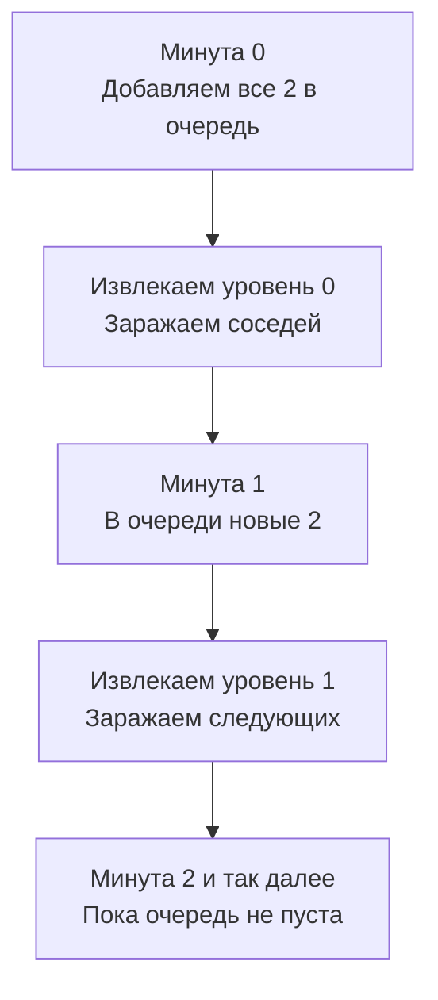

Задача Rotting Oranges (LeetCode 994) — это классический пример **мультиисточникового BFS** (Multi-Source BFS). Если в [[5. Word Ladder]] мы запускали волну из одной точки, то здесь эпицентров заражения (гнилых апельсинов) может быть несколько одновременно. Наша задача — смоделировать распространение "инфекции" по сетке с течением времени.

**Условие:** Дана сетка `grid`, где `0` — пустая клетка, `1` — свежий апельсин, `2` — гнилой апельсин. Каждую минуту гнилой апельсин делает гнилыми своих соседей (вверх, вниз, влево, вправо). Вернуть минимальное количество минут, пока все апельсины не станут гнилыми. Если это невозможно, вернуть `-1`.

В бэкенде этот паттерн точно моделирует **Gossip Protocol** (протоколы сплетен в Cassandra, Consul, Raft), отказы в сеточных топологиях дата-центров, а также расчет времени распространения транзакций или инвалидации кэша в распределенных системах.

## Инсайт: Мультиисточниковый BFS

Главный вопрос кандидатов: *"Как синхронизировать время, если гнилых апельсинов несколько?"*

Решение — поместить **все** изначально гнилые апельсины в очередь на уровне `time = 0`. Когда мы извлекаем их всех, мы переходим к `time = 1`, и в очереди оказываются все апельсины, которые сгнили в первую минуту. Это стандартный Level-Order Traversal из [[3. Binary Tree Level Order Traversal]], но с несколькими корнями.

## Идиоматичный Go: Плоская координата и очередь

Представление координат (row, col) в Go часто реализуют через структуру `struct { r, c int }`. Но при использовании указателей на структуры или самих структур в очереди мы создаем множество мелких объектов, что создает давление на GC.

Более эффективный подход — упаковать двумерную координату в одно число `int`, используя простую формулу: `r * cols + c`. Это позволяет использовать плоский слайс `[]int` в качестве очереди, обеспечивая идеальную локальность кэша.

```go
func orangesRotting(grid [][]int) int {
    rows, cols := len(grid), len(grid[0])
    queue := make([]int, 0)
    head := 0
    freshCount := 0

    // Сканируем сетку: собираем гнилые в очередь и считаем свежие
    for r := 0; r < rows; r++ {
        for c := 0; c < cols; c++ {
            if grid[r][c] == 2 {
                queue = append(queue, r*cols+c)
            } else if grid[r][c] == 1 {
                freshCount++
            }
        }
    }

    // Крайний случай: свежих апельсинов нет вообще
    if freshCount == 0 {
        return 0
    }

    minutes := 0
    // Направления: вверх, вправо, вниз, влево
    dirs := [5]int{-1, 0, 1, 0, -1} 

    for head < len(queue) {
        levelSize := len(queue)

        for i := head; i < levelSize; i++ {
            pos := queue[i]
            r, c := pos/cols, pos%cols // Распаковка координаты

            for d := 0; d < 4; d++ {
                nr, nc := r+dirs[d], c+dirs[d+1]
                if nr >= 0 && nr < rows && nc >= 0 && nc < cols && grid[nr][nc] == 1 {
                    grid[nr][nc] = 2 // Заражаем!
                    freshCount--
                    queue = append(queue, nr*cols+nc)
                }
            }
        }
        
        head = levelSize
        
        // Увеличиваем время, только если на следующем уровне кто-то есть
        // (избегаем лишней минуты, если последние гнилые уже никого не заразили)
        if head < len(queue) {
            minutes++
        }
    }

    if freshCount > 0 {
        return -1 // Остались свежие (недостижимые)
    }
    return minutes
}
```



> [!info] Под капотом
* Формула `r * cols + c` не только убирает необходимость в структурах, но и делает вычисление хеша для координат тривиальным, если бы нам понадобился `visited` сет (в этой задаче мы модифицируем `grid` на месте, экономя память).
* Слайс `dirs` из 5 элементов позволяет обойтись без создания массива пар `[]struct{x, y int}`, что опять же экономит аллокации. Доступ `dirs[d]` и `dirs[d+1]` компилируется в эффективное чтение из кэша.

## Mechanical Sympathy: Мутация in-place vs Дополнительная память

В алгоритме выше мы используем мутацию входного массива `grid[nr][nc] = 2` вместо выделения отдельного множества `visited`. 

Для Go это важный инженерный выбор. Массив `grid` уже загружен в кэш процессора (L1/L2) при первоначальном сканировании. Перезапись его ячеек не требует дополнительных аллокаций в куче. Если бы мы создали `visited := make(map[[2]int]bool)`, на каждое добавление мы бы аллоцировали элемент в хеш-таблице, что вызвало бы массовые Cache Miss и спровоцировало несколько лишних циклов Garbage Collector.

> [!warning] Ловушка / Gotcha
* Подсчет минут (`minutes++`) — классический повод для off-by-one ошибки. Если вы увеличиваете `minutes` после обработки каждого уровня, убедитесь, что вы не прибавляете лишнюю минуту, когда обработали последних гнилых апельсинов, но они уже никого не заразили. Мой код выше избегает этого проверкой `if head < len(queue)`.
* Если в сетке есть свежие апельсины, до которых невозможно добраться (окружены `0`), мы вернем `-1`. Это проверяется финальным `if freshCount > 0`.

## System Design: Gossip Protocols и Инвалидация кэша

В распределенных базах данных (например, Cassandra или DynamoDB) узлы обмениваются информацией о состоянии (heartbeat, версии данных) именно через Gossip Protocol. 

Когда узел A обновляет данные, он помечает свое состояние как "зараженное" (новая версия). Каждую секунду (тик) он сообщает об этом случайным соседям B и C. На следующем тике B и C расскажут об этом своим соседям. 

Математически и алгоритмически это в точности Rotting Oranges. Мультиисточниковый BFS гарантирует, что время распространения информации (Eventual Consistency) будет минимальным (равным диаметру графа кластера), а не зависит от длины цепочки (как при последовательном DFS-подобном распространении).

В кэш-системах (CDN) инвалидация устаревшего контента также использует мультиисточниковую волну: Origin сервер посылает сигнал инвалидации edge-серверам, и волна расходится по топологии сети.

> [!tip] Собеседование
> Если вы решаете эту задачу, озвучьте 3 ключевых шага:
> 1. *"Сначала я сканирую сетку за O(N*M), чтобы положить все изначальные источники заражения в очередь и посчитать количество свежих апельсинов."*
> 2. *"Я буду использовать Level-Order BFS (снимок размера уровня), чтобы синхронизировать таймер минут."*
> 3. *"Вместо Set для посещенных я буду мутить исходную сетку, меняя 1 на 2, чтобы сэкономить память и аллокации."*

## Итог

1. **Multi-Source BFS:** Когда в задаче несколько стартовых точек, которые распространяют волну с одинаковой скоростью, помещайте их все в очередь на нулевом уровне.
2. **Упаковка координат:** Использование `r * cols + c` вместо структур для ячеек сетки делает работу со слайсами в Go молниеносной и дружелюбной к GC.
3. **Мутация вместо Visited Set:** В задачах на сетку, где можно безопасно изменить входные данные, делайте это. Это избавляет от оверхеда хеш-таблиц.
4. **Архитектура:** Мультиисточниковый BFS — это алгоритмическая основа Gossip-протоколов, обеспечивающих минимальное время распространения данных в децентрализованных кластерах.

В следующей статье мы применим BFS к задаче вскрытия замков с вращающимися колесами: [[7. Open the Lock]].