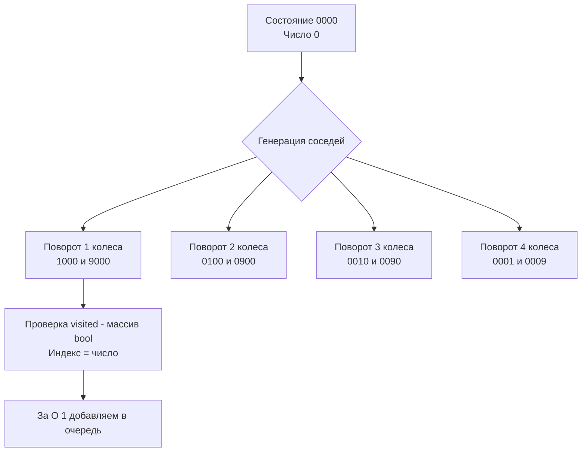

Задача Open the Lock (LeetCode 752) — это блестящий пример поиска кратчайшего пути в гигантском неявном графе состояний. Если в [[6. Rotting Oranges]] мы имели дело с двумерной сеткой, то здесь наше пространство состояний — это 10 000 комбинаций 4-значного замка (от "0000" до "9999"). Мы не можем построить этот граф заранее, мы должны генерировать соседей на лету.

**Условие:** Замок имеет 4 колесика, каждое от 0 до 9. За один шаг вы можете повернуть одно колесико на одну позицию вверх или вниз. Дан список `deadends` (запрещенные комбинации) и `target`. Найти минимальное количество шагов от "0000" до `target`, избегая `deadends`.

В бэкенде эта задача моделирует обход систем с состояниями (State Machines), поиск маршрутов в телекоммуникационных сетях с блокированными узлами, и даже алгоритмы подбора кодов в системах информационной безопасности.

## Ловушка строк: Аллокации в горячем цикле

Первый инстинкт разработчика — представить состояние как `string` ("0123"). При генерации соседей мы конвертируем строку в `[]byte`, меняем байт, конвертируем обратно в `string` и проверяем `map[string]bool`.

```go
// АНТИПАТТЕРН: Убийца производительности и GC
s := "0123"
bytes := []byte(s)
bytes[0]++
newState := string(bytes) // АЛЛОКАЦИЯ В КУЧЕ!
```

> [!warning] Ловушка / Gotcha
* В Go строки иммутабельны. Конвертация `[]byte` в `string` всегда вызывает аллокацию нового объекта в куче (Heap). В BFS мы генерируем до 8 соседей на каждый узел. Для 10 000 узлов это 80 000 аллокаций строк + аллокации в хеш-таблице `visited`. Garbage Collector будет работать на износ, а Cache Miss из-за разбросанных по куче коротких строк убьет локальность кэша L1.

## Mechanical Sympathy: Целочисленные состояния и плоские массивы

Чтобы сделать алгоритм молниеносным, мы должны избавиться от строк и хеш-таблиц вообще. 

1. **Состояние — это `int`:** Комбинацию "0123" можно представить как число `123`. Массив "0000" — это `0`, "9999" — это `9999`.
2. **Генерация соседей матрицей:** Вместо манипуляций со строками, мы можем извлекать цифры числа простым делением и остатком.
3. **Поворот колесика:** Поворот вверх — это `(digit + 1) % 10`. Поворот вниз — это `(digit + 9) % 10` (элегантный трюк, чтобы избежать ветвления с переходом от 0 к 9).
4. **Visited и Deadends — это массив `bool`:** Вместо `map[string]struct{}` мы используем плоский массив `[10000]bool`. Индекс массива — это и есть состояние. Доступ к элементу массива по индексу — это простое сложение указателей (base + offset), которое выполняется за 1 такт процессора. Весь массив занимает 10 КБ и идеально помещается в L1 кэш.

```go
func openLock(deadends []string, target string) int {
    const maxState = 10000
    visited := [maxState]bool{}
    
    // Парсим deadends в целые числа
    for _, d := range deadends {
        state := atoi(d)
        visited[state] = true // Отмечаем как посещенные (они же блокировки)
    }
    
    if visited[0] { return -1 } // Если старт заблокирован
    
    targetInt := atoi(target)
    if targetInt == 0 { return 0 }
    
    queue := []int{0}
    head := 0
    visited[0] = true
    steps := 0
    
    for head < len(queue) {
        levelSize := len(queue)
        
        for i := head; i < levelSize; i++ {
            curr := queue[i]
            
            // Генерируем 8 соседей
            for pos := 0; pos < 4; pos++ {
                pow := pow10(pos)
                digit := (curr / pow) % 10
                
                // Вырезаем текущую цифру, чтобы добавить новую
                base := curr - digit*pow
                
                // Поворот вверх
                upDigit := (digit + 1) % 10
                upState := base + upDigit*pow
                
                if !visited[upState] {
                    if upState == targetInt { return steps + 1 }
                    visited[upState] = true
                    queue = append(queue, upState)
                }
                
                // Поворот вниз
                downDigit := (digit + 9) % 10
                downState := base + downDigit*pow
                
                if !visited[downState] {
                    if downState == targetInt { return steps + 1 }
                    visited[downState] = true
                    queue = append(queue, downState)
                }
            }
        }
        head = levelSize
        steps++
    }
    
    return -1
}

// Быстрый парсинг без strconv.Atoi и оверхеда
func atoi(s string) int {
    v := 0
    for _, c := range s {
        v = v*10 + int(c-'0')
    }
    return v
}

func pow10(n int) int {
    if n == 0 { return 1 }
    if n == 1 { return 10 }
    if n == 2 { return 100 }
    return 1000
}
```



> [!info] Под капотом
* Массив `visited [10000]bool` в Go — это 10 КБ памяти. Если он объявлен внутри функции, компилятор Go попытается выделить его **на стеке горутины** (Stack Allocation), если Escape Analysis покажет, что указатель на массив не покидает функцию. Выделение на стеке означает нулевое давление на GC и нулевое время аллокации. Даже если массив убежит в кучу, одна аллокация 10 КБ несоизмеримо лучше, чем 10 000 аллокаций коротких строк.

## System Design: Исследование пространства состояний и DDoS

В распределенных системах безопасности (WAF, Anti-Fraud) злоумышленники часто пытаются подобрать OTP-код или пароль методом грубой силы (Brute Force). Система защиты использует `deadends` — после N неверных попыток аккаунт или IP-адрес блокируется.

Алгоритм Open the Lock — это математическая модель того, как атакующий ищет кратчайший путь к валидному коду, а система защиты выстраивает лабиринт из `deadends`. 

Понимание того, что пространство состояний (10 000) меньше, чем кажется, позволяет инженерам использовать **Bidirectional BFS** (как в [[5. Word Ladder]]). Запуская волны от "0000" и от `target` одновременно, мы снижаем количество проверенных узлов с 10 000 до ~200, что делает проверку пути мгновенной даже на слабом железе.

> [!tip] Собеседование
* На интервью решайте задачу через целые числа. Это моментально выделяет вас на фоне 90% кандидатов, пишущих медленный код со строками.
* Начните с вопроса: *"Сколько всего состояний у замка? 10^4 = 10000. Это число достаточно мало, чтобы отказаться от хеш-таблиц в пользу плоского массива."*
* Ассимптотика: Время $O(10000 \cdot 8 + D)$, где $D$ — длина deadends. Память $O(10000)$ на стеке. Это детерминированная латентность (predictable latency), что критически важно для бэкенда.

## Итог

1. **Строки — зло для BFS:** В горячих циклах отказывайтесь от строк в пользу целочисленной арифметики. Это экономит тысячи аллокаций и спасает GC.
2. **Массив вместо Map:** Если пространство состояний невелико и ограничено (как 10 000 комбинаций замка), используйте плоский массив `[N]bool` для `visited`. Он работает за $O(1)$ тактов CPU благодаря прямой адресации.
3. **Математика вместо ветвлений:** `(digit + 9) % 10` для поворота вниз красивее и быстрее, чем `if digit == 0 { digit = 9 }`, так как избегает Branch Misprediction.
4. **Масштабирование:** В реальных системах защиты (Anti-Brute-Force) используются аналогичные модели пространств состояний с блокировками (deadends), где скорость проверки маршрута критична для отклонения запроса.

В следующей статье мы применим BFS к поиску пути в матрице с препятствиями, где направления движения могут быть диагональными: [[8. Shortest Path in Binary Matrix]].