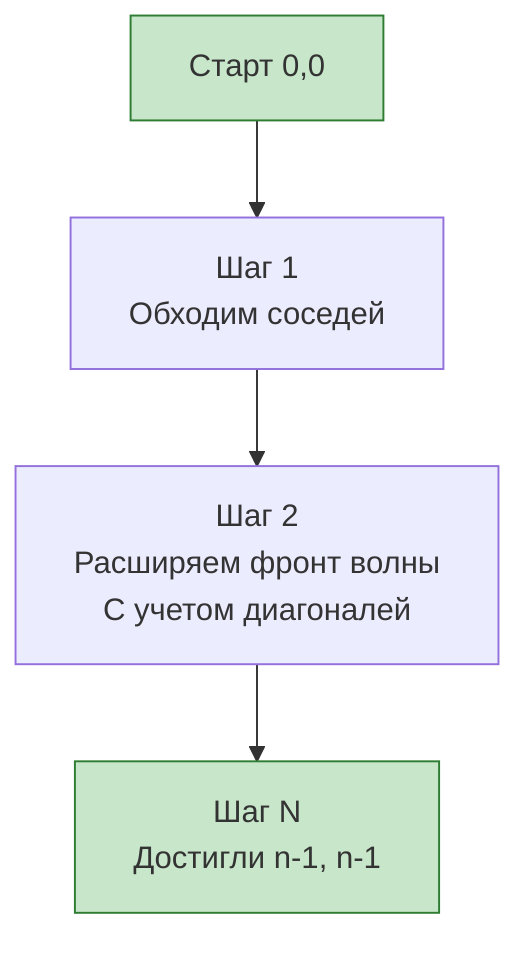

Задача Shortest Path in Binary Matrix (LeetCode 1091) — это квинтэссенция поиска кратчайшего пути на сетке (Grid BFS). Если в [[6. Rotting Oranges]] у нас было несколько источников заражения, а в [[7. Open the Lock]] — абстрактное пространство состояний, то здесь мы ищем путь в классическом лабиринте. Но с одним важным twistом: двигаться можно по 8 направлениям (ход короля в шахматах), а не по 4.

**Условие:** Дана $n \times n$ бинарная матрица. Нужно найти кратчайший путь из левого верхнего угла `(0, 0)` в правый нижний `(n-1, n-1)`, двигаясь только по клеткам со значением `0`. Пути по диагонали разрешены.

В бэкенде этот паттерн моделирует маршрутизацию в mesh-сетях дата-центров (где связи идут не только по ортогональным осям, но и по диагоналям между серверами), а также алгоритмы поиска пути в геоинформационных системах (GIS) с возможностью движения в любом направлении.

## 8 направлений: Диагонали меняют игру

Разрешение диагональных ходов радикально меняет структуру графа. В ортогональном графе расстояние — это Манхэттенское расстояние. С диагоналями расстояние становится расстоянием Чебышёва ($\max(|x_2 - x_1|, |y_2 - y_1|)$).

Для генерации соседей мы используем массив сдвигов на 8 направлений:

```go
// 8 направлений: вверх, вниз, влево, вправо и 4 диагонали
dirs := [8][2]int{
    {-1, 0}, {1, 0}, {0, -1}, {0, 1},
    {-1, -1}, {-1, 1}, {1, -1}, {1, 1},
}
```

## Идиоматичный Go: Плоская очередь и мутация In-Place

Как и в предыдущих задачах, мы отказываемся от `container/list` и строковых ключей. Мы используем быстрый слайс с индексом `head` и упаковываем координаты в одно число `r*n + c`. 

Особенность этой задачи — жесткие ограничения по памяти. Матрица может быть до $100 \times 100$. Вместо того чтобы создавать отдельную матрицу `visited [][]bool`, мы можем использовать мутацию входного массива, помечая посещенные клетки как `1` (стена). Это экономит 10 КБ памяти на аллокацию и радикально снижает нагрузку на GC.

```go
func shortestPathBinaryMatrix(grid [][]int) int {
    n := len(grid)
    
    // Крайние случаи: старт или финиш заблокированы
    if grid[0][0] == 1 || grid[n-1][n-1] == 1 {
        return -1
    }
    if n == 1 {
        return 1 // Матрица 1x1, путь = 1 шаг
    }
    
    // Очередь хранит упакованные координаты: r*n + c
    queue := []int{0}
    head := 0
    grid[0][0] = 1 // Отмечаем старт как посещенный (мутация!)
    
    steps := 1
    
    for head < len(queue) {
        levelSize := len(queue)
        
        for i := head; i < levelSize; i++ {
            pos := queue[i]
            r, c := pos/n, pos%n // Распаковка координат
            
            for _, d := range dirs {
                nr, nc := r+d[0], c+d[1]
                
                // Проверка границ и того, что клетка свободна (0)
                if nr >= 0 && nr < n && nc >= 0 && nc < n && grid[nr][nc] == 0 {
                    if nr == n-1 && nc == n-1 {
                        return steps + 1 // Достигли финиша!
                    }
                    
                    grid[nr][nc] = 1 // Мутация: помечаем как посещенную
                    queue = append(queue, nr*n+nc)
                }
            }
        }
        
        head = levelSize // Сдвигаем голову очереди
        steps++
    }
    
    return -1 // Путь не найден
}
```



> [!warning] Ловушка / Gotcha
* На интервью всегда уточняйте, можно ли мутировать входные данные. В алгоритмических задачах это обычно приветствуется для экономии памяти, но в реальном бэкенде (если матрица переиспользуется другими сервисами) мутация — это побочный эффект (Side Effect), который может привести к багам. Если мутация запрещена, используйте массив `visited [10000]bool`, как мы делали в Open the Lock.
* Также обратите внимание на ранний возврат: мы проверяем достижение финиша `nr == n-1 && nc == n-1` *до* добавления в очередь, а не при извлечении. Это экономит одну итерацию.

## Mechanical Sympathy: Структура массива dirs

Почему массив `dirs` объявлен как `[8][2]int`, а не слайс `[][]int`?

Массив фиксированного размера `[8][2]int` в Go — это 16 значений типа `int` (128 байт на 64-битной системе). Компилятор Go знает его размер на этапе компиляции. При обходе `for _, d := range dirs` процессор может полностью развернуть этот цикл (Loop Unrolling) и загрузить все пары координат в регистры заранее. Доступ к `d[0]` и `d[1]` становится простым чтением из регистра или L1 кэша.

Если бы мы использовали слайс `[][]int`, каждая внутренняя пара была бы отдельным объектом в куче, и доступ к ней вызвал бы Pointer Chasing (погоню за указателями).

> [!info] Под капотом
* Почему `grid[nr][nc] = 1` работает так быстро? Двумерный слайс в Go (`[][]int`) — это массив указателей на одномерные слайсы (строки). Строки матрицы в памяти лежат раздельно. Но при доступе к `grid[nr][nc]` процессор сначала загружает указатель на строку `nr` (Cache Hit, если мы недавно читали соседнюю клетку в этой строке), а затем читает `nc`. При обходе матрицы по строкам это эффективно использует кэш-линии.

## System Design: От BFS к A* (A-Star)

BFS отлично работает для матриц до $100 \times 100$. Но что если мы ищем путь на карте города размером $10 000 \times 10 000$? BFS посетит миллионы клеток, что потребует гигабайт памяти и секунд процессорного времени.

В production-системах (GIS-карты, игры, роутинг в K8s) вместо BFS используется **Алгоритм A***. 

Аналогия из бэкенда:
- **BFS** — это как если бы вы искали файл на сервере, перебирая все директории подряд, расширяя круг поиска от корня.
- **A*** — это как если бы вы использовали GPS. Вы направляетесь в сторону цели (эвристика), но если упираетесь в стену, откатываетесь. 

A* использует приоритетную очередь (Min-Heap), где приоритет — это сумма пройденного пути ($g(n)$) и эвристической оценки оставшегося пути ($h(n)$). Для нашей задачи с 8 направлениями идеальной эвристикой является расстояние Чебышёра. Это позволяет алгоритму исследовать только узкий "коридор" в сторону цели, снижая количество посещенных клеток в тысячи раз.

> [!tip] Собеседование
> Написав BFS, скажите: *"Это решение работает за O(N^2) времени и памяти. Но если бы матрица была размером с реальную карту города, BFS бы пал от OOM. В продакшене я бы реализовал алгоритм A* с приоритетной очередью и эвристикой Чебышёра, чтобы отсекать ненужные направления"*. Это продемонстрирует ваш System Design скилл на уровне Senior/Lead.

## Итог

1. **8 направлений:** Разрешение диагоналей меняет метрику расстояния и добавляет 4 новых вектора в массив `dirs`.
2. **Мутация вместо Visited:** Помечать пройденные `0` как `1` — мощный трюк для экономии памяти, но всегда оговаривайте его легитимность.
3. **Упаковка координат:** `r*n + c` для хранения в плоской очереди `[]int` остается самым быстрым и кэш-дружелюбным способом обхода сеток в Go.
4. **Ограничения BFS:** На гигантских графах BFS упирается в память. Переходите к A* или Dijkstra (для взвешенных графов), если масштабы выходят за рамки алгоритмических задач.

На этом мы завершаем раздел Поиска в ширину (BFS). Мы прошли путь от простых деревьев к мультиисточниковым волнам, неявным графам состояний и сеткам с диагоналями. В следующем разделе мы перейдем к Поиску в глубину (DFS) и начнем с теоретических основ работы со стеком вызовов: [[1. Теория. DFS]].