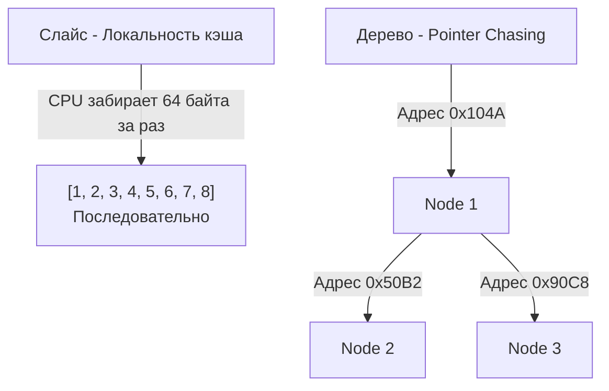

## Деревья в контексте системной инженерии

Когда мы говорим о деревьях на алгоритмических секциях, чаще всего речь идет о классических бинарных деревьях (Binary Trees) или бинарных деревьях поиска (BST). Однако для бэкенд-разработчика дерево — это не просто абстракция из LeetCode. Это фундаментальная структура, на которой строится большая часть современных систем:

- **B-Trees и B+Trees**: Лежат в основе индексов реляционных баз данных (PostgreSQL, MySQL).
- **Radix Trees (Trie)**: Используются в самых быстрых HTTP-роутерах экосистемы Go (например, `httprouter`, на котором базируется `Gin`, или роутер `chi`).
- **LSM-Trees**: Фундамент NoSQL баз данных (Cassandra, RocksDB, LevelDB).
- **DOM / JSON / YAML**: Любая парсируемая иерархическая структура в памяти представляется в виде дерева.

Понимание деревьев — это не просто умение обойти их рекурсией, это понимание работы памяти, локальности данных и цены использования указателей.

---

## Структура дерева в памяти Go

В Go бинарное дерево традиционно представляется через структуры с указателями на потомков:
```go
type TreeNode struct {
    Val   int
    Left  *TreeNode
    Right *TreeNode
}
```

> [!info] Под капотом
> Давайте посчитаем размер одного узла `TreeNode` на 64-битной архитектуре (amd64/arm64):
> - `Val int`: 8 байт
> - `Left *TreeNode`: 8 байт
> - `Right *TreeNode`: 8 байт
> Итого: **24 байта** на каждый узел (если нет дополнительных полей, требующих padding-а).
> 
> Когда вы создаете новый узел `&TreeNode{Val: 1}`, Go-компилятор проводит **Escape Analysis**. Так как деревья обычно живут дольше функции, в которой был создан узел (или передаются вверх по стеку/сохраняются в структуре графа), узлы практически всегда "убегают" в кучу (Heap).

### Проблема Pointer Chasing и локальность кэша (Cache Locality)

Главный враг производительности деревьев, реализованных через указатели, — это кэш процессора. В массивах (или `slice` в Go) элементы лежат в памяти последовательно. Процессор загружает в L1-кэш целую кэш-линию (обычно 64 байта), забирая сразу несколько элементов.

В дереве каждый узел — это отдельная аллокация в куче. Узлы раскиданы по памяти хаотично. 


Переход по ссылке `node.Left` — это так называемый **Pointer Chasing** (погоня за указателями). Если адреса нет в L1/L2 кэше, процессор вынужден ждать данные из оперативной памяти (RAM), что занимает сотни тактов CPU. Именно поэтому обход даже небольшого дерева на указателях всегда будет медленнее обхода массива того же размера.

### Влияние на Garbage Collector (GC)

Еще одна архитектурная проблема больших деревьев в Go — нагрузка на сборщик мусора.
Фаза Mark (пометка живых объектов) требует от GC пройтись по графу объектов. Если у вас в памяти висит дерево из миллиона узлов, GC придется отсканировать 2 миллиона указателей (`Left` и `Right`). Это значительно увеличивает задержки (STW / Mark Assist), так как GC тратит процессорное время на обход графа объектов.

> [!warning] Ловушка / Gotcha
> Если вы строите огромные in-memory деревья (например, гигантский Radix Tree для in-memory аналитики), классический подход с `*TreeNode` убьет производительность рантайма. 
> **Решение:** Использовать массивы для хранения узлов дерева (flattening) или индексы вместо указателей (слайс узлов, где `Left` и `Right` — это `int` индексы в этом слайсе). Это превращает миллион мелких аллокаций в одну большую, разгружая GC. В Go 1.20+ для таких структур также стали экспериментировать с пакетом `arena` (Arena Allocators).

---

## Виды деревьев на собеседованиях

### 1. Бинарное дерево (Binary Tree)
Каждый узел имеет не более двух потомков. Никаких правил упорядочивания нет. Чаще всего задачи на обычные бинарные деревья связаны с полным обходом, поиском путей или проверкой свойств дерева (например, сбалансировано ли оно).

### 2. Бинарное дерево поиска (Binary Search Tree - BST)
Упорядоченное дерево. Для любого узла справедливо правило:
- Все узлы в левом поддереве **меньше** текущего.
- Все узлы в правом поддереве **больше** текущего.

> [!tip] Собеседование
> Ключевое свойство BST, которое нужно помнить ночью: **In-Order обход (Left -> Root -> Right) бинарного дерева поиска всегда дает отсортированный массив**. 
> Если задача требует найти k-й наименьший элемент, сразу вспоминайте про In-Order обход.

**Сложность операций в BST:**
- Поиск, Вставка, Удаление: `O(log N)` в среднем случае.
- **Худший случай**: `O(N)`. Если вставлять в BST отсортированные данные (1, 2, 3, 4, 5), дерево вырождается в связный список. Именно поэтому в production-системах используют самобалансирующиеся деревья (Red-Black Tree, AVL).

### 3. Префиксное дерево (Trie)
Используется для задач на строки (автодополнение, поиск префиксов). Вместо хранения всего ключа в узле, путь от корня до узла определяет ключ.

---

## Рекурсия и стек горутин в Go

Большинство алгоритмов на деревьях элегантно выражаются через рекурсию. Но в Go рекурсия имеет свои архитектурные особенности, о которых любят спрашивать на Senior-собеседованиях.
```go
func traverse(node *TreeNode) {
    if node == nil {
        return
    }
    traverse(node.Left)
    traverse(node.Right)
}
```

Каждый рекурсивный вызов создает новый фрейм на стеке вызовов. 
- В Go начальный размер стека горутины составляет всего **2 КБ**. 
- Если дерево несбалансированное (выродилось в список из 100,000 узлов), глубина рекурсии достигнет 100,000. 
- Стек горутины начнет расти. Go делает это через **Stack Copying**: рантайм выделяет новый, вдвое больший кусок памяти, копирует туда старый стек, обновляет все указатели на локальные переменные стека и продолжает работу.
- Если стек превысит лимит (обычно 1 ГБ на 64-битных системах), приложение упадет с неуловимой паникой `stack overflow`, которую нельзя перехватить через `recover`.

> [!warning] Ловушка / Gotcha
> Go **не поддерживает** хвостовую оптимизацию (Tail Call Optimization - TCO). Компилятор не схлопывает рекурсивные вызовы в цикл, даже если вызов является последней инструкцией в функции. 
> 
> Поэтому для production-кода (если глубина дерева неизвестна и может быть огромной) обходы часто переписывают с рекурсии на итеративный подход с использованием кастомного стека (на базе слайса).

---

## Краевые случаи (Edge Cases) в задачах

При решении задач на деревья всегда проверяйте следующие состояния:
1 - **Пустое дерево**: `root == nil`. Если не проверить, получите `panic: nil pointer dereference` на первой же строке.
2 - **Дерево из одного узла**: Только корень без потомков.
3 - **Вырожденное дерево**: Дерево выглядит как связный список (только левые или только правые дети).
4 - **Несбалансированное дерево**: Один путь намного длиннее другого.

## Итоги

1. Дерево — это направленный граф без циклов.
2. В Go узлы дерева (из-за структуры с указателями) страдают от плохой локальности кэша и увеличивают нагрузку на GC (много указателей для сканирования).
3. Бинарное дерево поиска (BST) позволяет искать данные за логарифмическое время `O(log N)`, но только если оно сбалансировано. In-Order обход BST выдает отсортированную последовательность.
4. Глубокая рекурсия в деревьях провоцирует рост стека горутины (с копированием в памяти) и не оптимизируется компилятором Go (нет TCO).

Перейдем к практическим методам того, как заставить процессор ходить по этим узлам. Существует два глобальных подхода: вглубь и вширь. Подробный разбор алгоритмов обхода — в следующей статье: [[2. Обходы деревьев]].