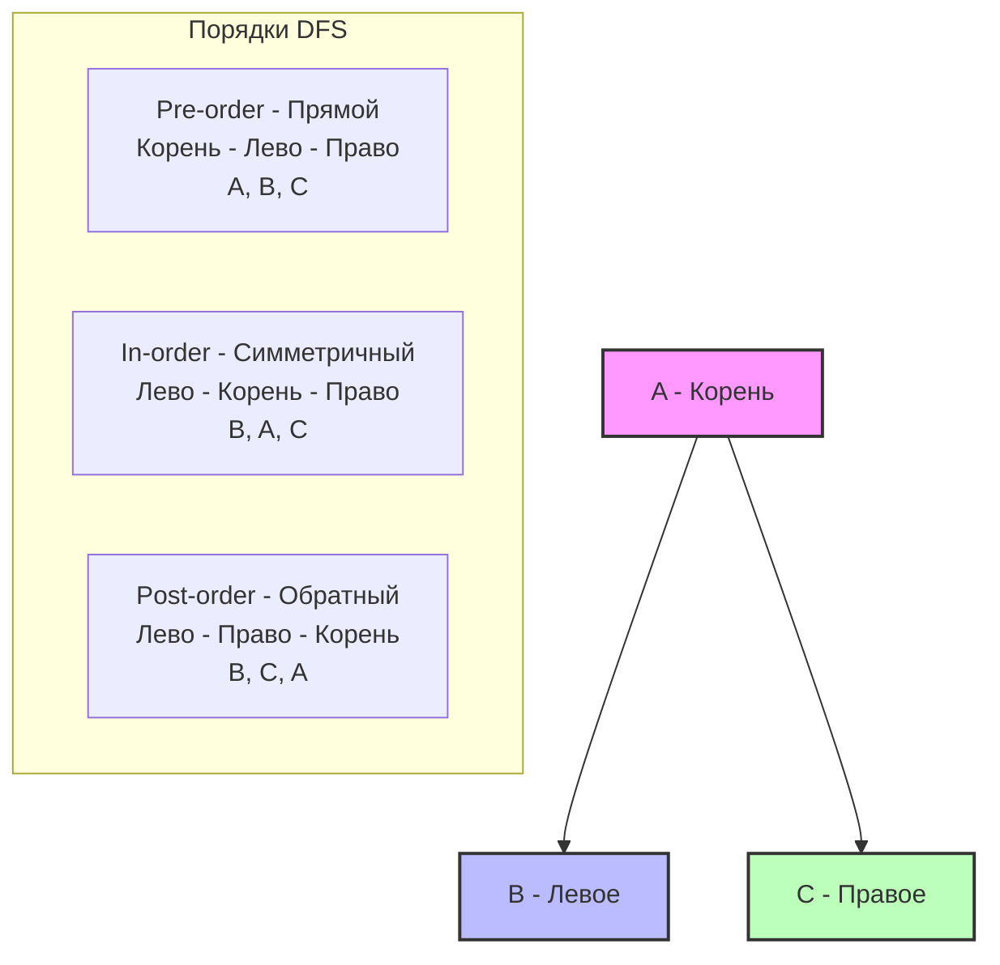

## Стратегии обхода деревьев: Вглубь и Вширь

В предыдущей статье [[1. Теория. Деревья]] мы выяснили, что дерево в памяти Go — это граф разбросанных по куче (Heap) аллокаций, объединенных указателями. Процессору больно обходить такие структуры из-за постоянных кэш-промахов (Cache Misses). Тем не менее, обходить деревья нужно.

Глобально существует два алгоритмических подхода к обходу любого графа (и дерева в частности): **DFS (Depth-First Search — поиск в глубину)** и **BFS (Breadth-First Search — поиск в ширину)**.

Выбор между ними на собеседовании — это не вопрос вкуса. Это инженерный компромисс между использованием оперативной памяти, паттернами доступа к кэшу и архитектурой стека вызовов горутины.

---

## 1. Поиск в глубину (DFS)

При DFS мы идем по ветке дерева максимально глубоко вниз, пока не упремся в лист (nil), после чего возвращаемся на шаг назад (backtrack) и идем в соседнюю ветку.

Существует три классических порядка обхода в глубину. Они отличаются только тем, в какой момент мы "обрабатываем" (читаем значение) текущего узла:


> [!tip] Собеседование
> **Где какой обход применяется?**
> 1 - **Pre-order**: Копирование дерева, сериализация дерева в строку.
> 2 - **In-order**: Получение отсортированного массива из бинарного дерева поиска (BST).
> 3 - **Post-order**: Удаление дерева (сначала удаляем детей, потом корень), вычисление размера папок в ФС.

### DFS: Рекурсия vs Итерация

Самый простой способ написать DFS — использовать рекурсию.
```go
func inorderTraversal(root *TreeNode) {
    if root == nil {
        return
    }
    inorderTraversal(root.Left)
    fmt.Println(root.Val)
    inorderTraversal(root.Right)
}
```

Но как Senior-инженер, вы должны понимать цену этих 8 строк кода.

> [!info] Под капотом: Стек горутины
> Когда вы вызываете функцию рекурсивно, Go помещает в стек горутины новый **фрейм** (содержащий аргумент `root` и адрес возврата). 
> Начальный размер стека горутины в современном Go — **2 КБ**. 
> Если дерево вырождено в связный список (например, 100 000 узлов только вправо), глубина рекурсии составит 100 000 вызовов. Стек неизбежно переполнится.
> 
> В этот момент рантайм Go приостановит горутину, выделит новый кусок памяти в 2 раза больше (stack growth), **скопирует** туда все данные старого стека, обновит все внутренние указатели и продолжит работу. Это крайне дорогая операция. В языках с Tail Call Optimization (TCO) компилятор мог бы свернуть рекурсию в цикл, но **компилятор Go не делает TCO** принципиально (для сохранения чистоты stack trace при паниках).

Поэтому на хардовых секциях вас попросят написать **итеративный DFS**. Для этого мы эмулируем стек вызовов (Call Stack) в куче с помощью обычного Go-слайса.

### Идиоматичный итеративный In-order DFS
```go
type TreeNode struct {
    Val   int
    Left  *TreeNode
    Right *TreeNode
}

func inorderTraversalIterative(root *TreeNode) []int {
    var result []int
    // Используем slice как LIFO стек
    var stack []*TreeNode 
    curr := root

    // Крутимся, пока есть текущий узел или стек не пуст
    for curr != nil || len(stack) > 0 {
        // Уходим максимально влево, сохраняя узлы в стек
        for curr != nil {
            stack = append(stack, curr)
            curr = curr.Left
        }
        
        // Достаем последний узел из стека (Pop)
        curr = stack[len(stack)-1]
        stack = stack[:len(stack)-1]
        
        // Обрабатываем значение
        result = append(result, curr.Val)
        
        // Переходим к правому поддереву
        curr = curr.Right
    }
    
    return result
}
```

**Сложность:**
- Время: `O(N)` — каждый узел посещается ровно один раз.
- Память: `O(H)`, где `H` — высота дерева. В худшем случае (вырожденное дерево) `O(N)`, в лучшем (сбалансированное) `O(log N)`.

---

## 2. Поиск в ширину (BFS)

При BFS мы обходим дерево по уровням: сначала корень (уровень 0), затем все его дети (уровень 1), затем все внуки (уровень 2) и так далее. 
Этот алгоритм незаменим, когда нужно найти **кратчайший путь** (в графах) или обработать иерархию по слоям.

В отличие от DFS, который использует стек (LIFO), BFS требует **очереди (FIFO)**. В Go нет встроенной структуры данных Queue, поэтому её обычно реализуют через `slice`.

### Идиоматичный BFS (Level-Order Traversal)

Эта структура кода — золотой стандарт для задач на BFS. Мы не просто кидаем узлы в очередь, а обрабатываем их **пачками (бачами)** по уровням.
```go
func levelOrder(root *TreeNode) [][]int {
    if root == nil {
        return nil
    }
    
    var result [][]int
    // Инициализируем очередь корнем
    queue := []*TreeNode{root}
    
    for len(queue) > 0 {
        // Фиксируем количество узлов на текущем уровне
        levelSize := len(queue)
        var currentLevel []int
        
        // Обрабатываем ровно levelSize элементов
        for i := 0; i < levelSize; i++ {
            // Dequeue: берем первый элемент
            node := queue[0]
            queue = queue[1:] // Внимание! Тут кроется подвох
            
            currentLevel = append(currentLevel, node.Val)
            
            // Enqueue: добавляем детей в конец очереди
            if node.Left != nil {
                queue = append(queue, node.Left)
            }
            if node.Right != nil {
                queue = append(queue, node.Right)
            }
        }
        
        result = append(result, currentLevel)
    }
    
    return result
}
```

> [!warning] Ловушка / Gotcha: Утечка памяти в слайсе-очереди
> Обратите внимание на строку `queue = queue[1:]`. В рамках LeetCode это работает отлично. Но в Production-коде это **потенциальная утечка памяти (Memory Leak)**.
> 
> Слайс в Go — это структура `reflect.SliceHeader` (указатель `Data`, `Len`, `Cap`). Когда мы делаем `queue = queue[1:]`, мы просто сдвигаем указатель `Data` на один элемент вправо. Базовый массив (backing array) **остается в памяти целиком**. Сборщик мусора (GC) не может удалить отработанные узлы в начале массива, потому что на этот массив всё еще ссылается активный слайс `queue`.
> 
> **Как это лечат в Production?** 
> Если очередь живет долго и перегоняет через себя миллионы элементов, используют кольцевой буфер (Ring Buffer) или затирают ссылку перед сдвигом: 
> ```go
> queue[0] = nil // Помогаем GC: убираем ссылку на узел
> queue = queue[1:]
> ```

### Mechanical Sympathy: Память при BFS

На собеседовании вас могут спросить: *"Что потребляет больше памяти: DFS или BFS?"*

Ответ зависит от топологии дерева.
DFS хранит в стеке узлы только текущего пути — сложность `O(H)` (Высота дерева).
BFS хранит в очереди все узлы текущего уровня. В идеальном сбалансированном бинарном дереве на последнем уровне находится `N/2` узлов. Следовательно, максимальный размер очереди будет `O(W)` (Ширина дерева), что в худшем случае стремится к `O(N)`.

**Итог:** Для широких и неглубоких деревьев BFS сожрет уйму памяти. Для узких и глубоких деревьев DFS убьет стек горутины. Инженерия — это всегда трейдоффы.

---

## Резюме для интервью

1. **DFS (В глубину)** — идеален для полного обхода, поиска в BST (In-order), сериализации. Легко пишется рекурсией, но на хардовых секциях нужно уметь писать через стек (slice).
2. **BFS (В ширину)** — идеален для поиска кратчайшего пути и работы по уровням. Реализуется через очередь (slice). Помните про сдвиг слайса `queue[1:]` и то, как он взаимодействует с Garbage Collector.
3. **Escape Analysis**: Узлы дерева и слайсы, используемые как стек/очередь внутри функции, могут аллоцироваться в куче, создавая работу для GC. Для сверх-оптимизации `currentLevel` слайс можно переиспользовать через `sync.Pool`, хотя для LeetCode это оверкилл.

Теперь, когда мы вооружились инструментами обхода, самое время применить их к классической алгоритмической задаче, которую часто дают для разминки: [[3. Maximum Depth of Binary Tree]].