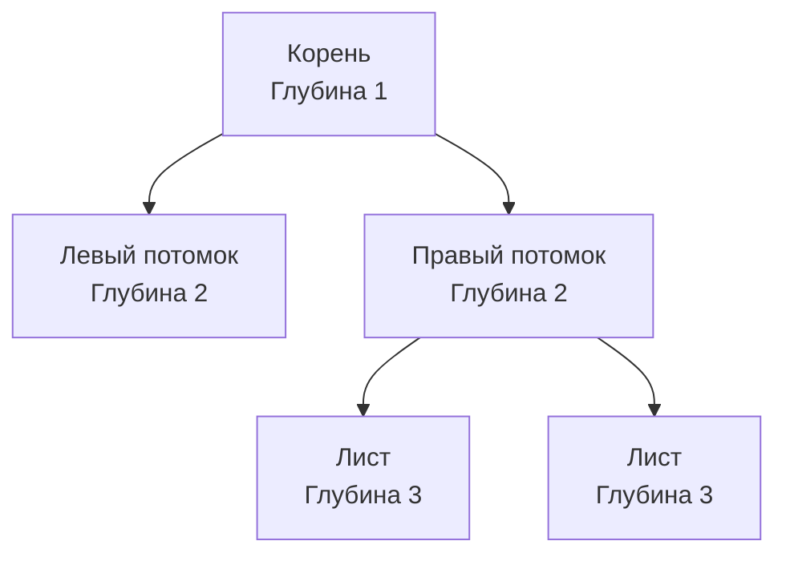

## Разбор задачи: Maximum Depth of Binary Tree

**Maximum Depth of Binary Tree (Максимальная глубина бинарного дерева)** — это классическая задача с LeetCode (№104). Она часто дается как разминочная на собеседованиях, чтобы проверить базовое понимание рекурсии и структур данных. 

**Условие:** Дано бинарное дерево. Нужно найти его максимальную глубину. Максимальная глубина — это количество узлов вдоль самого длинного пути от корневого узла до самого дальнего листового узла.

В рамках системной инженерии на Go нас интересует не просто факт решения (которое пишется в три строки), а то, как разные подходы нагружают рантайм: стек горутины, кучу (heap) и сборщик мусора (GC).

---

## Подход 1: Рекурсивный DFS (Поиск в глубину)

Самое элегантное и очевидное решение. Мы знаем, что глубина пустого дерева равна нулю, а глубина любого узла — это `1 +` максимальная из глубин его поддеревьев.
```go
// TreeNode определяет структуру узла бинарного дерева.
type TreeNode struct {
    Val   int
    Left  *TreeNode
    Right *TreeNode
}

// MaxDepth вычисляет максимальную глубину рекурсивно.
func MaxDepth(root *TreeNode) int {
    if root == nil {
        return 0 // Базовый случай: дошли до конца ветки
    }
    
    // Спускаемся рекурсивно в левое и правое поддерево
    leftDepth := MaxDepth(root.Left)
    rightDepth := MaxDepth(root.Right)
    
    // Возвращаем максимальную глубину плюс текущий узел
    if leftDepth > rightDepth {
        return leftDepth + 1
    }
    return rightDepth + 1
}
```

> [!tip] Собеседование
> В Go нет встроенной функции `math.Max` для целых чисел (до появления дженериков в 1.18, и даже сейчас отдельного `math.Max[T constraints.Ordered]` в стандартной библиотеке `math` нет, есть только встроенная `max` начиная с Go 1.21). Использование встроенной функции `max(a, b)` (Go 1.21+) сделает код короче: `return max(MaxDepth(root.Left), MaxDepth(root.Right)) + 1`.

### Оценка сложности
- **Время:** `O(N)`, где `N` — количество узлов. Мы обязаны посетить каждый узел ровно один раз.
- **Память:** `O(H)`, где `H` — высота дерева. Это память, расходуемая на стек вызовов.

> [!info] Под капотом: Нагрузка на стек горутины
> Как мы обсуждали в статье [[1. Теория. Деревья]], каждая горутина стартует со стеком в 2 КБ. 
> В сбалансированном дереве высота $H = \log_2(N)$. Даже для миллиона узлов глубина будет около 20 вызовов. Это безопасно.
> Но если дерево выродилось в связный список (каждый узел имеет только левого потомка), $H = N$. При $N = 100 000$ мы получим 100 000 вложенных фреймов функции `MaxDepth`. 
> Стек горутины исчерпает 2 КБ, рантайм выделит 4 КБ, скопирует данные, затем 8 КБ и так далее (Stack Growth / Stack Copying). Это убьет производительность и может привести к панике `stack overflow` (дефолтный лимит стека горутины на 64-битных системах — 1 ГБ). В Go нет хвостовой оптимизации рекурсии (TCO).

---

## Подход 2: Итеративный BFS (Поиск в ширину)

Чтобы избежать потенциального переполнения стека и дорогостоящего копирования памяти горутины (перенеся нагрузку со стека в кучу), мы можем использовать обход по уровням (BFS). 

Мы считаем количество пройденных уровней. В Go для BFS мы реализуем очередь через `slice`.
```go
func maxDepthBFS(root *TreeNode) int {
    if root == nil {
        return 0
    }
    
    // Используем slice как FIFO-очередь
    queue := []*TreeNode{root}
    depth := 0
    
    for len(queue) > 0 {
        // Фиксируем количество узлов на текущем уровне
        levelSize := len(queue)
        depth++ // Увеличиваем глубину для нового уровня
        
        // Обрабатываем строго один уровень
        for i := 0; i < levelSize; i++ {
            node := queue[0] // Берем элемент
            queue[0] = nil   // Помогаем GC (устраняем утечку памяти)
            queue = queue[1:] // Сдвигаем слайс
            
            // Добавляем детей следующего уровня
            if node.Left != nil {
                queue = append(queue, node.Left)
            }
            if node.Right != nil {
                queue = append(queue, node.Right)
            }
        }
    }
    
    return depth
}
```

### Визуализация BFS по уровням


> [!warning] Ловушка / Gotcha: Утечка узлов в очереди
> Обратите внимание на строку `queue[0] = nil`. 
> Когда мы делаем `queue = queue[1:]`, базовый массив слайса (backing array) в памяти не уменьшается. Мы просто сдвигаем указатель начала данных. 
> Если не обнулить `queue[0]`, то GC не сможет очистить обработанный `*TreeNode`, пока базовый массив очереди не будет полностью собран мусорщиком (что в рамках долгоживущего сервиса может произойти нескоро). Для LeetCode это не критично, но на собеседовании на Senior-позицию такое уточнение сразу выделит вас среди кандидатов.

### Оценка сложности
- **Время:** `O(N)`, так как каждый узел помещается в очередь и извлекается один раз.
- **Память:** `O(W)`, где `W` — максимальная ширина дерева (количество узлов на самом широком уровне). В худшем случае (полное бинарное дерево) на последнем уровне будет $N/2$ узлов. Следовательно, потребление памяти стремится к `O(N)`. 
Но в данном подходе память аллоцируется в куче (Heap), а не в стеке (Stack). Это увеличивает работу для Garbage Collector из-за аллокаций массива очереди и сканирования указателей.

---

## Подход 3: Итеративный DFS

Если мы хотим обойтись без рекурсии, но при этом дерево слишком широкое (BFS сожрет много памяти), можно симулировать стек вызовов вручную с помощью слайса.
```go
type Item struct {
    node  *TreeNode
    depth int
}

func maxDepthIterativeDFS(root *TreeNode) int {
    if root == nil {
        return 0
    }
    
    // Стек будет хранить структуры с узлом и его текущей глубиной
    stack := []Item{{node: root, depth: 1}}
    maxDepth := 0
    
    for len(stack) > 0 {
        // Pop из стека (LIFO)
        top := stack[len(stack)-1]
        stack = stack[:len(stack)-1]
        
        node := top.node
        currentDepth := top.depth
        
        // Обновляем максимальную глубину
        if currentDepth > maxDepth {
            maxDepth = currentDepth
        }
        
        // Push правого, затем левого (чтобы левый обрабатывался первым)
        if node.Right != nil {
            stack = append(stack, Item{node: node.Right, depth: currentDepth + 1})
        }
        if node.Left != nil {
            stack = append(stack, Item{node: node.Left, depth: currentDepth + 1})
        }
    }
    
    return maxDepth
}
```

> [!info] Под капотом: Размещение слайсов
> В итеративных версиях слайсы `queue` и `stack` скорее всего будут аллоцированы в куче (Escape Analysis отправит их в Heap, так как они меняют размер через `append`, и размер заранее неизвестен). Рекурсивный подход использует стек горутины, аллокации на котором практически бесплатны (простое смещение указателя стека). Поэтому **для сбалансированных деревьев рекурсивный вариант в Go всегда будет быстрее**.

---

## Итоги и Edge Cases

При решении этой задачи на собеседовании обязательно проговорите корнер-кейсы:
1 - `root == nil`: Пустое дерево должно сразу вернуть `0`.
2 - **Только левые или только правые дети**: Вырожденное дерево (List). Здесь рекурсия проигрывает по расходу стека.
3 - **Огромное полное дерево**: Очередь в BFS раздуется, создавая давление на Heap и GC.

Как только мы поняли, как вычислять глубину от корня до листа, мы можем усложнить задачу. Что если нам нужно найти самый длинный путь между **любыми двумя узлами** в дереве (он не обязательно проходит через корень)? Это классическая задача, которую мы разберем в следующей статье: [[4. Diameter of Binary Tree]].